<div align="center">
        <br>
</div>
<h3 align="center"> Universidad Peruana de Ciencias Aplicadas </h3>

<h3 align="center"> Ingeniería de Software </h3>
<h3 align="center">  2026 - 10</h3>

<h3 align="center"> NRC: 20177 </h3>

<h3 align="center"> Docente: Jose Miguel Flores Ingaruca </h3>

<h3 align="center"> Informe de Trabajo </h3>

<h3 align="center"> Cryologic Systems </h3>


<h3 align="center"> SafeFlow </h3>

<h3 align="center"> Team Members: </h3>

<div align = "center">

| Member                           |    Code    |
| :------------------------------- | :--------: |
| Andy Alejandro Mio Mejia         | U202218531 |
| Mel Andree Orellana Rodriguez      | U202116018 |
| Angel Guillermo Berrospi Marin  | U202114701 |
| Anhelo Rodrigo Rocca Leon | U20221C803 |
| Jefferson Bayron Morales Yapuchura | U202316049 |


</div>

<h3 align="center">2026</h3>

<div style="page-break-after: always;"></div>

## Registro de Versiones del Informe

<div align = "center">
    
| Versión |   Fecha    | Autor |                           Descripción de modificación                            |
|:-------:|:----------:| :----------------: |:--------------------------------------------------------------------------------:|
|   AV1   | 26-04-2026 | Morales Yapuchura, Jefferson Bayron |                      Desarrollo de registro de entrevistas                       |
|   AV1   | 26-04-2026 | Morales Yapuchura, Jefferson Bayron |                      Desarrollo de analisis de entrevistas                       |
|   AV1   | 25-04-2026 | Morales Yapuchura, Jefferson Bayron |                 Desarrollo de la primera version de Empathy Maps                 |
|   AV1   | 25-04-2026 | Morales Yapuchura, Jefferson Bayron |                Desarrollo de la primera version de User Personas                 |
|   AV1   | 25-04-2026 | Morales Yapuchura, Jefferson Bayron |             Desarrollo de la primera version de User Journey Mapping             |
|   AV1   | 25-04-2026 | Morales Yapuchura, Jefferson Bayron |               Desarrollo de la primera version de User Task Matrix               |
|   TB1   | 26-04-2026 | Morales Yapuchura, Jefferson Bayron |                      Desarrollo de registro de entrevistas                       |
|   TB1   | 26-04-2026 | Morales Yapuchura, Jefferson Bayron |                      Desarrollo de analisis de entrevistas                       |
|   TB1   | 26-04-2026 | Morales Yapuchura, Jefferson Bayron |        Actualización y mejora de wireframes - SignUp Authentication Flow         |
|   TB1   | 26-04-2026 | Morales Yapuchura, Jefferson Bayron |          Actualización y mejora de mockups - SignUp Authentication Flow          |
|   TB1   | 26-04-2026 | Morales Yapuchura, Jefferson Bayron |                 Actualización y mejora de Bounded Context Shared                 |
|   TB1   | 15-05-2026 | Morales Yapuchura, Jefferson Bayron |                 Actualización y refinamiento de mockups - Alerts                 |
|   TB1   | 15-05-2026 | Morales Yapuchura, Jefferson Bayron |                Actualización y refinamiento de wireframe - Alerts                |
|   TB1   | 26-04-2026 | Morales Yapuchura, Jefferson Bayron |                   Actualizacion de Web Applications Wireframes                   |
|   TB1   | 15-05-2026 | Morales Yapuchura, Jefferson Bayron |         Coordinación y revisión de consistencia entre mockups, wireframe         |
|   AV1   | 26-04-2026 | Morales Yapuchura, Jefferson Bayron |                           Desarrollo de 4 entrevistas                            |
|   AV1   | 26-04-2026 | Mio Mejia, Andy Alejandro |                                 Style Guidelines                                 |
|   AV1   | 26-04-2026 | Mio Mejia, Andy Alejandro |                             Information Architecture                             |
|   AV1   | 26-04-2026 | Mio Mejia, Andy Alejandro |                              Landing Page UI Design                              |
|   AV1   | 26-04-2026 | Mio Mejia, Andy Alejandro |                          Web Applications UX/UI Design                           |
|   AV1   | 11-04-2026 | Orellana Rodriguez, Mel Andree |                            Descripción de la Startup                             |
|   AV1   | 11-04-2026 | Orellana Rodriguez, Mel Andree |                        Creación de la carpeta de Imagenes                        |
|   AV1   | 11-04-2026 | Orellana Rodriguez, Mel Andree |                            Desarrollo de User Stories                            |
|   AV1   | 11-04-2026 | Orellana Rodriguez, Mel Andree |                                   Competidores                                   |
|   AV1   | 11-04-2026 | Orellana Rodriguez, Mel Andree |                      Creacion de Ramas en los Repositorios                       |
|   AV1   | 25-04-2026 | Orellana Rodriguez, Mel Andree |                        Software Deployment Configuration.                        |
|   AV1   | 25-04-2026 | Orellana Rodriguez, Mel Andree |                             Source Code Management.                              |
|   AV1   | 25-04-2026 | Orellana Rodriguez, Mel Andree |                  Software Development Environment Configuration                  |
|   AV1   | 25-04-2026 | Orellana Rodriguez, Mel Andree |                        Software Configuration Management.                        |
|   AV1   | 25-04-2026 | Orellana Rodriguez, Mel Andree |                     Creacion de la Estructura de la Landing                      |
|   AV1   | 25-04-2026 | Orellana Rodriguez, Mel Andree |                   Estrategias y tácticas frente a competidores                   |
|   AV1   | 25-04-2026 | Orellana Rodriguez, Mel Andree |                                     Sprint 1                                     |
|   AV1   | 26-04-2026 | Berrospi Marin, Angel Guillermo |                   Desarrollo de Lean Ux Hypothesis Statements                    |
|   AV1   | 26-04-2026 | Berrospi Marin, Angel Guillermo |                            Desarrollo Lean Ux Canvas                             |
|   AV1   | 26-04-2026 | Berrospi Marin, Angel Guillermo |                       Desarrollo de Diseño de entrevistas                        |
|   AV1   | 26-04-2026 | Berrospi Marin, Angel Guillermo |                      Desarrollo de registro de entrevistas                       |
|   AV1   | 26-04-2026 | Berrospi Marin, Angel Guillermo |                      Desarrollo de Análisis de entrevistas                       |
|   AV1   | 26-04-2026 | Berrospi Marin, Angel Guillermo |                           Desarrollo de User Personas                            |
|   AV1   | 26-04-2026 | Berrospi Marin, Angel Guillermo |                          Desarrollo de User Task Matrix                          |
|   AV1   | 26-04-2026 | Berrospi Marin, Angel Guillermo |                        Desarrollo de User Journey Mapping                        |
|   AV1   | 26-04-2026 | Berrospi Marin, Angel Guillermo |                     Desarrollo de Big Picture EventStorming                      |
|   AV1   | 26-04-2026 | Berrospi Marin, Angel Guillermo |                        Desarrollo de Ubiquitous Lenguage                         |
|   AV1   | 26-04-2026 | Berrospi Marin, Angel Guillermo |            Creación de estructura de Aspect Leaders and Collaborators            |
|   AV1   | 26-04-2026 | Berrospi Marin, Angel Guillermo |                     Creación de estructura de Sprint Backlog                     |
|   AV1   | 26-04-2026 | Berrospi Marin, Angel Guillermo |         Creación de estructura de Development Evidence for Sprint Review         |
|   AV1   | 19-04-2026 | Rocca Leon, Anhelo Rodrigo |                Desarollo del Domain-Driven Software Architecture                 |
|   AV1   | 19-04-2026 | Rocca Leon, Anhelo Rodrigo |                     Desarollo del Design-Level EventStorming                     |
|   AV1   | 19-04-2026 | Rocca Leon, Anhelo Rodrigo |               Desarollo del Software Architecture Context Diagram                |
|   AV1   | 21-04-2026 | Rocca Leon, Anhelo Rodrigo |              Desarollo del Software Architecture Container Diagram               |
|   AV1   | 21-04-2026 | Rocca Leon, Anhelo Rodrigo |             Desarollo del Software Architecture Components Diagrams              |
|   AV1   | 21-04-2026 | Rocca Leon, Anhelo Rodrigo |                  Desarollo del Software Object-Oriented Design                   |
|   AV1   | 21-04-2026 | Rocca Leon, Anhelo Rodrigo |                           Desarollo del Class Diagrams                           |
|   AV1   | 21-04-2026 | Rocca Leon, Anhelo Rodrigo |                          Desarollo del Database Design                           |
|   AV1   | 21-04-2026 | Rocca Leon, Anhelo Rodrigo |                         Desarollo del Database Diagrams                          |
|   AV1   | 24-04-2026 | Rocca Leon, Anhelo Rodrigo |                 Commit de la sección 'Benefits' del Landing Page                 |
|   AV1   | 24-04-2026 | Rocca Leon, Anhelo Rodrigo |              Commit de la sección 'Call-to-action' del Landing Page              |
|   AV1   | 26-04-2026 | Rocca Leon, Anhelo Rodrigo |              Desarollo de 1 entrevista para el segmento objetivo 2               |
|   TB1   | 15-05-2026 | Berrospi Marin, Angel Guillermo |               Desarrollo del mockup del bounded context inventory                |
|   TB1   | 15-05-2026 | Berrospi Marin, Angel Guillermo |             Desarrollo del mockup del bounded context inventory-Add              |
|   TB1   | 15-05-2026 | Berrospi Marin, Angel Guillermo |               Desarrollo del mockup del bounded context reporting                |
|   TB1   | 15-05-2026 | Berrospi Marin, Angel Guillermo |              Desarrollo del wireframe del bounded context inventory              |
|   TB1   | 15-05-2026 | Berrospi Marin, Angel Guillermo |            Desarrollo del wireframe del bounded context inventory-Add            |
|   TB1   | 15-05-2026 | Berrospi Marin, Angel Guillermo |              Desarrollo del wireframe del bounded context reporting              |
|   TB1   | 15-05-2026 | Berrospi Marin, Angel Guillermo |                Desarrollo de código del bounded context inventory                |
|   TB1   | 15-05-2026 | Berrospi Marin, Angel Guillermo |                Desarrollo de código del bounded context reporting                |
|   TB1   | 15-05-2026 | Berrospi Marin, Angel Guillermo |              Creación de las estructuras de las tablas del sprint 2              |
|   TB1   | 15-05-2026 | Mio Mejia, Andy Alejandro |          Actualización y refinamiento de mockups - Analytics Dashboard           |
|   TB1   | 15-05-2026 | Mio Mejia, Andy Alejandro |         Actualización y refinamiento de wireframe - Analytics Dashboard          |
|   TB1   | 15-05-2026 | Mio Mejia, Andy Alejandro |          Actualización y mejora de mockups - SignIn Authentication Flow          |
|   TB1   | 15-05-2026 | Mio Mejia, Andy Alejandro |         Actualización y mejora de wireframe - SignIn Authentication Flow         |
|   TB1   | 15-05-2026 | Mio Mejia, Andy Alejandro |    Revisión y corrección integral de User Stories - Refinamiento y validación    |
|   TB1   | 15-05-2026 | Mio Mejia, Andy Alejandro |         Corrección y mejora del Lean UX Canvas - Validación de hipótesis         |
|   TB1   | 15-05-2026 | Mio Mejia, Andy Alejandro |             Actualización de criterios de aceptación en User Stories             |
|   TB1   | 15-05-2026 | Mio Mejia, Andy Alejandro | Coordinación y revisión de consistencia entre mockups, wireframes y User Stories |
|   TB1   | 12-05-2026 | Orellana Rodriguez, Mel Andree |                   Creación de las implementaciones de SafeFlow                   |
|   TB1   | 12-05-2026 | Orellana Rodriguez, Mel Andree |           Actualización de landing con conexión a la App Web SafeFlow            |
|   TB1   | 12-05-2026 | Orellana Rodriguez, Mel Andree |                    Creación de las ramas para safeflow-webapp                    |
|   TB1   | 12-05-2026 | Orellana Rodriguez, Mel Andree |                            Implementación del MockAPI                            |
|   TB1   | 12-05-2026 | Orellana Rodriguez, Mel Andree |                     Coordinación de tareas para el frontend                      |
|   TB1   | 12-05-2026 | Orellana Rodriguez, Mel Andree |                   Implementación del Bounded Context Analytics                   |
|   TB1   | 12-05-2026 | Orellana Rodriguez, Mel Andree |                  Implementación del Bounded Context Monitoring                   |
|   TB1   | 15-04-2026 | Rocca Leon, Anhelo Rodrigo |                           Búsqueda y pago del MockAPI                            |
|   TB1   | 15-04-2026 | Rocca Leon, Anhelo Rodrigo |     Implementación del Bounded Context logistics en el frontend de SafeFlow      |
|   TB1   | 15-04-2026 | Rocca Leon, Anhelo Rodrigo |          Desarollo del mockup y wireframe del bounded context logistics          |
|   TB1   | 15-04-2026 | Rocca Leon, Anhelo Rodrigo |         Desarrollo del mockup y wireframe del bounded context monitoring         |
|   AV2   | 06-06-2026 | Mel Andree, Orellana Rodriguez |         Desarrollo en el Backend el Modulo de  Analytics                      |
|   AV2   | 06-06-2026 | Mel Andree, Orellana Rodriguez |         Desarrollo en el Backend el Modulo de  Analytics                      |
|   AV2   | 06-06-2026 | Mel Andree, Orellana Rodriguez |         Desarrollo en el Backend el Modulo de  Monitoring                    |
|   AV2   | 06-06-2026 | Mel Andree, Orellana Rodriguez |         Desarrollo de la Estrucutra del Proyecto Base Backend                 |
|   AV2   | 06-06-2026 | Mel Andree, Orellana Rodriguez |         Organización de Tareas para el AV2                                    |
|   AV2   | 06-06-2026 | Mel Andree, Orellana Rodriguez |         Desarrollo del Video del Trabajo Social ( 1 Parte )                   |


</div>

## Project Report Collaboration Insights

A lo largo del desarrollo del trabajo, se ha evidenciado una participación activa, coordinada y progresiva por parte de todos los integrantes del equipo. Cada fase fue abordada de manera estructurada, siguiendo las buenas prácticas de trabajo colaborativo con control de versiones en GitHub, planificación por entregables, y asignación clara de responsabilidades según las competencias de cada integrante.

El uso de repositorios específicos por subcomponente también contribuyó a mantener una mejor trazabilidad del trabajo colaborativo, integrando ramas por entregables y controlando versiones según el avance de cada sprint.

A continuación, se detallan los repositorios utilizados a lo largo del proyecto:

#### Link del repositorio del Reporte: [https://github.com/upc-pre-202610-1asi0730-20177-cryologic/safeflow-report](https://github.com/upc-pre-202610-1asi0730-20177-cryologic/safeflow-report)
#### Link del repositorio de la Landing Page:  [https://github.com/upc-pre-202610-1asi0730-20177-cryologic/safeflow-website](https://github.com/upc-pre-202610-1asi0730-20177-cryologic/safeflow-website)

  <br>

| Integrante | Tareas Asignadas |
|------------|------------------|
| Mel Andree Orellana Rodriguez | Idea conceptual de Proyecto, Descripción de la Startup, Creación de la carpeta de Imagenes, Desarrollo de User Stories, Competidores, Creacion de Ramas en los Repositorios, Software Deployment Configuration, Source Code Management, Software Development Environment Configuration, Software Configuration Management, Creacion de la Estructura de la Landing, Estrategias y tácticas frente a competidores, Sprint 1, Creación de las implementaciones de SafeFlow, Actualización de landing con conexión a la App Web SafeFlow, Creación de las ramas para safeflow-webapp, Implementación del MockAPI, Coordinación de tareas para el frontend, Implementación del Bounded Context Analytics, Implementación del Bounded Context Monitoring.  |
|  Angel Guillermo Berrospi Marin  | Desarrollo de Lean Ux Hypothesis Statements, Desarrollo Lean Ux Canvas, Desarrollo de Diseño de entrevistas, Desarrollo de registro de entrevistas, Desarrollo de Análisis de entrevistas, Desarrollo de User Personas, Desarrollo de User Task Matrix, Desarrollo de User Journey Mapping, Desarrollo de Big Picture EventStorming, Desarrollo de Ubiquitous Lenguage, Creación de estructura de Aspect Leaders and Collaborators, Creación de estructura de Sprint Backlog,Creación de estructura de Development Evidence for Sprint Review.  |
| Anhelo Rodrigo Rocca Leon | Desarollo del Domain-Driven Software Architecture, Desarollo del Design-Level EventStorming, Desarollo del Software Architecture Context Diagram, Desarollo del Software Architecture Container Diagram, Desarollo del Software Architecture Components Diagrams, Desarollo del Software Object-Oriented Design, Desarollo del Class Diagrams, Desarollo del Database Design, Desarollo del Database Diagrams, Commit de la sección 'Benefits' del Landing Page, Commit de la sección 'Call-to-action' del Landing Page y Desarollo de 1 entrevista para el segmento objetivo 2  |
| Andy Alejandro Mio Mejia    |  |
| Jefferson Bayron Morales Yapuchura    | Desarrollo de registro de entrevistas, Desarrollo de análisis de entrevistas, Desarrollo de la primera versión de Empathy Maps, Desarrollo de la primera versión de User Personas, Desarrollo de la primera versión de User Journey Mapping, Desarrollo de la primera versión de User Task Matrix, Actualización y mejora de wireframes (SignUp Authentication Flow), Actualización y mejora de mockups (SignUp Authentication Flow), Actualización y mejora de Bounded Context Shared, Actualización y refinamiento de mockups (Alerts), Actualización y refinamiento de wireframe (Alerts), Actualización de Web Applications Wireframes, Coordinación y revisión de consistencia entre mockups y wireframe. |

| Andy Alejandro Mio Mejia    | Desarrollo de los General Style Guidelines, Desarrollo de los Web Style Guidelines, Desarrollo de los Organization Systems, Desarrollo de los Labeling Systems, Desarrollo de los SEO Tags and Meta Tags, Desarrollo de los Searching Systems, Desarrollo de los Navigation Systems, Desarrollo del Landing Page Wireframe, Desarrollo del Landing Page Mock-up, Desarrollo de los Web Applications Wireframes, Desarrollo de los Web Applications Wireflow Diagrams, Desarrollo de los Web Applications Mock-ups y Desarrollo de los Web Applications User Flow Diagrams. |
| Jefferson Bayron Morales Yapuchura    | Desarrollo de Empathy Maps, Desarrollo de User Personas, Desarrollo de User Journey Mapping, Desarrollo de User Task Matrix y correcion de Domain-Driven Software Architecture. |

El proceso de colaboración en el informe se realizó mediante commits constantes al repositorio de la organización.

## **Github Collaboration Insights**

Los integrantes son:

* Andy Alejandro Mio Mejia   (AndyMio17)
* Angel Guillermo Berrospi Marin   (Guille-berrs)
* Mel Andree Orellana Rodriguez (melandree8)
* Anhelo Rodrigo Rocca Leon (RoccaA4)
* Jefferson Bayron Morales Yapuchura (Fenfito)

  </br>

<div align="center">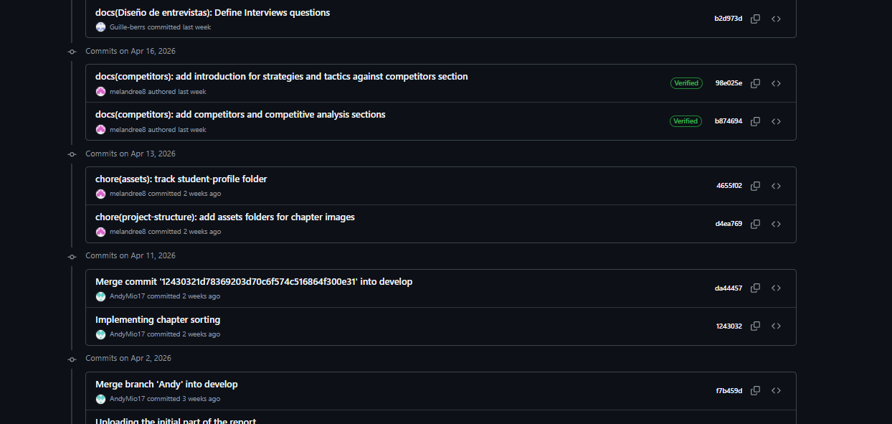 </div> 

# Contenido

## Tabla de Contenidos

[Registro de versiones del informe](#registro-de-versiones-del-informe)

[Project Report Collaboration Insights](#project-report-collaboration-insights)

[Contenido](#contenido)

[Student Outcome](#student-outcome)

[Capítulo I: Introducción](#capitulo-i-introduccion)

- [1.1. Startup Profile](#11-startup-profile)
  - [1.1.1. Descripción de la Startup](#111-descripción-de-la-startup)
  - [1.1.2. Perfiles de integrantes del equipo](#112-perfiles-de-integrantes-del-equipo)
- [1.2. Solution Profile](#12-solution-profile)
  - [1.2.1. Antecedentes y problemática](#121-antecedentes-y-problemática)
  - [1.2.2. Lean UX Process](#122-lean-ux-process)
    - [1.2.2.1. Lean UX Problem Statements](#1221-lean-ux-problem-statements)
    - [1.2.2.2. Lean UX Assumptions](#1222-lean-ux-assumptions)
    - [1.2.2.3. Lean UX Hypothesis Statements](#1223-lean-ux-hypothesis-statements)
    - [1.2.2.4. Lean UX Canvas](#1224-lean-ux-canvas)
- [1.3. Segmentos objetivo](#13-segmentos-objetivo)

[Capítulo II: Requirements Elicitation & Analysis](#capítulo-ii-requirements-elicitation--analysis-1)

- [2.1. Competidores](#21-competidores)
  - [2.1.1. Análisis competitivo](#211-análisis-competitivo)
  - [2.1.2. Estrategias y tácticas frente a competidores](#212-estrategias-y-tácticas-frente-a-competidores)
- [2.2. Entrevistas](#22-entrevistas)
  - [2.2.1. Diseño de entrevistas](#221-diseño-de-entrevistas)
  - [2.2.2. Registro de entrevistas](#222-registro-de-entrevistas)
  - [2.2.3. Análisis de entrevistas](#223-análisis-de-entrevistas)
- [2.3. Needfinding](#23-needfinding)
  - [2.3.1. User Personas](#231-user-personas)
  - [2.3.2. User Task Matrix](#232-user-task-matrix)
  - [2.3.3. User Journey Mapping](#233-user-journey-mapping)
  - [2.3.4. Empathy Mapping](#234-empathy-mapping)
- [2.4. Big Picture EventStorming](#24-big-picture-eventstorming)
- [2.5. Ubiquitous Language](#25-ubiquitous-language)

[Capítulo III: Requirements Specification](#capítulo-iii-requirements-specification-1)

- [3.1. User Stories](#31-user-stories)
- [3.2. Impact Mapping](#32-impact-mapping)
- [3.3. Product Backlog](#33-product-backlog)

[Capítulo IV: Product Design](#capitulo-iv-product-design-1)

- [4.1. Style Guidelines](#41-style-guidelines)
  - [4.1.1. General Style Guidelines](#411-general-style-guidelines)
  - [4.1.2. Web Style Guidelines](#412-web-style-guidelines)
- [4.2. Information Architecture](#42-information-architecture)
  - [4.2.1. Organization Systems](#421-organization-systems)
  - [4.2.2. Labeling Systems](#422-labeling-systems)
  - [4.2.3. SEO Tags and Meta Tags](#423-seo-tags-and-meta-tags)
  - [4.2.4. Searching Systems](#424-searching-systems)
  - [4.2.5. Navigation Systems](#425-navigation-systems)
- [4.3. Landing Page UI Design](#43-landing-page-ui-design)
  - [4.3.1. Landing Page Wireframe](#431-landing-page-wireframe)
  - [4.3.2. Landing Page Mock-up](#432-landing-page-mock-up)
- [4.4. Web Applications UX/UI Design](#44-web-applications-uxui-design)
  - [4.4.1. Web Applications Wireframes](#441-web-applications-wireframes)
  - [4.4.2. Web Applications Wireflow Diagrams](#442-web-applications-wireflow-diagrams)
  - [4.4.3. Web Applications Mock-ups](#443-web-applications-mock-ups)
  - [4.4.4. Web Applications User Flow Diagrams](#444-web-applications-user-flow-diagrams)
- [4.5. Web Applications Prototyping](#45-web-applications-prototyping)
- [4.6. Domain-Driven Software Architecture](#46-domain-driven-software-architecture)
  - [4.6.1. Design-Level EventStorming](#461-design-level-eventstorming)
  - [4.6.2. Software Architecture Context Diagram](#462-software-architecture-context-diagram)
  - [4.6.3. Software Architecture Container Diagrams](#463-software-architecture-container-diagrams)
  - [4.6.4. Software Architecture Components Diagrams](#464-software-architecture-components-diagrams)
- [4.7. Software Object-Oriented Design](#47-software-object-oriented-design)
  - [4.7.1. Class Diagrams](#471-class-diagrams)
- [4.8. Database Design](#48-database-design)
  - [4.8.1. Database Diagrams](#481-database-diagrams)

[Capítulo V: Product Implementation, Validation & Deployment](#capitulo-v-product-implementation-validation-deployment-)
- [5.1. Software Configuration Management](#51-software-configuration-management)
  - [5.1.1. Software Development Environment Configuration](#511-software-development-environment-configuration)
  - [5.1.2. Source Code Management](#512-source-code-management)
  - [5.1.3. Source Code Style Guide & Conventions](#513-source-code-style-guide--conventions)
  - [5.1.4. Software Deployment Configuration](#514-software-deployment-configuration)
- [5.2. Landing Page, Service & Application Implementation](#52-landing-page-service--application-implementation)
  - [5.2.1 Sprint 1](#521-sprint-1)
    - [5.2.1.1. Sprint Planning](#5211-sprint-planning)
    - [5.2.1.2. Aspect Leaders and Collaborators](#5212-aspect-leaders-and-collaborators)
    - [5.2.1.3. Sprint Backlog](#5213-sprint-backlog)
    - [5.2.1.4. Development Evidence](#5214-development-evidence)
    - [5.2.1.5. Execution Evidence](#5215-execution-evidence)
    - [5.2.1.6. Services Documentation](#5216-services-documentation)
    - [5.2.1.7. Software Deployment Evidence](#5217-software-deployment-evidence)
    - [5.2.1.8. Team Collaboration Insights](#5218-team-collaboration-insights)
 - [5.3. Validation Interviews](#53-validation-interviews)
   - [5.3.1. Diseño de Entrevistas](#531-diseño-de-entrevistas)
   - [5.3.2. Registro de Entrevistas](#532-registro-de-entrevistas)
   - [5.3.3. Evaluaciones según heurísticas](#533-evaluaciones-según-heurísticas)
 
- [5.4. Video About-the-Product](#54-video-about-the-product)
   
      
- [Conclusiones y recomendaciones](#conclusiones-y-recomendaciones)

- [Video About-the-Team](#Video-About-the-Team)
  
- [Bibliografía](#bibliografia)

- [Anexos](#anexos)


# Student Outcome

<div align="center">
  <table style="width:100%; border-collapse: collapse; font-family: Arial, sans-serif; font-size: 14px;">
    <thead>
      <tr style="background-color: #f2f2f2; text-align: center;">
        <th style="border: 1px solid #dddddd; padding: 12px; width: 25%;">Criterio específico</th>
        <th style="border: 1px solid #dddddd; padding: 12px; width: 45%;">Acciones realizadas</th>
        <th style="border: 1px solid #dddddd; padding: 12px; width: 30%;">Conclusiones</th>
      </tr>
    </thead>
    <tbody>
      <tr>
        <td style="border: 1px solid #dddddd; padding: 10px; font-weight: bold; vertical-align: top;">
          Trabaja en equipo para proporcionar liderazgo en forma conjunta.
        </td>
        <td style="border: 1px solid #dddddd; padding: 10px; vertical-align: top;">
          <ul>
            <li><b>AV1 - Angel Guillermo, Berrospi Marin:</b> 
            Fomenté comunicación con el grupo para tener un buen entendimiento del proyecto realizado, asi mismo ayude en la realización de diferentes puntos del proyecto, por ejmplo el capítulo 2 y la landing page, la estructura del capítulo 5 y coordinaciones que ayudaron en el avance del trabajo y su culminación.</li>
            <li><b>TB1 - Angel Guillermo, Berrospi Marin:</b> 
            Realice los diseños de los dashboard del bounded context inventory y reporting en figma, asi mismo en la programación de los mencionados bounded context que me tocaron realizar, participe activamente en la comunicación con el grupo y fomentando avances del proyecto.</li>
            <li><b>AV2 - Angel Guillermo, Berrospi Marin:</b> 
            Fomenté comunicación con el grupo para tener un buen entendimiento del proyecto realizado, asi mismo ayude en la realización de diferentes puntos del proyecto, por ejmplo la estructura de diseño de entrevistas, entrevistas y coordinaciones que ayudaron en el avance del trabajo y su culminación.</li>
            <li><b>TB1 - Andy Alejandro, Mio Mejia:</b>
            Realicé la actualización y refinamiento integral de mockups y wireframes para los bounded contexts Analytics y SignUp, mejorando la consistencia visual y la experiencia del usuario. Llevé a cabo la revisión y corrección exhaustiva de User Stories, incluyendo la validación de criterios de aceptación y la alineación con los requisitos del proyecto. Corregí y mejoré el Lean UX Canvas validando hipótesis y asegurando coherencia con los objetivos del producto. Participé activamente en la coordinación del equipo, asegurando que los diseños, wireframes y documentación estuvieran alineados.</li>
            <li><b>AV1 - Mel Andre, Orellana Rodriguez:</b> Contribuí activamente en la organización y desarrollo del proyecto, apoyando en la planificación de tareas y asegurando el cumplimiento de los objetivos establecidos. Participé en la coordinación del equipo para mantener una comunicación clara y efectiva, además de colaborar en la implementación de la landing page y en la estructuración de secciones clave del documento.</li>
           <li><b>TB1 - Mel Andre, Orellana Rodriguez:</b> Contribuí activamente en el desarrollo de SafeFlow mediante la implementación y organización de la aplicación web, colaborando en la conexión de la landing page con el frontend principal. Participé en la creación y gestión de ramas del repositorio safeflow-webapp, en la implementación del MockAPI y en el desarrollo de los bounded contexts Analytics y Monitoring. Además, apoyé en la coordinación de tareas del frontend para asegurar el cumplimiento de los objetivos del proyecto y mantener una comunicación efectiva dentro del equipo.</li>
                  <li><b>AV2 - Mel Andre, Orellana Rodriguez:</b> Contribuí activamente en el desarrollo del backend de SafeFlow mediante el diseño e implementación de la base de datos relacional, asegurando la correcta persistencia y estructura de los datos del sistema. Participé en el desarrollo de las APIs REST para conectar la lógica del lado del servidor con el frontend, trabajando en la arquitectura de los servicios y en la configuración del entorno de despliegue. Además, apoyé en la gestión del repositorio del backend y en la coordinación de tareas técnicas para asegurar el cumplimiento de los objetivos y una integración eficiente del proyecto.</li>
           <li><b>AV1 - Anhelo Rodrigo, Rocca Leon:</b>Complete las tareas que me fueron asignadas y comunique mi progreso en gran parte de ellas. Además, contribuí en otras tareas que me fueron ofrecidas. Mi aporte ayudó a materializar la arquitectura de Safeflow y ayudar un poco en el estudio del público objetivo.</li>
          <li><b>TB1 - Anhelo Rodrigo, Rocca Leon:</b>Complete las tareas que me fueron asignadas y comunique mi progreso en gran parte de ellas. Además, contribuí en otras tareas que me fueron ofrecidas..</li>
            <li><b>AV1 - Tu Nombre:</b> Tus acciones</li>
            <li><b>AV1 - Anhelo Rodrigo, Rocca Leon:</b>Complete las tareas que me fueron asignadas y comunique mi progreso en gran parte de ellas. Además, contribuí en otras tareas que me fueron ofrecidas. Mi aporte ayudó a materializar la arquitectura de Safeflow y ayudar un poco en el estudio del público objetivo.</li>
            <li><b>AV1 - Andy Alejandro, Mio Mejia:</b> Completé las tareas de diseño de producto asignadas y comuniqué mi progreso de manera efectiva en cada etapa. Además, contribuí en tareas adicionales para fortalecer la identidad visual y estructural del proyecto. Mi aporte ayudó a materializar la interfaz y la experiencia de usuario de Safeflow, definiendo desde los lineamientos de estilo y la arquitectura de información hasta el diseño detallado de los wireframes y mock-ups para la landing page y las aplicaciones web.</li>
            <li><b>AV1 - Jefferson Bayron, Morales Yapuchura:</b> Apoyé el liderazgo del grupo dirigiendo la estructuración del perfil de nuestros usuarios. A través de la creación de la primera version de user personas, empathy maps, user journey maps, la user task matrix y el desarollo de 4 entrevistas, proporcioné las bases necesarias para que el equipo pudiera trabajar de manera conjunta y enfocada, guiando el desarrollo funcional y visual del proyecto. </li>
          </ul>
        </td>
        <td style="border: 1px solid #dddddd; padding: 10px; vertical-align: top;">
El equipo logró coordinarse de manera progresiva a lo largo del desarrollo del proyecto, destacando la participación activa de algunos integrantes en la organización y toma de decisiones. Esto permitió mantener una dirección clara y avanzar de forma constante en las actividades planteadas.        </td>
      </tr>
      <tr>
        <td style="border: 1px solid #dddddd; padding: 10px; font-weight: bold; vertical-align: top;">
          Crea un entorno colaborativo e inclusivo, establece metas, planifica tareas y cumple objetivos.
        </td>
        <td style="border: 1px solid #dddddd; padding: 10px; vertical-align: top;">
          <ul>
            <li><b>AV1 - Angel Guillermo Berrospi Marin:</b>
            Participé activamente en el desarrollo del proyecto, tanto en la realización de tareas cómo entrar a las reuniones programadas para la coordinación de diferentes puntos, establecí mi propia métrica con respecto a los puntos que me tocaron y de esa forma pude desempeñar un buen rendimiento tanto en ayuda para el grupo cómo para la finalización del proyecto.</li>
            <li><b>TB1 - Angel Guillermo Berrospi Marin:</b>
            En todo momento fomente la comunicación para tener un buen desarrollo del trabajo y las mejoras que requeria, del mismo modo cumpli con las tareas que se me asignaron en el tiempo que se designo, ayude tanto en la documentación cómo en el desarrollo del frontend.</li>
            <li><b>AV2 - Angel Guillermo Berrospi Marin:</b>
            Activamente fui participe en el desarrollo del trabajo, tanto en la realización de tareas cómo entrar a las reuniones programadas para la coordinación de diferentes puntos, establecí mi propia métrica con respecto a los puntos que me tocaron y de esa forma pude desempeñar un buen rendimiento tanto en ayuda para el grupo cómo para la culminación del proyecto.</li>
            <li><b>TB1 - Andy Alejandro, Mio Mejia:</b>
            Fomentélapequeña comunicación constante con el equipo para asegurar la alineación en los diseños y requisitos del proyecto. Establecí metas claras para la revisión de User Stories y el refinamiento de mockups, cumpliendo con los plazos establecidos. Coordiné las mejoras necesarias en el Lean UX Canvas con el feedback del equipo, contribuyendo a que los objetivos de TB1 se lograran de manera organizada y eficiente. Participé activamente en las reuniones del sprint y contribuí en la documentación del desarrollo.</li>
            <li><b>AV1 - Mel Andre Orellana Rodriguez:</b>Fomenté un ambiente colaborativo dentro del equipo, promoviendo la participación activa y el cumplimiento de responsabilidades. Me enfoqué en coordinar tareas, apoyar en la resolución de problemas y mantener alineados los objetivos del proyecto, contribuyendo así a la entrega final de manera organizada y eficiente.</li>
          <li><b>TB1 - Mel Andre Orellana Rodriguez:</b> Fomenté un ambiente colaborativo dentro del equipo durante el desarrollo de SafeFlow, promoviendo la participación activa y el cumplimiento de responsabilidades en las tareas del frontend. Me enfoqué en coordinar actividades relacionadas con la implementación de la aplicación web, la integración de la landing page, el desarrollo del MockAPI y los bounded contexts Analytics y Monitoring. Además, apoyé en la organización del repositorio y en la alineación de los objetivos del proyecto para asegurar un desarrollo eficiente y ordenado.</li>
    <li><b>AV2 - Mel Andre Orellana Rodriguez:</b> Fomenté un ambiente colaborativo dentro del equipo durante el desarrollo del backend de SafeFlow, coordinando el diseño e implementación de la base de datos relacional y asegurando la persistencia de los datos. Me enfoqué en liderar la arquitectura del lado del servidor, el desarrollo de las APIs REST para conectar los módulos principales y la lógica de negocio de los bounded contexts. Asimismo, apoyé en la gestión de migraciones, la configuración de variables de entorno y el despliegue del backend para garantizar una integración limpia y eficiente con el frontend.</li>
            <li><b>AV1 - Anhelo Rodrigo Rocca Leon:</b>Participé en la planificación y desarrollo del proyecto, al igual que en las reuniones de equipo programadas. Me asegure de mantener un ambiente respetuoso entre los compañeros y que la solución de las tareas asignadas a mi persona cumplan con las metas establecidas por el equipo.</li>
            <li><b>TB1 - Anhelo Rodrigo Rocca Leon:</b>Participé en la planificación y desarrollo del proyecto, al igual que en la comunicación mediante mensajes de texto. Me asegure de mantener un ambiente respetuoso entre los compañeros y que la solución de las tareas asignadas a mi persona cumplan con las metas establecidas por el equipo.</li>
<li><b>AV1 - Tu Nombre:</b> Tus acciones</li>
             <li><b>AV1 - Jefferson Bayron Morales Yapuchura:</b> Contribuí a crear un ambiente de trabajo inclusivo y colaborativo participando activamente en todas las coordinaciones. Para mis asignaciones, establecí metas específicas y planifiqué el desarrollo de herramientas como los empathy maps y la user task matrix. Esto me permitió cumplir estrictamente con mis objetivos, entregando un análisis de usuario que facilitó el avance organizado de todo el equipo.</li>
            <li><b>AV1 - TAndy Alejandro Mio Mejia:</b> Participé activamente en la planificación y el diseño de la interfaz del proyecto, así como en todas las reuniones de equipo programadas. Me aseguré de mantener un ambiente colaborativo y respetuoso con mis compañeros, garantizando que el desarrollo de los lineamientos de estilo, la arquitectura de información y los prototipos de Safeflow cumplieran estrictamente con las metas de calidad y los plazos establecidos por el equipo.</li>
            <li><b>AV1 - Jefferson Bayron Morales Yapuchura:</b> Contribuí a crear un ambiente de trabajo inclusivo y colaborativo participando activamente en todas las coordinaciones. Para mis asignaciones, establecí metas específicas y planifiqué el desarrollo de herramientas como los empathy maps y la user task matrix. Esto me permitió cumplir estrictamente con mis objetivos, entregando un análisis de usuario que facilitó el avance organizado de todo el equipo.</li>
          </ul>
        </td>
        <td style="border: 1px solid #dddddd; padding: 10px; vertical-align: top;">
Se establecieron metas y una planificación que facilitaron el desarrollo del proyecto. A pesar de algunas diferencias en el ritmo de trabajo, se logró cumplir con los objetivos principales y completar las entregas de manera organizada.        </td>
      </tr>
    </tbody>
  </table>
</div>

# Capitulo I: Introduccion

## 1.1. StartUp Profile 

En esta sección se presenta el perfil de la startup Cryologic Systems, describiendo su propósito, enfoque y propuesta de valor dentro del contexto de la gestión de la cadena de frío. Asimismo, se detallan las características principales de la solución planteada y el rol del equipo encargado de su desarrollo.


### 1.1.1. Descripción de la Startup

Cryologic Systems es una startup tecnológica que desarrolla una plataforma digital orientada a la gestión y monitoreo de la cadena de frío en productos sensibles como medicamentos y alimentos perecederos. Su propósito principal es ofrecer una solución que permita a las empresas garantizar que sus productos se mantengan dentro de condiciones térmicas adecuadas durante todo el proceso de almacenamiento y transporte.

La startup surge como respuesta a la problemática de pérdidas económicas y riesgos sanitarios ocasionados por variaciones en la temperatura que afectan la calidad e integridad de los productos. En este contexto, Cryologic Systems  propone un sistema que permite registrar productos, definir rangos de temperatura permitidos y supervisar su comportamiento a lo largo de la cadena logística.

La plataforma analiza continuamente las condiciones registradas y detecta desviaciones respecto a los parámetros establecidos, generando alertas que facilitan la toma de decisiones oportunas. Además, permite la trazabilidad de los productos, identificando en qué punto de la cadena ocurre una incidencia y facilitando el control operativo


### 1.1.2. Perfiles de integrantes del equipo


| *Integrante*            |         |
|---------------------------|---------------------------------------------------------------------------------------------------|
| *Código del Estudiante* | U202116018          |
| *Carrera*               | Ingeneria de Software         |
| *Descripción*           | Soy estudiante de Ingeniería de Software y me caracterizo por mi compromiso con el trabajo en equipo. Cuento con conocimientos en HTML, CSS, JavaScript y SQL, lo cual puede aportar al desarrollo del proyecto en las áreas de frontend y bases de datos. Además, tengo experiencia en Python, lo que me permite apoyar en tareas de programación, automatización y análisis cuando sea necesario.    |
| Foto                      | <div align="center"> </div>         |

| *Integrante*            |            |
|---------------------------|---------------------------------------------------------------------------------------------------|
| *Código del Estudiante* | U202114701      |
| *Carrera*               | Ingenieria de Software           |
| *Descripción*           | Soy estudiante de Ingeniería de Software. Tendre el compromiso con mi equipo en ser proactivo, siempre apoyar en lo que se necesite y mantener una comunicación fluida. Cuento con conocimientos en html, css, javascript y SQL, lo cual puede ser de ayuda en el desarrollo del proyecto.           |
| Foto                      | <div algin="center">  </div>        |

| *Integrante*            | Anhelo Rocca                                                                                                                                                                                                                                                          |
|---------------------------|-----------------------------------------------------------------------------------------------------------------------------------------------------------------------------------------------------------------------------------------------------------------------|
| *Código del Estudiante* | U20221C803                                                                                                                                                                                                                                                            |
| *Carrera*               | Ingeniería de Software                                                                                                                                                                                                                                                |
| *Descripción*           | Soy estudiante de Ingeniería de Software. Cuento con conocimientos en los lenguajes de programación como C++, Python y SQL. Me comprometo a trabajar con mi equipo en el desarrollo de nuestro proyecto, al igual que ayudar siempre que mis capacidades lo permitan. |
| Foto                      | <div align="center">                                                                                                                                                                                                    |

| *Integrante*            | Jefferson Morales           |
|---------------------------|---------------------------------------------------------------------------------------------------|
| *Código del Estudiante* | U202316049           |
| *Carrera*               | Ingenieria de Software           |
| *Descripción*           | Estudiante de Ingeniería de Software con un enfoque proactivo en la resolución de problemas y el desarrollo de soluciones escalables. Me defino como un entusiasta del aprendizaje continuo, lo que me permite navegar con agilidad entre lenguajes y frameworks emergentes.           |
| Foto                      | <div algin="center">  </div>           |

| *Integrante*            |       Andy Alejandro Mio Mejia     |
|---------------------------|---------------------------------------------------------------------------------------------------|
| *Código del Estudiante* |     U202218531       |
| *Carrera*               |     Ingenieria de Software       |
| *Descripción*           |       Soy estudiante de la carrera de Ingeniería de Software, puedo aportar mucho al equipo, aplicando mis conocimientos en diversos lenguajes de programación     |
| Foto                      |     <div align="center">        |


## 1.2. Solution Profile

El Solution Profile de SafeFlow presenta la definición del problema que aborda la propuesta y el enfoque de solución basado en la optimización de la cadena de frío mediante una plataforma web. Esta sección se divide en dos partes: antecedentes y problemática, y el proceso de Lean UX aplicado al dominio del problema.

### 1.2.1 Antecedentes y problemática

La cadena de frío constituye un proceso fundamental en industrias como la farmacéutica y alimentaria, donde es indispensable mantener los productos dentro de rangos específicos de temperatura para preservar su calidad, seguridad y efectividad. A lo largo del tiempo, las empresas han implementado distintos mecanismos de control durante el almacenamiento y transporte; sin embargo, estos métodos no siempre garantizan un monitoreo continuo ni una supervisión eficiente de las condiciones ambientales.

En la actualidad, muchas organizaciones aún enfrentan limitaciones para controlar de manera constante las variables críticas, especialmente la temperatura, lo que dificulta la detección temprana de anomalías. Como consecuencia, las incidencias suelen identificarse cuando el producto ya ha sido afectado, generando pérdidas económicas significativas y posibles riesgos para la salud de los consumidores.

Asimismo, la ausencia de sistemas integrados que permitan una trazabilidad completa de la cadena logística impide identificar con precisión en qué punto ocurrió la falla y quién fue el responsable del evento. Esta falta de visibilidad reduce la capacidad de respuesta ante incidentes y limita la toma de decisiones oportunas.

En este contexto, se evidencia la necesidad de contar con una solución tecnológica que permita monitorear, registrar y analizar las condiciones de la cadena de frío de manera eficiente, con el fin de prevenir pérdidas, mejorar la trazabilidad y optimizar la gestión de productos sensibles.


### 1.2.2 Lean UX Process

En esta parte se implementa el Lean UX Process, abordando la visión del modelo de negocio que respaldará al producto de software. Se incluyen los Problem Statements, que contemplan elementos como el dominio, los segmentos de clientes, los puntos de dolor, las brechas, la visión/estrategia y el segmento inicial. Además, se definen las Assumptions y los Hypothesis Statements de acuerdo con la metodología Lean UX. Finalmente, se presenta el Lean UX Canvas que resume y organiza estos elementos.

#### 1.2.2.1. Lean UX Problem Statements

El estado actual de la gestión de la cadena de frío en las industrias farmacéutica y alimentaria es deficiente debido a la falta de monitoreo en tiempo real y sistemas de trazabilidad integrados. Muchas empresas dependen de registros manuales o dispositivos que solo detectan fallos post-mortem, lo que genera pérdidas económicas, riesgos sanitarios y retrasos en la capacidad de respuesta ante incidencias.

Nuestra plataforma ha sido diseñada para permitir a pequeñas y medianas empresas del sector logístico, farmacéutico y alimentario, así como a gestores logísticos, supervisores de calidad y operadores administrativos, gestionar eficientemente el monitoreo de la cadena de frío, desde la supervisión de temperatura en tiempo real hasta el seguimiento y trazabilidad de los productos transportados. A través de esta herramienta digital, buscamos facilitar la administración operativa, mejorar la capacidad de reacción ante anomalías y optimizar la integridad y seguridad de la carga.

¿Cómo podríamos ofrecer a los gestores logísticos y responsables de calidad una herramienta que proporcione visibilidad completa y alertas preventivas sobre el estado de sus productos, para que puedan intervenir antes de que la temperatura salga del rango permitido y asegurar la integridad de la carga?

#### 1.2.2.2. Lean UX Assumptions

En esta sección se detallan las suposiciones relacionadas con los resultados esperados del sistema de monitoreo en tiempo real de la cadena de frío. Estas suposiciones se organizan en tres categorías: Business Outcomes, que contemplan los beneficios comerciales y mejoras en la gestión logística; User Outcomes, enfocados en cómo las empresas y usuarios se beneficiarán al monitorear y controlar la temperatura de sus productos; y User Outcomes Assumptions, que examinan las necesidades, intereses y comportamientos de los usuarios que fundamentan las suposiciones anteriores. Cada categoría busca garantizar que la plataforma cumpla tanto con los objetivos comerciales como con las expectativas de quienes la utilizarán.

Usuarios del sistema
- Gerentes logísticos.
- Supervisores y responsables de calidad.
- Operadores administrativos.
- Encargados de almacén y transporte.
- Empresas farmacéuticas, alimentarias y logísticas que gestionan productos sensibles a cambios de temperatura.

¿Dónde encaja nuestro producto en su trabajo?
- La plataforma encaja en las operaciones diarias de monitoreo y control de la cadena de frío, permitiendo a los usuarios supervisar la temperatura de los productos en tiempo real, recibir alertas preventivas, gestionar incidencias y consultar reportes históricos desde cualquier lugar mediante una solución centralizada y accesible.

Business Outcomes
- Creemos que al implementar nuestra plataforma de monitoreo continuo de la cadena de frío basada en IoT, podremos aumentar en un 50% la cantidad de empresas que supervisan en tiempo real la temperatura de sus productos.
- Creemos que al ofrecer alertas automáticas en tiempo real, lograremos reducir en un 30% las pérdidas de productos ocasionadas por fallas en la cadena de frío.
- Creemos que al proporcionar dashboards visuales y reportes claros, incrementaremos en un 40% la eficiencia en la toma de decisiones logísticas y operativas.
- Creemos que al ofrecer una plataforma accesible e intuitiva, obtendremos una satisfacción del usuario superior al 85% en cuanto a facilidad de uso y utilidad.
- Creemos que al integrar trazabilidad completa de los productos, permitiremos a las empresas reducir en un 25% los tiempos de respuesta ante incidencias.

Business Outcomes Assumptions
- Creemos que la falta de monitoreo continuo de la temperatura en la cadena de frío es un problema crítico que genera pérdidas económicas y riesgos sanitarios.
- Creemos que las empresas del sector logístico, farmacéutico y alimentario estarán interesadas en adoptar una solución tecnológica que les permita mejorar el control de sus productos.
- Creemos que el uso de sensores IoT con monitoreo en tiempo real facilitará la detección temprana de problemas en la cadena de frío.
- Creemos que las empresas valoran soluciones que automaticen alertas y reportes, ya que optimizan tiempo y reducen errores humanos.
- Creemos que las organizaciones buscan herramientas que les permitan tener visibilidad completa de su operación logística.

User Outcomes
- Creemos que al ofrecer monitoreo en tiempo real, los usuarios podrán tomar decisiones rápidas para evitar pérdidas de productos.
- Creemos que mediante dashboards intuitivos, los usuarios podrán interpretar fácilmente el estado de sus productos.
- Creemos que al permitir el acceso remoto, los usuarios podrán supervisar sus operaciones desde cualquier lugar.
- Creemos que al ofrecer historial de datos, los usuarios podrán identificar patrones y prevenir futuras incidencias.
- Creemos que al generar alertas automáticas, los usuarios podrán actuar de manera inmediata ante desviaciones de temperatura.


User Outcomes Assumptions
- Creemos que los usuarios necesitan información clara y en tiempo real para gestionar adecuadamente la cadena de frío.
- Creemos que los usuarios prefieren soluciones simples que no requieran conocimientos técnicos avanzados.
- Creemos que los usuarios se sienten limitados por sistemas actuales que no ofrecen monitoreo continuo.
- Creemos que los usuarios valoran herramientas que reduzcan riesgos y optimicen sus procesos operativos.
- Creemos que las empresas necesitan sistemas confiables que les permitan garantizar la calidad de sus productos.


Features Assumptions
- Creemos que un dashboard en tiempo real permitirá a los usuarios monitorear múltiples productos y ubicaciones de manera eficiente.
- Creemos que las alertas automáticas ayudarán a prevenir pérdidas al detectar desviaciones de temperatura de forma inmediata.
- Creemos que el acceso remoto permitirá una gestión más flexible y eficiente de la cadena de frío.
- Creemos que el historial de datos permitirá analizar tendencias y mejorar procesos logísticos.
- Creemos que una interfaz intuitiva facilitará la adopción del sistema sin necesidad de capacitación especializada.

#### 1.2.2.3. Lean UX Hypothesis Statements

##### Hipótesis de Prevención (Monitoreo + Alertas):
Creemos que al integrar el Contexto de Monitoreo Ambiental con el Contexto de Alertas, lograremos reducir la pérdida de carga en un 25%. Sabremos que estamos en lo correcto cuando el tiempo entre la detección de una anomalía y la acción correctiva del conductor sea menor a 15 minutos.

##### Hipótesis de Trazabilidad (Inventario + Logístico):
Creemos que al vincular el Contexto de Inventario con el Contexto Logístico (actualizando el estado térmico del despacho), aumentaremos la confianza del cliente B2B. Sabremos que tenemos razón cuando los reportes finales de entrega no muestren discrepancias entre lo prometido en el inventario y lo registrado en el trayecto.

##### Hipótesis de Eficiencia (Gestión del Sistema):
Creemos que al proporcionar un Dashboard de Gestión que centralice todos los contextos, los jefes de logística reducirán el tiempo dedicado a la supervisión diaria. Lo validaremos cuando los usuarios reporten una disminución del 40% en el uso de herramientas externas (como Excel o llamadas telefónicas) para verificar el estado de los despachos.

##### Hipótesis de Integridad (Logístico):
Confiamos en que al automatizar el cambio de estado del despacho basado en datos de sensores, eliminaremos el error humano en los registros de calidad. Estaremos en lo cierto cuando el 100% de los despachos completados cuenten con un historial térmico verificado e inalterable.

#### 1.2.2.4. Lean UX Canvas
El Lean UX Canvas presenta de manera visual y estructurada los principales elementos estratégicos del producto propuesto. En este canvas se resumen los problemas identificados en la gestión de la cadena de frío, los usuarios involucrados, las necesidades del negocio, las hipótesis planteadas, las funcionalidades principales y los resultados esperados. Asimismo, permite organizar las ideas centrales de la solución tecnológica enfocada en el monitoreo en tiempo real, la trazabilidad y la prevención de incidencias en productos sensibles a variaciones de temperatura.

 <div align="center"> </div>

## 1.3. Segmentos objetivo

En esta sección se identifican los segmentos de clientes a los cuales está dirigida la solución propuesta por Cryologic Systems. La segmentación permite enfocar el desarrollo del producto en usuarios que presentan necesidades específicas relacionadas con la gestión de la cadena de frío, optimizando así la propuesta de valor.

### Segmento Objetivo 1: Empresas del sector farmacéutico

Este segmento está conformado por laboratorios, distribuidoras y operadores logísticos que transportan medicamentos sensibles a la temperatura, como vacunas, insulina y productos biológicos.

Estas organizaciones requieren un control estricto de la cadena de frío debido a normativas sanitarias y estándares de calidad. Actualmente, enfrentan dificultades para monitorear en tiempo real las condiciones térmicas durante el transporte, lo que puede comprometer la eficacia de los productos y generar pérdidas económicas significativas.

Necesidades clave:

- Monitoreo en tiempo real de temperatura
- Alertas inmediatas ante desviaciones
- Trazabilidad completa para auditorías
- Cumplimiento de normativas sanitarias


### Segmento 2: Operadores logísticos (3PL / transporte especializado)

Empresas que brindan servicios de transporte y distribución para terceros (farmacéuticas o alimentos), especialmente aquellas que manejan carga refrigerada.

Por qué es potente:

No son dueños del producto, pero sí responsables del transporte
Necesitan evidencia (reportes) para sus clientes
Tienen alto interés en diferenciarse con tecnología

Necesidades:

- Monitoreo en tiempo real durante rutas
- Reportes para clientes
- Alertas para conductores
- Optimización de rutas y tiempos

# Capítulo II: Requirements Elicitation & Analysis
## 2.1. Competidores

En esta sección se identifican y describen los principales competidores de Cryologic Systems  dentro del mercado de soluciones tecnológicas para el monitoreo de la cadena de frío. El análisis de competidores permite comprender el entorno en el que se desarrollará la propuesta, así como reconocer las características, fortalezas y enfoques de otras soluciones existentes.

### 2.1.1. Análisis competitivo

El análisis competitivo tiene como objetivo evaluar y comparar a Cryologic Systems  con sus principales competidores en función de distintos criterios, tales como propuesta de valor, mercado objetivo, estrategias de marketing, productos y servicios ofrecidos, costos y canales de distribución.

<table>
    <tr>
        <td colspan="6" class="section-title">
            <h3>Competitive Analysis Landscape</h3>
        </td>
    </tr>
    <tr>
        <td colspan="2" rowspan="2">
            ¿Por qué llevar a cabo este análisis?
        </td>
        <td colspan="4">
            Escriba en el recuadro la pregunta que busca responder o el objetivo de este análisis.
        </td>
    </tr>
    <tr>
        <td colspan="4">
            Analizar cómo se posiciona  Cryologic Systems  frente a sus competidores en el mercado de monitoreo de la cadena de frío, en términos de propuesta de valor, tecnología y accesibilidad.
        </td>
    </tr>
    <tr>
        <td colspan="2">(Productos)</td>
        <td align="center"> Cryologic Systems  (Startup)</td>
        <td align="center">Sensitech</td>
        <td align="center">Controlant</td>
        <td align="center">Monnit</td>
    </tr>
    <tr>
       <td align="center" rowspan="2">Perfil</td>
        <td>Overview</td>
        <td> Cryologic Systems  es una plataforma web que permite monitorear en tiempo real la cadena de frío mediante sensores IoT, generando alertas y ofreciendo trazabilidad completa de los productos.</td>
        <td>Sensitech ofrece soluciones globales de monitoreo de la cadena de frío con alta precisión y análisis avanzado para grandes empresas.</td>
        <td>Controlant es una plataforma IoT enfocada en la industria farmacéutica, que permite visibilidad en tiempo real y análisis de datos.</td>
        <td>Monnit proporciona sensores inalámbricos para monitoreo ambiental en múltiples industrias.</td>
    </tr>
    <tr>
        <td>Ventaja Competitiva ¿Qué valor ofrece a los clientes?</td>
        <td>Accesibilidad, facilidad de uso, monitoreo en tiempo real y alertas preventivas que reducen pérdidas.</td>
        <td>Alta precisión, cumplimiento normativo y experiencia global.</td>
        <td>Integración avanzada de IoT y analítica en tiempo real.</td>
        <td>Bajo costo y flexibilidad en implementación de sensores.</td>
    </tr>
    <tr>
       <td align="center" rowspan="2">Perfil de Marketing</td>
        <td>Mercado Objetivo</td>
        <td>PYMEs, empresas farmacéuticas y operadores logísticos.</td>
        <td>Grandes corporaciones y empresas globales.</td>
        <td>Industria farmacéutica y logística avanzada.</td>
        <td>Empresas que requieren soluciones de monitoreo económico.</td>
    </tr>
    <tr>
        <td>Estrategias de Marketing</td>
        <td>Marketing digital, enfoque en facilidad de adopción y escalabilidad.</td>
        <td>Posicionamiento como líder global y soluciones enterprise.</td>
        <td>Alianzas estratégicas con farmacéuticas.</td>
        <td>Venta directa de hardware y soluciones accesibles.</td>
    </tr>
    <tr>
       <td align="center" rowspan="3">Productos & Servicios</td>
        <td>Productos & Servicios</td>
        <td>Plataforma web con monitoreo en tiempo real, alertas, dashboard y trazabilidad.</td>
        <td>Servicios completos de monitoreo, análisis y cumplimiento.</td>
        <td>Plataforma IoT con sensores y analítica avanzada.</td>
        <td>Sensores inalámbricos y software básico.</td>
    </tr>
    <tr>
        <td>Precios & Costos</td>
        <td>Modelo de suscripción accesible.</td>
        <td>Alto costo (enterprise).</td>
        <td>Alto costo especializado.</td>
        <td>Bajo costo.</td>
    </tr>
    <tr>
        <td>Canales de Distribución (Web y/o Móvil)</td>
        <td>Web (SaaS).</td>
        <td>Web y soluciones empresariales.</td>
        <td>Web con integración IoT.</td>
        <td>Web y dispositivos físicos.</td>
    </tr>
    <tr>
       <td align="center" rowspan="4">Análisis SWOT</td>
        <td>Fortalezas</td>
        <td>Plataforma accesible, monitoreo en tiempo real, alertas automáticas y trazabilidad completa.</td>
        <td>Alta precisión, experiencia global y marca reconocida.</td>
        <td>Tecnología IoT avanzada y enfoque especializado.</td>
        <td>Bajo costo y facilidad de implementación.</td>
    </tr>
    <tr>
        <td>Debilidades</td>
        <td>Startup en crecimiento y baja presencia en el mercado.</td>
        <td>Costos elevados y complejidad de implementación.</td>
        <td>Dependencia de hardware y alto costo.</td>
        <td>Menor especialización en cadena de frío.</td>
    </tr>
    <tr>
        <td>Oportunidades</td>
        <td>Crecimiento del IoT, regulación sanitaria y digitalización logística.</td>
        <td>Expansión en mercados emergentes.</td>
        <td>Demanda creciente en farmacéutica.</td>
        <td>Crecimiento del mercado IoT.</td>
    </tr>
    <tr>
        <td>Amenazas</td>
        <td>Competidores consolidados y barreras de adopción.</td>
        <td>Nuevas startups más accesibles.</td>
        <td>Competencia de soluciones más económicas.</td>
        <td>Competidores especializados.</td>
    </tr>
</table>


### 2.1.2. Estrategias y tácticas frente a competidores

En esta sección se definen las estrategias y tácticas que Cryologic Systems implementará para posicionarse frente a sus competidores dentro del mercado de soluciones para la cadena de frío. Estas acciones se basan en el análisis de fortalezas, debilidades, oportunidades y amenazas, permitiendo establecer un enfoque estratégico que aproveche las ventajas competitivas de la startup y reduzca los riesgos del entorno.


<table border="1" cellpadding="8" cellspacing="0">
    <tr>
        <td>Cryologic Systems</td>
        <td align="center"><strong>Fortalezas</strong><br>
            - Monitoreo en tiempo real<br>
            - Plataforma accesible y fácil de usar<br>
            - Alertas automáticas<br>
            - Trazabilidad completa
        </td>
        <td align="center"><strong>Debilidades</strong><br>
            - Startup con baja presencia en el mercado<br>
            - Dependencia de adopción tecnológica<br>
            - Recursos limitados frente a competidores grandes
        </td>
    </tr>
    <tr>
        <td align="center"><strong>Oportunidades</strong><br>
            - Crecimiento del IoT<br>
            - Regulaciones sanitarias<br>
            - Digitalización logística<br>
            - Expansión al sector alimentario
        </td>
        <td align="center">
            <strong>Estrategia FO</strong><br>
            - Aprovechar el monitoreo en tiempo real para captar empresas que buscan digitalización<br>
            - Escalar la solución a sectores farmacéutico y alimentario<br>
            - Integrar sensores IoT accesibles para facilitar adopción
        </td>
        <td align="center">
            <strong>Estrategia DO</strong><br>
            - Incrementar visibilidad mediante marketing digital<br>
            - Realizar pruebas piloto con empresas<br>
            - Generar contenido educativo sobre cadena de frío
        </td>
    </tr>
    <tr>
        <td align="center"><strong>Amenazas</strong><br>
            - Competidores consolidados<br>
            - Soluciones de bajo costo<br>
            - Barreras de confianza<br>
            - Rápido avance tecnológico
        </td>
        <td align="center">
            <strong>Estrategia FA</strong><br>
            - Diferenciarse por simplicidad frente a soluciones complejas<br>
            - Ofrecer implementación rápida<br>
            - Enfocar la solución en prevención mediante alertas
        </td>
        <td align="center">
            <strong>Estrategia DA</strong><br>
            - Ofrecer versiones demo o gratuitas<br>
            - Generar casos de éxito<br>
            - Brindar soporte técnico cercano y personalizado
        </td>
    </tr>
</table>

## 2.2. Entrevistas
### 2.2.1. Diseño de entrevistas
Segmento Objetivo 1: Empresas del sector farmacéutico

1. ¿Podría indicarnos su edad, cargo actual y cuántos años de experiencia tiene en el sector farmacéutico?

2. ¿En qué distrito reside y cómo es su rutina tecnológica diaria (qué dispositivos usa más: laptop, smartphone, tablet)?

3. ¿Cuáles son sus principales responsabilidades respecto a la seguridad de productos termolábiles (vacunas, insulinas, biológicos)?

4. ¿Qué marcas o softwares de logística e inventario reconoce como líderes o utiliza actualmente?

5. ¿Cómo se describiría profesionalmente: prefiere decisiones basadas en datos analíticos o en la rapidez operativa?

6. ¿Cómo es el proceso actual de registro de un producto sensible cuando ingresa a su sistema de inventario?

7. ¿Cómo definen y vinculan los rangos de temperatura permitidos a cada lote de producto antes de un despacho?

8. ¿Qué criterios utilizan para asignar un transporte específico a un despacho de alta sensibilidad?

9. ¿Cómo se aseguran de que el transportista externo cumpla con los requisitos térmicos antes de cargar el producto?

10. ¿De qué manera supervisan la temperatura mientras el camión está en tránsito hacia una provincia o clínica?

11. ¿Cuál ha sido la peor experiencia que ha tenido con una ruptura de cadena de frío y quién asumió la pérdida económica?

12. ¿Qué sucede exactamente en su empresa cuando un sensor detecta que la temperatura subió a un nivel crítico? ¿Quién recibe la alerta y cuánto tardan en reaccionar?

13. ¿Qué es lo que más le frustra del sistema de monitoreo que usan actualmente (ej. demora en datos, falta de precisión, interfaz compleja)?

14. ¿Cómo manejan actualmente las auditorías sanitarias? ¿Cuánto tiempo les toma reunir la evidencia de trazabilidad térmica de un despacho de hace un mes?

15. ¿Qué impacto tendría en su bono de desempeño o en los KPIs de su área reducir las mermas por temperatura en un 20%?

16. Si tuviera un dashboard que centralizara inventario, rutas y alertas en tiempo real, ¿qué métrica sería la primera que revisaría cada mañana?

17. ¿Qué funcionalidad considera "no negociable" para confiar ciegamente en una plataforma web de cadena de frío?

Segmento Objetivo 2: Operadores logísticos (3PL / transporte especializado)

1. ¿Cuál es su edad, estado civil y nivel de estudios? ¿Cuál es su rol exacto en la operación logística?

2. ¿Qué aplicaciones móviles utiliza con más frecuencia para su trabajo y para su vida personal (WhatsApp, Waze, Facebook, Apps bancarias)?

3. ¿Cómo es la relación tecnológica de sus conductores? ¿Cuentan con smartphones modernos o equipos básicos?

4. ¿Qué canales digitales utiliza para informarse sobre nuevas normativas de transporte o gestión de flotas (LinkedIn, grupos de Facebook, portales web)?

5. ¿Cómo organizan las rutas diarias y cómo notifican a los conductores sobre sus puntos de parada y entrega?

6. ¿Qué proceso siguen los conductores para reportar que han llegado a un punto de entrega y que el producto fue recibido conforme?

7. ¿Cómo registran actualmente las incidencias en ruta (tráfico, fallas mecánicas, desvíos) y cómo afectan estas a la temperatura de la carga?

8. ¿Utilizan alguna herramienta digital para el registro fotográfico de la entrega o siguen usando guías de remisión físicas en papel?

9. ¿Cómo sabe un conductor, mientras maneja, si el equipo de frío de su furgón ha dejado de funcionar correctamente?

10. ¿Reciben los conductores algún tipo de alerta visual o sonora, o dependen de que alguien desde la oficina les avise por teléfono?

11. ¿Qué tan frecuente es que los sensores fallen o den lecturas erróneas? ¿Cómo gestionan esa incertidumbre con sus clientes?

12. ¿Cuál es su mayor miedo o frustración cuando transportan carga de terceros valorizada en miles de dólares?

13. ¿Cómo demuestran ante sus clientes corporativos que son mejores o más confiables que la competencia?

14. ¿Cuánto tiempo invierte su equipo administrativo en descargar datos de los dispositivos de monitoreo para armar el reporte final del cliente?

15. ¿Qué tanto valoraría que el sistema actualizara el "estado térmico" del despacho automáticamente cada 5 minutos en un mapa interactivo?

16. Si pudiera elegir una mejora para su dashboard de gestión, ¿preferiría ver más mapas, más gráficos estadísticos o más alertas de texto?

17. ¿Qué le impide hoy digitalizar el 100% de su operación logística (falta de presupuesto, resistencia del personal, falta de software adecuado)?

### 2.2.2. Registro de entrevistas

#### Segmento objetivo #1: Empresas del sector farmacéutico

---


**Entrevista 1:**
- **Nombres y apellidos:** Sebastian Mendoza
- **Edad:** 35 años
- **Distrito:** San Borja

- **Inicio:** 1:15
- **Duración:** 7:54
- **URL:** https://youtu.be/v0ob7pnyQcw

**Resumen:**
Sebastian es un Jefe de Aseguramiento de la Calidad con 10 años de experiencia en el sector farmacéutico. Su gestión se centra en garantizar que productos críticos (vacunas e insulinas) se mantengan estrictamente entre 2°C y 8°C. Actualmente, enfrenta una grave falta de visibilidad durante el transporte, calificándolo como una "caja negra" donde solo detecta fallos post-mortem mediante la descarga manual de dataloggers.

Esta falta de monitoreo en tiempo real ha causado pérdidas económicas de hasta 50 mil dólares y daños reputacionales severos. Sebastian es un perfil altamente analítico que sufre con la demora de los datos y el caos administrativo de las auditorías sanitarias (que le toman hasta 3 días de trabajo). Valora por encima de todo la integridad inalterable de los datos y espera que SafeFlow le proporcione alertas preventivas y un dashboard centralizado para reducir mermas, lo cual impactaría directamente en sus KPIs y bonificaciones profesionales.


**Entrevista 2:**
- **Nombres y apellidos:** Marlon Vilca
- **Edad:** 27 años
- **Distrito:** Jesus Maria

- **Inicio:** 00:00
- **Duración:** 09:30
- **URL:** https://youtu.be/ffD4qivNFuk

**Resumen:**
Marlon es un Analista de Aseguramiento de la Calidad con 4 años de experiencia en el sector farmacéutico. Su gestión se centra en asegurar que los productos críticos cumplan con la normativa sanitaria manteniéndolos entre 2°C y 8°C. Actualmente, enfrenta una falta de monitoreo en la nube, calificando el proceso de transporte como una "caja negra total" , donde solo puede hacer un análisis post-mortem mediante la descarga manual de dataloggers físicos a través de USB.  

Esta falta de visibilidad causó anteriormente la pérdida de un lote valorizado en decenas de miles de dólares. Marlon tiene un perfil analítico que se frustra con la demora de la información y el desorden de las auditorías sanitarias, que le exigen hasta 2 o 3 días de trabajo manual. Considera no negociable la integridad inalterable de los datos y priorizaría un dashboard con alertas críticas activas para reducir las mermas , lo cual le quitaría estrés operativo e impactaría positivamente en su evaluación de desempeño y sus KPIs.


**Entrevista 3:**
- **Nombres y apellidos:** Joan Aguirre
- **Edad:** 26 años
- **Distrito:** Surquillo

- **Inicio:** 00:00
- **Duración:** 07:32
- **URL:** https://youtu.be/ZWq9LLy3t9c

**Resumen:**
El entrevistado es un Jefe de Aseguramiento de la Calidad de 26 años con 3 años de experiencia en el sector farmacéutico. Su responsabilidad absoluta es garantizar la integridad biológica de productos críticos manteniéndolos entre 2°C y 8°C para cumplir con la normativa de DIGEMID. Siendo un profesional netamente analítico, su mayor debilidad actual es que el transporte es una "caja negra" sin monitoreo en la nube. Al depender de dataloggers físicos, las fallas se detectan de forma post-mortem tras descargar la información por USB, reaccionando cuando el producto ya está perdido. Esta situación ha ocasionado pérdidas de hasta 50 mil dólares y severos daños reputacionales en el pasado , además de generarle un proceso caótico de 2 a 3 días de trabajo para consolidar evidencias en auditorías. Considera como "no negociable" la integridad inalterable de los datos para respaldar las operaciones ante el Ministerio de Salud. Priorizaría un dashboard con "Alertas Críticas Activas" y proyecta que reducir las mermas en un 20% impactaría directa y positivamente en sus KPIs y bonos de desempeño.

---

#### Segmento objetivo #2: Operadores logísticos (3PL / transporte especializado)

---


**Entrevista 4:**
- **Nombres y apellidos:** Maria Ruiz
- **Edad:** 28 años
- **Distrito:** Los Olivos

- **Inicio:** 1:30
- **Duración:** 05:47
- **URL:** https://youtu.be/aeB15YUm4ok

**Resumen:**
Maria es una Supervisora de Operaciones y Flota de 28 años que gestiona la logística de transporte especializado. Su flujo de trabajo actual es altamente dependiente de herramientas informales (pizarras acrílicas y fotos por WhatsApp), lo que genera un desorden administrativo y falta de control sobre la carga. Su mayor problema es la vulnerabilidad ante reclamos de clientes, ya que no cuenta con pruebas digitales en tiempo real para demostrar que el frío se mantuvo correctamente durante la ruta, dependiendo de la vista del conductor sobre visores externos.

Valora la rapidez y la simplicidad; para ella, la digitalización es necesaria para ganar clientes corporativos exigentes, pero teme a la resistencia tecnológica de sus conductores. Espera que SafeFlow sea una herramienta intuitiva (tipo WhatsApp) que emita alertas de texto críticas y visualización en tiempo real sobre mapas, eliminando las 5 horas semanales que su equipo pierde procesando datos manualmente desde memorias USB.

---


**Entrevista 5:**
- **Nombres y apellidos:** Silvia Leon
- **Edad:** 52 años
- **Distrito:** Surquillo

- **Inicio:** 0:10
- **Duración:** 10:11
- **URL:** https://youtu.be/w3bmDZ1fEZ8

**Resumen:**
Silvia es una Jefa de Operaciones de 52 años con formación universitaria que lidera la logística de transporte de carga de terceros de alto valor. Su flujo de trabajo actual es un modelo híbrido que aún depende fuertemente de la gestión manual: planifica rutas en Excel, coordina entregas por WhatsApp y depende de que los conductores envíen fotos de guías físicas y sellos para confirmar la recepción.

Silvia busca una transición hacia una operación 100% digital que sea vista como una inversión para evitar multas y pérdidas. Valora críticamente un sistema que actualice el estado térmico automáticamente cada 5 minutos en un mapa interactivo, una herramienta lo suficientemente sencilla para vencer la resistencia tecnológica de los conductores y un sistema que combine el mapeo visual con alertas de tipo texto automáticas.


**Entrevista 6:**
- **Nombres y apellidos:** Henry Ruiz
- **Edad:** 26 años
- **Distrito:** Surquillo

- **Inicio:** 00:00
- **Duración:** 08:33
- **URL:** https://youtu.be/6a17Hf1BH-g

**Resumen:**
El entrevistado es un Supervisor de Operaciones y Flota de 26 años. Su gestión se centra en coordinar los despachos diarios, supervisar a los conductores en ruta y asegurar que la carga llegue en buenas condiciones. Actualmente, enfrenta un proceso altamente manual y dependiente de WhatsApp, Excel y guías de remisión físicas en papel para gestionar las entregas y reportar incidencias. Señala que los conductores, quienes presentan resistencia a aplicaciones complejas, carecen de alertas de temperatura en la cabina, lo que convierte el tránsito en una "caja negra" y ocasiona que los problemas se detecten demasiado tarde. Esta falta de evidencia digital en tiempo real los deja vulnerables ante reclamos de clientes y penalidades. A nivel administrativo, su equipo pierde unas 5 horas semanales descargando datos manualmente desde USBs. Valora la implementación de un mapa interactivo con alertas automáticas de texto para mejorar la visibilidad y recuperar competitividad , enfatizando que la solución debe ser tan sencilla e intuitiva como WhatsApp para lograr la adopción por parte de los conductores.

---

### 2.2.3. Análisis de entrevistas

### Segmento 1: Empresas del sector farmacéutico

- **Rol principal:** 100% asegura la integridad biológica de productos termolábiles (2°C a 8°C) y garantiza el cumplimiento de normativas sanitarias (DIGEMID).
- **Gestión de Datos:** 100% se describe como un perfil "analítico" que no toma decisiones sin reportes de datos sustentados.
- **Herramientas actuales:**  100% utiliza ERPs robustos (SAP) y dataloggers físicos; 0% cuenta con monitoreo en la nube en tiempo real.
- **Problemas comunes:** 
  * 100% califica el transporte como una "caja negra" sin visibilidad en tránsito.
  * 100% reporta procesos caóticos de auditoría (entre 2 a 3 días para consolidar evidencias).
  * 100% menciona falta de alertas inmediatas ante fallas mecánicas o humanas.
- **Indicadores Valorados:** 100% prioriza el conteo de "Alertas Críticas Activas" y la trazabilidad histórica inalterable.
- **Impacto de la solución:** 100% afirma que una reducción del 20% en mermas impacta directamente en sus bonos de desempeño y KPIs.
- **Factor "No Negociables"** 100% exige integridad total de los datos (registros no editables).

### Segmento 2: Operadores logísticos (3PL / transporte especializado)

- **Rol principal:** 100% coordina despachos, supervisa conductores y gestiona la comunicación operativa en ruta.
- **Canales digitales:** 100% utiliza WhatsApp para coordinar rutas y Facebook/LinkedIn para actualizarse en normativas.
- **Herramientas actuales:**  100% usa pizarras acrílicas y registros en papel; 50% depende de fotos enviadas por los choferes como "evidencia".
- **Problemas comunes:** 
  * 100% reporta vulnerabilidad ante reclamos de clientes por falta de pruebas de temperatura en vivo.
  * 100% menciona que los choferes no detectan fallas de frío a tiempo por falta de alertas en cabina.
  * 100% identifica una pérdida de 5 horas semanales en la descarga manual de datos USB y armado de reportes en Excel.
- **Indicadores Valorados:** 100% prioriza la visualización de unidades en mapas interactivos con estado térmico actualizado cada 5 minutos.
- **Adopción de app:** 100% dispuesto a adoptar la solución siempre que sea "fácil de usar como WhatsApp" y apta para conductores con baja alfabetización digital.
- **Diferenciación:** 100% considera que la falta de una plataforma de monitoreo les está haciendo perder grandes clientes corporativos.


## 2.3. Needfinding
### 2.3.1. User Personas

#### Segmento 1 Jefe de Aseguramiento de Calidad


#### Segmento 2 Supervisora de Operaciones y Flota


### 2.3.2. User Task Matrix

La siguiente matriz presenta las tareas identificadas para los segmentos objetivo, evaluando la frecuencia e importancia para cada User Persona de manera independiente.

| User Task (Tarea) | **Maria Ruiz** | | **Sebastian Mendoza** | |
| :--- | :---: | :---: | :---: | :---: |
| | **Frecuencia** | **Importancia** | **Frecuencia** | **Importancia** |
| Registro de dispositivos y sensores | Media | Alta | Baja | Alta |
| Monitoreo de temperatura en tiempo real | Alta | Alta | Media | Alta |
| Configuración de umbrales de alerta | Media | Alta | Alta | Alta |
| Atención de alertas y resolución | Alta | Alta | Media | Alta |
| Generación de reportes para auditorías | Media | Alta | Alta | Alta |
| Visualización de dashboard e indicadores | Media | Alta | Alta | Alta |
| Gestion de usuarios y permisos (IAM) | N/A | N/A | Baja | Alta |

**Conclusiones:**
* **Sebastian Mendoza** se enfoca en el cumplimiento normativo y la integridad de la carga; necesita trazabilidad inalterable, reportes de auditoría automáticos y alertas críticas para proteger productos de alto valor. 
* **Maria Ruiz** prioriza la eficiencia operativa y la protección ante reclamos; requiere una visión en tiempo real de la flota, comunicación fluida con conductores y evidencias digitales rápidas para justificar el servicio ante sus clientes.
* La plataforma debe equilibrar un panel de control analítico para los gestores de calidad y una interfaz operativa simplificada para los supervisores de flota, enfocándose en los puntos de dolor compartidos: la visibilidad en la "caja negra" del transporte, la automatización de reportes y la respuesta inmediata ante alertas térmicas.

### 2.3.3. User Journey Mapping

#### Segmento 1  Gestor de Aseguramiento de Calidad


#### Segmento 2 Supervisor de Operaciones y Flota


### 2.3.4. Empathy Mapping

####  Gestores de Aseguramiento de Calidad


####  Supervisores de Operaciones y Flota


## 2.4. Big Picture EventStorming.

* EventStorming Inicial


* EventStorming Final


## 2.5. Ubiquitous Language.

| Término (Inglés / Español) | Definición |
| :--- | :--- |
| **Cold Chain Integrity (Integridad de Cadena de Frío)** | Estado de preservación constante de un producto dentro de su rango térmico permitido durante todas las etapas de logística. |
| **Thermal Excursion (Excursión Térmica)** | Desviación de la temperatura por encima o debajo de los límites permitidos (ej. fuera del rango 2°C - 8°C) que activa una alerta crítica. |
| **IoT Telemetry (Telemetría IoT)** | Transmisión inalámbrica y en tiempo real de datos de temperatura, humedad y ubicación desde sensores integrados en la carga. |
| **Data Integrity Log (Bitácora de Integridad de Datos)** | Registro inalterable y auditable de todos los eventos térmicos y acciones de usuario para garantizar el cumplimiento legal (DIGEMID). |
| **Threshold Configuration (Configuración de Umbrales)** | Definición de límites térmicos máximos y mínimos asignados a un producto o lote específico antes de su despacho. |
| **Real-Time Alerting (Alertas en Tiempo Real)** | Notificaciones automáticas enviadas instantáneamente a conductores y supervisores ante una anomalía detectada por los sensores. |
| **Digital Thermal Proof (Prueba Térmica Digital)** | Evidencia certificada por el sistema que muestra el historial de temperatura completo de un despacho como respaldo ante el cliente. |
| **SafeFlow Dashboard (Panel de Control SafeFlow)** | Interfaz centralizada que visualiza la ubicación de la flota, el estado térmico de los lotes y los indicadores de mermas. |
| **Last Mile Monitoring (Monitoreo de Última Milla)** | Supervisión del transporte desde el centro de distribución local hasta el cliente final (clínicas, farmacias o postas). |
| **Corrective Action Record (Registro de Acciones Correctivas)** | Documentación digital de las medidas tomadas por el operador (Maria) o calidad (Sebastian) tras recibir una alerta de excursión. |
| **Auditory Evidence Pack (Paquete de Evidencia de Auditoría)** | Compilación automática de reportes de temperatura y geolocalización lista para ser presentada en inspecciones sanitarias. |


# Capítulo III: Requirements Specification

## 3.1. User Stories

<div align="center">

<table>
  <tr>
    <th>Epic ID</th>
    <th>Nombre del Epic</th>
  </tr>
  <tr>
    <td>EP-01</td>
    <td>Gestión de Inventario</td>
  </tr>
  <tr>
    <td>EP-02</td>
    <td>Monitoreo de Temperatura</td>
  </tr>
  <tr>
    <td>EP-03</td>
    <td>Gestión de Alertas</td>
  </tr>
  <tr>
    <td>EP-04</td>
    <td>Gestión Logística</td>
  </tr>
  <tr>
    <td>EP-05</td>
    <td>Gestión del Sistema (Usuarios, Reportes, Dashboard)</td>
  </tr>
  <tr>
    <td>EP-06</td>
    <td>Landing Page y Captación de Usuarios</td>
  </tr>
</table>

</div>


| ID    | Título                              | Descripción                                                                 | Criterios de Aceptación                                                                 | Epic  |
|-------|-------------------------------------|-----------------------------------------------------------------------------|------------------------------------------------------------------------------------------|-------|
| US-01 | Registrar producto                  | Como usuario, quiero registrar productos con sus rangos de temperatura para garantizar su correcta conservación | **E1-Éxito:** Dado que ingreso datos válidos (nombre, categoría, rango), Cuando guardo la información, Entonces el sistema registra el producto correctamente. **E2-Error:** Dado que dejo campos obligatorios vacíos, Cuando intento guardar, Entonces el sistema muestra error indicando campos requeridos. **E3-Error:** Dado que defino rango inválido (min > max), Cuando intento guardar, Entonces muestra error "Rango de temperatura inválido". **E4-Alterno:** Dado que existe producto con mismo nombre, Cuando intento registrarlo, Entonces muestra advertencia "Este producto ya existe" con opción duplicar. | EP-01 |
| US-02 | Registrar ingreso de stock          | Como usuario, quiero registrar el ingreso de productos al inventario para llevar el control de cantidades disponibles | **E1-Éxito:** Dado que selecciono producto existente e ingreso cantidad válida, Cuando guardo, Entonces el inventario se actualiza correctamente. **E2-Error:** Dado que ingreso cantidad cero o negativa, Cuando intento guardar, Entonces muestra error "Cantidad debe ser mayor a cero". **E3-Error:** Dado que el producto fue eliminado, Cuando intento registrar ingreso, Entonces muestra error "Producto no encontrado". | EP-01 |
| US-03 | Visualizar temperatura en tiempo real | Como usuario, quiero visualizar la temperatura en tiempo real para detectar posibles anomalías | **E1-Éxito:** Dado que existen sensores activos conectados, Cuando accedo al dashboard, Entonces visualizo temperaturas actualizadas cada 5 segundos. **E2-Alterno:** Dado que la temperatura cambia fuera del rango permitido, Cuando se detecta el cambio, Entonces destaca en color rojo con ícono de alerta. **E3-Alterno:** Dado que no hay sensores activos, Cuando intento visualizar, Entonces muestra mensaje "Sin sensores disponibles". **E4-Error:** Dado que se pierde conexión del sensor, Cuando ocurre la desconexión, Entonces muestra última lectura + estado "Desconectado". | EP-02 |
| US-04 | Detectar anomalías de temperatura   | Como sistema, quiero detectar automáticamente temperaturas fuera del rango permitido para prevenir riesgos en los productos | **E1-Error:** Dado que se registra temperatura fuera del rango definido, Cuando se detecta la anomalía, Entonces marca automáticamente como "En Riesgo" + prepara alerta. **E2-Error:** Dado que se registran 3+ lecturas anómalas consecutivas, Cuando se confirma el patrón, Entonces escala a "Crítico" + notifica a supervisores. **E3-Alterno:** Dado que temperatura está dentro de tolerancia (±2°C), Cuando se registra, Entonces guarda sin alerta pero marca como "Advertencia". | EP-02 |
| US-05 | Generar alertas                    | Como sistema, quiero generar alertas automáticas para notificar anomalías en la cadena de frío | **E1-Éxito:** Dado que se detecta una anomalía, Cuando genera alerta, Entonces crea alerta con ID único y estado "Activa". **E2-Éxito:** Dado que hay múltiples destinatarios configurados, Cuando genera alerta, Entonces enruta a todos y notifica en sus perfiles. **E3-Alterno:** Dado que ocurren alertas recurrentes en 1 hora, Cuando se detecta patrón, Entonces agrupa + muestra resumen en lugar de múltiples alertas. | EP-03 |
| US-06 | Gestionar alertas                  | Como usuario, quiero visualizar y resolver alertas para tomar acciones correctivas oportunas | **E1-Éxito:** Dado que existen alertas activas en el sistema, Cuando accedo a alertas, Entonces visualizo lista con descripción, severidad y fecha. **E2-Éxito:** Dado que reviso una alerta, Cuando hago clic en ella, Entonces puedo marcarla como "Resuelta" + se archiva automáticamente. **E3-Alterno:** Dado que no hay alertas activas, Cuando accedo, Entonces muestra mensaje "Sin alertas activas" + histórico desarchivado. | EP-03 |
| US-07 | Monitorear transporte              | Como usuario, quiero monitorear la temperatura durante el transporte para evitar pérdidas | **E1-Éxito:** Dado que creo un despacho y asigno sensor, Cuando se registran temperaturas, Entonces se vinculan correctamente al despacho en tránsito. **E2-Alterno:** Dado que hay múltiples lecturas de un sensor, Cuando accedo al historial, Entonces se agrupan y muestran ordenadas por timestamp. **E3-Error:** Dado que el sensor falla o se desconecta, Cuando deja de enviar datos, Entonces muestra estado "Desconectado" y alerta al usuario. | EP-04 |
| US-08 | Gestionar usuarios                 | Como administrador, quiero gestionar usuarios para controlar el acceso al sistema | **E1-Éxito:** Dado que completo formulario con datos válidos y selecciono rol, Cuando guardo usuario, Entonces se crea correctamente y puede iniciar sesión. **E2-Error:** Dado que ingreso un email que ya existe en el sistema, Cuando intento guardar, Entonces muestra error "Email ya registrado en el sistema". **E3-Éxito:** Dado que deseo actualizar datos de un usuario existente, Cuando edito y guardo, Entonces los cambios se reflejan inmediatamente. **E4-Éxito:** Dado que intento eliminar un usuario, Cuando solicito eliminar, Entonces pide confirmación y al confirmar lo desactiva. | EP-05 |
| US-09 | Cambiar estado del producto        | Como sistema, quiero actualizar el estado del producto para reflejar su condición actual | **E1-Alterno:** Dado que se detecta una anomalía de temperatura, Cuando el sistema confirma anomalía, Entonces cambia automáticamente estado a "En Riesgo". **E2-Alterno:** Dado que se resuelve la anomalía y temperatura vuelve a rango, Cuando se normaliza, Entonces cambia estado a "Normal". **E3-Error:** Dado que se detectan más de 3 anomalías consecutivas, Cuando se confirma patrón crítico, Entonces cambia estado a "Desechado" automáticamente. | EP-01 |
| US-10 | Consultar inventario               | Como usuario, quiero visualizar el inventario disponible para conocer el estado de los productos | **E1-Éxito:** Dado que existen productos registrados en el sistema, Cuando accedo a inventario, Entonces visualizo lista con nombre, cantidad, estado y rango de temperatura. **E2-Alterno:** Dado que no hay productos registrados, Cuando accedo a inventario, Entonces muestra lista vacía con mensaje "Sin productos" y botón agregar. **E3-Éxito:** Dado que aplico filtro por estado (Normal/En Riesgo/Desechado), Cuando filtro, Entonces muestra solo productos con ese estado. | EP-01 |
| US-11 | Asociar temperatura a despacho     | Como sistema, quiero asociar registros de temperatura a un despacho para monitorear el transporte | **E1-Éxito:** Dado que existe despacho activo y sensor asignado, Cuando se registra temperatura, Entonces se vincula correctamente al despacho correspondiente. **E2-Alterno:** Dado que hay múltiples sensores, Cuando se registran temperaturas, Entonces cada una se asocia al despacho correcto. **E3-Error:** Dado que no existe despacho activo, Cuando intenta registrar temperatura, Entonces muestra error "Despacho no encontrado". | EP-02 |
| US-12 | Identificar origen de anomalía     | Como sistema, quiero identificar si una anomalía ocurrió en almacén o transporte para tomar decisiones | **E1-Éxito:** Dado que se detecta anomalía con sensor en almacén, Cuando se registra, Entonces marca origen "Almacén". **E2-Éxito:** Dado que se detecta anomalía con sensor en despacho, Cuando se registra, Entonces marca origen "Transporte". **E3-Alterno:** Dado que no hay metadatos del sensor, Cuando se evalúa, Entonces marca como "Origen desconocido". | EP-02 |
| US-13 | Visualizar dashboard              | Como usuario, quiero ver un resumen general del sistema para tomar decisiones rápidas | **E1-Éxito:** Dado que he iniciado sesión autenticado, Cuando accedo al dashboard, Entonces visualizo indicadores clave (productos, alertas, despachos). **E2-Alterno:** Dado que tengo permisos limitados (operador), Cuando accedo, Entonces veo solo indicadores permitidos para mi rol. **E3-Alterno:** Dado que no hay datos disponibles, Cuando carga, Entonces muestra placeholders + sugerencias de acción. | EP-05 |
| US-14 | Editar producto                   | Como usuario, quiero editar la información de un producto para mantener datos actualizados | **E1-Éxito:** Dado que selecciono un producto existente, Cuando modifico sus datos válidos, Entonces se actualiza correctamente en el sistema. **E2-Error:** Dado que intento dejar campos obligatorios vacíos, Cuando guardo, Entonces muestra error de validación. **E3-Alterno:** Dado que cambio el rango de temperatura, Cuando guardo, Entonces aplica retroactivamente a registros sin anomalía aún. | EP-01 |
| US-15 | Eliminar producto                 | Como usuario, quiero eliminar productos que ya no se utilizan para mantener el inventario ordenado | **E1-Éxito:** Dado que selecciono un producto sin registros activos, Cuando confirmo eliminación, Entonces se elimina del sistema + se confirma acción. **E2-Alterno:** Dado que el producto tiene registros en historial, Cuando intento eliminar, Entonces pide confirmación + advierte que perderá historial. **E3-Error:** Dado que el producto está en un despacho activo, Cuando intento eliminar, Entonces muestra error "No se puede eliminar producto en uso". | EP-01 |
| US-16 | Registrar ubicación del producto  | Como usuario, quiero asignar una ubicación al producto para saber dónde se encuentra | **E1-Éxito:** Dado que ingreso ubicación válida (almacén, pasillo, estánte), Cuando guardo, Entonces se registra correctamente. **E2-Alterno:** Dado que cambio la ubicación, Cuando guardo, Entonces registra cambio en historial de auditoría. **E3-Error:** Dado que la ubicación no existe, Cuando intento guardar, Entonces muestra error "Ubicación no válida". | EP-01 |
| US-17 | Visualizar historial de temperatura | Como usuario, quiero ver el historial de temperaturas para analizar comportamientos | **E1-Éxito:** Dado que existe producto con historial de registros, Cuando accedo al historial, Entonces muestra lista ordenada por fecha/hora con valores y estados. **E2-Alterno:** Dado que un producto no tiene registros, Cuando intento visualizar, Entonces muestra mensaje "Sin registros de temperatura". **E3-Éxito:** Dado que aplico filtro por rango de fechas, Cuando filtro, Entonces muestra solo registros dentro del rango seleccionado. | EP-02 |
| US-18 | Controlar acceso por rol          | Como sistema, quiero restringir accesos según el rol del usuario para mayor seguridad | **E1:** Usuario Supervisor → Visualiza solo funciones permitidas. **E2:** Usuario Operador → Acceso limitado a registros. **E3:** Usuario Admin → Acceso completo. **E4:** Intenta acceder sin permiso → Muestra error 403. | EP-05 |
| US-19 | Registrar lote de producto        | Como usuario, quiero registrar el lote de un producto para asegurar su trazabilidad | **E1-Éxito:** Dado que ingreso número de lote válido, Cuando guardo, Entonces se registra correctamente vinculado al producto. **E2-Error:** Dado que dejo el campo de lote vacío, Cuando intento guardar, Entonces muestra error "Lote es obligatorio". **E3-Alterno:** Dado que existe lote duplicado, Cuando intento registrar, Entonces muestra advertencia "Lote ya registrado" con opción actualizar. | EP-01 |
| US-20 | Consultar productos en riesgo     | Como usuario, quiero visualizar productos en estado de riesgo para tomar acciones rápidas | **E1-Éxito:** Dado que existen productos con estado "En Riesgo", Cuando consulto, Entonces se listan con información de anomalía + temperatura actual. **E2-Alterno:** Dado que no hay productos en riesgo, Cuando consulto, Entonces muestra mensaje "Sin productos en riesgo". **E3-Éxito:** Dado que hago clic en un producto en riesgo, Cuando accedo, Entonces visualizo detalles + historial de anomalías. | EP-01 |
| US-21 | Validar rango de temperatura      | Como sistema, quiero validar automáticamente el rango permitido de temperatura para cada producto | **E1-Éxito:** Dado que se registra temperatura dentro del rango, Cuando se evalúa, Entonces la compara + marca como "Normal". **E2-Error:** Dado que se registra temperatura fuera del rango, Cuando se evalúa, Entonces marca como "Fuera de rango" + genera alerta. **E3-Alterno:** Dado que la temperatura está en zona de tolerancia, Cuando se evalúa, Entonces marca como "Advertencia" pero no genera alerta crítica. | EP-02 |
| US-22 | Registrar origen de temperatura   | Como sistema, quiero identificar el origen del registro (manual o simulado) para análisis | **E1-Éxito:** Dado que llega dato de sensor IoT, Cuando se registra, Entonces se almacena origen como "Sensor". **E2-Éxito:** Dado que usuario registra manualmente, Cuando guarda, Entonces se almacena origen como "Manual". **E3-Alterno:** Dado que entra dato de simulación, Cuando se procesa, Entonces se almacena origen como "Simulado" + marca claramente. | EP-02 |
| US-23 | Notificar múltiples usuarios      | Como sistema, quiero enviar alertas a varios usuarios para asegurar una respuesta rápida | **E1-Éxito:** Dado que se genera alerta + existen múltiples usuarios asignados, Cuando se crea, Entonces se envía a todos por correo + notificación en app. **E2-Éxito:** Dado que usuario desactiva notificaciones, Cuando se genera alerta, Entonces respeta preferencia + registra en lista de alertas. **E3-Error:** Dado que falla envío de correo, Cuando intenta notificar, Entonces registra error + reintenta. | EP-03 |
| US-24 | Actualizar estado de entrega      | Como usuario, quiero marcar un despacho como entregado para completar el proceso logístico | **E1:** Despacho en tránsito → Cambia a "Entregado" + registra fecha/hora. **E2:** Sin autorización → Muestra error de permisos. **E3:** Despacho ya entregado → Muestra advertencia. | EP-04 |
| US-25 | Consultar estado de despacho      | Como usuario, quiero ver el estado de los despachos para monitorear envíos | **E1-Éxito:** Dado que existen despachos registrados, Cuando consulto, Entonces visualizo lista con estado actual, producto + temperatura. **E2-Alterno:** Dado que no hay despachos, Cuando consulto, Entonces muestra mensaje "Sin despachos" + botón crear. **E3-Éxito:** Dado que filtro por estado (Pendiente/En tránsito/Entregado), Cuando filtro, Entonces muestra solo despachos con ese estado. | EP-04 |
| US-26 | Visualizar landing page           | Como visitante, quiero visualizar la landing page para conocer la solución SafeFlow | **E1-Éxito:** Dado que accedo a la página sin autenticar, Cuando carga, Entonces visualiza información principal en < 3 segundos. **E2-Alterno:** Dado que accedo desde dispositivo móvil, Cuando accedo, Entonces se adapta correctamente al tamaño de pantalla. **E3-Éxito:** Dado que hay mucho contenido, Cuando carga, Entonces muestra indicador de progreso. | EP-06 |
| US-27 | Ver propuesta de valor            | Como visitante, quiero entender los beneficios del sistema para evaluar su utilidad | **E1-Éxito:** Dado que accedo a sección de beneficios, Cuando leo contenido, Entonces visualizo propuesta de valor clara + impacto cuantificado. **E2-Éxito:** Dado que reviso beneficios, Cuando leo, Entonces entiende cómo soluciona el problema. **E3-Éxito:** Dado que comparo con competencia, Cuando reviso, Entonces identifica diferenciadores clave. | EP-06 |
| US-28 | Navegar por secciones             | Como visitante, quiero navegar por diferentes secciones para explorar el contenido | **E1-Éxito:** Dado que estoy en landing, Cuando navego por menú, Entonces accedo a cada sección sin errores. **E2-Alterno:** Dado que uso breadcrumb o botones de navegación, Cuando hago clic, Entonces vuelvo a sección anterior correctamente. **E3-Alterno:** Dado que accedo desde móvil, Cuando navego, Entonces menú se adapta correctamente. | EP-06 |
| US-29 | Visualizar características        | Como visitante, quiero ver las funcionalidades del sistema para conocer sus capacidades | **E1-Éxito:** Dado que accedo a sección de características, Cuando visualizo, Entonces se listan funcionalidades principales con descripciones. **E2-Éxito:** Dado que reviso descripción de característica, Cuando leo, Entonces entiende utilidad + beneficio. **E3-Alterno:** Dado que no hay características para mostrar, Cuando intento acceder, Entonces muestra mensaje explicativo. | EP-06 |
| US-30 | Registrarse en la plataforma      | Como visitante, quiero registrarme para acceder al sistema | **E1:** Datos válidos (nombre, email, contraseña fuerte, acepta términos) → Cuenta creada + email confirmación. **E2:** Email existente → Error "Email ya registrado" + opciones login/recuperar. **E3:** Contraseña débil → Error con requisitos. **E4:** Sin aceptar términos → Error + botón deshabilitado. | EP-05 |
| US-31 | Iniciar sesión                   | Como usuario, quiero iniciar sesión para acceder a la plataforma | **E1:** Credenciales correctas → Accede a dashboard + sesión activa. **E2:** Contraseña incorrecta → Error "Credenciales inválidas" + permanece en login. **E3:** Email no registrado → Error "Usuario no encontrado" + sugiere registrarse. **E4:** 5 intentos fallidos → Bloquea cuenta 30min + sugiere recuperar. | EP-05 |
| US-32 | Contactar a la empresa           | Como visitante, quiero enviar un mensaje para solicitar información o soporte | **E1:** Completa formulario válido → Se registra correctamente. **E2:** Campos obligatorios vacíos → Error de validación. **E3:** Email inválido → Error de formato. | EP-06 |
| US-33 | Visualizar testimonios           | Como visitante, quiero ver testimonios para confiar en la solución | **E1-Éxito:** Dado que accedo a sección de testimonios, Cuando visualizo, Entonces muestra experiencias reales de usuarios con foto + nombre. **E2-Alterno:** Dado que hay testimonios en vídeo, Cuando visualizo, Entonces puedo reproducir directamente. **E3-Alterno:** Dado que no hay testimonios aún, Cuando intento acceder, Entonces muestra mensaje "Próximamente" o alterna a resenas. | EP-06 |
| US-34 | Acceder desde dispositivos móviles | Como usuario, quiero acceder desde mi celular para usar la plataforma en cualquier lugar | **E1-Éxito:** Dado que accedo desde smartphone, Cuando carga, Entonces interfaz se adapta correctamente en resolución 375px. **E2-Éxito:** Dado que accedo desde tablet, Cuando carga, Entonces se optimiza para pantalla mediana. **E3-Éxito:** Dado que navego en móvil, Cuando interactuo, Entonces todos los botones son accesibles + textura >44px. | EP-06 |
| US-35 | Ver llamada a la acción (CTA)    | Como visitante, quiero ver botones claros para registrarme o probar el sistema | **E1-Éxito:** Dado que accedo a landing, Cuando visualizo, Entonces encuentro botón CTA destacado + visible sin scroll. **E2-Éxito:** Dado que hago clic en CTA, Cuando interactuo, Entonces me lleva a formulario de registro o demo. **E3-Alterno:** Dado que hay múltiples CTAs, Cuando visualizo, Entonces distingue entre "Probar" + "Registrarse". | EP-06 |
| US-36 | Configurar rangos personalizados | Como usuario, quiero definir rangos de temperatura personalizados para distintos productos | **E1-Éxito:** Dado que ingreso rango mín. y máx. válidos, Cuando guardo, Entonces se registra + se aplica a futuras mediciones. **E2-Error:** Dado que ingreso rango inválido (mín > máx), Cuando intento guardar, Entonces muestra error descriptivo. **E3-Alterno:** Dado que cambio rango existente, Cuando guardo, Entonces pregunta si aplicar retroactivamente. | EP-02 |
| US-37 | Simular cambios de temperatura   | Como usuario, quiero simular datos de temperatura para probar el sistema | **E1-Éxito:** Dado que activo modo simulación, Cuando lo configuro, Entonces genera datos automáticamente cada 10 seg. **E2-Éxito:** Dado que configuro parámetros de simulación, Cuando ejecuto, Entonces respeta rango especificado. **E3-Alterno:** Dado que desactivo simulación, Cuando lo hago, Entonces vuelve a datos reales + limpia datos simulados. | EP-02 |
| US-38 | Cancelar despacho               | Como usuario, quiero cancelar un despacho para evitar envíos incorrectos | **E1-Éxito:** Dado que un despacho está en estado Pendiente, Cuando solicito cancelación, Entonces cambia a "Cancelado" + registra fecha de cancelación. **E2-Error:** Dado que despacho ya está en tránsito, Cuando intento cancelar, Entonces muestra error "No se puede cancelar despacho en tránsito". **E3-Alterno:** Dado que cancelo con motivo, Cuando guardo, Entonces registra observación + la muestra en historial. | EP-04 |
| US-39 | Reprogramar entrega             | Como usuario, quiero reprogramar entregas para adaptarme a cambios logísticos | **E1-Éxito:** Dado que un despacho está planificado, Cuando modifico la fecha, Entonces se actualiza correctamente + notifica destinatario. **E2-Alterno:** Dado que hay despachos en tránsito, Cuando intento reprogramar, Entonces pide confirmación del cambio. **E3-Error:** Dado que fecha es anterior a hoy, Cuando intento guardar, Entonces muestra error "Fecha no válida". | EP-04 |
| US-40 | Mostrar recomendaciones         | Como sistema, quiero sugerir acciones para reducir riesgos en la cadena de frío | **E1-Éxito:** Dado que se detecta patrón de anomalía recurrente, Cuando se analiza, Entonces muestra recomendación: "Revisar calibración del sensor" o "Ajustar rango de temperatura". **E2-Éxito:** Dado que hay múltiples productos en riesgo, Cuando se evalúa, Entonces recomienda acción inmediata. **E3-Alterno:** Dado que no hay problemas, Cuando consulta, Entonces muestra mensaje "Sistema operando correctamente". | EP-05 |
| US-41 | Validar datos ingresados        | Como sistema, quiero validar los datos para evitar errores de ingreso | **E1-Éxito:** Dado que se ingresan datos válidos, Cuando se valida, Entonces permite guardar sin restricciones. **E2-Error:** Dado que hay campos requeridos vacíos, Cuando se valida, Entonces muestra error "[Campo] es obligatorio". **E3-Error:** Dado que se ingresa formato inválido (ej: email), Cuando se valida, Entonces muestra error descriptivo + ejemplo correcto. | EP-05 |
| US-42 | Cerrar sesión                  | Como usuario, quiero cerrar sesión para proteger mi información | **E1:** Hace clic en cerrar sesión → Sesión se finaliza + redirige a login. **E2:** Sesión expira → Cierra automáticamente + notifica usuario. **E3:** Vuelve atrás en navegador → No permite acceso sin autenticar. | EP-05 |
| US-43 | Visualizar video demostrativo   | Como visitante, quiero ver un video demo para entender cómo funciona el sistema | **E1-Éxito:** Dado que accedo a landing, Cuando busco sección de video, Entonces encuentro reproductor embebido + visible. **E2-Éxito:** Dado que hago clic en play, Cuando reproduzco, Entonces video carga sin errores + tiene 1-3 min de duración. **E3-Alterno:** Dado que está en móvil, Cuando reproduzco, Entonces se adapta + permite pantalla completa. | EP-06 |
| US-44 | Comparar planes del servicio    | Como visitante, quiero comparar planes para elegir la mejor opción | **E1-Éxito:** Dado que accedo a sección de precios, Cuando visualizo, Entonces muestra tabla comparativa con planes (Básico/Profesional/Empresarial). **E2-Éxito:** Dado que reviso características, Cuando comparo, Entonces identifica diferencias clave entre planes. **E3-Éxito:** Dado que hago clic en plan, Cuando selecciono, Entonces me lleva a suscripción o contacto. | EP-06 |
| US-45 | Duplicar producto              | Como usuario, quiero duplicar un producto para registrar rápidamente similares | **E1-Éxito:** Dado que selecciono un producto existente, Cuando hago clic en duplicar, Entonces crea nuevo producto con mismos datos + rango de temperatura. **E2-Éxito:** Dado que deseo cambiar datos del duplicado, Cuando edito, Entonces puedo modificar antes de guardar. **E3-Alterno:** Dado que duplico producto, Cuando guardo, Entonces muestra confirmación + sugiere asignar nueva ubicación. | EP-01 |
| US-46 | Marcar producto como desechado | Como usuario, quiero marcar productos como desechados para reflejar pérdidas | **E1-Éxito:** Dado que tengo un producto en riesgo, Cuando decido descartarlo, Entonces cambia a estado "Desechado" + registra fecha + motivo. **E2-Alterno:** Dado que confirmo descarte, Cuando guardo, Entonces registra en historial + genera reporte de pérdida. **E3-Error:** Dado que intento descartar producto sin anomalía, Cuando intento guardar, Entonces pide confirmación de acción. | EP-01 |
| US-47 | Validar condiciones antes del envío | Como sistema, quiero validar la temperatura antes de enviar productos para evitar riesgos | **E1:** Despacho con temperatura normal → Se genera sin restricciones. **E2:** Despacho con temperatura en riesgo → Muestra advertencia + pide confirmación. **E3:** Sin datos de temperatura → Bloquea envío y sugiere completar. | EP-04 |
| US-48 | Visualizar equipo de trabajo    | Como visitante, quiero conocer el equipo para generar confianza | **E1-Éxito:** Dado que accedo a sección "Equipo", Cuando visualizo, Entonces muestra integrantes con foto + nombre + rol + experiencia. **E2-Alterno:** Dado que hay más de 6 personas, Cuando visualizo, Entonces agrupa o hace paginable. **E3-Alterno:** Dado que hago clic en miembro, Cuando interactuo, Entonces muestra perfil completo + redes sociales. | EP-06 |
| US-49 | Cambiar idioma                | Como usuario, quiero cambiar el idioma para una mejor comprensión | **E1-Éxito:** Dado que estoy en la aplicación, Cuando accedo a configuración + selecciono idioma (ES/EN), Entonces interfaz cambia inmediatamente. **E2-Éxito:** Dado que cambio idioma, Cuando guardo, Entonces preferencia persiste en siguientes sesiones. **E3-Alterno:** Dado que accedo desde otro dispositivo, Cuando inicio sesión, Entonces respeta idioma anterior. | EP-05 |
| US-50 | Ver estado del sistema        | Como usuario, quiero ver si el sistema está operativo para confiar en el servicio | **E1-Éxito:** Dado que accedo a página de estado, Cuando visualizo, Entonces muestra indicador de operación (Verde/Amarillo/Rojo). **E2-Éxito:** Dado que hay mantenimiento programado, Cuando consulto, Entonces muestra aviso + fecha de finalización. **E3-Alterno:** Dado que hay incidente, Cuando reviso, Entonces muestra detalles + tiempo estimado de resolución. | EP-05 |
| US-51 | Asociar múltiples productos a despacho | Como usuario, quiero enviar varios productos en un solo despacho | **E1-Éxito:** Dado que selecciono 2+ productos válidos, Cuando creo despacho, Entonces agrupa correctamente + muestra lista de items. **E2-Alterno:** Dado que algunos productos tienen rangos diferentes, Cuando se agrupa, Entonces registra rango más restrictivo para el despacho. **E3-Error:** Dado que intento crear despacho sin productos, Cuando intento guardar, Entonces muestra error "Debe seleccionar al menos un producto". | EP-04 |
| US-52 | Integrar con sensores IoT     | Como sistema, quiero recibir datos de sensores para automatizar el monitoreo | **E1:** Sensor activo envia datos → Se registran automáticamente. **E2:** Datos inválidos → Se rechazan y registran error. **E3:** Sensor desconectado → Sistema detecta y alerta. | EP-02 |
| US-53 | Registrar auditías          | Como usuario, quiero registrar auditías para cumplimiento normativo | **E1-Éxito:** Dado que realizo auditoria, Cuando registro información, Entonces se guarda con fecha/hora + usuario que registró. **E2-Alterno:** Dado que documento hallazgos, Cuando guardo, Entonces se registra en historial inmutable. **E3-Éxito:** Dado que descargo reporte de auditorías, Cuando exporto, Entonces genera PDF con todos los registros. | EP-05 |
| US-54 | Ver cumplimiento de normativas | Como usuario, quiero verificar el cumplimiento para evitar sanciones | **E1-Éxito:** Dado que he registrado datos completos, Cuando consulto cumplimiento, Entonces visualiza porcentaje de conformidad + detalles por norma. **E2-Alterno:** Dado que hay no conformidades, Cuando reviso, Entonces muestra qué falta + cómo corregir. **E3-Éxito:** Dado que descargo reporte de conformidad, Cuando exporto, Entonces genera certificación en PDF con firma digital. | EP-05 |
| US-55 | Visualizar alertas en dashboard | Como usuario, quiero ver alertas en el panel principal para reaccionar rápido | **E1:** Alertas activas → Se muestran destacadas con color. **E2:** Sin alertas → Muestra estado "Sin alertas". **E3:** Hace clic en alerta → Navega a detalles. | EP-05 |

## 3.2. Impact Mapping

* Gestor de Calidad


* Supervisora de Flota


## 3.3. Product Backlog

<table style="width:100%; border-collapse: collapse;">
  <thead>
    <tr style="background-color: #f2f2f2;">
      <th style="border: 1px solid #dddddd; padding: 8px;"># Orden</th>
      <th style="border: 1px solid #dddddd; padding: 8px;">User Story Id</th>
      <th style="border: 1px solid #dddddd; padding: 8px;">Título</th>
      <th style="border: 1px solid #dddddd; padding: 8px;">Descripción</th>
      <th style="border: 1px solid #dddddd; padding: 8px;">Story Points (1/2/3/5/8)</th>
    </tr>+
  </thead>
  <tbody>
    <tr><td><b>1</b></td><td>US-26</td><td>Visualizar landing page</td><td>Como visitante, quiero visualizar la landing page para conocer la solución SafeFlow.</td><td style="text-align: center;">2</td></tr>
    <tr><td><b>2</b></td><td>US-27</td><td>Ver propuesta de valor</td><td>Como visitante, quiero entender los beneficios del sistema para evaluar su utilidad.</td><td style="text-align: center;">1</td></tr>
    <tr><td><b>3</b></td><td>US-29</td><td>Visualizar características</td><td>Como visitante, quiero ver las funcionalidades del sistema para conocer sus capacidades.</td><td style="text-align: center;">1</td></tr>
    <tr><td><b>4</b></td><td>US-01</td><td>Registrar producto</td><td>Como operador logístico, quiero registrar productos con sus rangos de temperatura para garantizar su conservación.</td><td style="text-align: center;">3</td></tr>
    <tr><td><b>5</b></td><td>US-03</td><td>Visualizar temperatura en tiempo real</td><td>Como operador logístico, quiero visualizar la temperatura en tiempo real para detectar anomalías.</td><td style="text-align: center;">5</td></tr>
    <tr><td><b>6</b></td><td>US-04</td><td>Detectar anomalías de temperatura</td><td>Como operador logístico, quiero detectar automáticamente temperaturas fuera del rango permitido.</td><td style="text-align: center;">5</td></tr>
    <tr><td><b>7</b></td><td>US-05</td><td>Generar alertas</td><td>Como operador logístico, quiero generar alertas automáticas para notificar anomalías.</td><td style="text-align: center;">3</td></tr>
    <tr><td><b>8</b></td><td>US-07</td><td>Monitorear transporte</td><td>Como operador logístico, quiero monitorear la temperatura durante el transporte para evitar pérdidas.</td><td style="text-align: center;">5</td></tr>
    <tr><td><b>9</b></td><td>US-10</td><td>Consultar inventario</td><td>Como operador logístico, quiero visualizar el inventario disponible para conocer el estado de los productos.</td><td style="text-align: center;">2</td></tr>
    <tr><td><b>10</b></td><td>US-52</td><td>Integrar con sensores IoT</td><td>Como operador logístico, quiero recibir datos de sensores para automatizar el monitoreo.</td><td style="text-align: center;">8</td></tr>
    <tr><td><b>11</b></td><td>US-02</td><td>Registrar ingreso de stock</td><td>Como operador logístico, quiero registrar el ingreso de productos al inventario para control de cantidades.</td><td style="text-align: center;">3</td></tr>
    <tr><td><b>12</b></td><td>US-09</td><td>Cambiar estado del producto</td><td>Como operador logístico, quiero actualizar el estado del producto para reflejar su condición (En Riesgo).</td><td style="text-align: center;">3</td></tr>
    <tr><td><b>13</b></td><td>US-13</td><td>Visualizar dashboard</td><td>Como operador logístico, quiero ver un resumen general del sistema para tomar decisiones rápidas.</td><td style="text-align: center;">5</td></tr>
    <tr><td><b>14</b></td><td>US-55</td><td>Visualizar alertas en dashboard</td><td>Como usuario, quiero ver alertas en el panel principal para reaccionar rápido.</td><td style="text-align: center;">2</td></tr>
    <tr><td><b>15</b></td><td>US-24</td><td>Actualizar estado de entrega</td><td>Como operador logístico, quiero marcar un despacho como entregado para completar el proceso logístico.</td><td style="text-align: center;">2</td></tr>
    <tr><td><b>16</b></td><td>US-32</td><td>Contactar a la empresa</td><td>Como visitante, quiero enviar un mensaje para solicitar información o soporte.</td><td style="text-align: center;">2</td></tr>
    <tr><td><b>17</b></td><td>US-47</td><td>Validar condiciones antes del envío</td><td>Como operador logístico, quiero validar la temperatura antes de enviar productos para evitar riesgos.</td><td style="text-align: center;">3</td></tr>
    <tr><td><b>18</b></td><td>US-17</td><td>Visualizar historial de temperatura</td><td>Como operador logístico, quiero ver el historial de temperaturas para analizar comportamientos.</td><td style="text-align: center;">3</td></tr>
    <tr><td><b>19</b></td><td>US-30</td><td>Registrarse en la plataforma</td><td>Como visitante, quiero registrarme para acceder al sistema.</td><td style="text-align: center;">3</td></tr>
    <tr><td><b>20</b></td><td>US-31</td><td>Iniciar sesión</td><td>Como operador logístico, quiero iniciar sesión para acceder a la plataforma.</td><td style="text-align: center;">2</td></tr>
    <tr><td><b>21</b></td><td>US-18</td><td>Controlar acceso por rol</td><td>Como operador logístico, quiero restringir accesos según el rol del usuario para mayor seguridad.</td><td style="text-align: center;">5</td></tr>
    <tr><td><b>22</b></td><td>US-08</td><td>Gestionar usuarios</td><td>Como administrador, quiero gestionar operadores para controlar el acceso al sistema.</td><td style="text-align: center;">3</td></tr>
    <tr><td><b>23</b></td><td>US-42</td><td>Cerrar sesión</td><td>Como operador logístico, quiero cerrar sesión para proteger mi información.</td><td style="text-align: center;">1</td></tr>
  </tbody>
</table>

<br>

#  Capítulo IV: Product Design

## 4.1. Style Guidelines

Con el objetivo de asegurar coherencia visual y comunicacional a lo largo de todos los puntos de contacto con los usuarios, se define una guía de estilo centralizada para el equipo de diseño y desarrollo. Esta guía permitirá mantener una presentación consistente tanto en plataformas web como móviles, alineada con los valores de sostenibilidad, inclusión y responsabilidad promovidos por **safeFlow**.

### 4.1.1. General Style Guidelines

Teniendo en cuenta nuestro público objetivo (empresas logísticas, distribuidoras y laboratorios) y el nicho de la cadena de frío, nos decidimos por la siguiente paleta de colores:

**Paleta de colores: **Teniendo en cuenta nuesto publico objetivo y el nicho a apuntar, nos decidimos por la siguiente paleta de colores:

- **Azul Primario - #0066CC**: Es nuestro color principal y representa confianza, profesionalismo y seguridad. Se utiliza en botones principales (CTAs), encabezados destacados, links y elementos interactivos. Este azul transmite la fiabilidad que los usuarios buscan en una solución de control de temperatura crítica.

- **Azul Secundario - #1AA8E6**: Un tono más claro y vibrante del azul, utilizado para crear gradientes visuales, estados hover, y elementos secundarios. Funciona perfectamente con el azul primario para crear una jerarquía visual clara. Se usa también en secciones secundarias y para resaltar información complementaria.

- **Gris Oscuro (Texto Primario) - #1F2937**: Color para el texto principal del cuerpo. Proporciona excelente legibilidad sobre fondos claros y transmite profesionalismo y estabilidad.

- **Gris Claro (Texto Secundario) - #6B7280**: Se utiliza para subtítulos, descripciones, leyendas y texto secundario. Esta práctica crea una jerarquía visual clara y ayuda a que el contenido principal destaque.

- **Blanco - #FFFFFF**: Fondo principal de la aplicación. Proporciona una base limpia y profesional para todo el contenido.

- **Gris Muy Claro (Secciones Alternadas) - #F9FAFB**: Se usa como fondo alterno en secciones secundarias, bloques de contenido o tarjetas para crear dinamismo y separación visual sin ser demasiado agresivo.

- **Gris Ultra Claro - #F5F7FA**: Color de fondo complementario para elementos como el selector de idioma, campos de entrada o áreas con información adicional.

- **Gris Muy Oscuro (Fondos Oscuros) - #0F1419**: Utilizado en fondos oscuros para mantener coherencia y sofisticación en cualquier tema futuro.

- **Verde de Éxito - #10B981**: Indica operaciones exitosas, temperaturas dentro del rango permitido, o estados positivos. Genera confianza al usuario.

- **Naranja/Amarillo de Advertencia - #F59E0B**: Señala advertencias o temperaturas que requieren atención pero no son críticas. Captura la atención sin alarmar.

- **Rojo de Peligro - #EF4444**: Indica errores, temperaturas fuera de rango o alertas críticas. Representa urgencia y requiere acción inmediata.

- **Color de Borde - #E5E7EB**: Utilizado para separaciones sutiles entre elementos, bordes de tarjetas, campos de entrada y líneas divisorias. Mantiene la cohesión visual sin ser invasivo.

**Tipografía** La tipografía principal para safeFlow es Fira Sans, seleccionada por su legibilidad en pantalla y su estilo moderlo y profesional. Es una fuente ideal para encabezados y elementos de interfaz importantes. Para el cuerpo del texto y elementos secundarios se emplea Open Sans, ya que de igual forma es una fuente legible y versátil, además que se complementa a la perfección con Fira Sans, esto garantiza una lectura cómoda y una jerarquía visual clara en toda la plataforma.
- **Fira Sans** (para encabezados): Seleccionada por su estilo moderno, profesional y excelente legibilidad. Ideal para títulos y elementos de interfaz importantes que necesitan captar atención.

- **Open Sans** (para cuerpo de texto): Fuente legible, versátil y que se complementa perfectamente con Fira Sans. Garantiza una lectura cómoda y justa para contenido extenso.

- **System Fonts** (fallback): Se incluyen fuentes del sistema (-apple-system, BlinkMacSystemFont, Segoe UI, Roboto, etc.) para asegurar compatibilidad multiplataforma.

**Escala**
- **Base**: 16px
- **Ratio**: 1.25 (Proporción Mayor)

**Nomenclatura**
| Nombre | Tamaño | Peso | Familia |
|--------|--------|------|---------|
| H1 | 56px | SemiBold (600) | Fira Sans |
| H2 | 44.8px | Medium (500) | Fira Sans |
| H3 | 35.84px | Regular (400) | Fira Sans |
| Section Title | 40px | Bold (700) | Fira Sans |
| Subtitle | 28.8px | Light (300) | Open Sans |
| Body | 16px | Regular (400) | Open Sans |
| Caption | 12.8px | Light (300) | Open Sans |

**Propiedades de Espaciado y Línea**

- **Interlineado (line-height) Global**: 1.6 para facilitar la lectura y mantener espacios respirable en el texto.
- **Interlineado en Encabezados**: 1.2 para un aspecto más compacto y poderoso.
- **Margin/Padding Base**: 8px (usar múltiplos de 8 para coherencia: 8px, 16px, 24px, 32px, 48px, etc.)


**Pesos Tipográficos Disponibles**

El proyecto utiliza los siguientes pesos de fuente para crear jerarquía y énfasis:

- Thin (100)
- ExtraLight (200)
- Light (300)
- Regular (400)
- Medium (500)
- SemiBold (600)
- Bold (700)
- ExtraBold (800)
- Black (900)

**Branding e ícono** El logo de SafeFlow es un ícono abstracto y dinámico que integra elementos simbólicos de movimiento, seguridad y control. Las líneas curvas suavemente ondulantes representan el movimiento constante y el flujo ininterrumpido de la cadena de frío. La combinación de elementos geométricos y orgánicos simboliza la vigilancia precisa de la temperatura. El diseño limpio y moderno transmite confianza a empresas logísticas, distribuidoras y laboratorios. 

### 4.1.2. Web Style Guidelines
La versión web de SafeFlow está diseñada para ofrecer una experiencia fluida e intuitiva, tanto para administradores de logística como para operarios de almacén y laboratorio. Su diseño es responsivo y dinámico, adaptándose a las necesidades de usuarios en entornos críticos de control de temperatura.

- **Diseño Responsivo**: La plataforma se adapta perfectamente a dispositivos de escritorio, tabletas y móviles, garantizando una experiencia de usuario consistente, ya sea que se encuentre en una oficina central, en una cámara frigorífica o en movimiento. La interfaz mantiene su funcionalidad y claridad en todos los tamaños de pantalla.

- **Hover Effects**: Los elementos interactivos como botones, tarjetas de sensores y alertas cambian sutilmente de color al pasar el cursor sobre ellos. Por ejemplo, los botones de llamado a la acción azul pueden oscurecerse ligeramente o cambiar a un azul secundario para indicar que son seleccionables. Las tarjetas de monitoreo de temperatura pueden elevarse con una sombra suave para indicar interactividad.

- **Barra de Navegación Superior**: La barra de navegación principal está ubicada en la parte superior e incluye accesos clave como Inicio, Reportes, Inventario y Perfil. Esto asegura que los usuarios puedan acceder a las secciones más críticas de manera rápida y eficiente, minimizando pasos para tomar decisiones sobre la cadena de frío.

- **Animaciones Sutiles**: Se emplean transiciones suaves para mejorar la experiencia de usuario sin distraer de la información crítica. Las animaciones sutiles como el deslizamiento de paneles al expandir menús, el cambio de estado de un botón al ser presionado, o la aparición gradual de alertas, hacen que la interacción se sienta más fluida, moderna y profesional. Las animaciones nunca interfieren con la legibilidad de datos críticos.

- **Paneles Modulares**: El contenido como los datos de sensores, el historial de temperaturas, las alertas activas o los reportes de cumplimiento, se organizará en paneles modulares y tarjetas. Esto facilita tanto la lectura y escaneo rápido de información, como la adaptación a diferentes tamaños de pantalla. Cada panel tiene límites claros usando el color de borde (#E5E7EB) y espaciado consistente.

## 4.2. Information Architecture

En esta sección se definen las decisiones de arquitectura de información que dirigen cómo se organizará el contenido en las experiencias web de **safeFlow**, incluyendo el Landing Page y futuras aplicaciones. El objetivo principal es garantizar que los visitantes y usuarios se adapten de manera intuitiva a la funcionalidad de cada producto, puedan encontrar fácilmente lo que necesitan y logren una navegación fluida y satisfactoria.

Las propuestas de arquitectura están diseñadas siguiendo principios de usabilidad, claridad y accesibilidad, abordando los siguientes componentes:

- **Organization Systems**
- **Labeling Systems**
- **SEO Tags and Meta Tags**
- **Searching Systems**
- **Navigation Systems**

### 4.2.1. Organization Systems

Se establecen las siguientes decisiones sobre la organización del contenido en SafeFlow:

### Visual Hierarchy

Se aplicará una **jerarquía visual clara** en todas las páginas, priorizando:

- **Dashboard**: Vista principal con métricas críticas de temperatura
- **Monitoreo en Tiempo Real**: Seguimiento activo de sensores y ubicaciones
- **Alertas**: Notificaciones de desviaciones de temperatura
- **Reportes**: Análisis histórico y cumplimiento normativo
- **Inventario**: Gestión de productos en cadena de frío
- **Configuración**: Parámetros de sistema y usuarios

El tamaño, color y peso de los elementos gráficos ayudarán a guiar la atención del usuario hacia información crítica de monitoreo y control de temperatura.

### Secuencial Organization

En procesos clave como:

- **Configuración de Sensores**: Instalación y calibración de dispositivos
- **Creación de Zonas de Monitoreo**: Definición de áreas y parámetros de temperatura
- **Establecimiento de Alertas**: Configuración de umbrales y notificaciones
- **Generación de Reportes de Cumplimiento**: Análisis periódico de conformidad

Se usará una **organización paso a paso**, facilitando al usuario completar acciones en orden lógico:

**Ejemplo del proceso de configuración de alertas:**

1. Seleccionar zona o sensor a monitorear.
2. Definir rangos de temperatura permitidos (mínimo y máximo).
3. Configurar escalas de alerta (crítica, advertencia, normal).
4. Establecer canales de notificación y destinatarios.
5. Revisar y guardar configuración.

### Matricial Organization

Para listas de sensores, zonas de almacenamiento o reportes históricos, se aplicará un modelo **matricial**:

- Comparar múltiples fuentes de datos al mismo nivel.
- Uso de filtros por: ubicación, rango de temperatura, estado operativo, fecha, tipo de producto almacenado.
- Ordenamiento flexible: por temperatura actual, anomalías detectadas, eficiencia, proximidad a umbrales críticos.

Esto permite que los operarios y administradores comparen rápidamente el estado de diferentes zonas y sensores para identificar problemas.

### Esquemas de Categorización

Según el tipo de contenido, se aplicarán distintos esquemas:

- **Por Ubicación**: diferentes cámaras frigoríficas, almacenes, vehículos de distribución o laboratorios monitoreados.
- **Por Audiencia**: vistas simplificadas para "Operarios de Campo" vs. vistas detalladas para "Administradores de Logística" y "Supervisores de Cumplimiento".
- **Cronológico**: alertas recientes, tendencias de temperatura en las últimas 24 horas, histórico de eventos.
- **Por Estado**: sensores activos, inactivos, con fallos, en mantenimiento.
- **Por Criticidad**: alertas críticas (rojo), advertencias (naranja), normales (verde).

Esto permite un acceso eficiente y contextualizado, adaptado a las distintas necesidades y roles de los usuarios en la cadena de frío.

### 4.2.2. Labeling Systems

La representación de los datos en la plataforma busca ser clara, intuitiva y evitar confusión. Para ello se establecen las siguientes directrices de etiquetado:

### Principios de Etiquetado

- Utilizar un **mínimo número de palabras**.
- Preferir términos **comunes en logística y control de temperatura** y **fáciles de comprender**.
- Mantener **consistencia** en la terminología a lo largo de la aplicación.
- Usar verbos de acción claros para funcionalidades críticas.

### Etiquetas principales propuestas

| Área                    | Etiqueta asignada              | Propósito                                          |
| ----------------------- | ------------------------------ | -------------------------------------------------- |
| Vista Principal         | "Dashboard"                    | Resumen general del estado de todas las zonas.    |
| Monitoreo Activo        | "Monitoreo en Tiempo Real"     | Seguimiento continuo de sensores y temperaturas.  |
| Notificaciones          | "Alertas"                      | Historial y gestión de desviaciones detectadas.   |
| Análisis Histórico      | "Reportes"                     | Cumplimiento normativo y análisis de tendencias.  |
| Gestión de Inventario   | "Inventario"                   | Control de productos en cadena de frío.           |
| Parámetros del Sistema  | "Configuración"                | Ajustes de sensores, usuarios y umbrales.         |
| Información del Usuario | "Mi Perfil"                    | Datos personales y preferencias del usuario.      |
| Búsqueda Global         | "Buscar"                       | Entrada de texto para localizar sensores y zonas. |

### Etiquetas dentro de filtros

Los filtros utilizarán palabras clave simples y contextuales:

- **"Tipo de Zona"** (cámara frigorífica, almacén, vehículo, laboratorio).
- **"Ubicación"** (edificio, sala, dirección o código de ubicación).
- **"Rango de Temperatura"** (temperatura mínima, temperatura máxima).
- **"Estado del Sensor"** (activo, inactivo, en mantenimiento, fallo).
- **"Crítica"** (crítica, advertencia, normal).
- **"Producto"** (categoría de producto almacenado).
- **"Período"** (últimas 24 horas, última semana, último mes).
- **"Responsable"** (nombre del operario o administrador asignado).

### Convenciones de Nomenclatura

- **Estados de Alerta**: "Crítica" (rojo), "Advertencia" (naranja), "Normal" (verde) — alineado con la paleta de colores semántica.
- **Acciones**: Usar imperativos claros: "Generar Reporte", "Configurar Umbral", "Exportar Datos", "Notificar Equipo".
- **Referencias de Datos**: Ejemplo: "Zona A - Cámara 01" o "Sensor #S-2847", manteniendo formato consistente.

Esto facilita que tanto **administradores logísticos** como **operarios de campo** interpreten de inmediato las opciones disponibles sin necesidad de explicaciones adicionales, mejorando la eficiencia operativa en entornos críticos de cadena de frío.

### 4.2.3. SEO Tags and Meta Tags

Para optimizar la visibilidad y accesibilidad de SafeFlow en motores de búsqueda, se establecen los siguientes **SEO Tags** y **Meta Tags** que serán implementados tanto en el **Landing Page** como en la **Web Application**:

| Página                              | Title                                                              | Meta Description                                                                                | Meta Keywords                                                                | Author            |
| ----------------------------------- | ------------------------------------------------------------------ | ----------------------------------------------------------------------------------------------- | ----------------------------------------------------------------------------- | ----------------- |
| Landing Page                        | Control de Cadena de Frío en Tiempo Real - SafeFlow                | SafeFlow es la plataforma líder para monitoreo y control de temperatura en logística, almacenamiento y distribución. Garantiza el cumplimiento normativo y la seguridad de productos refrigerados.                                              | control cadena de frío, monitoreo temperatura, logística refrigerada, sensores IoT, cumplimiento normativo, almacenamiento en frío | Equipo SafeFlow   |
| Web Application - Dashboard         | SafeFlow Dashboard - Monitoreo de Cadena de Frío                  | Supervisa en tiempo real el estado de todas tus zonas de almacenamiento, sensores y alertas de temperatura desde un único panel intuitivo.                                            | dashboard monitoreo, control temperatura, alertas logística, monitoreo sensores | Equipo SafeFlow   |
| Web Application - Reportes          | SafeFlow Reportes - Análisis y Cumplimiento Normativo             | Genera reportes detallados de temperatura, auditoría de cumplimiento y análisis histórico para validación regulatoria en cadena de frío.                                            | reportes cadena frío, auditoría normativa, análisis temperatura, cumplimiento regulatorio | Equipo SafeFlow   |
| Web Application - Alertas           | SafeFlow Alertas - Notificaciones de Desviaciones de Temperatura  | Recibe alertas instantáneas cuando detectamos desviaciones críticas de temperatura que requieren acción inmediata.                                            | alertas temperatura, notificaciones logística, monitoreo crítico, detección anomalías | Equipo SafeFlow   |
| Web Application - Perfil Usuario    | SafeFlow - Mi Perfil                                               | Gestiona tus datos de usuario, permisos, preferencias de notificación y acceso a zonas de monitoreo en SafeFlow.                                            | perfil usuario SafeFlow, gestión permisos, preferencias notificación, acceso logística | Equipo SafeFlow   |
| Web Application - Configuración     | SafeFlow Configuración - Gestión de Sensores y Umbrales           | Configura sensores IoT, define rangos de temperatura permitidos, establece umbrales de alerta y gestiona usuarios del sistema.                                            | configuración sensores, gestión umbrales, parámetros temperatura, administración sistema | Equipo SafeFlow   |

### 4.2.4. Searching Systems

Para mejorar la **capacidad de búsqueda** dentro del sitio web y la aplicación, se implementarán sistemas claros, efectivos y centrados en la experiencia operativa y administrativa.

### Tipos de búsqueda ofrecidos

#### Búsqueda Global (Header Search Box)

- Visible en todas las páginas principales de la aplicación.
- Permite buscar:
  - **Sensores** (por ID, ubicación o zona).
  - **Zonas de almacenamiento** (cámaras frigoríficas, almacenes, vehículos).
  - **Productos** (por código, categoría o lote).
  - **Alertas recientes** (búsqueda por criticidad o fecha).
  - **Reportes** (búsqueda por período o zona).
- Incluye **autocompletado** con sugerencias relevantes (ejemplo: "Sensor #S-2847", "Cámara Zona A", "Alerta Crítica - Almacén 01").

#### Filtros de búsqueda en "Monitoreo en Tiempo Real"

- **Tipo de Zona** (cámara frigorífica, almacén, vehículo, laboratorio).
- **Ubicación** (edificio, sala, dirección física o código de ubicación).
- **Rango de Temperatura** (mínima, máxima, permitida).
- **Estado del Sensor** (activo, inactivo, en mantenimiento, fallo).
- **Producto Almacenado** (categoría, tipo de insumo, medicamento, alimento).
- **Período** (últimas 24 horas, última semana, último mes, rango personalizado).
- **Responsable** (operario o administrador asignado).
- **Criticidad** (solo crítico, solo advertencias, todo).

#### Búsqueda específica en "Reportes"

- Por **tipo de reporte** (auditoría, cumplimiento, temperatura, eventos).
- Por **período de generación** (rango de fechas).
- Por **zona o sensor específico**.
- Por **estado de cumplimiento** (completamente conforme, conforme con desviaciones, no conforme).

### Presentación de resultados

#### Resultados dinámicos

El listado se actualizará en tiempo real al aplicar filtros o realizar búsquedas, proporcionando retroalimentación inmediata al usuario.

#### Organización matricial

Cada resultado se mostrará en forma de **card o fila matricial** con:

- **Identificador del elemento** (nombre del sensor, código de zona, nombre de producto).
- **Información de estado** (temperatura actual, estado operativo, última actualización).
- **Indicador visual de criticidad** (ícono/color: verde, naranja, rojo).
- **Detalles secundarios** (ubicación, responsable, producto almacenado).
- **Botón de acción destacado** (Ver detalles, Configurar alerta, Generar reporte).

#### Resultados ordenables por

- **Relevancia** (coincidencia con términos de búsqueda).
- **Criticidad** (alertas críticas primero).
- **Última actividad** (registros más recientes).
- **Temperatura** (desviaciones extremas primero).
- **Nombre o ID** (orden alfabético).

### Características adicionales de búsqueda

- **Búsqueda guardada:** Los administradores pueden guardar filtros frecuentes para acceso rápido.
- **Búsqueda avanzada:** Enlace a opciones de búsqueda compleja con lógica booleana (AND, OR, NOT).
- **Exportación de resultados:** Opción para descargar resultados en CSV o PDF.
- **Historial de búsquedas:** Acceso rápido a búsquedas previas (últimas 10).

Con este sistema, SafeFlow ofrece búsquedas precisas, filtros contextuales y presentación clara de resultados que permiten a administradores y operarios localizar información crítica de cadena de frío de forma rápida y eficiente.

### 4.2.5. Navigation Systems

Está diseñada para guiar a los usuarios (administradores logísticos, operarios de campo y supervisores) de manera fluida, asegurando que encuentren las herramientas de monitoreo y control de forma natural e intuitiva.

### Principios de navegación

- **Navegación principal fija**: barra superior presente en todo momento, accesible desde cualquier parte de la aplicación.
- **Accesos rápidos**: a las secciones principales: Dashboard, Monitoreo en Tiempo Real, Alertas, Reportes, Inventario, Configuración.
- **Navegación progresiva**: acciones críticas (establecer alertas, generar reportes, configurar sensores) se presentan en momentos contextuales apropiados, evitando saturación informativa.
- **Pistas visuales**: utilización de colores, íconos y estados activos en menús para indicar dónde se encuentra el usuario. Indicadores de criticidad (rojo, naranja, verde) en navegación para alertas urgentes.
- **Breadcrumbs**: en procesos secuenciales como la configuración de sensores o la generación de reportes, para mostrar al usuario en qué etapa del flujo se encuentra.

### Flujo de navegación en la Landing Page

1. El visitante accede a la Landing Page.
2. Puede navegar rápidamente a:
   - Información sobre SafeFlow y sus beneficios
   - Casos de uso (almacenamiento, distribución, laboratorios)
   - Características técnicas y de cumplimiento
   - Testimonios de clientes

3. Se invita a la acción con CTAs claros como:
   - "Solicitar demostración"
   - "Comenzar prueba gratuita"
   - "Contactar equipo de ventas"

### Flujo de navegación en la Web Application

#### Menú Principal (Top Navigation Bar)

Menú con **íconos + texto** en la barra superior:
- **Dashboard** (ícono de home): Vista general del estado del sistema
- **Monitoreo en Tiempo Real** (ícono de sensor/gráfico): Supervisión activa de zonas
- **Alertas** (ícono de campana): Historial y gestión de desviaciones
- **Reportes** (ícono de documento): Análisis y auditoría de cumplimiento
- **Inventario** (ícono de caja): Gestión de productos en cadena de frío
- **Configuración** (ícono de engranaje): Parámetros del sistema y usuarios

#### Flujos específicos por módulo

**Dashboard**
- Resumen visual de todas las zonas monitoreadas
- Indicadores de estado (verde/naranja/rojo)
- Acceso rápido a zonas con alertas activas
- Desde aquí, el usuario puede navegar a detalles específicos

**Monitoreo en Tiempo Real**
- Seleccionar zona o sensor específico
- Aplicar filtros por ubicación, estado, rango de temperatura
- Ver gráficos y tendencias de temperatura en tiempo real
- Opción de configurar alertas directamente desde esta vista

**Alertas**
- Listado de alertas activas y resueltas
- Filtrar por criticidad (crítica, advertencia, resuelto)
- Ver detalles completos y tomar acciones (notificar, investigar, resolver)
- Desde aquí, navegación rápida a la zona o sensor que generó la alerta

**Reportes**
- Seleccionar tipo de reporte (auditoría, cumplimiento, análisis de tendencias)
- Elegir período y zonas a incluir
- Generar y descargar reporte
- Opción de programar generación automática de reportes

**Inventario**
- Listar productos en cadena de frío
- Filtrar por zona, categoría, lote
- Ver historial de temperatura de cada producto
- Registrar movimientos y cambios

**Configuración**
- Gestión de sensores y dispositivos IoT
- Definición de zonas de monitoreo
- Configuración de umbrales de alerta
- Gestión de usuarios y permisos
- Parámetros de sistema y notificaciones

#### Navegación secundaria y contextual

- **Sidebar lateral** (opcional, colapsable): Acceso a sub-secciones dentro del módulo actual
- **Menú de contexto**: Acciones adicionales (exportar, compartir, configurar) accesibles mediante botones o menús desplegables
- **Búsqueda global**: Disponible en todo momento desde la barra superior para búsquedas rápidas

### Indicadores de estado y navegación

- **Notificaciones en tiempo real**: Badge con número de alertas no leídas en navegación
- **Indicador de zona crítica**: Resalte visual en el menú si existe una alerta crítica sin atender
- **Presencia visual de usuario**: Foto de perfil y rol del usuario logueado en la esquina superior derecha
- **Logout**: Opción claramente visible para cerrar sesión

Con este sistema, SafeFlow proporciona navegación intuitiva y eficiente que permite a administradores logísticos y operarios de campo acceder rápidamente a herramientas críticas de monitoreo y control de cadena de frío, minimizando pasos y evitando confusión en entornos de operación intensiva.

## 4.3. Landing Page UI Design
### 4.3.1. Landing Page Wireframe


<div align="center"> 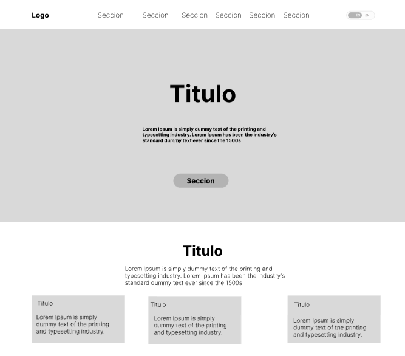 </div>
<div align="center">*Es la portada principal del sitio. Presenta un menú de navegación superior, una sección de bienvenida con un título grande y un botón de acción, seguida de una zona de tres columnas para destacar servicios o conceptos clave.*</div>


<div align="center"> 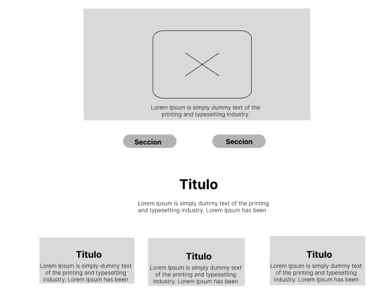 </div>
<div align="center">*Una sección enfocada en contenido visual. Muestra un reproductor de video central con botones de interacción y, debajo, una cuadrícula de tres bloques de texto para explicar beneficios específicos.*</div>


<div align="center"> 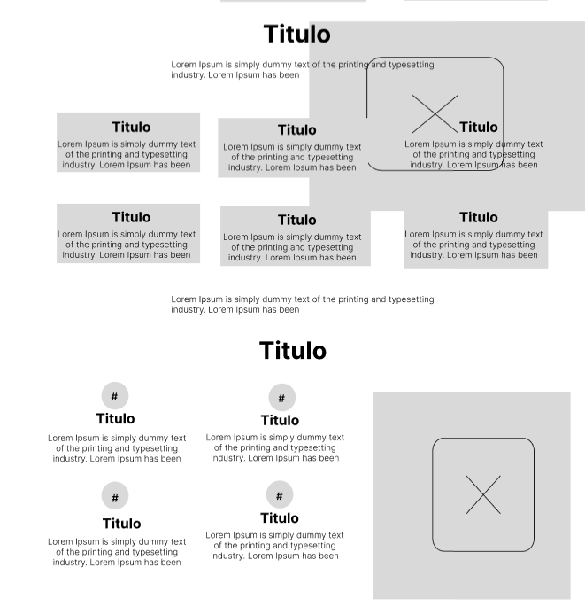 </div>
<div align="center">*Un diseño que combina texto e imágenes de forma asimétrica. Se divide en dos partes: una cuadrícula superior para detalles técnicos y una sección inferior que utiliza iconos numerados junto a una imagen lateral.*</div>


<div align="center"> 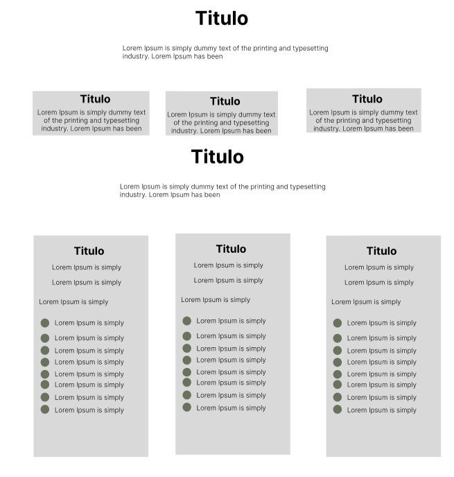 </div>
<div align="center">*Un esquema diseñado para el desglose detallado. Presenta tres columnas verticales largas, ideales para mostrar listas de características, planes de precios o especificaciones de diferentes categorías.*</div>

<div align="center"> 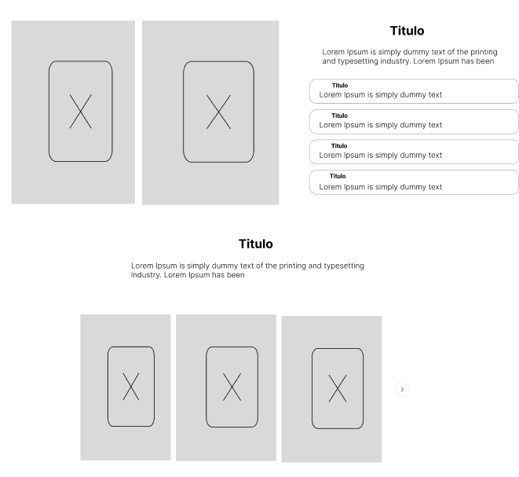 </div>
<div align="center">*Una composición visual que incluye dos grandes contenedores de imágenes a la izquierda con una lista de elementos a la derecha, además de un carrusel o deslizador de imágenes en la parte inferior.*</div>

<div align="center"> 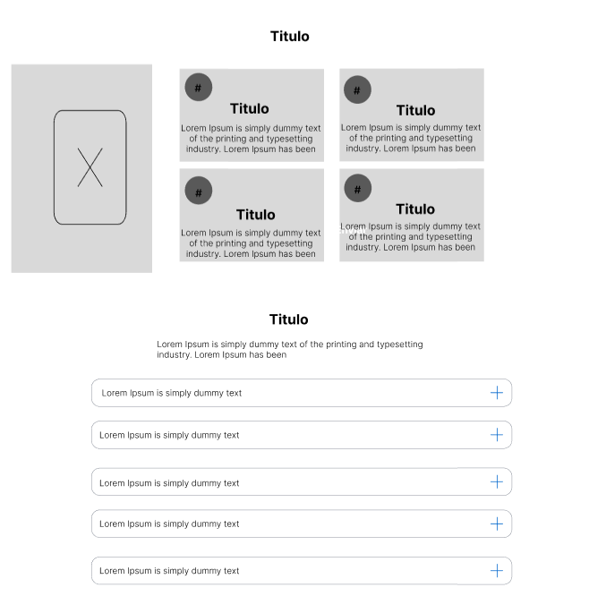 </div>
<div align="center">*Un diseño funcional que presenta cuatro bloques de información con iconos en la parte superior y una sección de "acordeones" o pestañas desplegables en la parte inferior para resolver dudas.*</div>

<div align="center"> 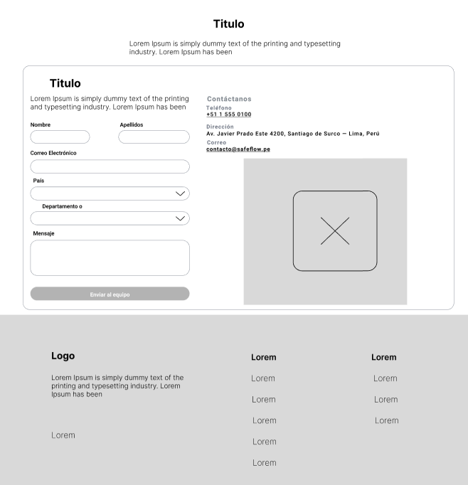 </div>
<div align="center">*El cierre del sitio. Contiene un formulario de contacto con mapa e información de ubicación, seguido de un pie de página (footer) organizado en varias columnas para enlaces institucionales y redes sociales.*</div>

### 4.3.2. Landing Page Mock-up

### 1. Hero Section Overview

<div align="center">Esta vista recrea la barra de navegación y la sección principal (Hero) que contiene el propósito de nuestra solución
 junto con la propuesta de valor, botón preeliminar para visualizar la demo de nuestra web y para agendar reunión con nosotros, y el impacto que puede nuestra
solución tener en el área laboral de nuestros clientes.</div>

<div align="center"> 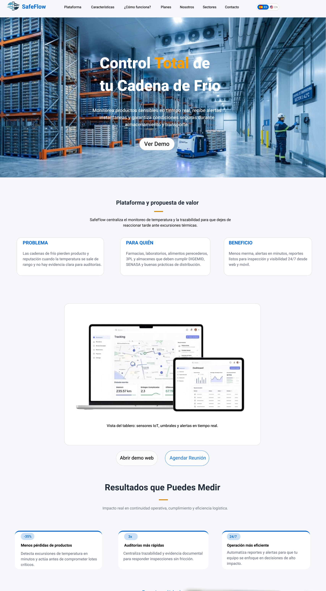  </div>

### 2. Operational Flow and Key Benefits

<div align="center">Mockup detallado que ilustra las principales características de SafeFlow, como este funciona de forma breve 
y las tecnologías que componieron el desarrollo de la solución.</div>

<div align="center"> 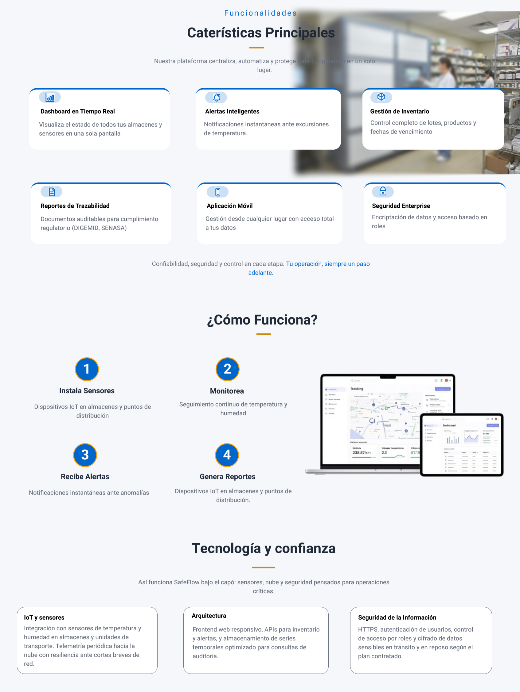  </div>

### 3. SafeFlow Benefits & Development Team

<div align="center">Penúltima sección que muestra 3 distintos modelos de suscripción con sus detalles, ventajas que provee nuestra solución,
el equipo de ingeniería a cargo y los principales sectores laborales beneficiados por SafeFlow.</div>

<div align="center"> 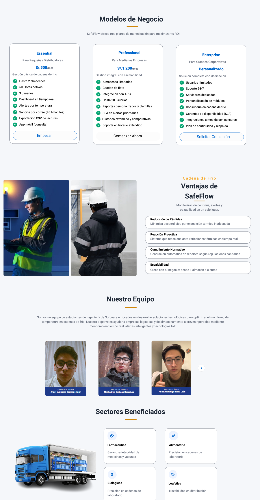  </div>

## 4. FAQ, Contact and Footer

<div align="center">Última sección de la landing page que muestra las preguntas frecuentes, el formulario de contacto y 
el footer con información del producto</div>

<div align="center"> 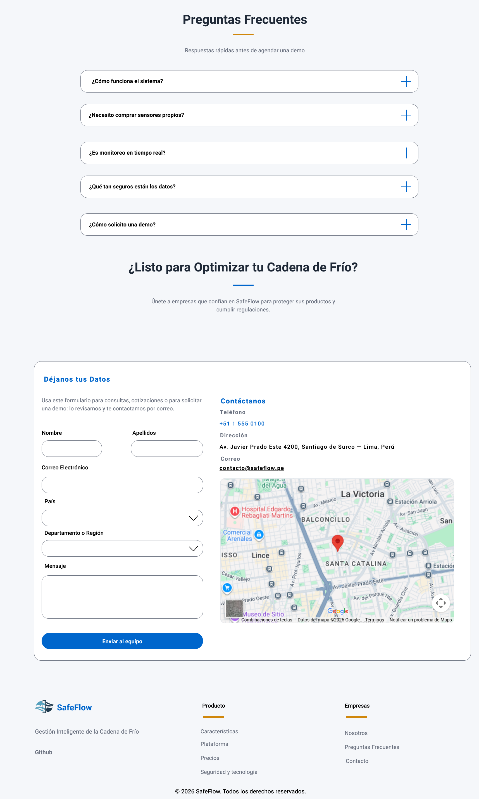  </div>

## 4.4. Web Applications UX/UI Design
### 4.4.1. Web Applications Wireframes

### 1. Pantalla de Login y Registro

Esta pantalla representa el punto de entrada al sistema SafeFlow. Su función principal es autenticar a los usuarios mediante el ingreso de credenciales (correo y contraseña) o permitir la creación de una nueva cuenta.
El diseño del wireframe prioriza la simplicidad y claridad, mostrando únicamente los campos necesarios para reducir fricción en el acceso. Además, contempla validaciones básicas y retroalimentación al usuario en caso de errores.
Esta pantalla es fundamental porque garantiza la seguridad del sistema y controla el acceso según roles (administrador u operador), lo cual condiciona las funcionalidades disponibles dentro de la plataforma.

<div align="center"> 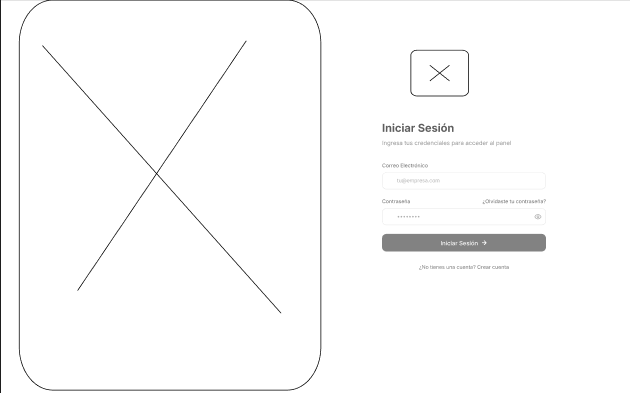  </div>
<div align="center"> 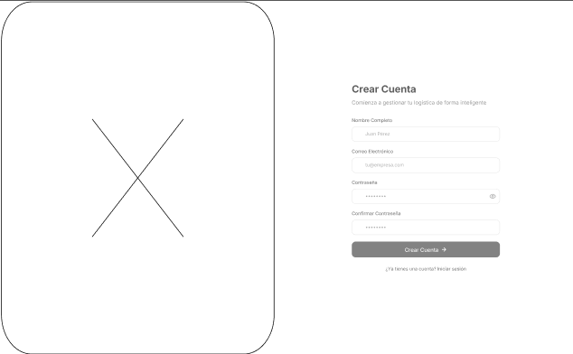  </div>


### 2. Dashboard (Panel de Control)

El dashboard es la vista principal del sistema y actúa como centro de monitoreo. En este wireframe se visualizan indicadores clave como la cantidad de productos en riesgo, alertas activas, productos seguros y métricas generales del sistema.

Su diseño está orientado a la toma de decisiones rápida, utilizando tarjetas, gráficos y resúmenes visuales que permiten al usuario comprender el estado del sistema de un vistazo.
Este componente está directamente relacionado con el contexto de **Gestión del Sistema**, ya que integra información proveniente de los demás módulos (inventario, monitoreo, alertas y logística) en una sola interfaz centralizada.

<div align="center"> 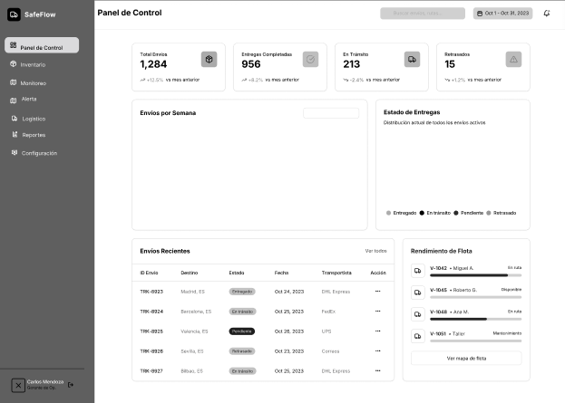  </div>


### 3. Módulo de Inventario

Este wireframe muestra la interfaz destinada a la gestión de productos dentro del sistema. Permite visualizar información detallada como nombre del producto, categoría, cantidad disponible, ubicación y estado (Disponible, En Riesgo, etc.).

El diseño facilita la organización y control del stock mediante tablas, filtros y acciones como registrar, editar o eliminar productos.

Este módulo está vinculado al **Contexto de Inventario**, ya que gestiona la base de datos principal sobre la cual operan los demás procesos del sistema, siendo esencial para el monitoreo y la trazabilidad.

<div align="center"> 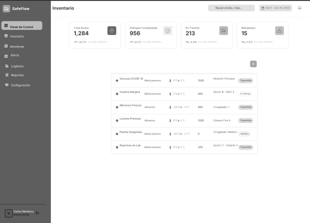  </div>

### 4. Módulo de Reportes y Análisis

Este wireframe representa la sección encargada de mostrar información histórica y analítica del sistema. Permite al usuario consultar reportes de temperatura, productos en riesgo, cumplimiento de condiciones térmicas, entre otros.

Su diseño incluye tablas y posibles visualizaciones gráficas que facilitan la interpretación de datos y la identificación de patrones o incidencias.

Está vinculado al contexto de **Gestión del Sistema**, ya que consolida información de todos los módulos para apoyar la toma de decisiones estratégicas, auditorías y mejora continua de los procesos.

<div align="center"> 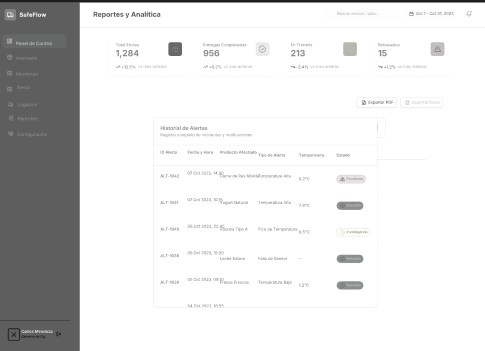  </div>


### 5. Módulo de Alertas

Este wireframe representa la interfaz encargada de gestionar las alertas generadas por el sistema ante anomalías detectadas, principalmente relacionadas con variaciones de temperatura fuera del rango permitido o productos próximos a vencer.

Permite visualizar un listado de alertas con información relevante como tipo de alerta, producto afectado, fecha y estado (activa o resuelta). Además, el usuario puede acceder al detalle de cada alerta, filtrarlas según criterios específicos y marcarlas como resueltas una vez tomada la acción correctiva.

El diseño está orientado a resaltar visualmente los eventos críticos, facilitando una rápida identificación y priorización de incidencias.

Este módulo está vinculado al **Contexto de Alertas**, y trabaja en conjunto con el monitoreo y el inventario para garantizar una respuesta oportuna ante problemas en la cadena de frío.

<div align="center"> 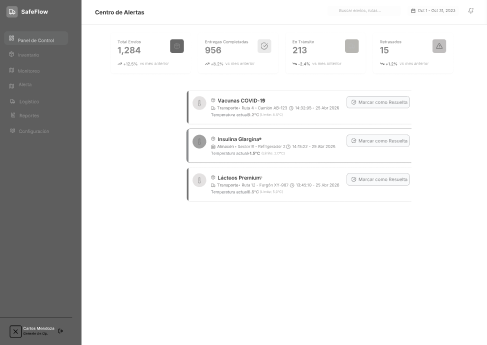  </div>

### 6. Módulo de Monitoreo

Este wireframe muestra la interfaz dedicada al seguimiento de las condiciones de temperatura de los productos, tanto en tiempo real como a través de datos históricos.Permite visualizar registros de temperatura asociados a productos o despachos, indicando valores, fechas, origen (manual o simulado) y estado. Además, puede incluir gráficos que representan la variación de temperatura a lo largo del tiempo, facilitando la detección de patrones o anomalías.El diseño prioriza la claridad de la información y la actualización constante de los datos, permitiendo al usuario supervisar de manera continua el estado de los productos.Este módulo está directamente relacionado con el **Contexto de Monitoreo Ambiental**, siendo el núcleo del sistema, ya que se encarga de evaluar las condiciones térmicas y desencadenar alertas en caso de detectar desviaciones.


<div align="center"> 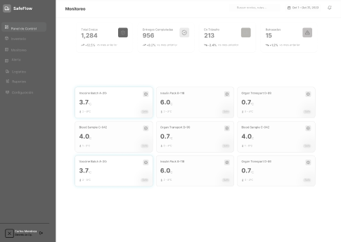  </div>


### 4.4.2. Web Applications Wireflow Diagrams
En esta sección se presenta los wireflows de SafeFlow, construidos a partir de los user goals definidos para cada User Persona en el capitulo 2. Cada wireflow representa la secuencia de pantallas y los cambios de estado esperados en la interfaz, usando como base los wireframes de Login, Dashboard, Inventario, Reportes, Alertas y Monitoreo. Todo orientado a los user personas.

**User Goal 1: Garantizar la potencia biológica de los productos mediante el control estricto de la temperatura.**

**User Goal 2: Automatizar la consolidación de datos para auditorías sanitarias.**
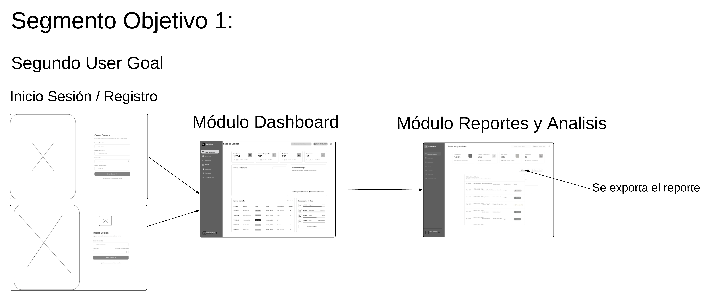
**User Goal 3: Lograr la trazabilidad completa e inalterable de cada despacho.**
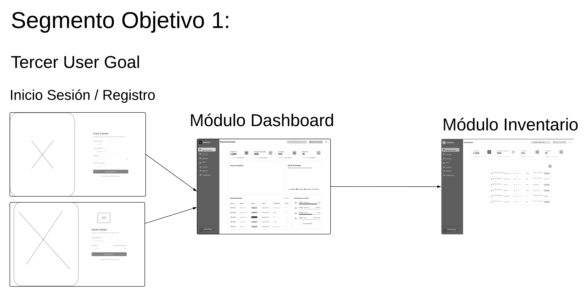
**User Goal 4: Reducir las mermas de productos críticos en un 20%.**
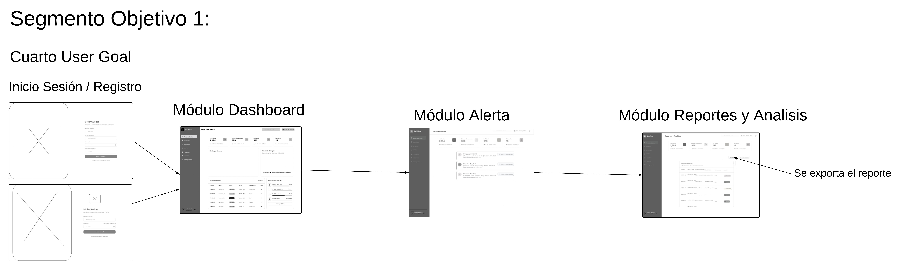

### 4.4.3. Web Applications Mock-ups

Esta sección presenta los mock-ups de la aplicación web SafeFlow, los cuales representan una versión visual más detallada y cercana al producto final en comparación con los wireframes. En estos diseños se evidencian decisiones relacionadas con la experiencia de usuario (UX), interfaz de usuario (UI), arquitectura de información y la aplicación de un Design System consistente.


### 1. Pantalla de Login

El mock-up de inicio de sesión muestra una interfaz limpia y moderna, con una jerarquía visual clara que guía al usuario hacia la acción principal: ingresar al sistema.

Se aplican principios de diseño como:
- **Jerarquía visual**: uso de tamaños y contrastes para destacar el formulario.
- **Minimalismo**: solo se presentan los campos necesarios.
- **Accesibilidad**: contraste adecuado y disposición centrada para fácil lectura.

Además, el uso de imagen de fondo contextual (logística) refuerza el propósito del sistema.

<div align="center"> 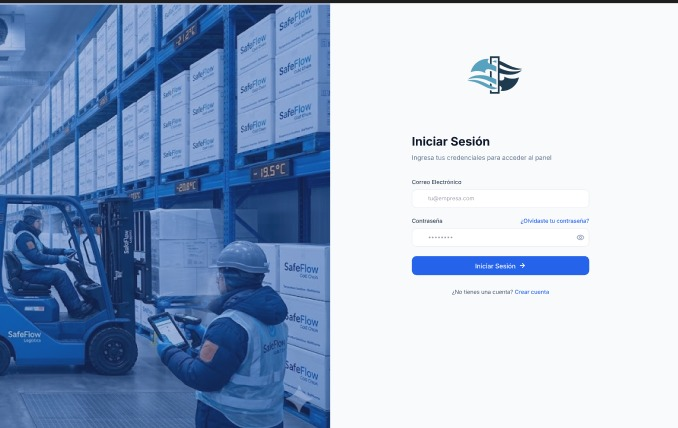  </div>


### 2. Módulo de Inventario

El mock-up de inventario muestra una tabla estructurada con productos, estados y acciones.

Aspectos destacados:
- **Organización tabular** para facilitar lectura de datos.
- **Uso de etiquetas de estado (badges)** para indicar condiciones.
- **Acciones visibles** (editar, eliminar) para mejorar usabilidad.

El diseño prioriza eficiencia operativa y claridad en la gestión de productos.

<div align="center"> 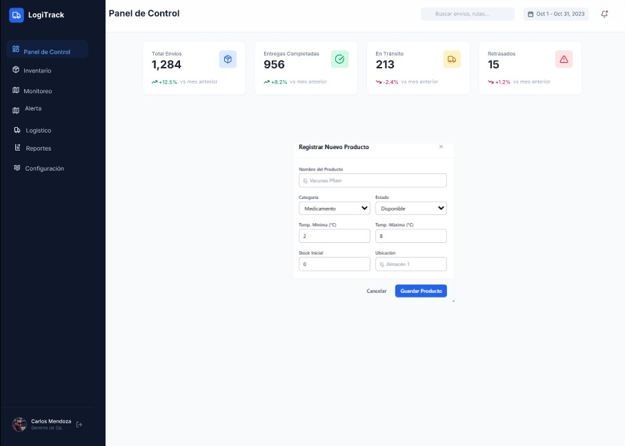  </div>

### 3. Módulo de Alertas

Este mock-up resalta visualmente las alertas mediante colores y disposición jerárquica.

Principios aplicados:
- **Contraste visual** para destacar alertas críticas.
- **Prioridad de información** mostrando primero lo más importante.
- **Feedback visual** para acciones como resolver alertas.

Facilita la identificación rápida de problemas en la cadena de frío.

<div align="center"> 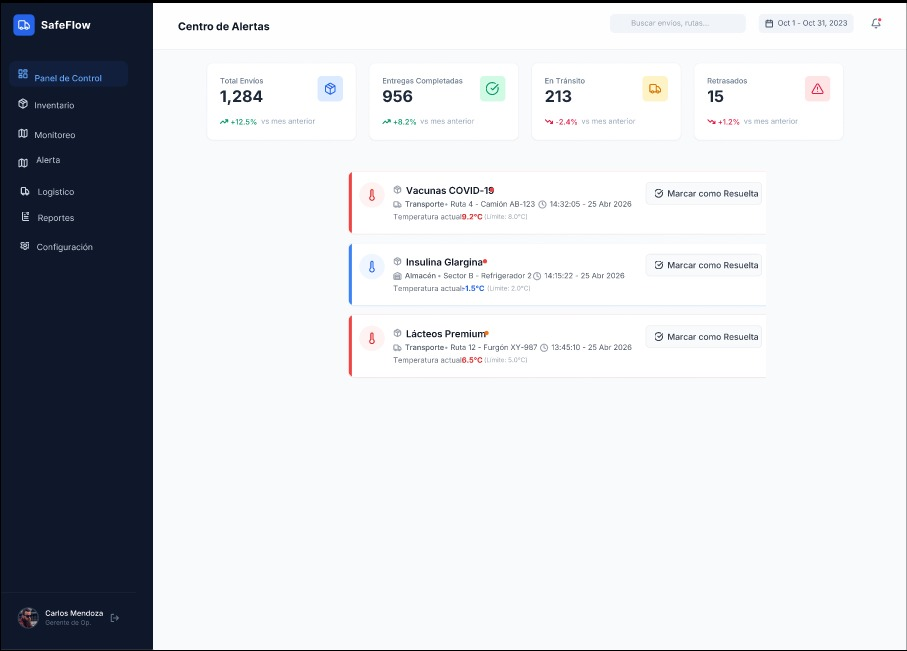  </div>

###  4. Módulo de Monitoreo

El módulo de monitoreo muestra datos de temperatura en tiempo real mediante tarjetas y métricas.

Elementos clave:
- **Visualización clara de datos** con números grandes y legibles.
- **Consistencia visual** con el dashboard.
- **Actualización constante** para reflejar el estado actual.

Permite supervisar condiciones térmicas de forma continua.

<div align="center"> 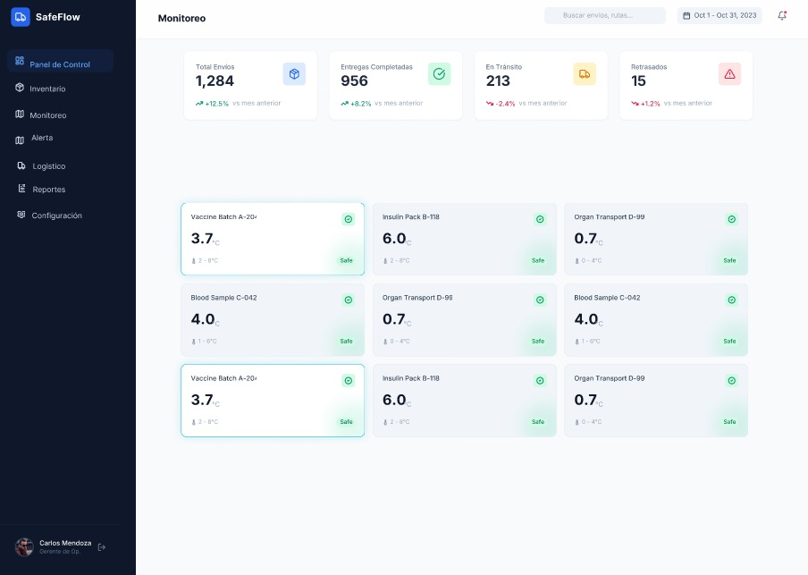  </div>


### 5. Módulo de Reportes y Análisis

Este mock-up presenta tablas y métricas históricas que permiten analizar el comportamiento del sistema.

Características:
- **Estructura ordenada** para datos complejos.
- **Apoyo visual** mediante indicadores y colores.
- **Facilidad de interpretación** para detectar patrones.

Está diseñado para la toma de decisiones estratégicas y auditorías.

<div align="center"> 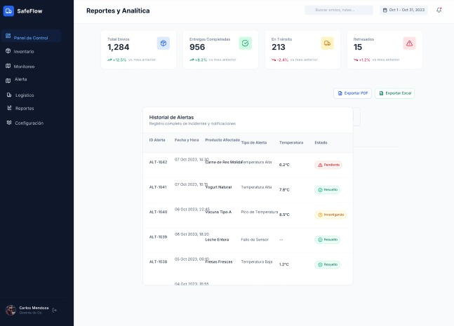  </div>


###  Design System aplicado

Los mock-ups siguen un sistema de diseño consistente basado en:

- **Paleta de colores**: tonos azules para confianza, verdes para estados correctos y rojos para alertas.
- **Tipografía**: clara y legible para mejorar la accesibilidad.
- **Componentes reutilizables**: botones, tarjetas, tablas y formularios.
- **Espaciado uniforme**: mejora la organización visual.
- **Iconografía simple**: refuerza la comprensión de acciones.


### Diseño Inclusivo

Se han considerado aspectos de accesibilidad como:

- Contraste adecuado entre texto y fondo.
- Interfaces simples e intuitivas.
- Uso de colores acompañado de texto (no depender solo del color).
- Navegación clara y consistente.


###  Arquitectura de Información

La estructura de la aplicación está organizada en módulos claros:

- Dashboard (visión general)
- Inventario (gestión de productos)
- Monitoreo (seguimiento en tiempo real)
- Alertas (gestión de incidencias)
- Reportes (análisis de datos)

Esta organización permite una navegación intuitiva y una experiencia de usuario eficiente.


### 4.4.4. Web Applications User Flow Diagrams
**Segmento Objetivo 1:**
**User goal 1: Control temperatura**


**User goal 2: Auditorías sanitarias.**
Happy path: Login -> Reportes -> Generar reporte -> Exportar pdf
Unhappy path: no existen datos suficientes -> mensaje de error.

**User goal 3: Trazabilidad completa.**
Happy path: Login -> Inventario → Reporte trazable.
Unhappy path: Lote sin información completa o erronea -> estado incompleto o pendiente.

**User goal 4: Reducción de mermas.**
Happy path: Login -> Alertas -> Acción correctiva → Reportes -> Generar reporte -> Exportar pdf.
Unhappy path: La condición sigue fuera de rango o erronea -> escalamiento de alerta (estado)

**Segmento Objetivo 2:**
**User goal 1: Coordinación de despachos**


**User goal 2: Evidencia digital para reclamos.**
Happy path: Login -> Alertas / Reportes -> Detalle del evento -> Exportación de evidencia por archivo pdf.
Unhappy path: Datos faltantes o erroneos -> evidencia incompleta o no exportable a ningun tipo de archivo ofrecido.

**User goal 3: Tecnología de monitoreo en vivo.**
Happy path: Login -> Monitoreo -> Datos actualizados -> Vista de estado en vivo.
Unhappy path: Sensor IoT dañado o lectura desactualizada.

**User goal 4: Cumplimiento de protocolos de frío sin supervisión presencial.**
Happy path: Login -> Monitoreo -> Alerta al conductor -> Confirmación de lectura.
Unhappy path: Falla de alerta o no se confirma la alerta -> escalamiento al supervisor.

## 4.5. Web Applications Prototyping

En esta sección se presentan los prototipos desarrollados para SafeFlow, los cuales simulan la navegación e interacción del sistema de acuerdo con los User Flow Diagrams definidos. Estos prototipos permiten validar la experiencia del usuario y el funcionamiento de los principales flujos del sistema antes de su implementación.

A continuación, se detallan los criterios clave que guiaron las decisiones de diseño e interacción:

###  Estructura jerárquica clara
La información se organiza por niveles de importancia, priorizando elementos críticos como productos en riesgo, alertas activas y monitoreo en tiempo real. El dashboard actúa como punto central, mostrando un resumen del estado del sistema y permitiendo acceder rápidamente a los diferentes módulos.

###  Sistema de navegación consistente
Se implementa un menú lateral persistente en la versión desktop que permite acceder a módulos como Inventario, Monitoreo, Alertas, Logística y Reportes. En la versión mobile, este menú se adapta a un formato desplegable, manteniendo la accesibilidad y usabilidad en pantallas reducidas.

###  Agrupación de contenido por tareas
Cada pantalla está diseñada en función de una acción específica del usuario:
- Inventario: gestión y visualización de productos
- Monitoreo: seguimiento de temperatura en tiempo real e histórico
- Alertas: gestión de incidencias y eventos críticos
- Logística: seguimiento de despachos y transporte
- Reportes: análisis de datos y generación de informes

Esta organización permite una navegación intuitiva y enfocada en objetivos.

###  Retroalimentación visual constante
El sistema utiliza colores semánticos (verde, amarillo, rojo), indicadores y estados visuales para comunicar la condición de los productos y eventos del sistema. Las alertas se destacan visualmente para facilitar su identificación y priorización, permitiendo una respuesta rápida ante anomalías.

###  Interacción centrada en el rol del usuario
Las funcionalidades del sistema se adaptan según el rol del usuario (administrador u operador), controlando el acceso a ciertas acciones como gestión de usuarios, configuración o supervisión avanzada. Esto garantiza seguridad, control y eficiencia en la operación.

Enlace Prototyping: [Enlace Prototyping](https://www.figma.com/proto/BNOvhoeCvJ2AjuPAZiBkJT/WebGeeks?node-id=42-24&starting-point-node-id=42%3A24)

Enlace Video Explicación: [Video Explicación](https://upcedupe-my.sharepoint.com/:v:/g/personal/u202116018_upc_edu_pe/IQDEdqvWLEBjSZZOytc_1BiOAYAOM2Ui3EpwRMfFIkv0Oug?nav=eyJyZWZlcnJhbEluZm8iOnsicmVmZXJyYWxBcHAiOiJPbmVEcml2ZUZvckJ1c2luZXNzIiwicmVmZXJyYWxBcHBQbGF0Zm9ybSI6IldlYiIsInJlZmVycmFsTW9kZSI6InZpZXciLCJyZWZlcnJhbFZpZXciOiJNeUZpbGVzTGlua0NvcHkifX0&e=trAf6E)


## 4.6. Domain-Driven Software Architecture
### 4.6.1. Software Architecture Context Diagram
En esta sección se elaboro el Software Architecture Context Diagram de SafeFlow representando un sistema web que integre
monitoreo ambiental, gestión de inventario, logística y notificaciones. A su alrededor se identifican los actores humanos 
que interactúan con la plataforma y los sistemas externos que aportan datos y/o servicios complementarios.
##### Context Diagram
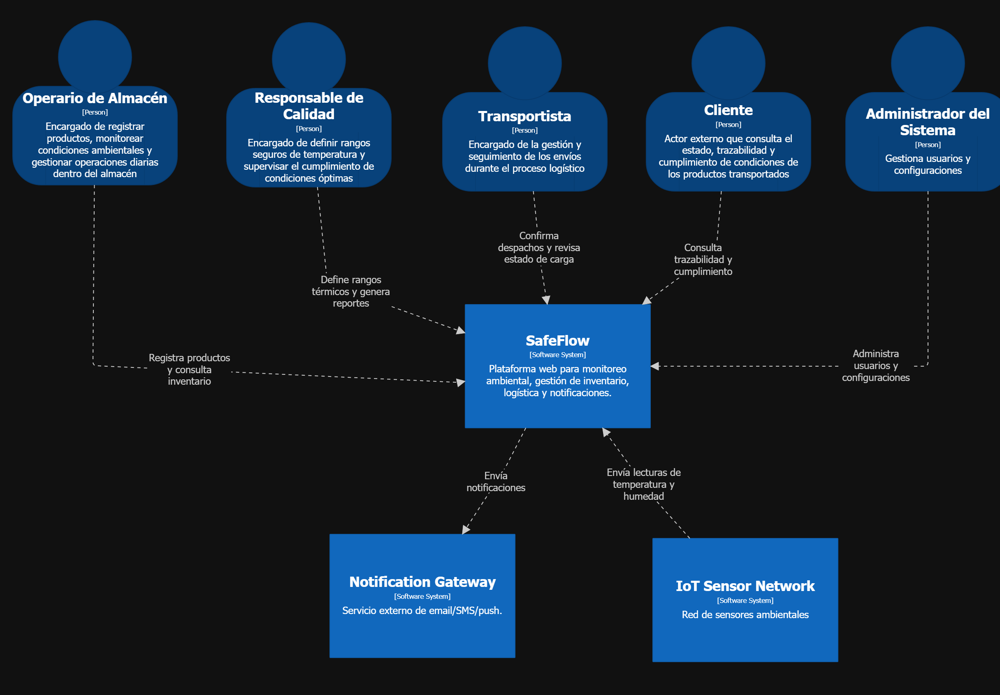

### 4.6.2. Software Architecture Container Diagrams
En esta sección se elaboro el Software Architecture Container Diagram de SafeFlow. Se representa la propuesta de solución 
en un Landing Page público, una Web Application para usuarios, un REST API interno, un servicio de ingesta IoT, un 
servicio interno de despacho de notificaciones y una base de datos central.
##### Container Diagram
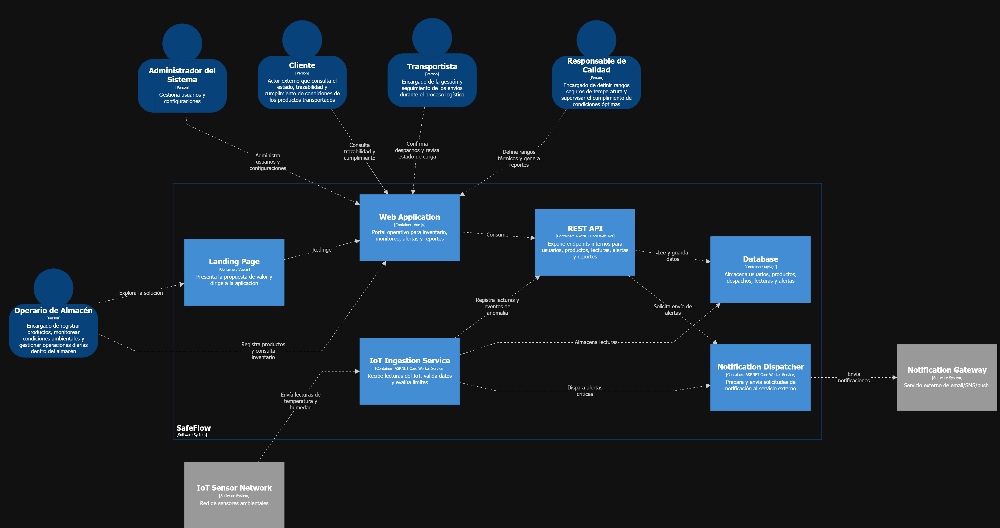

### 4.6.3. Software Architecture Components Diagrams
En esta sección, a diferencia de los modelos C4 anteriores, se descompone los contenedores principales en módulos internos. 
En la Web Application se diagraman componentes de navegación, vistas y cliente API. En la REST API se distinguen controladores, 
servicios de aplicación, repositorios y servicios de infraestructura. Y en los servicios de IoT y notificación se modelan los 
componentes responsables de procesar lecturas IoT y enviar alertas.
##### Web Application Component Diagram
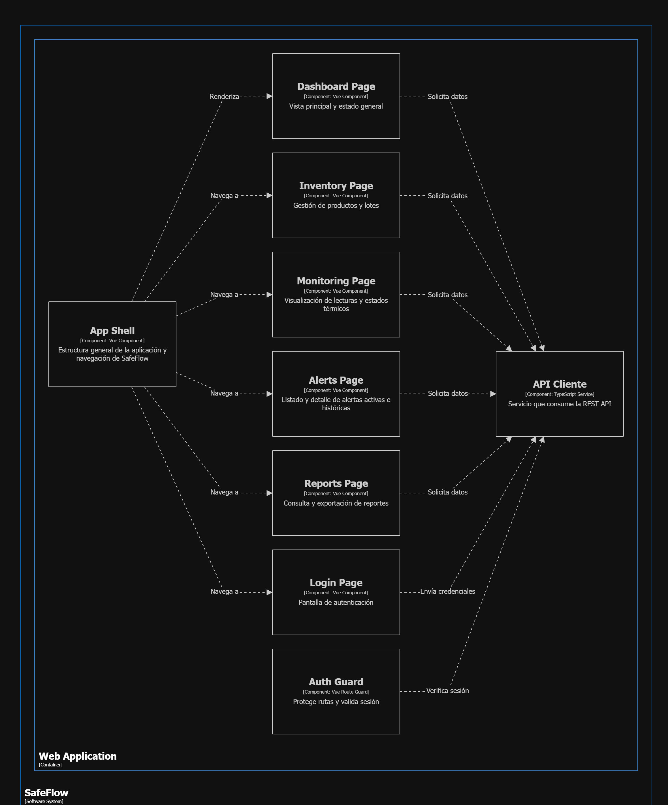

##### REST API Component Diagram
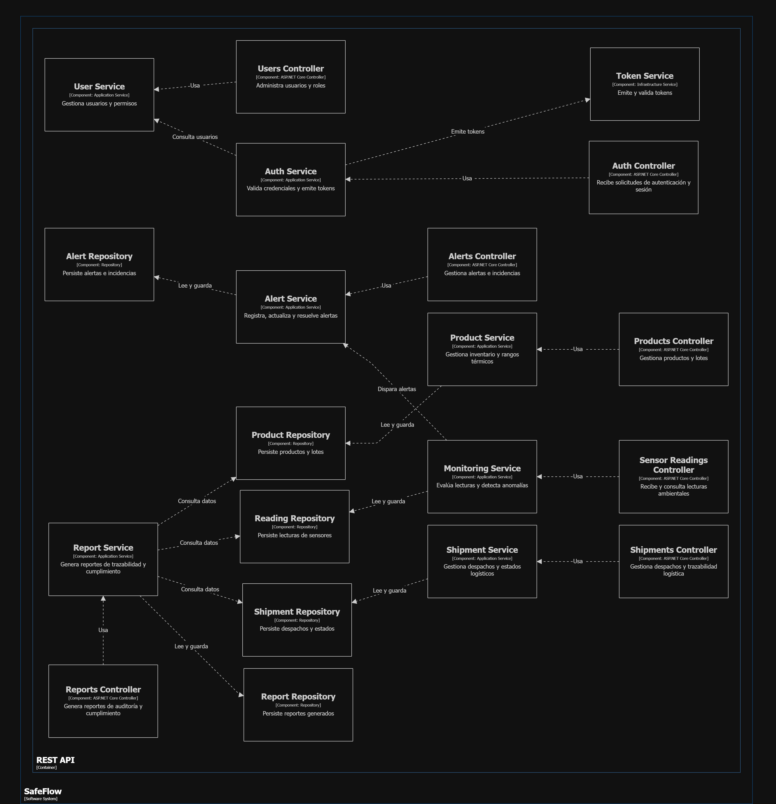

##### IoT Service Component Diagram
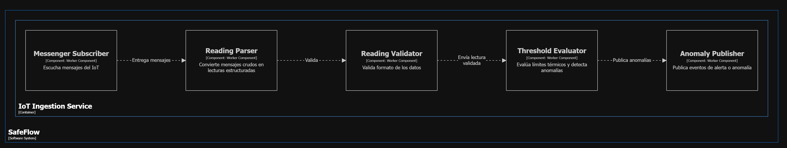

##### Notification Service Component Diagram
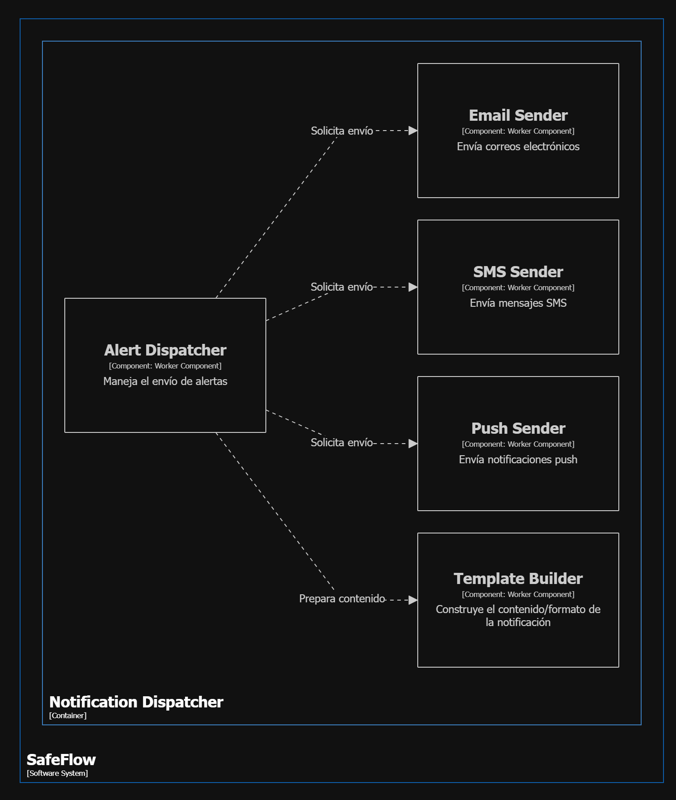

Gracias a los modelos C4 elaborados, se logró una visión clara y estructurada de la arquitectura de software propuesta para SafeFlow,
identificando los contenedores principales, sus responsabilidades y las interacciones entre ellos. Esta separación facilita
la implementación, la escalabilidad y la trazabilidad de las reglas de negocio.

## 4.7. Software Object-Oriented Design
### 4.7.1. Class Diagrams
Con la finalidad de que practicidad y para seguir con el modelo Domain-Driven-Design (DDD) se elaboró el diagrama de clase 
de SafeFlow por bounded context para representar con mayor precisión la estructura interna del dominio. Cada diagrama incluye clases, 
interfaces y enumeraciones, junto con atributos, métodos, visibilidad, relaciones y multiplicidad.
##### Class Diagram - Bounded Context: Monitoreo en Tiempo Real
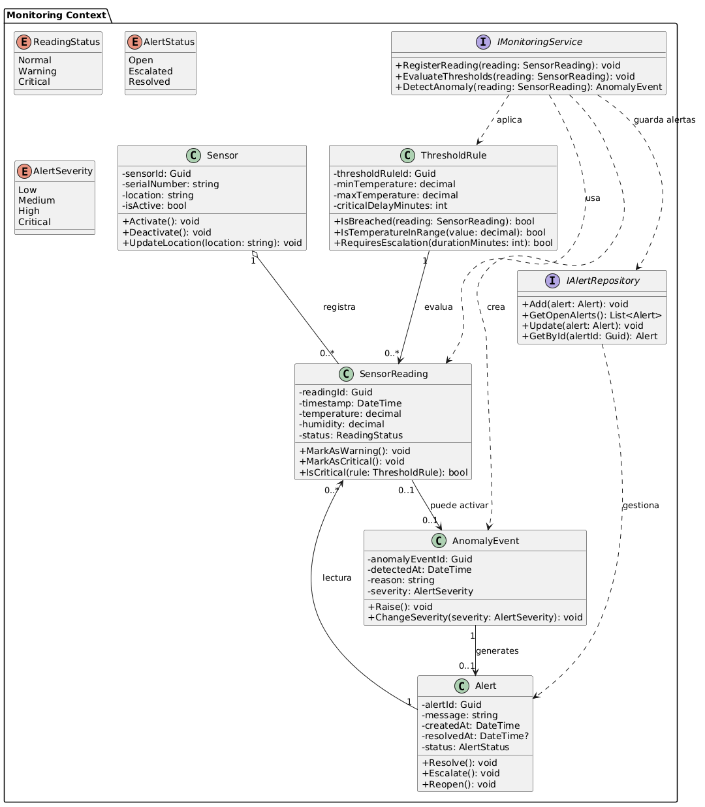

##### Class Diagram - Bounded Context: Inventario
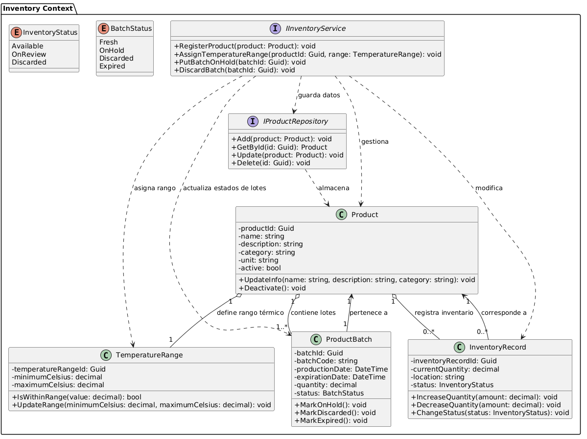

##### Class Diagram - Bounded Context: Logística
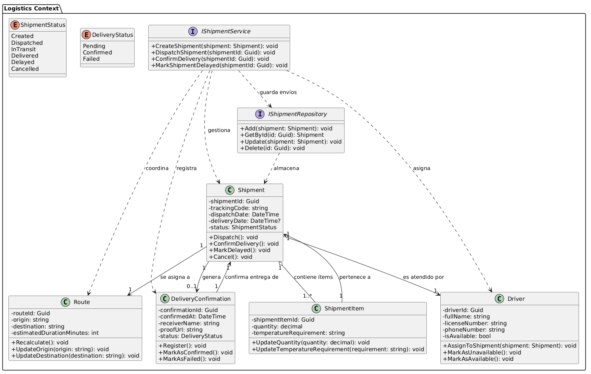

##### Class Diagram - Bounded Context: Notificaciones
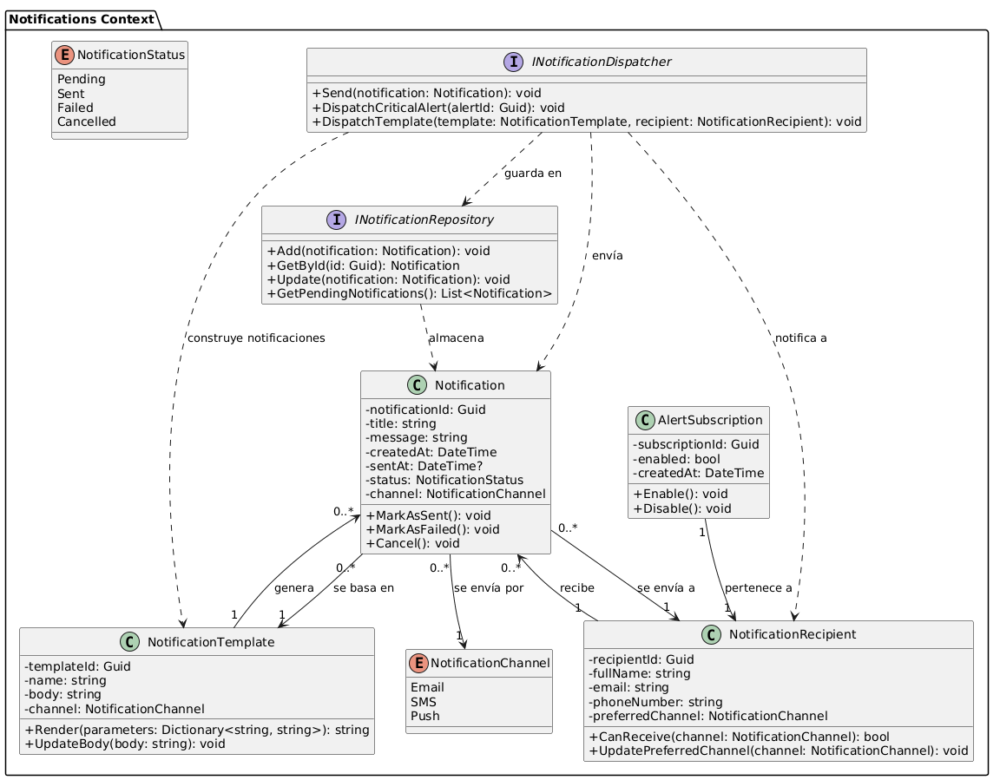

### 4.7.2. Class Dictionary
##### Class Dictionary - Bounded Context: Monitoreo en Tiempo Real
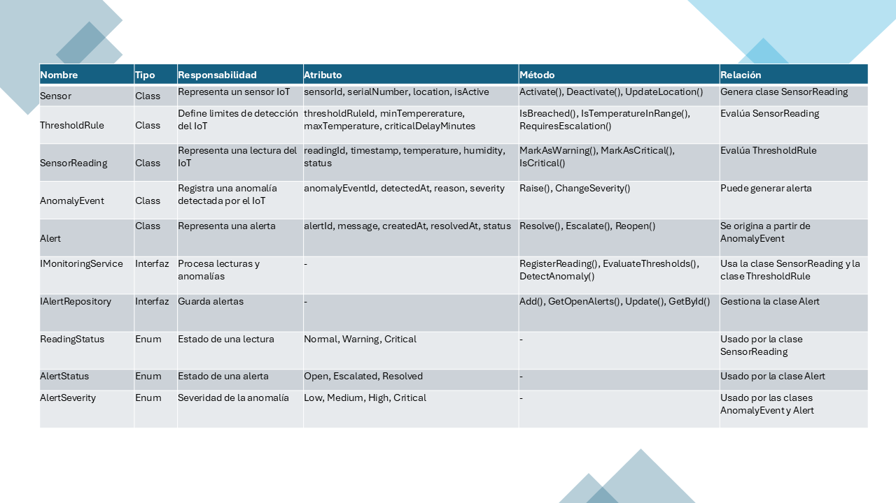

##### Class Dictionary - Bounded Context: Inventario
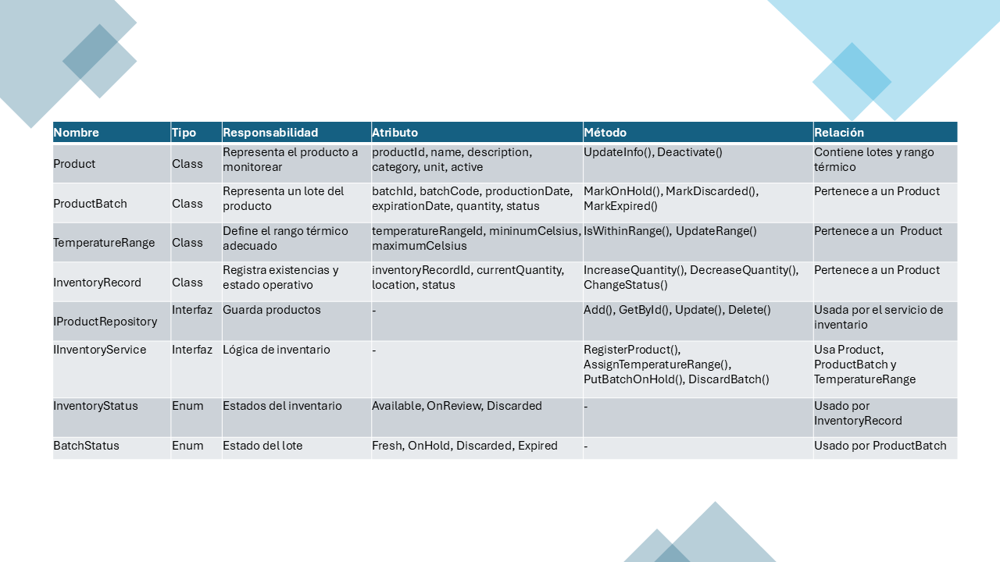

##### Class Dictionary - Bounded Context: Logística
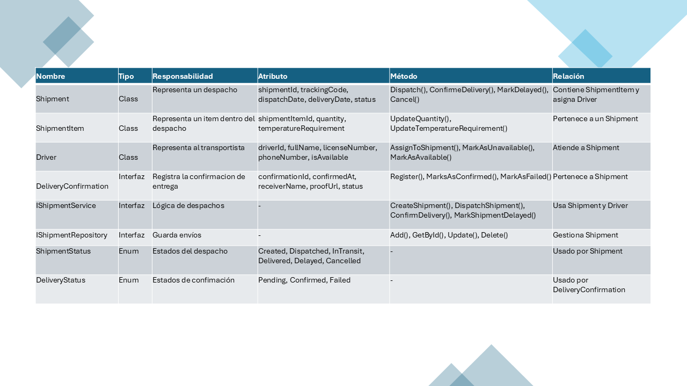

##### Class Dictionary - Bounded Context: Notificaciones
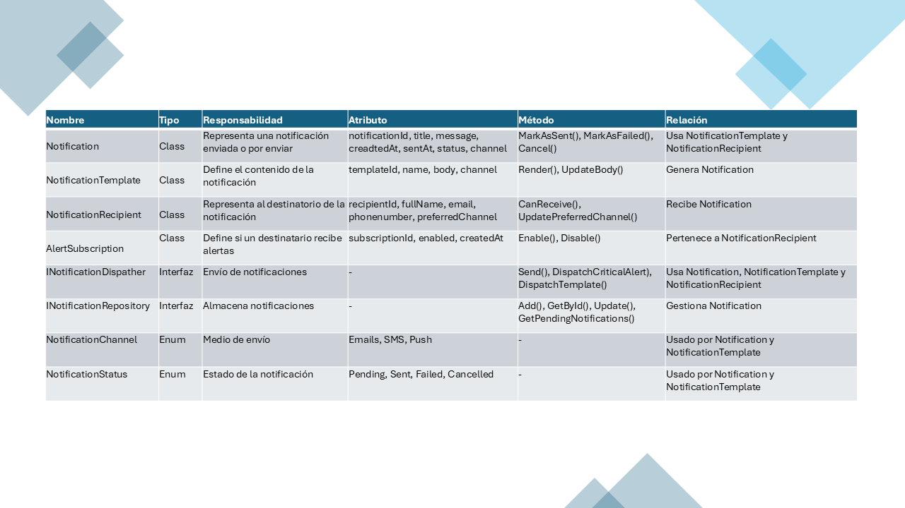

## 4.8. Database Design
### 4.8.1. Database Diagram
En esta sección se elaboró el Database Diagram de SafeFlow, representando las tablas principales, sus atributos, 
tipos de datos, claves primarias y foráneas, así como las relaciones entre ellas. El diseño se centró en la eficiencia para 
consultas críticas de monitoreo y control de temperatura en la cadena de frío.
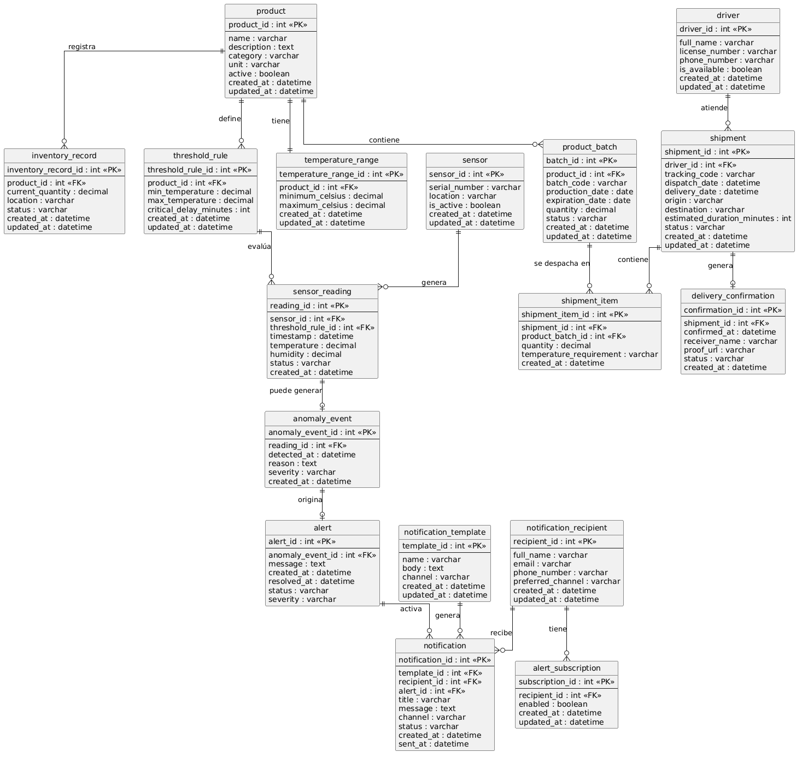


# Capítulo V: Product Implementation, Validation & Deployment
## 5.1. Software Configuration Management

En esta sección se describe la gestión de la configuración del software utilizada en el proyecto SafeFlow, la cual tiene como objetivo garantizar el control adecuado de los cambios realizados durante el desarrollo del sistema. Esta gestión permite mantener la integridad, trazabilidad y consistencia del código fuente, así como coordinar de manera eficiente el trabajo colaborativo del equipo.

El Software Configuration Management en SafeFlow se basa en el uso de herramientas de control de versiones y buenas prácticas de desarrollo que permiten administrar las distintas versiones del sistema a lo largo del tiempo. Esto incluye la organización del repositorio del proyecto, la definición de estrategias de ramificación, la gestión de cambios mediante commits y la integración del trabajo realizado por los diferentes miembros del equipo.


### 5.1.1. Software Development Enviroment Configuration

En esta sección se describen las herramientas utilizadas por nuestro equipo de SafeFlow para colaborar de manera efectiva durante todo el ciclo de vida del producto digital. Estas herramientas han sido seleccionadas estratégicamente con el objetivo de optimizar la comunicación, organización, diseño, desarrollo, despliegue y documentación del sistema, permitiendo un trabajo colaborativo eficiente y escalable.

Las herramientas se organizan según las principales actividades del ciclo de vida del software: gestión del proyecto y requisitos, diseño UX/UI, desarrollo de software, despliegue y documentación técnica.


### Project Management y Requirements Management

- [**Jira**](https://www.atlassian.com/es/software/jira): Es la herramienta principal utilizada para la gestión del proyecto bajo un enfoque ágil. Permite organizar tareas en tableros, listas y tarjetas, facilitando el seguimiento del avance del Sprint, la asignación de actividades y el control del backlog del producto SafeFlow. Gracias a su interfaz visual, el equipo puede mantener una visión clara del progreso del proyecto.

- [**Google Docs**](https://docs.google.com/document/u/0/):  Google Drive y Google Docs se utilizan como plataforma de almacenamiento y colaboración en la nube. Estas herramientas permiten al equipo crear, editar y compartir documentos en tiempo real, facilitando la elaboración de historias de usuario, informes, entregables y documentación general del proyecto.


### Product UX/UI Design

- [**Figma**](https://www.figma.com/files/team/1542201510350230976/recents-and-sharing?fuid=1227966816494785121): Es la herramienta principal utilizada para el diseño de la interfaz de usuario de SafeFlow. Se emplea para crear wireframes, prototipos y diseños finales de la Landing Page. Su funcionalidad colaborativa permite que todo el equipo participe en el proceso de diseño de forma simultánea, asegurando coherencia visual y funcional.

- [**Miro**](https://miro.com/es/): Se utiliza como herramienta de apoyo para la planificación y análisis del sistema. Permite la creación de flujos de usuario, mapas mentales y diagramas conceptuales que ayudan a estructurar la lógica del sistema antes de su implementación.


### Software Development

- [**Visual Studio Code**](https://code.visualstudio.com/) Es el editor de código utilizado para el desarrollo de la Landing Page de SafeFlow. Permite trabajar de manera eficiente con tecnologías como HTML, CSS y JavaScript, ofreciendo soporte para extensiones, terminal integrada y herramientas de depuración.

- [**Git**](https://git-scm.com/): Es el sistema de control de versiones utilizado para gestionar el código fuente del proyecto. Permite llevar un registro de los cambios realizados, trabajar de forma colaborativa y mantener un historial organizado del desarrollo del sistema.

 - [**GitHub**](https://github.com/): Es la plataforma utilizada para alojar el repositorio del proyecto SafeFlow. Facilita la colaboración entre los miembros del equipo, la revisión de código y la integración continua del desarrollo.


### Software Deployment

- [**GitHub Pages**](https://pages.github.com/):  Es el servicio utilizado para desplegar la Landing Page de SafeFlow. Permite publicar el sitio web directamente desde el repositorio de GitHub, haciendo que esté disponible de forma pública y accesible desde internet.

- [**Railway**](https://railway.com/?referralCode=DEKy5z&gad_source=1&gad_campaignid=23664573240&gbraid=0AAAABDFaxslTYf4hnTBvRruYK6aw83ZRT&gclid=CjwKCAjwqazPBhALEiwAOuXqdCfDjdi6sFgnjvQFrgAjSGbASzAlM3bABoe3LYkBQZX9uwk5_0xjbhoCwOYQAvD_BwE):  Es una plataforma en la nube utilizada para el despliegue de aplicaciones web. En futuras etapas del proyecto, se utilizará para publicar tanto el frontend como el backend del sistema, permitiendo su acceso desde cualquier dispositivo conectado a internet.


### Software Documentation

- [**Notion**](https://www.notion.com/es): Es la herramienta utilizada como espacio centralizado de documentación del proyecto. Permite organizar información técnica, decisiones de diseño, documentación funcional y guías del sistema de manera estructurada y colaborativa.
  
- [**Swagger**](https://swagger.io/):  Es la herramienta utilizada para documentar las APIs REST del sistema. Permite visualizar y probar los endpoints del backend de forma interactiva, facilitando la integración entre frontend y backend en las siguientes etapas del desarrollo.

### 5.1.2. Source Code Management

En esta sección se describe la gestión del código fuente del proyecto SafeFlow, el cual se ha implementado utilizando GitHub como plataforma principal de control de versiones. Este sistema permite al equipo trabajar de forma colaborativa, mantener un historial completo de cambios y asegurar la correcta integración de las funcionalidades desarrolladas durante el proyecto.

El repositorio principal del proyecto  es el siguiente:


- **SafeFlow Website**:  [https://github.com/upc-pre-202610-1asi0730-20177-cryologic/safeflow-website](https://github.com/upc-pre-202610-1asi0730-20177-cryologic/safeflow-website)

- **safeflow-platform**: [https://github.com/upc-pre-202610-1asi0730-20177-cryologic/safeflow-platform](https://github.com/upc-pre-202610-1asi0730-20177-cryologic/safeflow-platform)

- **safeflow-webapp**: [https://github.com/upc-pre-202610-1asi0730-20177-cryologic/safeflow-webapp](https://github.com/upc-pre-202610-1asi0730-20177-cryologic/safeflow-webapp)


Actualmente, el repositorio cuenta con múltiples ramas activas (12 branches), lo que refleja una organización estructurada del desarrollo basada en GitFlow.


### GitFlow Workflow implementado

El equipo ha adoptado la metodología GitFlow como modelo de control de versiones, lo cual permite separar el desarrollo de nuevas funcionalidades, la integración de cambios y la preparación de versiones estables.

Las ramas principales utilizadas son:

- **main**: rama principal que contiene la versión estable del proyecto.
- **develop**: rama de integración donde se consolidan todas las funcionalidades completadas antes de ser llevadas a producción.
- **feature/**: ramas utilizadas para el desarrollo de funcionalidades específicas del sistema.


### Feature Branches utilizados en el proyecto

El desarrollo de la Landing Page de SafeFlow se ha organizado mediante ramas feature específicas por componente funcional:

- feature/hero → sección principal de presentación
- feature/benefits → sección de beneficios del sistema
- feature/call-to-action → botones y acciones de conversión
- feature/characteristic → características del producto
- feature/footer → pie de página del sistema
- feature/how-it-works → explicación del funcionamiento de SafeFlow
- feature/industries → sectores a los que está dirigido el producto
- feature/pricing → sección de planes o precios

Esta organización permite un desarrollo modular, donde cada funcionalidad se implementa de forma independiente antes de integrarse a la rama develop.


### Convención de ramas

El proyecto sigue la siguiente convención de nomenclatura:

- feature/nombre-descriptivo → nuevas funcionalidades
- develop → integración de funcionalidades
- main → versión estable del sistema

### Semantic Versioning

Aunque en esta primera etapa se ha trabajado principalmente en la Landing Page, el proyecto adopta el estándar de versionado semántico:

MAJOR.MINOR.PATCH

- MAJOR: cambios estructurales grandes
- MINOR: nuevas funcionalidades
- PATCH: corrección de errores

Versión actual del proyecto: v1.0.0 (Landing Page inicial)

### Conventional Commits

Para mantener un historial claro de cambios, el equipo utiliza Conventional Commits en todos los commits del repositorio.

##### Tipos de commits utilizados:

- `feat`: Nueva funcionalidad  
- `fix`: Corrección de errores  
- `docs`: Cambios en documentación  
- `style`: Cambios en formato/estilo sin afectar la lógica  
- `refactor`: Reestructuración del código sin cambio funcional  
- `test`: Cambios en tests  
- `build`: Cambios que afectan al sistema de compilación o dependencias  
- `ci`: Configuraciones de integración continua  
- `chore`: Tareas menores de mantenimiento  
- `perf`: Mejoras de rendimiento  
- `revert`: Reversión de un commit anterior  


### 5.1.3. Source Code Style Guide & Conventions

Con el objetivo de mantener un código legible, limpio, coherente y fácilmente mantenible, el proyecto **SafeFlow** adopta un conjunto de guías de estilo y convenciones estándar para todos los lenguajes utilizados en la solución. Estas buenas prácticas permiten asegurar consistencia entre los miembros del equipo, mejorar la calidad del código y facilitar su escalabilidad en futuras iteraciones.

Todas las variables, funciones, clases, componentes y archivos se nombran en inglés, siguiendo estándares internacionales de la industria del software.


### HTML / CSS

**Guía adoptada:** Google HTML/CSS Style Guide y W3C Standards

### HTML
- Se utiliza una estructura semántica clara usando etiquetas como `header`, `main`, `section`, `article` y `footer`.
- El código HTML se escribe con indentación de 2 espacios.
- Todas las etiquetas deben cerrarse correctamente.
- Se utilizan comillas dobles para atributos HTML.
- Se evita el uso de estilos inline para mantener separación entre estructura y diseño.

### CSS
- Se utiliza la metodología BEM (Block Element Modifier) para la nomenclatura de clases:
  - Ejemplo: `hero__title`, `button--primary`
- Se prioriza el uso de clases reutilizables.
- Se evita la duplicación de estilos.
- Se aplican variables CSS para colores, espaciados y medidas globales.
- Se organiza el CSS de forma modular por componentes o secciones.


### JavaScript / Vue.js (Frontend)

**Guías adoptadas:** Vue Style Guide y Google JavaScript Style Guide

### Nomenclatura
- `camelCase` para variables, funciones y métodos.
- `PascalCase` para componentes Vue.
- Archivos de componentes en `PascalCase.vue`.

### Buenas prácticas
- Uso de Composition API (preferentemente).
- Componentes pequeños, reutilizables y con una sola responsabilidad.
- Uso correcto de `props` y `emits`.
- Evitar lógica compleja dentro de templates.
- Uso de `computed` para lógica derivada.
- Separación clara entre lógica, vista y estilos.

### Estilo de código
- Uso de `const` y `let` (no `var`).
- Código modular y reutilizable.
- Uso de `async/await` para operaciones asincrónicas.
- Manejo de errores con `try/catch`.
- Comentarios solo en lógica compleja.


### Java / Spring Boot (Backend)

**Guías adoptadas:** Google Java Style Guide y Spring Boot Best Practices

### Estructura del proyecto
- Arquitectura en capas:
  - Controller
  - Service
  - Repository
  - Entity
  - DTO

### Nomenclatura
- Clases: `PascalCase`
- Métodos: `camelCase`
- Variables: `camelCase`
- Constantes: `UPPER_CASE`

### Buenas prácticas
- Uso de inyección de dependencias.
- Separación entre entidades, DTOs y lógica de negocio.
- Uso de JPA/Hibernate para persistencia de datos.
- Manejo centralizado de excepciones con `@ControllerAdvice`.
- Validación con Bean Validation (`@Valid`, `@NotNull`, etc.).
- Servicios encargados de la lógica de negocio.


### Convenciones generales del proyecto SafeFlow

- Todo el código está escrito en inglés.
- Se aplica el principio SOLID.
- Se sigue el principio DRY (Don’t Repeat Yourself).
- Se prioriza la legibilidad sobre la complejidad.
- Se documentan módulos y funciones críticas.
- Se mantiene consistencia entre frontend y backend.


### Gherkin (Especificaciones)

Para la definición de criterios de aceptación en historias de usuario se utiliza Gherkin:

- Given / When / Then
- Lenguaje claro y entendible por el negocio

### Ejemplo:

```gherkin
Given a product is registered
When temperature exceeds allowed range
Then the system generates an alert
````

### 5.1.4. Software Deployment Configuration


En esta sección el equipo especifica la configuración del despliegue de la solución **SafeFlow**, incluyendo los procedimientos necesarios para que, a partir de los repositorios de código fuente, se pueda realizar la publicación exitosa de los productos digitales que componen el sistema: Landing Page, Frontend Web Application y Web Services (Backend).

La solución se encuentra estructurada bajo una arquitectura desacoplada, donde cada componente es desplegado de manera independiente utilizando plataformas especializadas en la nube, lo que permite mejorar la escalabilidad, disponibilidad y mantenimiento del sistema.


### Componentes de Despliegue

- **Landing Page**: desplegada en GitHub Pages  
- **Frontend Web Application (Vue.js)**: desplegada en Netlify  
- **Backend Web Services (Java Spring Boot) + Base de Datos (PostgreSQL)**: desplegados en Railway  


### 1. Control de Versiones

El proyecto utiliza **Git** como sistema de control de versiones y **GitHub** como plataforma para la gestión de repositorios.

### Estrategia de ramas

- `main`: contiene la versión estable lista para producción  
- `develop`: integra las funcionalidades en desarrollo  
- `feature/*`: ramas destinadas al desarrollo de nuevas funcionalidades  
- `hotfix/*`: ramas destinadas a correcciones críticas en producción  


### 2. Despliegue de Landing Page (GitHub Pages)

La Landing Page es una aplicación estática desarrollada con HTML, CSS y JavaScript.

### Pasos de despliegue

#### 1. Inicializar y preparar el repositorio

- git init
- git add .
- git commit -m "deploy landing page"


#### 2. Conectar el repositorio con GitHub

- git branch -M main
- git remote add origin <repo-url>
- git push -u origin main


#### 3. Configurar GitHub Pages

- Ir a **Settings** del repositorio  
- Acceder a la sección **Pages**  
- Seleccionar:  
  - **Source**: Deploy from branch  
  - **Branch**: main  
  - **Folder**: / (root)  

#### Resultado : https://username.github.io/repository-name/


### 3. Despliegue del Frontend Web Application (Vue.js en Netlify)

El frontend está desarrollado con Vue 3 y se despliega utilizando Netlify, el cual permite integración continua con GitHub.

### Pasos de despliegue

#### 1. Subir el proyecto al repositorio

- git add .
- git commit -m "deploy frontend"
- git push origin main


#### 2. Configurar en Netlify

- Acceder a: https://www.netlify.com/  
- Seleccionar **Add new site → Import an existing project**  
- Conectar con GitHub  
- Seleccionar el repositorio del frontend  

#### 3. Configurar el build

- **Build command**:

- npm run build


- **Publish directory**:

- dist


#### 4. Configurar variables de entorno


- VITE_API_URL=https://<backend-url>

#### 5. Despliegue

- Netlify ejecuta el build automáticamente  
- Se genera una URL pública accesible  


### 4. Despliegue de Web Services (Backend en Railway)

El backend está desarrollado en Java con Spring Boot y se despliega en Railway junto con la base de datos.

### Pasos de despliegue

#### 1. Subir el backend a GitHub

- git add .
- git commit -m "deploy backend"
- git push origin main


#### 2. Crear proyecto en Railway

- Acceder a: https://railway.app/  
- Seleccionar **Deploy from GitHub repo**  
- Elegir el repositorio del backend  

#### 3. Configurar variables de entorno


- SPRING_DATASOURCE_URL
- SPRING_DATASOURCE_USERNAME
- SPRING_DATASOURCE_PASSWORD
- PORT


#### 4. Despliegue automático

Railway detecta el proyecto Spring Boot y ejecuta automáticamente:


- mvn clean install


#### Resultado: https://safeflow-backend.up.railway.app


### 5. Configuración de Base de Datos (PostgreSQL en Railway)

### Pasos

#### 1. Crear servicio de base de datos

- En Railway seleccionar **Add Plugin → PostgreSQL**

#### 2. Obtener credenciales generadas


- HOST
- DATABASE
- USERNAME
- PASSWORD
- PORT

#### 3. Configurar en el backend

- SPRING_DATASOURCE_URL
- SPRING_DATASOURCE_USERNAME
- SPRING_DATASOURCE_PASSWORD

### 6. Integración de Componentes

El sistema funciona de la siguiente manera:

- La **Landing Page** actúa como punto de entrada y redirige al usuario al frontend  
- El **Frontend** consume los servicios del backend mediante API REST  
- El **Backend** gestiona la lógica de negocio y acceso a datos  
- La **Base de Datos** almacena la información del sistema  


### 7. Consideraciones de Despliegue

- Uso obligatorio de variables de entorno para configuración sensible  
- Configuración de CORS en el backend para permitir comunicación con el frontend  
- Separación de entornos (desarrollo y producción)  
- Evitar credenciales dentro del código fuente  
- Verificación de URLs públicas después del despliegue  
- Mantener compatibilidad entre versiones de frontend y backend  


## 5.2. Landing Page, Service & Application Implementation

### 5.2.1 Sprint 1

El Sprint 1 se enfocó en el desarrollo e implementación de la Landing Page de SafeFlow, la cual representa el primer punto de contacto entre la solución y los usuarios potenciales. Este sprint tuvo como objetivo establecer una presencia digital sólida que comunique de manera clara la propuesta de valor del producto, centrada en el monitoreo y gestión de la cadena de frío en tiempo real.

Durante este sprint, se desarrollaron e integraron las secciones principales de la Landing Page, incluyendo presentación del producto, funcionalidades clave, beneficios, testimonios y llamadas a la acción, siguiendo los lineamientos de diseño y los wireframes definidos previamente en el Capítulo IV. Asimismo, se priorizó la usabilidad, accesibilidad y coherencia visual, con el fin de ofrecer una experiencia atractiva y profesional.

#### 5.2.1.1. Sprint Planning 1

<table><tr> <th colspan="5">Sprint #</th> <th colspan="9">Sprint 1</th> </tr> <tr> <td colspan="13">Sprint Planning Background</td> </tr> <tr> <td colspan="5">Date</td> <td colspan="8">24-04-2026</td> </tr> <tr> <td colspan="5">Time</td> <td colspan="8">4:00 PM</td> </tr> <tr> <td colspan="5">Location</td> <td colspan="8">Reunion por Meet</td> </tr> <tr> <td colspan="5">Prepared By</td> <td colspan="8">Mel Andre Orellana</td> </tr> <tr> <td colspan="5">Attendees (to planning meeting)</td> <td colspan="8">Anhelo Rodrigo	Rocca
, Andy Alejandro Mio, Mel Andre Orellana, Angel Berrospi Marin, Jefferson Bayron</td> </tr> <tr> <td colspan="5">Sprint n-1 Review Summary</td> <td colspan="8">No aplica - Este es el primer Sprint del proyecto</td> </tr> <tr> <td colspan="5">Sprint n-1 Retrospective Summary</td> <td colspan="8">No aplica - Este es el primer Sprint del proyecto</td> </tr> <tr> <td colspan="13">Sprint Goal & User Stories</td> </tr> <tr> <td colspan="5">Sprint 1 Goal</td> <td colspan="8"> <strong>"Our focus is on delivering a fully functional and user-friendly Landing Page for SafeFlow, accompanied by complete and well-structured documentation.
We believe this will provide an engaging first impression and clearly communicate the value proposition of our solution for cold chain monitoring.
This will be validated when the Landing Page is successfully deployed and accessible online, with all core sections (home, features, benefits, and testimonials) working correctly, and all corresponding documentation completed."</strong> </td> </tr> <tr> <td colspan="5">Sprint 1 Velocity</td> <td colspan="8">6</td> </tr> <tr> <td colspan="5">Sum of Story Points</td> <td colspan="8">8 story points</td> </tr> </table>


#### 5.2.1.2. Aspect Leaders and Collaborators
<div align="center">
  <table style="width:100%; border-collapse: collapse; font-family: Arial, sans-serif; font-size: 13px; text-align: center;">
    <thead>
      <tr style="background-color: #f2f2f2;">
        <th style="border: 1px solid #dddddd; padding: 10px;">Team Member (Last Name, First Name)</th>
        <th style="border: 1px solid #dddddd; padding: 10px;">GitHub Username</th>
        <th style="border: 1px solid #dddddd; padding: 10px;">Diseño del Layout Principal (L/C)</th>
        <th style="border: 1px solid #dddddd; padding: 10px;">Navegacion (L/C)</th>
        <th style="border: 1px solid #dddddd; padding: 10px;">Llamada a la Accion ( CTA ) (L/C)</th>
        <th style="border: 1px solid #dddddd; padding: 10px;">Despliegue de la Landing (L/C)</th>
      </tr>
    </thead>
    <tbody>
      <tr>
        <td style="border: 1px solid #dddddd; padding: 8px;">Orellana Rodriguez, Mel Andree</td>
        <td style="border: 1px solid #dddddd; padding: 8px;">melandree8</td>
        <td style="border: 1px solid #dddddd; padding: 8px; font-weight: bold;">L</td>
        <td style="border: 1px solid #dddddd; padding: 8px;">L</td>
        <td style="border: 1px solid #dddddd; padding: 8px; font-weight: bold;">L</td>
        <td style="border: 1px solid #dddddd; padding: 8px;">L</td>
      </tr>
      <tr>
        <td style="border: 1px solid #dddddd; padding: 8px;">Bayron	Morales, Jefferson</td>
        <td style="border: 1px solid #dddddd; padding: 8px;">Fenfito</td>
        <td style="border: 1px solid #dddddd; padding: 8px;">C</td>
        <td style="border: 1px solid #dddddd; padding: 8px;">C</td>
        <td style="border: 1px solid #dddddd; padding: 8px;">C</td>
        <td style="border: 1px solid #dddddd; padding: 8px; font-weight: bold;">C</td>
      </tr>
      <tr>
        <td style="border: 1px solid #dddddd; padding: 8px;">Berrospi Marin, Angel Guillermo</td>
        <td style="border: 1px solid #dddddd; padding: 8px;">Guille-berrs</td>
        <td style="border: 1px solid #dddddd; padding: 8px;">C</td>
        <td style="border: 1px solid #dddddd; padding: 8px; font-weight: bold;">C</td>
        <td style="border: 1px solid #dddddd; padding: 8px;">C</td>
        <td style="border: 1px solid #dddddd; padding: 8px;">C</td>
      </tr>
      <tr>
        <td style="border: 1px solid #dddddd; padding: 8px;">Alejandro	Mio, Andy</td>
        <td style="border: 1px solid #dddddd; padding: 8px;">AndyMio17</td>
        <td style="border: 1px solid #dddddd; padding: 8px;">C</td>
        <td style="border: 1px solid #dddddd; padding: 8px;">C</td>
        <td style="border: 1px solid #dddddd; padding: 8px; font-weight: bold;">C</td>
        <td style="border: 1px solid #dddddd; padding: 8px;">C</td>
      </tr>
            <tr>
        <td style="border: 1px solid #dddddd; padding: 8px;">Rodrigo Rocca, Anhelo</td>
        <td style="border: 1px solid #dddddd; padding: 8px;">RoccaA4</td>
        <td style="border: 1px solid #dddddd; padding: 8px;">C</td>
        <td style="border: 1px solid #dddddd; padding: 8px;">C</td>
        <td style="border: 1px solid #dddddd; padding: 8px; font-weight: bold;">C</td>
        <td style="border: 1px solid #dddddd; padding: 8px;">C</td>
      </tr>
    </tbody>
  </table>
</div>


#### 5.2.1.3. Sprint Backlog 1


El objetivo principal del Sprint 1 es implementar las funcionalidades base del sistema SafeFlow, enfocadas en la gestión de inventario y el monitoreo inicial de temperatura. Este sprint permite establecer la estructura principal del sistema, incluyendo el registro de productos, visualización del inventario y la simulación de datos de temperatura.

 **Board del Sprint (Trello):**


🔗 URL del Board: https://trello.com/tu-board-publico


###  Sprint Backlog

| Sprint | User Story ID | User Story Title | Task ID | Task Title | Description | Estimation (Hours) | Assigned To | Status |
|--------|--------------|------------------|---------|------------|-------------|--------------------|-------------|--------|
| Sprint 1 | US-26 | Visualizar landing page | T-01 | Crear estructura HTML/CSS | Maquetar layout principal | 4 | Andree | To-do |
| Sprint 1 | US-27 | Ver propuesta de valor | T-02 | Sección Hero | Diseñar sección principal con CTA | 3 | Angel | To-do |
| Sprint 1 | US-29 | Visualizar características | T-03 | Sección features | Mostrar funcionalidades del sistema | 3 | Anhelo | To-do |
| Sprint 1 | US-28 | Navegar por secciones | T-04 | Implementar navbar | Navegación entre secciones | 2 | Andree | InProcess |
| Sprint 1 | US-32 | Contactar a la empresa | T-05 | Formulario de contacto | Crear formulario funcional | 3 | Anhelo | To-do |
| Sprint 1 | US-33 | Visualizar testimonios | T-06 | Sección testimonios | Mostrar opiniones de usuarios | 2 | Andre | To-do |
| Sprint 1 | US-35 | Ver CTA | T-07 | Botones CTA | Implementar botones de acción | 2 | Adolfo | To-do |
| Sprint 1 | US-34 | Acceder desde dispositivos móviles | T-08 | Responsive design | Adaptar a mobile | 4 | Angel | To-do |
| Sprint 1 | - | Configuración inicial | T-09 | Configurar proyecto | Inicializar proyecto frontend | 2 | Andree | Done |

###  Estados de las tareas
- **To-do**: Pendiente
- **InProcess**: En desarrollo
- **ToReview**: En revisión
- **Done**: Finalizado


#### 5.2.1.5. Execution Evidence for Sprint Review


## 1. Resumen de Logros del Sprint
En este Sprint, el equipo se ha enfocado en el diseño, maquetación y despliegue de la interfaz principal de **SafeFlow**. Se ha logrado consolidar la identidad visual de la marca y la arquitectura de información necesaria para comunicar una solución técnica compleja de manera sencilla y efectiva.

**Hitos alcanzados:**
* **Desarrollo de Interfaz:** Implementación completa de la Landing Page utilizando estándares modernos de diseño UI/UX.
* **Optimización de Activos:** Organización y renombrado semántico de recursos visuales para mejorar la mantenibilidad del proyecto.
* **Propuesta de Valor:** Estructuración de las secciones de monetización (Planes) y validación social (Testimonios).
* **Navegación:** Configuración de una experiencia de usuario fluida y orientada a la conversión (CTAs).

## 2. Screenshots de las Principales Vistas
A continuación, se presentan las capturas de pantalla que sirven como evidencia de la implementación funcional del sitio:

### A. Portada y Propuesta de Valor
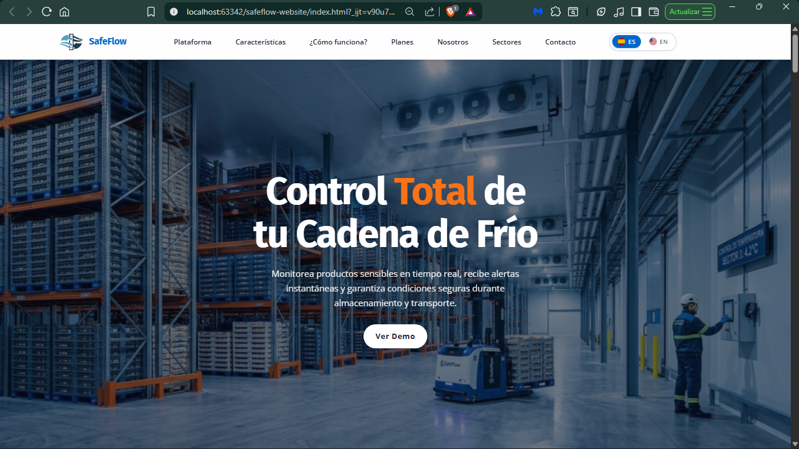
*Sección principal que comunica el "Control Total de tu Cadena de Frío" y facilita el acceso inmediato a la demo.*

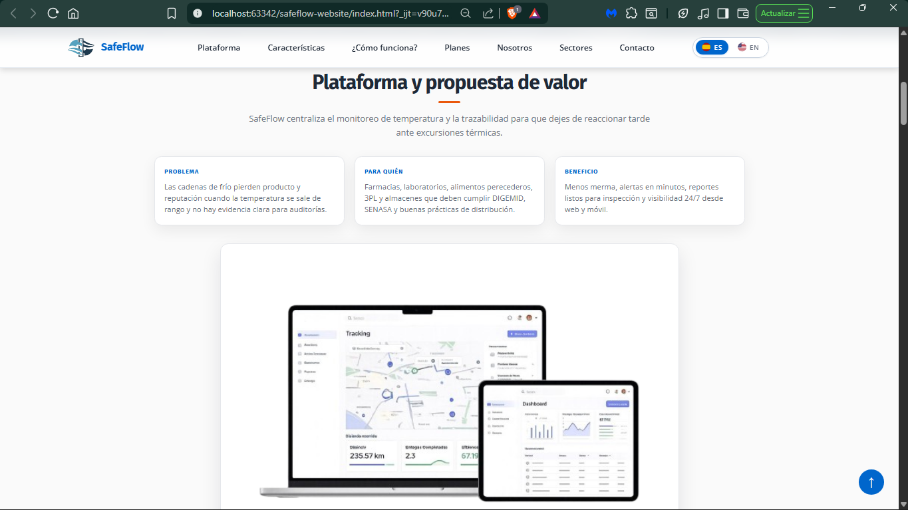
*Sección que comunica la propuesta de valor de SafeFlow y muestra una futura vista al dashboard de nuestra solución.*

### B. Impacto y Funcionalidades

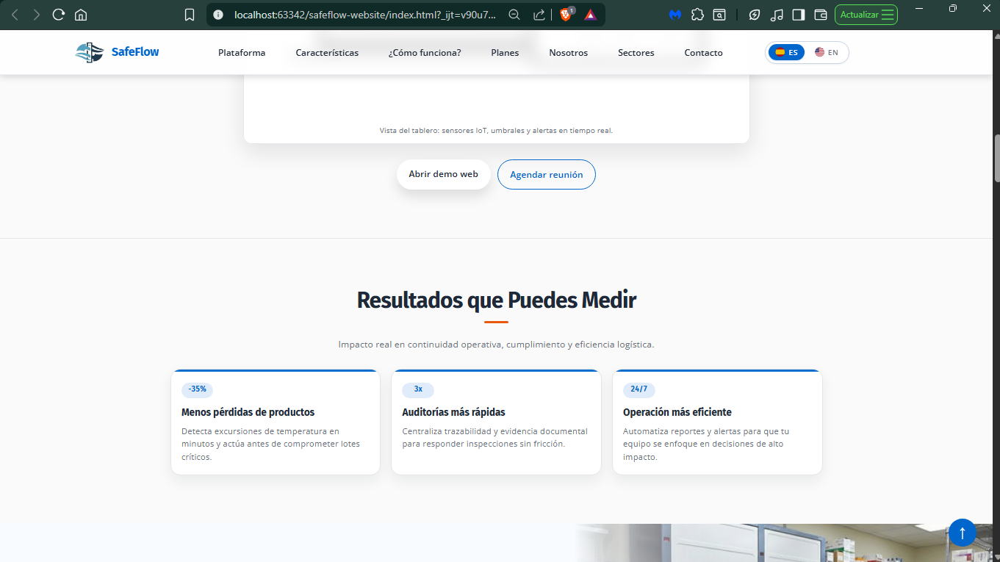
*Sección que comunica el impacto tangible que los clientes pueden esperar al implementar SafeFlow en sus operaciones de cadena de frío.*

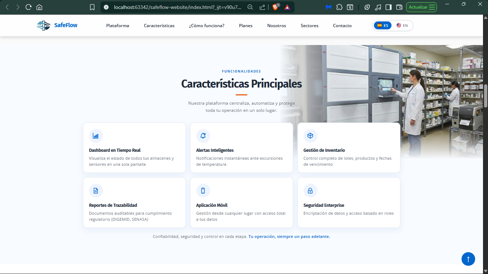
*Sección que destaca las funcionalidades clave de SafeFlow, como monitoreo en tiempo real, alertas inteligentes y análisis predictivo.*

### C. Operatividad y Tecnología

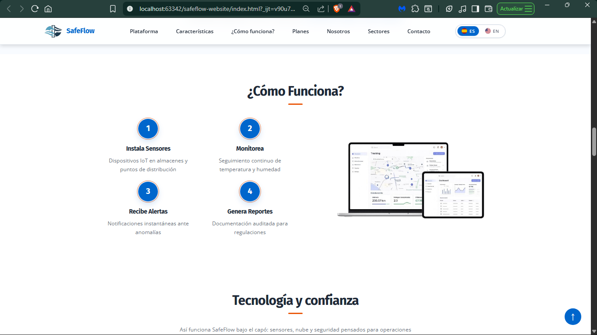
*Sección que explica de manera visual y sencilla el funcionamiento de SafeFlow, desde la instalación de sensores IoT hasta la generación de reportes y alertas.*

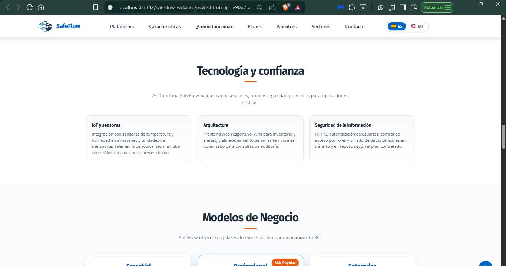
*Sección que detalla las tecnologías utilizadas en el desarrollo de SafeFlow, incluyendo IoT, análisis de datos, arquitectura de software y seguridad de autenticación.*

### D. Subscripciones y Ventajas Principales de SafeFlow
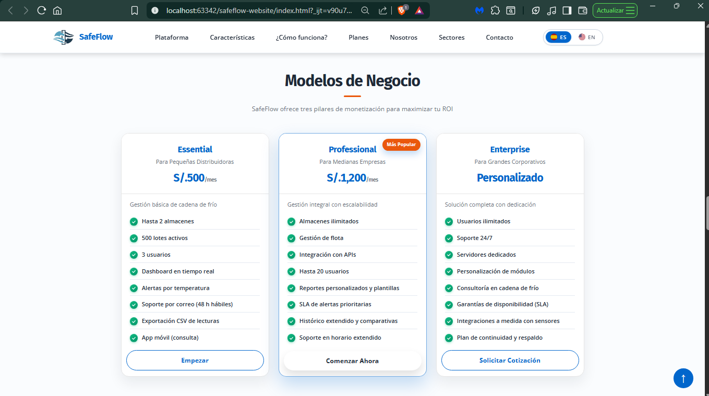
*Modelos de suscripción (Essential, Professional, Enterprise) diseñados para diferentes escalas de operación y cada uno presenta detalles de sus beneficios.*

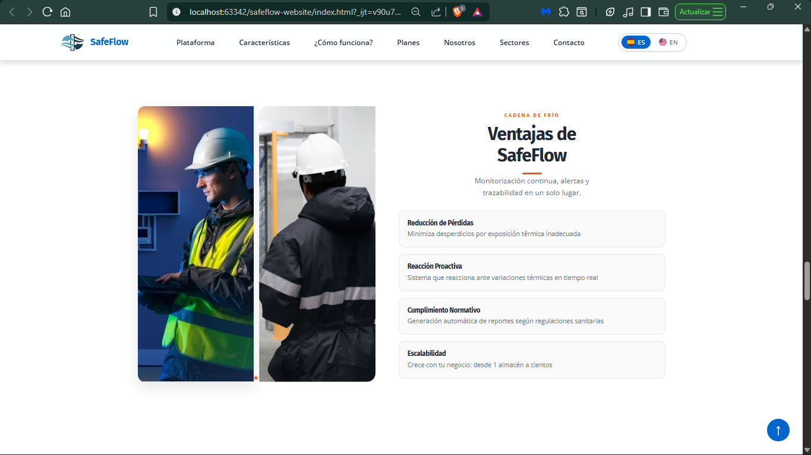
*Sección que resalta las ventajas competitivas de SafeFlow, como la reducción de pérdidas, mejora en la eficiencia operativa y cumplimiento normativo.*

### E. Equipo y Sectores beneficiados de SafeFlow

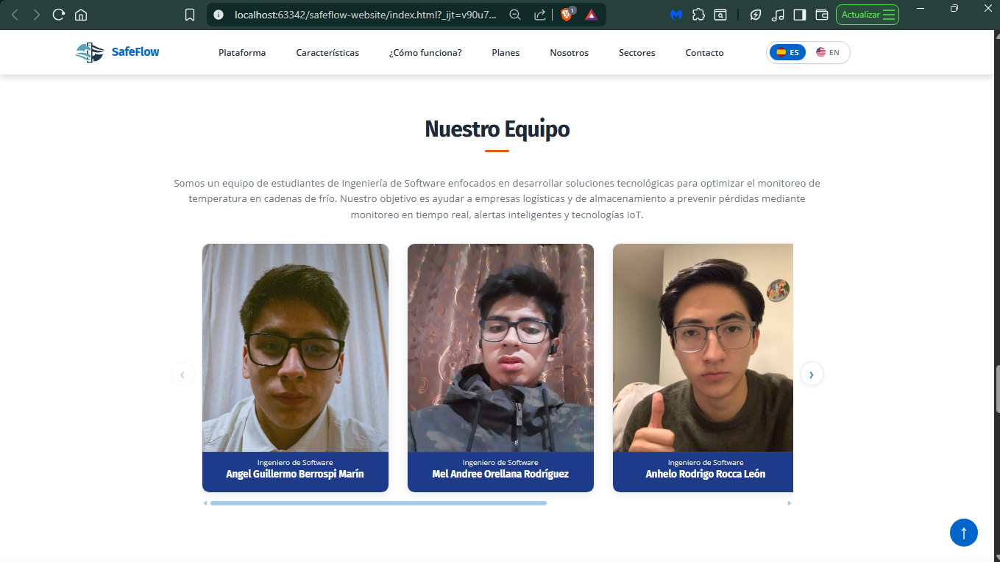
*Presentación del equipo de ingeniería responsable del desarrollo del software.*

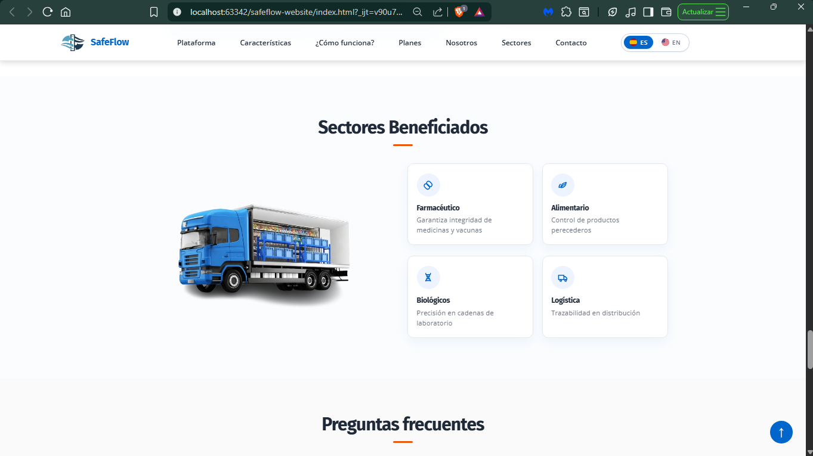
*Sección que muestra los sectores beneficiarios de SafeFlow, incluyendo farmacéutico, logístico, alimentario y otros.*


### F. Cierre 

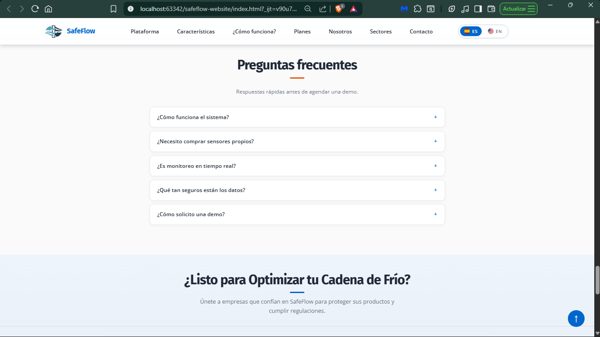
*Sección de preguntas frecuentes que aborda las dudas más comunes de los usuarios potenciales al momento de adquirir SafeFlow.*

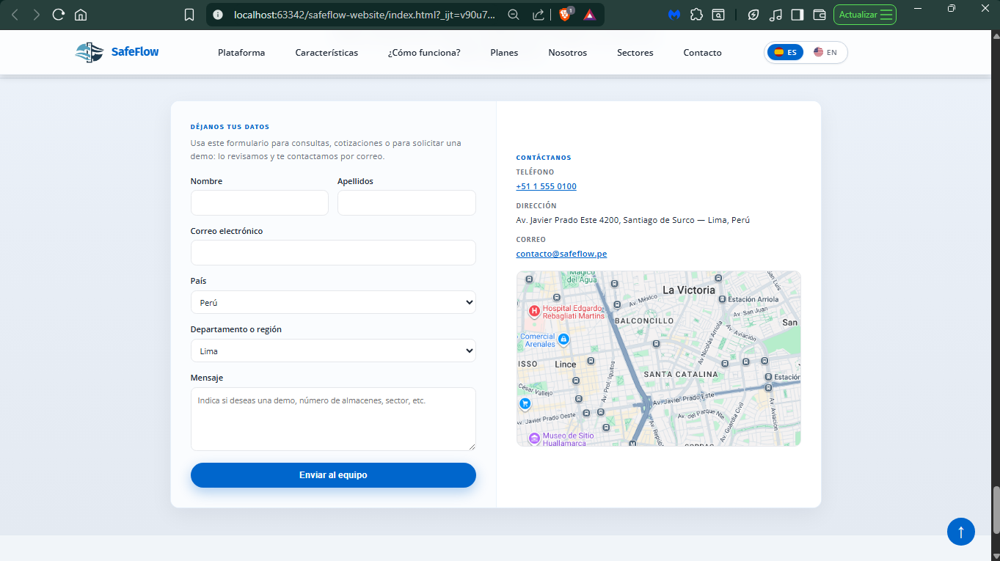
*Sección final que invita a los usuarios a contactar al equipo de ventas o solicitar una demo personalizada, con un formulario de contacto integrado.*


*Pie de página con información de contacto, secciones de la página, enlace a Github y derechos de autor.*

## 3. Video de Demostración y Navegación
Para observar la fluidez de la navegación, la respuesta de los elementos interactivos y la explicación detallada de cada sección, se ha preparado el siguiente material audiovisual:

 **[Ver Video de Demostración - SafeFlow Sprint Review](TU_ENLACE_AQUÍ)**


#### 5.2.1.6. Services Documentation Evidence for Sprint Review

En esta sección se presenta la documentación relacionada con los servicios que serán ofrecidos a través de la plataforma web de SafeFlow, los cuales estarán orientados al monitoreo, control y análisis de la cadena de frío en tiempo real. Estos servicios incluirán funcionalidades como el registro de datos de sensores, visualización de temperaturas, generación de alertas ante desviaciones térmicas y recomendaciones para la toma de decisiones logísticas.

Durante el presente Sprint 1, el enfoque del equipo estuvo centrado exclusivamente en el diseño y desarrollo de la Landing Page del producto, con el objetivo de definir la propuesta de valor, los segmentos de usuarios y la experiencia inicial del sistema. Debido a este alcance, no se implementaron ni desplegaron servicios web funcionales, por lo que no se cuenta aún con endpoints operativos ni documentación técnica asociada a su consumo mediante OpenAPI.


#### 5.2.1.7. Software Deployment Evidence for Sprint Review

En esta sección se describe el proceso de implementación de la plataforma en un entorno de producción. Además, se presentarán los hitos más importantes que marcarán el despliegue del proyecto y garantizarán su disponibilidad para los usuarios finales.

URL de despliegue del Landing Page: [Landing Page Desplegado](https://upc-pre-202610-1asi0730-20177-cryologic.github.io/safeflow-website/) 

1. Para la Landing Page, nuestro equipo creó una rama denominada “develop” dentro del repositorio, en la cual se organizaron y almacenaron todos los archivos correspondientes al desarrollo de la Landing Page.
 <div algin="center">  </div>        
 
2. Posteriormente, nos dirigimos a configuración y empleamos GitHub Pages, el servicio de alojamiento para sitios estáticos de GitHub, para publicar y poner en línea nuestra Landing Page.
 <div algin="center">  </div>        

3. Se seleccionó la rama previamente configurada y se procedió con el despliegue de la página.
    <div algin="center">  </div>        

5. Finalmente, obtuvimos el enlace de publicación, que nos permite acceder y visualizar la Landing Page en línea.
    <div algin="center">  </div>        


#### 5.2.1.8. Team Collaboration Insights during Sprint

 <div algin="center">  </div>        

 <div algin="center">  </div>        


# Conclusiones y recomendaciones

## Conclusiones

La gestión de la cadena de frío constituye un desafío crítico en sectores como el farmacéutico y logístico, donde mantener condiciones térmicas adecuadas es fundamental para preservar la calidad y seguridad de los productos. A partir del análisis realizado, se evidenció que muchas organizaciones aún dependen de métodos tradicionales o herramientas limitadas que no permiten un monitoreo continuo ni una trazabilidad eficiente durante el transporte.

Las entrevistas realizadas a los segmentos objetivo permitieron identificar problemas recurrentes como la falta de visibilidad en tiempo real, la detección tardía de incidencias y la dificultad para generar evidencia confiable durante auditorías. Estos factores no solo generan pérdidas económicas significativas, sino que también afectan la confianza de los clientes y el cumplimiento de normativas sanitarias.

En este contexto, la solución propuesta, SafeFlow, responde a estas necesidades mediante la integración de tecnologías IoT, monitoreo en tiempo real, generación de alertas automáticas y dashboards centralizados. Estas funcionalidades permiten a los usuarios anticiparse a posibles fallas, mejorar la toma de decisiones y optimizar la gestión de la cadena logística.

Asimismo, la aplicación de la metodología Lean UX permitió estructurar el desarrollo del producto en función de las necesidades reales de los usuarios, validando hipótesis y asegurando que la solución propuesta tenga un enfoque centrado en el usuario. Finalmente, la definición de user stories y el product backlog permitió organizar de manera clara y priorizada las funcionalidades del sistema, facilitando su implementación mediante metodologías ágiles.

## Recomendaciones

Se recomienda implementar y validar la solución SafeFlow en entornos reales mediante pruebas piloto con empresas del sector farmacéutico y logístico, con el fin de evaluar su desempeño y obtener retroalimentación directa de los usuarios. Esto permitirá identificar oportunidades de mejora y ajustar la solución a necesidades específicas del mercado.

Asimismo, es importante continuar con el desarrollo de integraciones con sensores IoT reales para garantizar la precisión y confiabilidad de los datos recolectados durante el monitoreo de la cadena de frío. Esto fortalecerá la propuesta de valor del sistema y permitirá una supervisión más efectiva.

También se recomienda mejorar continuamente la experiencia de usuario (UX/UI), priorizando interfaces simples, intuitivas y accesibles, especialmente considerando que algunos usuarios pueden tener un nivel limitado de alfabetización digital.

Por otro lado, se sugiere integrar la plataforma con sistemas empresariales existentes, como ERP o sistemas de gestión logística, con el objetivo de facilitar su adopción en organizaciones y evitar la duplicidad de procesos.

Finalmente, se recomienda considerar la escalabilidad de la solución hacia otros sectores que requieran control de condiciones ambientales, como la industria alimentaria o biotecnológica, ampliando así el alcance y sostenibilidad del proyecto.

# Video About-the-Team


# Bibliografía
- Ministerio de Salud del Perú. (2000). Taller sobre planificación, administración y evaluación: Módulo III. Cadena de frío. https://www.gob.pe/institucion/minsa/informes-publicaciones/352804-taller-sobre-planificacion-administracion-y-evaluacion-modulo-iii-cadena-de-frio
- Dirección General de Medicamentos, Insumos y Drogas. (2025). Guía de apoyo al usuario para solicitar la expedición del certificado de liberación de lote de productos biológicos. https://www.digemid.minsa.gob.pe
- Dirección General de Medicamentos, Insumos y Drogas. (2025). Programa de control y vigilancia del mercado de productos farmacéuticos, dispositivos médicos y productos sanitarios 2023-2025. https://www.digemid.minsa.gob.pe
- Centro Nacional de Abastecimiento de Recursos Estratégicos en Salud. (2025). Cenares obtiene importante certificación de buenas prácticas de distribución y transporte (BPDyT) de DIGEMID. https://www.gob.pe/institucion/cenares/noticias/1199604-cenares-obtiene-importante-certificacion-de-buenas-practicas-de-distribucion-y-transporte-bpdyt-de-digemid
- Dirección General de Medicamentos, Insumos y Drogas. (2026). Establecimientos farmacéuticos autorizados y regulación sanitaria. https://www.digemid.minsa.gob.pe/webDigemid/establecimientos/
- Interworld Freight. (2026). Almacén farmacéutico en Perú y cadena de frío validada. https://interwf.com/es/servicios/almacenamiento/farmaceutico/peru
- Medicas. (2026). Almacenamiento y certificación BPA para productos farmacéuticos. https://medicas.com.pe/almacenamiento.html
- Ministerio de Salud del Perú. (2009). Tablas peruanas de composición de alimentos. https://www.gob.pe/institucion/minsa/informes-publicaciones/353006-tablas-peruanas-de-composicion-de-alimentos
- Cornejo, D. (2023). COVID-19: Digemid dice que no se rompió cadena de frío de vacunas, pero Pfizer pidió que se desechen. La República. https://larepublica.pe/sociedad/2023/06/07/covid19-digemid-dice-que-no-se-rompio-cadena-de-frio-de-vacunas-pero-pfizer-pidio-que-se-desechen-96824


# Anexos
