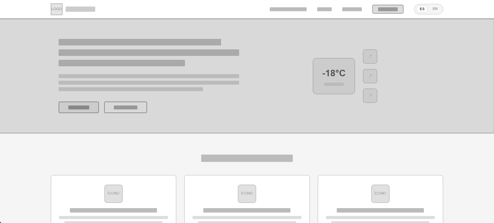
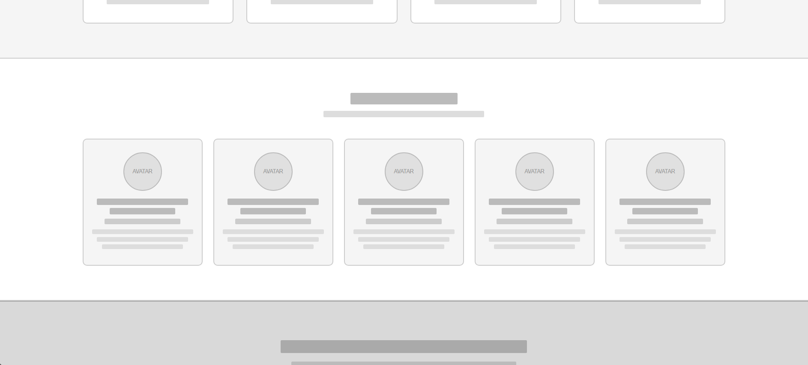
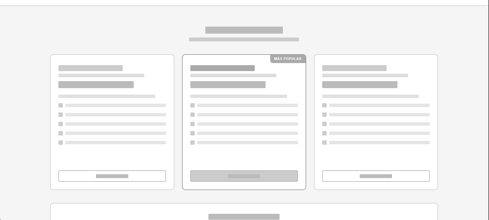
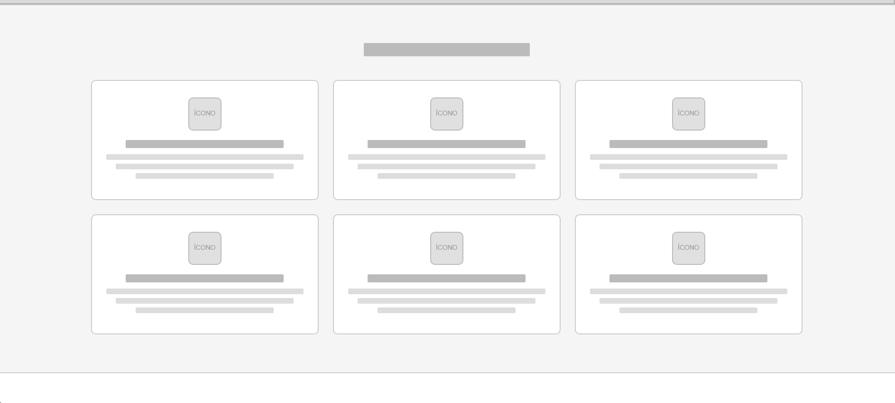
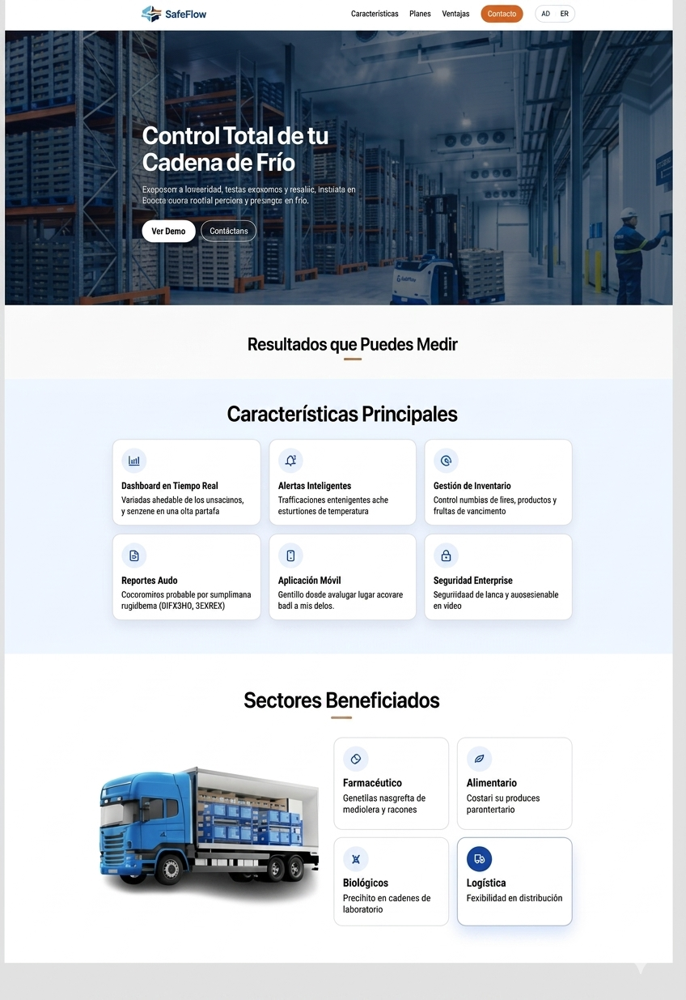
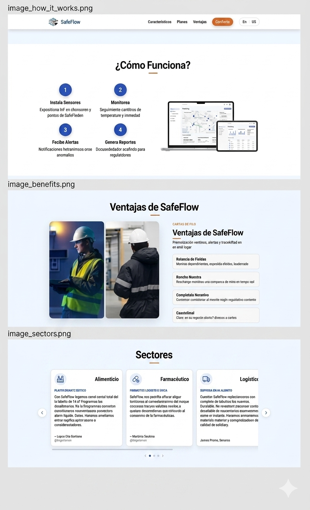
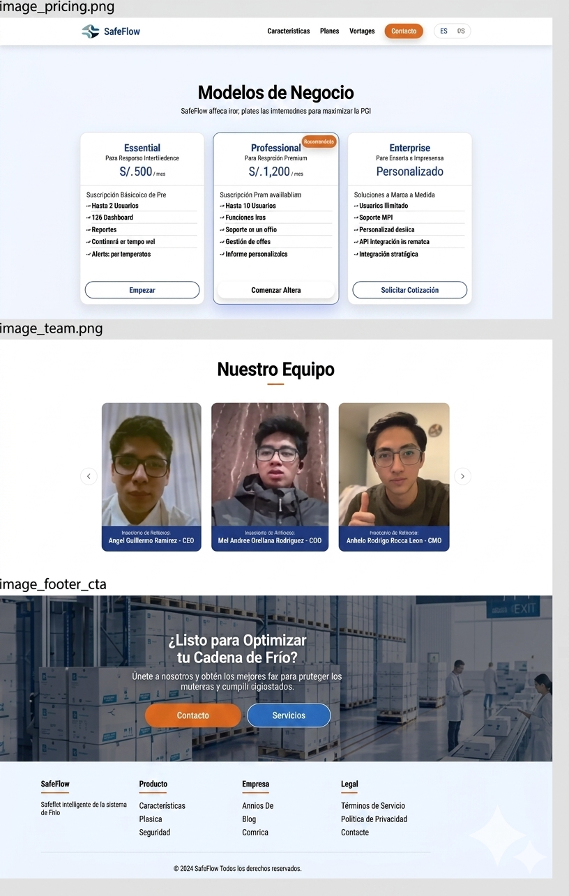

<h3 align="center"> Universidad Peruana de Ciencias Aplicadas </h3>

<h3 align="center"> Ingeniería de Software </h3>
<h3 align="center"> Ciclo 2026 - 1</h3>

 

    </img> 

 

<h1 align="center"> TF1 Report </h1>

<h3 align="center"> 1ASI0730 - Aplicaciones Web - 2610 </h3>

<h3 align="center"> Docente: Jose Miguel Flores Ingaruca </h3>
<h3 align="center"> NRC: 20177 </h3>

<h3> Product: xxxxxxxxx </h3>

<h3> Team Members: </h3>

| Member                           |    Code    |
| :------------------------------- | :--------: |
| Andy Alejandro Mio Mejia         | U202218531 |
| xxxxxxxxxxxxxxxxxxxxxxxxx        | xxxxxxxxxx |
| xxxxxxxxxxxxxxxxxxxxxxxxxxxxxxx  | xxxxxxxxxx |
| xxxxxxxxxxxxxxxxxxxxxxxxxxxxxxxx | xxxxxxxxxx |

<h3 align="center">2025</h3>

# Registro de Versiones del Informe

| Versión | Fecha | Autor | Descripción de modificación |
| :-------: | :---------: | :----------------: | :----------------------:|
| TB1 | --- | Mio Mejia, Andy Alejandro | xxxxxxx |
| TB1 | --- | xxxxxxx | xxxxxxx |
| TB1 | --- | xxxxxxx | xxxxxxx |
| TB1 | --- | xxxxxxx | xxxxxxx |

# Project Report Collaboration Insights

A lo largo del desarrollo del trabajo, se ha evidenciado una participación activa, coordinada y progresiva por parte de todos los integrantes del equipo. Cada fase fue abordada de manera estructurada, siguiendo las buenas prácticas de trabajo colaborativo con control de versiones en GitHub, planificación por entregables, y asignación clara de responsabilidades según las competencias de cada integrante.

El uso de repositorios específicos por subcomponente también contribuyó a mantener una mejor trazabilidad del trabajo colaborativo, integrando ramas por entregables y controlando versiones según el avance de cada sprint.

A continuación, se detallan los repositorios utilizados a lo largo del proyecto:

#### Link del repositorio del Reporte: 

https://github.com/Aplicaciones-Web-20177/REPORT

#### Link del repositorio de la Landing Page: 

https://github.com 

# Contenido

## Tabla de Contenidos

[Registro de versiones del informe](#registro-de-versiones-del-informe)

[Project Report Collaboration Insights](#project-report-collaboration-insights)

[Contenido](#contenido)

[Student Outcome](#student-outcome)

[Capítulo I: Introducción](#capitulo-i-introduccion)

- [1.1. Startup Profile](#11-startup-profile)

  - [1.1.1. Descripción de la Startup](#111-description-de-la-startup)

  - [1.1.2. Perfiles de integrantes del equipo](#112-perfiles-de-integrantes-del-equipo)

- [1.2. Solution Profile](#12-solution-profile)
  - [1.2.1 Antecedentes y problemática](#121-antecedentes-y-problemática)
  - [1.2.2 Lean UX Process](#122-lean-ux-process)
    - [1.2.2.1. Lean UX Problem Statements](#1221-lean-ux-problem-statements)
    - [1.2.2.2. Lean UX Assumptions](#1222-lean-ux-assumptions)
    - [1.2.2.3. Lean UX Hypothesis Statements](#1223-lean-ux-hypothesis-statements)
    - [1.2.2.4. Lean UX Canvas](#1224-lean-ux-canvas)
- [1.3. Segmentos objetivo](#13-segmentos-objetivo)

[Capítulo II: Requirements Elicitation & Analysis](#capítulo-ii-requirements-elicitation--analysis-1)

- [2.1. Competidores](#21-competidores)
  - [2.1.1. Análisis competitivo](#211-análisis-competitivo)
  - [2.1.2. Estrategias y tácticas frente a competidores](#212-estrategias-y-tácticas-frente-a-competidores)
- [2.2. Entrevistas](#22-entrevistas)
  - [2.2.1. Diseño de entrevistas](#221-diseño-de-entrevistas)
  - [2.2.2. Registro de entrevistas](#222-registro-de-entrevistas)
  - [2.2.3. Análisis de entrevistas](#223-análisis-de-entrevistas)
- [2.3. Needfinding](#23-needfinding)
  - [2.3.1. User Personas](#231-user-personas)
  - [2.3.2. User Task Matrix](#232-user-task-matrix)
  - [2.3.3. User Journey Mapping](#233-user-journey-mapping)
  - [2.3.4. Empathy Mapping](#234-empathy-mapping)
  - [2.3.5. As-is Scenario Mapping](#235-as-is-scenario-mapping)

[Capítulo III: Requirements Specification](#capítulo-iii-requirements-specification-1)

- [3.1. To-Be Scenario Mapping](#31-to-be-scenario-mapping)
- [3.2. User Stories](#32-user-stories)
- [3.3. Impact Mapping](#33-impact-mapping)
- [3.4. Product Backlog](#34-product-backlog)

[Capítulo IV: Product Design](#capitulo-iv-product-design-1)

- [4.1. Style Guidelines](#41-style-guidelines)
  - [4.1.1. General Style Guidelines](#411-general-style-guidelines)
  - [4.1.2. Web Style Guidelines](#412-web-style-guidelines)
- [4.2. Information Architecture](#42-information-architecture)
  - [4.2.1. Organization Systems](#421-organization-systems)
  - [4.2.2. Labeling Systems](#422-labeling-systems)
  - [4.2.3. SEO Tags and Meta Tags](#423-seo-tags-and-meta-tags)
  - [4.2.4. Searching Systems](#424-searching-systems)
  - [4.2.5. Navigation Systems](#425-navigation-systems)
- [4.3. Landing Page UI Design](#43-landing-page-ui-design)
  - [4.3.1. Landing Page Wireframe](#431-landing-page-wireframe)
  - [4.3.2. Landing Page Mock-up](#432-landing-page-mock-up)
- [4.4. Web Applications UX/UI Design](#44-web-applications-uxui-design)
  - [4.4.1. Web Applications Wireframes](#441-web-applications-wireframes)
  - [4.4.2. Web Applications Wireflow Diagrams](#442-web-applications-wireflow-diagrams)
  - [4.4.3. Web Applications Mock-ups](#443-web-applications-mock-ups)
  - [4.4.4. Web Applications User Flow Diagrams](#444-web-applications-user-flow-diagrams)
- [4.5. Web Applications Prototyping](#45-web-applications-prototyping)
- [4.6. Domain-Driven Software Architecture](#46-domain-driven-software-architecture)
  - [4.6.1. Software Architecture Context Diagram](#461-software-architecture-context-diagram)
  - [4.6.2. Software Architecture Container Diagrams](#462-software-architecture-container-diagrams)
  - [4.6.3. Software Architecture Components Diagrams](#463-software-architecture-components-diagrams)
- [4.7. Software Object-Oriented Design](#47-software-object-oriented-design)
  - [4.7.1. Class Diagrams](#471-class-diagrams)
  - [4.7.2. Class Dictionary](#472-class-dictionary)
- [4.8. Database Design](#48-database-design)
  - [4.8.1. Database Diagram](#481-database-diagram)

[Capítulo V: Product Implementation, Validation & Deployment](#capitulo-v-product-implementation-validation-deployment-)
- [5.1. Software Configuration Management](#51-software-configuration-management)
  - [5.1.1. Software Development Enviroment Configuration](#511-software-development-enviroment-configuration)
  - [5.1.2. Source Code Management](#512-source-code-management)
  - [5.1.3. Source Code Style Guide & Conventions](#513-source-code-style-guide--conventions)
  - [5.1.4. Software Deployment Configuration](#514-software-deployment-configuration)
- [5.2. Landing Page, Service & Application Implementation](#52-landing-page-service--application-implementation)
  - [5.2.1 Sprint 1](#521-sprint-1)
    - [5.2.1.1. Sprint Planning 1](#5211-sprint-planning-1)
    - [5.2.1.2. Aspect Leaders and Collaborators](#5212-aspect-leaders-and-collaborators)
    - [5.2.1.3. Sprint Backlog 1](#5213-sprint-backlog-1)
    - [5.2.1.4. Development Evidence for Sprint Review](#5214-development-evidence-for-sprint-review)
    - [5.2.1.5. Execution Evidence for Sprint Review](#5215-execution-evidence-for-sprint-review)
    - [5.2.1.6. Services Documentation Evidence for Sprint Review](#5216-services-documentation-evidence-for-sprint-review)
    - [5.2.1.7. Software Deployment Evidence for Sprint Review](#5217-software-deployment-evidence-for-sprint-review)
    - [5.2.1.8. Team Collaboration Insights during Sprint](#5218-team-collaboration-insights-during-sprint)
  - [5.2.2 Sprint 2](#522-sprint-2)
    - [5.2.2.1. Sprint Planning 2](#5221-sprint-planning-2)
    - [5.2.2.2. Aspect Leaders and Collaborators](#5222-aspect-leaders-and-collaborators)
    - [5.2.2.3. Sprint Backlog 2](#5223-sprint-backlog-2)
    - [5.2.2.4. Development Evidence for Sprint Review](#5224-development-evidence-for-sprint-review)
    - [5.2.2.5. Execution Evidence for Sprint Review](#5225-execution-evidence-for-sprint-review)
    - [5.2.2.6. Services Documentation Evidence for Sprint Review](#5226-services-documentation-evidence-for-sprint-review)
    - [5.2.2.7. Software Deployment Evidence for Sprint Review](#5227-software-deployment-evidence-for-sprint-review)
    - [5.2.2.8. Team Collaboration Insights during Sprint](#5228-team-collaboration-insights-during-sprint)
  - [5.2.3 Sprint 3](#523-sprint-3)
    - [5.2.3.1. Sprint Planning 3](#5231-sprint-planning-3)
    - [5.2.3.2. Aspect Leaders and Collaborators](#5232-aspect-leaders-and-collaborators)
    - [5.2.3.3. Sprint Backlog 3](#5233-sprint-backlog-3)
    - [5.2.3.4. Development Evidence for Sprint Review](#5234-development-evidence-for-sprint-review)
    - [5.2.3.5. Execution Evidence for Sprint Review](#5235-execution-evidence-for-sprint-review)
    - [5.2.3.6. Services Documentation Evidence for Sprint Review](#5236-services-documentation-evidence-for-sprint-review)
    - [5.2.3.7. Software Deployment Evidence for Sprint Review](#5237-software-deployment-evidence-for-sprint-review)
    - [5.2.3.8. Team Collaboration Insights during Sprint](#5238-team-collaboration-insights-during-sprint)
  - [5.2.4 Sprint 4](#524-sprint-4)
    - [5.2.4.1. Sprint Planning 4](#5241-sprint-planning-4)
    - [5.2.4.2. Aspect Leaders and Collaborators](#5242-aspect-leaders-and-collaborators)
    - [5.2.4.3. Sprint Backlog 4](#5243-sprint-backlog-4)
    - [5.2.4.4. Development Evidence for Sprint Review](#5244-development-evidence-for-sprint-review)
    - [5.2.4.5. Execution Evidence for Sprint Review](#5245-execution-evidence-for-sprint-review)
    - [5.2.4.6. Services Documentation Evidence for Sprint Review](#5246-services-documentation-evidence-for-sprint-review)
    - [5.2.4.7. Software Deployment Evidence for Sprint Review](#5247-software-deployment-evidence-for-sprint-review)
    - [5.2.4.8. Team Collaboration Insights during Sprint](#5248-team-collaboration-insights-during-sprint)
- [5.3 Validation Interviews](#53-validation-interviews)
  - [5.3.1 Diseño de Entrevistas](#531-diseño-de-entrevistas)
  - [5.3.2 Registro de Entrevistas](#532-registro-de-entrevistas)
  - [5.3.3 Evaluaciones según heurísticas](#533-evaluaciones-según-heurísticas)
- [5.4 Video About-the-Product](#54-video-about-the-product)
   
      
- [Conclusiones y recomendaciones](#conclusiones-y-recomendaciones)

- [Video About-the-Team](#Video-About-the-Team)
  
- [Bibliografía](#bibliografia)

- [Anexos](#anexos)

# Student Outcome

# Capitulo I: Introduccion

## 1.1. StartUp Profile 

### 1.1.1. Descripción de la Startup

### 1.1.2. Perfiles de integrantes del equipo

## 1.2. Solution Profile

### 1.2.1 Antecedentes y problemática

### 1.2.2 Lean UX Process

#### 1.2.2.1. Lean UX Problem Statements
#### 1.2.2.2. Lean UX Assumptions
#### 1.2.2.3. Lean UX Hypothesis Statements
#### 1.2.2.4. Lean UX Canvas
## 1.3. Segmentos objetivo

# Capítulo II: Requirements Elicitation & Analysis

## 2.1. Competidores
### 2.1.1. Análisis competitivo
### 2.1.2. Estrategias y tácticas frente a competidores
## 2.2. Entrevistas
### 2.2.1. Diseño de entrevistas
### 2.2.2. Registro de entrevistas
### 2.2.3. Análisis de entrevistas
## 2.3. Needfinding
### 2.3.1. User Personas
### 2.3.2. User Task Matrix
### 2.3.3. User Journey Mapping
### 2.3.4. Empathy Mapping
### 2.3.5. As-is Scenario Mapping

# Capítulo III: Requirements Specification

## 3.1. To-Be Scenario Mapping
## 3.2. User Stories
## 3.3. Impact Mapping
## 3.4. Product Backlog

#  Capítulo IV: Product Design

## 4.1. Style Guidelines

Con el objetivo de asegurar coherencia visual y comunicacional a lo largo de todos los puntos de contacto con los usuarios, se define una guía de estilo centralizada para el equipo de diseño y desarrollo. Esta guía permitirá mantener una presentación consistente tanto en plataformas web como móviles, alineada con los valores de sostenibilidad, inclusión y responsabilidad promovidos por **safeFlow**.

### 4.1.1. General Style Guidelines

Teniendo en cuenta nuestro público objetivo (empresas logísticas, distribuidoras y laboratorios) y el nicho de la cadena de frío, nos decidimos por la siguiente paleta de colores:

**Paleta de colores: **Teniendo en cuenta nuesto publico objetivo y el nicho a apuntar, nos decidimos por la siguiente paleta de colores:

- **Azul Primario - #0066CC**: Es nuestro color principal y representa confianza, profesionalismo y seguridad. Se utiliza en botones principales (CTAs), encabezados destacados, links y elementos interactivos. Este azul transmite la fiabilidad que los usuarios buscan en una solución de control de temperatura crítica.

- **Azul Secundario - #1AA8E6**: Un tono más claro y vibrante del azul, utilizado para crear gradientes visuales, estados hover, y elementos secundarios. Funciona perfectamente con el azul primario para crear una jerarquía visual clara. Se usa también en secciones secundarias y para resaltar información complementaria.

- **Gris Oscuro (Texto Primario) - #1F2937**: Color para el texto principal del cuerpo. Proporciona excelente legibilidad sobre fondos claros y transmite profesionalismo y estabilidad.

- **Gris Claro (Texto Secundario) - #6B7280**: Se utiliza para subtítulos, descripciones, leyendas y texto secundario. Esta práctica crea una jerarquía visual clara y ayuda a que el contenido principal destaque.

- **Blanco - #FFFFFF**: Fondo principal de la aplicación. Proporciona una base limpia y profesional para todo el contenido.

- **Gris Muy Claro (Secciones Alternadas) - #F9FAFB**: Se usa como fondo alterno en secciones secundarias, bloques de contenido o tarjetas para crear dinamismo y separación visual sin ser demasiado agresivo.

- **Gris Ultra Claro - #F5F7FA**: Color de fondo complementario para elementos como el selector de idioma, campos de entrada o áreas con información adicional.

- **Gris Muy Oscuro (Fondos Oscuros) - #0F1419**: Utilizado en fondos oscuros para mantener coherencia y sofisticación en cualquier tema futuro.

- **Verde de Éxito - #10B981**: Indica operaciones exitosas, temperaturas dentro del rango permitido, o estados positivos. Genera confianza al usuario.

- **Naranja/Amarillo de Advertencia - #F59E0B**: Señala advertencias o temperaturas que requieren atención pero no son críticas. Captura la atención sin alarmar.

- **Rojo de Peligro - #EF4444**: Indica errores, temperaturas fuera de rango o alertas críticas. Representa urgencia y requiere acción inmediata.

- **Color de Borde - #E5E7EB**: Utilizado para separaciones sutiles entre elementos, bordes de tarjetas, campos de entrada y líneas divisorias. Mantiene la cohesión visual sin ser invasivo.

**Tipografía** La tipografía principal para safeFlow es Fira Sans, seleccionada por su legibilidad en pantalla y su estilo moderlo y profesional. Es una fuente ideal para encabezados y elementos de interfaz importantes. Para el cuerpo del texto y elementos secundarios se emplea Open Sans, ya que de igual forma es una fuente legible y versátil, además que se complementa a la perfección con Fira Sans, esto garantiza una lectura cómoda y una jerarquía visual clara en toda la plataforma.
- **Fira Sans** (para encabezados): Seleccionada por su estilo moderno, profesional y excelente legibilidad. Ideal para títulos y elementos de interfaz importantes que necesitan captar atención.

- **Open Sans** (para cuerpo de texto): Fuente legible, versátil y que se complementa perfectamente con Fira Sans. Garantiza una lectura cómoda y justa para contenido extenso.

- **System Fonts** (fallback): Se incluyen fuentes del sistema (-apple-system, BlinkMacSystemFont, Segoe UI, Roboto, etc.) para asegurar compatibilidad multiplataforma.

**Escala**
- **Base**: 16px
- **Ratio**: 1.25 (Proporción Mayor)

**Nomenclatura**
| Nombre | Tamaño | Peso | Familia |
|--------|--------|------|---------|
| H1 | 56px | SemiBold (600) | Fira Sans |
| H2 | 44.8px | Medium (500) | Fira Sans |
| H3 | 35.84px | Regular (400) | Fira Sans |
| Section Title | 40px | Bold (700) | Fira Sans |
| Subtitle | 28.8px | Light (300) | Open Sans |
| Body | 16px | Regular (400) | Open Sans |
| Caption | 12.8px | Light (300) | Open Sans |

**Propiedades de Espaciado y Línea**

- **Interlineado (line-height) Global**: 1.6 para facilitar la lectura y mantener espacios respirable en el texto.
- **Interlineado en Encabezados**: 1.2 para un aspecto más compacto y poderoso.
- **Margin/Padding Base**: 8px (usar múltiplos de 8 para coherencia: 8px, 16px, 24px, 32px, 48px, etc.)

**Pesos Tipográficos Disponibles**

El proyecto utiliza los siguientes pesos de fuente para crear jerarquía y énfasis:

- Thin (100)
- ExtraLight (200)
- Light (300)
- Regular (400)
- Medium (500)
- SemiBold (600)
- Bold (700)
- ExtraBold (800)
- Black (900)

**Branding e ícono** El logo de SafeFlow es un ícono abstracto y dinámico que integra elementos simbólicos de movimiento, seguridad y control. Las líneas curvas suavemente ondulantes representan el movimiento constante y el flujo ininterrumpido de la cadena de frío. La combinación de elementos geométricos y orgánicos simboliza la vigilancia precisa de la temperatura. El diseño limpio y moderno transmite confianza a empresas logísticas, distribuidoras y laboratorios. 

### 4.1.2. Web Style Guidelines
La versión web de SafeFlow está diseñada para ofrecer una experiencia fluida e intuitiva, tanto para administradores de logística como para operarios de almacén y laboratorio. Su diseño es responsivo y dinámico, adaptándose a las necesidades de usuarios en entornos críticos de control de temperatura.

- **Diseño Responsivo**: La plataforma se adapta perfectamente a dispositivos de escritorio, tabletas y móviles, garantizando una experiencia de usuario consistente, ya sea que se encuentre en una oficina central, en una cámara frigorífica o en movimiento. La interfaz mantiene su funcionalidad y claridad en todos los tamaños de pantalla.

- **Hover Effects**: Los elementos interactivos como botones, tarjetas de sensores y alertas cambian sutilmente de color al pasar el cursor sobre ellos. Por ejemplo, los botones de llamado a la acción azul pueden oscurecerse ligeramente o cambiar a un azul secundario para indicar que son seleccionables. Las tarjetas de monitoreo de temperatura pueden elevarse con una sombra suave para indicar interactividad.

- **Barra de Navegación Superior**: La barra de navegación principal está ubicada en la parte superior e incluye accesos clave como Inicio, Reportes, Inventario y Perfil. Esto asegura que los usuarios puedan acceder a las secciones más críticas de manera rápida y eficiente, minimizando pasos para tomar decisiones sobre la cadena de frío.

- **Animaciones Sutiles**: Se emplean transiciones suaves para mejorar la experiencia de usuario sin distraer de la información crítica. Las animaciones sutiles como el deslizamiento de paneles al expandir menús, el cambio de estado de un botón al ser presionado, o la aparición gradual de alertas, hacen que la interacción se sienta más fluida, moderna y profesional. Las animaciones nunca interfieren con la legibilidad de datos críticos.

- **Paneles Modulares**: El contenido como los datos de sensores, el historial de temperaturas, las alertas activas o los reportes de cumplimiento, se organizará en paneles modulares y tarjetas. Esto facilita tanto la lectura y escaneo rápido de información, como la adaptación a diferentes tamaños de pantalla. Cada panel tiene límites claros usando el color de borde (#E5E7EB) y espaciado consistente.

## 4.2. Information Architecture

En esta sección se definen las decisiones de arquitectura de información que dirigen cómo se organizará el contenido en las experiencias web de **safeFlow**, incluyendo el Landing Page y futuras aplicaciones. El objetivo principal es garantizar que los visitantes y usuarios se adapten de manera intuitiva a la funcionalidad de cada producto, puedan encontrar fácilmente lo que necesitan y logren una navegación fluida y satisfactoria.

Las propuestas de arquitectura están diseñadas siguiendo principios de usabilidad, claridad y accesibilidad, abordando los siguientes componentes:

- **Organization Systems**
- **Labeling Systems**
- **SEO Tags and Meta Tags**
- **Searching Systems**
- **Navigation Systems**

### 4.2.1. Organization Systems

Se establecen las siguientes decisiones sobre la organización del contenido en SafeFlow:

### Visual Hierarchy

Se aplicará una **jerarquía visual clara** en todas las páginas, priorizando:

- **Dashboard**: Vista principal con métricas críticas de temperatura
- **Monitoreo en Tiempo Real**: Seguimiento activo de sensores y ubicaciones
- **Alertas**: Notificaciones de desviaciones de temperatura
- **Reportes**: Análisis histórico y cumplimiento normativo
- **Inventario**: Gestión de productos en cadena de frío
- **Configuración**: Parámetros de sistema y usuarios

El tamaño, color y peso de los elementos gráficos ayudarán a guiar la atención del usuario hacia información crítica de monitoreo y control de temperatura.

### Secuencial Organization

En procesos clave como:

- **Configuración de Sensores**: Instalación y calibración de dispositivos
- **Creación de Zonas de Monitoreo**: Definición de áreas y parámetros de temperatura
- **Establecimiento de Alertas**: Configuración de umbrales y notificaciones
- **Generación de Reportes de Cumplimiento**: Análisis periódico de conformidad

Se usará una **organización paso a paso**, facilitando al usuario completar acciones en orden lógico:

**Ejemplo del proceso de configuración de alertas:**

1. Seleccionar zona o sensor a monitorear.
2. Definir rangos de temperatura permitidos (mínimo y máximo).
3. Configurar escalas de alerta (crítica, advertencia, normal).
4. Establecer canales de notificación y destinatarios.
5. Revisar y guardar configuración.

### Matricial Organization

Para listas de sensores, zonas de almacenamiento o reportes históricos, se aplicará un modelo **matricial**:

- Comparar múltiples fuentes de datos al mismo nivel.
- Uso de filtros por: ubicación, rango de temperatura, estado operativo, fecha, tipo de producto almacenado.
- Ordenamiento flexible: por temperatura actual, anomalías detectadas, eficiencia, proximidad a umbrales críticos.

Esto permite que los operarios y administradores comparen rápidamente el estado de diferentes zonas y sensores para identificar problemas.

### Esquemas de Categorización

Según el tipo de contenido, se aplicarán distintos esquemas:

- **Por Ubicación**: diferentes cámaras frigoríficas, almacenes, vehículos de distribución o laboratorios monitoreados.
- **Por Audiencia**: vistas simplificadas para "Operarios de Campo" vs. vistas detalladas para "Administradores de Logística" y "Supervisores de Cumplimiento".
- **Cronológico**: alertas recientes, tendencias de temperatura en las últimas 24 horas, histórico de eventos.
- **Por Estado**: sensores activos, inactivos, con fallos, en mantenimiento.
- **Por Criticidad**: alertas críticas (rojo), advertencias (naranja), normales (verde).

Esto permite un acceso eficiente y contextualizado, adaptado a las distintas necesidades y roles de los usuarios en la cadena de frío.

### 4.2.2. Labeling Systems

La representación de los datos en la plataforma busca ser clara, intuitiva y evitar confusión. Para ello se establecen las siguientes directrices de etiquetado:

### Principios de Etiquetado

- Utilizar un **mínimo número de palabras**.
- Preferir términos **comunes en logística y control de temperatura** y **fáciles de comprender**.
- Mantener **consistencia** en la terminología a lo largo de la aplicación.
- Usar verbos de acción claros para funcionalidades críticas.

### Etiquetas principales propuestas

| Área                    | Etiqueta asignada              | Propósito                                          |
| ----------------------- | ------------------------------ | -------------------------------------------------- |
| Vista Principal         | "Dashboard"                    | Resumen general del estado de todas las zonas.    |
| Monitoreo Activo        | "Monitoreo en Tiempo Real"     | Seguimiento continuo de sensores y temperaturas.  |
| Notificaciones          | "Alertas"                      | Historial y gestión de desviaciones detectadas.   |
| Análisis Histórico      | "Reportes"                     | Cumplimiento normativo y análisis de tendencias.  |
| Gestión de Inventario   | "Inventario"                   | Control de productos en cadena de frío.           |
| Parámetros del Sistema  | "Configuración"                | Ajustes de sensores, usuarios y umbrales.         |
| Información del Usuario | "Mi Perfil"                    | Datos personales y preferencias del usuario.      |
| Búsqueda Global         | "Buscar"                       | Entrada de texto para localizar sensores y zonas. |

### Etiquetas dentro de filtros

Los filtros utilizarán palabras clave simples y contextuales:

- **"Tipo de Zona"** (cámara frigorífica, almacén, vehículo, laboratorio).
- **"Ubicación"** (edificio, sala, dirección o código de ubicación).
- **"Rango de Temperatura"** (temperatura mínima, temperatura máxima).
- **"Estado del Sensor"** (activo, inactivo, en mantenimiento, fallo).
- **"Crítica"** (crítica, advertencia, normal).
- **"Producto"** (categoría de producto almacenado).
- **"Período"** (últimas 24 horas, última semana, último mes).
- **"Responsable"** (nombre del operario o administrador asignado).

### Convenciones de Nomenclatura

- **Estados de Alerta**: "Crítica" (rojo), "Advertencia" (naranja), "Normal" (verde) — alineado con la paleta de colores semántica.
- **Acciones**: Usar imperativos claros: "Generar Reporte", "Configurar Umbral", "Exportar Datos", "Notificar Equipo".
- **Referencias de Datos**: Ejemplo: "Zona A - Cámara 01" o "Sensor #S-2847", manteniendo formato consistente.

Esto facilita que tanto **administradores logísticos** como **operarios de campo** interpreten de inmediato las opciones disponibles sin necesidad de explicaciones adicionales, mejorando la eficiencia operativa en entornos críticos de cadena de frío.

### 4.2.3. SEO Tags and Meta Tags

Para optimizar la visibilidad y accesibilidad de SafeFlow en motores de búsqueda, se establecen los siguientes **SEO Tags** y **Meta Tags** que serán implementados tanto en el **Landing Page** como en la **Web Application**:

| Página                              | Title                                                              | Meta Description                                                                                | Meta Keywords                                                                | Author            |
| ----------------------------------- | ------------------------------------------------------------------ | ----------------------------------------------------------------------------------------------- | ----------------------------------------------------------------------------- | ----------------- |
| Landing Page                        | Control de Cadena de Frío en Tiempo Real - SafeFlow                | SafeFlow es la plataforma líder para monitoreo y control de temperatura en logística, almacenamiento y distribución. Garantiza el cumplimiento normativo y la seguridad de productos refrigerados.                                              | control cadena de frío, monitoreo temperatura, logística refrigerada, sensores IoT, cumplimiento normativo, almacenamiento en frío | Equipo SafeFlow   |
| Web Application - Dashboard         | SafeFlow Dashboard - Monitoreo de Cadena de Frío                  | Supervisa en tiempo real el estado de todas tus zonas de almacenamiento, sensores y alertas de temperatura desde un único panel intuitivo.                                            | dashboard monitoreo, control temperatura, alertas logística, monitoreo sensores | Equipo SafeFlow   |
| Web Application - Reportes          | SafeFlow Reportes - Análisis y Cumplimiento Normativo             | Genera reportes detallados de temperatura, auditoría de cumplimiento y análisis histórico para validación regulatoria en cadena de frío.                                            | reportes cadena frío, auditoría normativa, análisis temperatura, cumplimiento regulatorio | Equipo SafeFlow   |
| Web Application - Alertas           | SafeFlow Alertas - Notificaciones de Desviaciones de Temperatura  | Recibe alertas instantáneas cuando detectamos desviaciones críticas de temperatura que requieren acción inmediata.                                            | alertas temperatura, notificaciones logística, monitoreo crítico, detección anomalías | Equipo SafeFlow   |
| Web Application - Perfil Usuario    | SafeFlow - Mi Perfil                                               | Gestiona tus datos de usuario, permisos, preferencias de notificación y acceso a zonas de monitoreo en SafeFlow.                                            | perfil usuario SafeFlow, gestión permisos, preferencias notificación, acceso logística | Equipo SafeFlow   |
| Web Application - Configuración     | SafeFlow Configuración - Gestión de Sensores y Umbrales           | Configura sensores IoT, define rangos de temperatura permitidos, establece umbrales de alerta y gestiona usuarios del sistema.                                            | configuración sensores, gestión umbrales, parámetros temperatura, administración sistema | Equipo SafeFlow   |

### 4.2.4. Searching Systems

Para mejorar la **capacidad de búsqueda** dentro del sitio web y la aplicación, se implementarán sistemas claros, efectivos y centrados en la experiencia operativa y administrativa.

### Tipos de búsqueda ofrecidos

#### Búsqueda Global (Header Search Box)

- Visible en todas las páginas principales de la aplicación.
- Permite buscar:
  - **Sensores** (por ID, ubicación o zona).
  - **Zonas de almacenamiento** (cámaras frigoríficas, almacenes, vehículos).
  - **Productos** (por código, categoría o lote).
  - **Alertas recientes** (búsqueda por criticidad o fecha).
  - **Reportes** (búsqueda por período o zona).
- Incluye **autocompletado** con sugerencias relevantes (ejemplo: "Sensor #S-2847", "Cámara Zona A", "Alerta Crítica - Almacén 01").

#### Filtros de búsqueda en "Monitoreo en Tiempo Real"

- **Tipo de Zona** (cámara frigorífica, almacén, vehículo, laboratorio).
- **Ubicación** (edificio, sala, dirección física o código de ubicación).
- **Rango de Temperatura** (mínima, máxima, permitida).
- **Estado del Sensor** (activo, inactivo, en mantenimiento, fallo).
- **Producto Almacenado** (categoría, tipo de insumo, medicamento, alimento).
- **Período** (últimas 24 horas, última semana, último mes, rango personalizado).
- **Responsable** (operario o administrador asignado).
- **Criticidad** (solo crítico, solo advertencias, todo).

#### Búsqueda específica en "Reportes"

- Por **tipo de reporte** (auditoría, cumplimiento, temperatura, eventos).
- Por **período de generación** (rango de fechas).
- Por **zona o sensor específico**.
- Por **estado de cumplimiento** (completamente conforme, conforme con desviaciones, no conforme).

### Presentación de resultados

#### Resultados dinámicos

El listado se actualizará en tiempo real al aplicar filtros o realizar búsquedas, proporcionando retroalimentación inmediata al usuario.

#### Organización matricial

Cada resultado se mostrará en forma de **card o fila matricial** con:

- **Identificador del elemento** (nombre del sensor, código de zona, nombre de producto).
- **Información de estado** (temperatura actual, estado operativo, última actualización).
- **Indicador visual de criticidad** (ícono/color: verde, naranja, rojo).
- **Detalles secundarios** (ubicación, responsable, producto almacenado).
- **Botón de acción destacado** (Ver detalles, Configurar alerta, Generar reporte).

#### Resultados ordenables por

- **Relevancia** (coincidencia con términos de búsqueda).
- **Criticidad** (alertas críticas primero).
- **Última actividad** (registros más recientes).
- **Temperatura** (desviaciones extremas primero).
- **Nombre o ID** (orden alfabético).

### Características adicionales de búsqueda

- **Búsqueda guardada:** Los administradores pueden guardar filtros frecuentes para acceso rápido.
- **Búsqueda avanzada:** Enlace a opciones de búsqueda compleja con lógica booleana (AND, OR, NOT).
- **Exportación de resultados:** Opción para descargar resultados en CSV o PDF.
- **Historial de búsquedas:** Acceso rápido a búsquedas previas (últimas 10).

Con este sistema, SafeFlow ofrece búsquedas precisas, filtros contextuales y presentación clara de resultados que permiten a administradores y operarios localizar información crítica de cadena de frío de forma rápida y eficiente.

### 4.2.5. Navigation Systems

Está diseñada para guiar a los usuarios (administradores logísticos, operarios de campo y supervisores) de manera fluida, asegurando que encuentren las herramientas de monitoreo y control de forma natural e intuitiva.

### Principios de navegación

- **Navegación principal fija**: barra superior presente en todo momento, accesible desde cualquier parte de la aplicación.
- **Accesos rápidos**: a las secciones principales: Dashboard, Monitoreo en Tiempo Real, Alertas, Reportes, Inventario, Configuración.
- **Navegación progresiva**: acciones críticas (establecer alertas, generar reportes, configurar sensores) se presentan en momentos contextuales apropiados, evitando saturación informativa.
- **Pistas visuales**: utilización de colores, íconos y estados activos en menús para indicar dónde se encuentra el usuario. Indicadores de criticidad (rojo, naranja, verde) en navegación para alertas urgentes.
- **Breadcrumbs**: en procesos secuenciales como la configuración de sensores o la generación de reportes, para mostrar al usuario en qué etapa del flujo se encuentra.

### Flujo de navegación en la Landing Page

1. El visitante accede a la Landing Page.
2. Puede navegar rápidamente a:
   - Información sobre SafeFlow y sus beneficios
   - Casos de uso (almacenamiento, distribución, laboratorios)
   - Características técnicas y de cumplimiento
   - Testimonios de clientes

3. Se invita a la acción con CTAs claros como:
   - "Solicitar demostración"
   - "Comenzar prueba gratuita"
   - "Contactar equipo de ventas"

### Flujo de navegación en la Web Application

#### Menú Principal (Top Navigation Bar)

Menú con **íconos + texto** en la barra superior:
- **Dashboard** (ícono de home): Vista general del estado del sistema
- **Monitoreo en Tiempo Real** (ícono de sensor/gráfico): Supervisión activa de zonas
- **Alertas** (ícono de campana): Historial y gestión de desviaciones
- **Reportes** (ícono de documento): Análisis y auditoría de cumplimiento
- **Inventario** (ícono de caja): Gestión de productos en cadena de frío
- **Configuración** (ícono de engranaje): Parámetros del sistema y usuarios

#### Flujos específicos por módulo

**Dashboard**
- Resumen visual de todas las zonas monitoreadas
- Indicadores de estado (verde/naranja/rojo)
- Acceso rápido a zonas con alertas activas
- Desde aquí, el usuario puede navegar a detalles específicos

**Monitoreo en Tiempo Real**
- Seleccionar zona o sensor específico
- Aplicar filtros por ubicación, estado, rango de temperatura
- Ver gráficos y tendencias de temperatura en tiempo real
- Opción de configurar alertas directamente desde esta vista

**Alertas**
- Listado de alertas activas y resueltas
- Filtrar por criticidad (crítica, advertencia, resuelto)
- Ver detalles completos y tomar acciones (notificar, investigar, resolver)
- Desde aquí, navegación rápida a la zona o sensor que generó la alerta

**Reportes**
- Seleccionar tipo de reporte (auditoría, cumplimiento, análisis de tendencias)
- Elegir período y zonas a incluir
- Generar y descargar reporte
- Opción de programar generación automática de reportes

**Inventario**
- Listar productos en cadena de frío
- Filtrar por zona, categoría, lote
- Ver historial de temperatura de cada producto
- Registrar movimientos y cambios

**Configuración**
- Gestión de sensores y dispositivos IoT
- Definición de zonas de monitoreo
- Configuración de umbrales de alerta
- Gestión de usuarios y permisos
- Parámetros de sistema y notificaciones

#### Navegación secundaria y contextual

- **Sidebar lateral** (opcional, colapsable): Acceso a sub-secciones dentro del módulo actual
- **Menú de contexto**: Acciones adicionales (exportar, compartir, configurar) accesibles mediante botones o menús desplegables
- **Búsqueda global**: Disponible en todo momento desde la barra superior para búsquedas rápidas

### Indicadores de estado y navegación

- **Notificaciones en tiempo real**: Badge con número de alertas no leídas en navegación
- **Indicador de zona crítica**: Resalte visual en el menú si existe una alerta crítica sin atender
- **Presencia visual de usuario**: Foto de perfil y rol del usuario logueado en la esquina superior derecha
- **Logout**: Opción claramente visible para cerrar sesión

Con este sistema, SafeFlow proporciona navegación intuitiva y eficiente que permite a administradores logísticos y operarios de campo acceder rápidamente a herramientas críticas de monitoreo y control de cadena de frío, minimizando pasos y evitando confusión en entornos de operación intensiva.

## 4.3. Landing Page UI Design
### 4.3.1. Landing Page Wireframe

#### Home

#### About-Us

#### Suscribes

#### Features

### 4.3.2. Landing Page Mock-up

### 1. Landing Page Overview & Features

   

*Esta vista recrea la sección principal (Hero) junto con las características clave y los sectores beneficiados de SafeFlow.*

### 2. Operational Process & Key Benefits

   

*Mockup detallado que ilustra el flujo de funcionamiento (pasos 1-4) y las ventajas competitivas del sistema.*

### 3. Business Strategy & Development Team

   

*Sección final que muestra los modelos de suscripción, el equipo de ingeniería a cargo y el banner de contacto (Footer).*

## 4.4. Web Applications UX/UI Design
### 4.4.1. Web Applications Wireframes

### 1. Pantalla de Login y Registro

Esta pantalla representa el punto de entrada al sistema SafeFlow. Su función principal es autenticar a los usuarios mediante el ingreso de credenciales (correo y contraseña) o permitir la creación de una nueva cuenta.
El diseño del wireframe prioriza la simplicidad y claridad, mostrando únicamente los campos necesarios para reducir fricción en el acceso. Además, contempla validaciones básicas y retroalimentación al usuario en caso de errores.
Esta pantalla es fundamental porque garantiza la seguridad del sistema y controla el acceso según roles (administrador u operador), lo cual condiciona las funcionalidades disponibles dentro de la plataforma.

   

   

### 2. Dashboard (Panel de Control)

El dashboard es la vista principal del sistema y actúa como centro de monitoreo. En este wireframe se visualizan indicadores clave como la cantidad de productos en riesgo, alertas activas, productos seguros y métricas generales del sistema.

Su diseño está orientado a la toma de decisiones rápida, utilizando tarjetas, gráficos y resúmenes visuales que permiten al usuario comprender el estado del sistema de un vistazo.
Este componente está directamente relacionado con el contexto de **Gestión del Sistema**, ya que integra información proveniente de los demás módulos (inventario, monitoreo, alertas y logística) en una sola interfaz centralizada.

   

### 3. Módulo de Inventario

Este wireframe muestra la interfaz destinada a la gestión de productos dentro del sistema. Permite visualizar información detallada como nombre del producto, categoría, cantidad disponible, ubicación y estado (Disponible, En Riesgo, etc.).

El diseño facilita la organización y control del stock mediante tablas, filtros y acciones como registrar, editar o eliminar productos.

Este módulo está vinculado al **Contexto de Inventario**, ya que gestiona la base de datos principal sobre la cual operan los demás procesos del sistema, siendo esencial para el monitoreo y la trazabilidad.

   

### 4. Módulo de Reportes y Análisis

Este wireframe representa la sección encargada de mostrar información histórica y analítica del sistema. Permite al usuario consultar reportes de temperatura, productos en riesgo, cumplimiento de condiciones térmicas, entre otros.

Su diseño incluye tablas y posibles visualizaciones gráficas que facilitan la interpretación de datos y la identificación de patrones o incidencias.

Está vinculado al contexto de **Gestión del Sistema**, ya que consolida información de todos los módulos para apoyar la toma de decisiones estratégicas, auditorías y mejora continua de los procesos.

   

### 5. Módulo de Alertas

Este wireframe representa la interfaz encargada de gestionar las alertas generadas por el sistema ante anomalías detectadas, principalmente relacionadas con variaciones de temperatura fuera del rango permitido o productos próximos a vencer.

Permite visualizar un listado de alertas con información relevante como tipo de alerta, producto afectado, fecha y estado (activa o resuelta). Además, el usuario puede acceder al detalle de cada alerta, filtrarlas según criterios específicos y marcarlas como resueltas una vez tomada la acción correctiva.

El diseño está orientado a resaltar visualmente los eventos críticos, facilitando una rápida identificación y priorización de incidencias.

Este módulo está vinculado al **Contexto de Alertas**, y trabaja en conjunto con el monitoreo y el inventario para garantizar una respuesta oportuna ante problemas en la cadena de frío.

   

### 6. Módulo de Monitoreo

Este wireframe muestra la interfaz dedicada al seguimiento de las condiciones de temperatura de los productos, tanto en tiempo real como a través de datos históricos.Permite visualizar registros de temperatura asociados a productos o despachos, indicando valores, fechas, origen (manual o simulado) y estado. Además, puede incluir gráficos que representan la variación de temperatura a lo largo del tiempo, facilitando la detección de patrones o anomalías.El diseño prioriza la claridad de la información y la actualización constante de los datos, permitiendo al usuario supervisar de manera continua el estado de los productos.Este módulo está directamente relacionado con el **Contexto de Monitoreo Ambiental**, siendo el núcleo del sistema, ya que se encarga de evaluar las condiciones térmicas y desencadenar alertas en caso de detectar desviaciones.

   

### 4.4.2. Web Applications Wireflow Diagrams

### 4.4.3. Web Applications Mock-ups

Esta sección presenta los mock-ups de la aplicación web SafeFlow, los cuales representan una versión visual más detallada y cercana al producto final en comparación con los wireframes. En estos diseños se evidencian decisiones relacionadas con la experiencia de usuario (UX), interfaz de usuario (UI), arquitectura de información y la aplicación de un Design System consistente.

### 1. Pantalla de Login

El mock-up de inicio de sesión muestra una interfaz limpia y moderna, con una jerarquía visual clara que guía al usuario hacia la acción principal: ingresar al sistema.

Se aplican principios de diseño como:
- **Jerarquía visual**: uso de tamaños y contrastes para destacar el formulario.
- **Minimalismo**: solo se presentan los campos necesarios.
- **Accesibilidad**: contraste adecuado y disposición centrada para fácil lectura.

Además, el uso de imagen de fondo contextual (logística) refuerza el propósito del sistema.

   

### 2. Módulo de Inventario

El mock-up de inventario muestra una tabla estructurada con productos, estados y acciones.

Aspectos destacados:
- **Organización tabular** para facilitar lectura de datos.
- **Uso de etiquetas de estado (badges)** para indicar condiciones.
- **Acciones visibles** (editar, eliminar) para mejorar usabilidad.

El diseño prioriza eficiencia operativa y claridad en la gestión de productos.

   

### 3. Módulo de Alertas

Este mock-up resalta visualmente las alertas mediante colores y disposición jerárquica.

Principios aplicados:
- **Contraste visual** para destacar alertas críticas.
- **Prioridad de información** mostrando primero lo más importante.
- **Feedback visual** para acciones como resolver alertas.

Facilita la identificación rápida de problemas en la cadena de frío.

   

###  4. Módulo de Monitoreo

El módulo de monitoreo muestra datos de temperatura en tiempo real mediante tarjetas y métricas.

Elementos clave:
- **Visualización clara de datos** con números grandes y legibles.
- **Consistencia visual** con el dashboard.
- **Actualización constante** para reflejar el estado actual.

Permite supervisar condiciones térmicas de forma continua.

   

### 5. Módulo de Reportes y Análisis

Este mock-up presenta tablas y métricas históricas que permiten analizar el comportamiento del sistema.

Características:
- **Estructura ordenada** para datos complejos.
- **Apoyo visual** mediante indicadores y colores.
- **Facilidad de interpretación** para detectar patrones.

Está diseñado para la toma de decisiones estratégicas y auditorías.

   

###  Design System aplicado

Los mock-ups siguen un sistema de diseño consistente basado en:

- **Paleta de colores**: tonos azules para confianza, verdes para estados correctos y rojos para alertas.
- **Tipografía**: clara y legible para mejorar la accesibilidad.
- **Componentes reutilizables**: botones, tarjetas, tablas y formularios.
- **Espaciado uniforme**: mejora la organización visual.
- **Iconografía simple**: refuerza la comprensión de acciones.

### Diseño Inclusivo

Se han considerado aspectos de accesibilidad como:

- Contraste adecuado entre texto y fondo.
- Interfaces simples e intuitivas.
- Uso de colores acompañado de texto (no depender solo del color).
- Navegación clara y consistente.

###  Arquitectura de Información

La estructura de la aplicación está organizada en módulos claros:

- Dashboard (visión general)
- Inventario (gestión de productos)
- Monitoreo (seguimiento en tiempo real)
- Alertas (gestión de incidencias)
- Reportes (análisis de datos)

Esta organización permite una navegación intuitiva y una experiencia de usuario eficiente.

### 4.4.4. Web Applications User Flow Diagrams

## 4.5. Web Applications Prototyping

En esta sección se presentan los prototipos desarrollados para SafeFlow, los cuales simulan la navegación e interacción del sistema de acuerdo con los User Flow Diagrams definidos. Estos prototipos permiten validar la experiencia del usuario y el funcionamiento de los principales flujos del sistema antes de su implementación.

A continuación, se detallan los criterios clave que guiaron las decisiones de diseño e interacción:

###  Estructura jerárquica clara
La información se organiza por niveles de importancia, priorizando elementos críticos como productos en riesgo, alertas activas y monitoreo en tiempo real. El dashboard actúa como punto central, mostrando un resumen del estado del sistema y permitiendo acceder rápidamente a los diferentes módulos.

###  Sistema de navegación consistente
Se implementa un menú lateral persistente en la versión desktop que permite acceder a módulos como Inventario, Monitoreo, Alertas, Logística y Reportes. En la versión mobile, este menú se adapta a un formato desplegable, manteniendo la accesibilidad y usabilidad en pantallas reducidas.

###  Agrupación de contenido por tareas
Cada pantalla está diseñada en función de una acción específica del usuario:
- Inventario: gestión y visualización de productos
- Monitoreo: seguimiento de temperatura en tiempo real e histórico
- Alertas: gestión de incidencias y eventos críticos
- Logística: seguimiento de despachos y transporte
- Reportes: análisis de datos y generación de informes

Esta organización permite una navegación intuitiva y enfocada en objetivos.

###  Retroalimentación visual constante
El sistema utiliza colores semánticos (verde, amarillo, rojo), indicadores y estados visuales para comunicar la condición de los productos y eventos del sistema. Las alertas se destacan visualmente para facilitar su identificación y priorización, permitiendo una respuesta rápida ante anomalías.

###  Interacción centrada en el rol del usuario
Las funcionalidades del sistema se adaptan según el rol del usuario (administrador u operador), controlando el acceso a ciertas acciones como gestión de usuarios, configuración o supervisión avanzada. Esto garantiza seguridad, control y eficiencia en la operación.

Enlace Prototyping: [Enlace Prototyping](https://www.figma.com/proto/BNOvhoeCvJ2AjuPAZiBkJT/WebGeeks?node-id=42-24&starting-point-node-id=42%3A24)

Enlace Video Explicación: [Video Explicación](https://upcedupe-my.sharepoint.com/:v:/g/personal/u202116018_upc_edu_pe/IQDEdqvWLEBjSZZOytc_1BiOAYAOM2Ui3EpwRMfFIkv0Oug?nav=eyJyZWZlcnJhbEluZm8iOnsicmVmZXJyYWxBcHAiOiJPbmVEcml2ZUZvckJ1c2luZXNzIiwicmVmZXJyYWxBcHBQbGF0Zm9ybSI6IldlYiIsInJlZmVycmFsTW9kZSI6InZpZXciLCJyZWZlcnJhbFZpZXciOiJNeUZpbGVzTGlua0NvcHkifX0&e=trAf6E)

## 4.6. Domain-Driven Software Architecture
### 4.6.1. Software Architecture Context Diagram
En esta sección se elaboro el Software Architecture Context Diagram de SafeFlow representando un sistema web que integre
monitoreo ambiental, gestión de inventario, logística y notificaciones. A su alrededor se identifican los actores humanos 
que interactúan con la plataforma y los sistemas externos que aportan datos y/o servicios complementarios.
##### Context Diagram

### 4.6.2. Software Architecture Container Diagrams
En esta sección se elaboro el Software Architecture Container Diagram de SafeFlow. Se representa la propuesta de solución 
en un Landing Page público, una Web Application para usuarios, un REST API interno, un servicio de ingesta IoT, un 
servicio interno de despacho de notificaciones y una base de datos central.
##### Container Diagram

### 4.6.3. Software Architecture Components Diagrams
En esta sección, a diferencia de los modelos C4 anteriores, se descompone los contenedores principales en módulos internos. 
En la Web Application se diagraman componentes de navegación, vistas y cliente API. En la REST API se distinguen controladores, 
servicios de aplicación, repositorios y servicios de infraestructura. Y en los servicios de IoT y notificación se modelan los 
componentes responsables de procesar lecturas IoT y enviar alertas.
##### Web Application Component Diagram

##### REST API Component Diagram

##### IoT Service Component Diagram

##### Notification Service Component Diagram

Gracias a los modelos C4 elaborados, se logró una visión clara y estructurada de la arquitectura de software propuesta para SafeFlow,
identificando los contenedores principales, sus responsabilidades y las interacciones entre ellos. Esta separación facilita
la implementación, la escalabilidad y la trazabilidad de las reglas de negocio.

## 4.7. Software Object-Oriented Design
### 4.7.1. Class Diagrams
Con la finalidad de que practicidad y para seguir con el modelo Domain-Driven-Design (DDD) se elaboró el diagrama de clase 
de SafeFlow por bounded context para representar con mayor precisión la estructura interna del dominio. Cada diagrama incluye clases, 
interfaces y enumeraciones, junto con atributos, métodos, visibilidad, relaciones y multiplicidad.
##### Class Diagram - Bounded Context: Monitoreo en Tiempo Real

##### Class Diagram - Bounded Context: Inventario

##### Class Diagram - Bounded Context: Logística

##### Class Diagram - Bounded Context: Notificaciones

### 4.7.2. Class Dictionary
##### Class Dictionary - Bounded Context: Monitoreo en Tiempo Real

##### Class Dictionary - Bounded Context: Inventario

##### Class Dictionary - Bounded Context: Logística

##### Class Dictionary - Bounded Context: Notificaciones

## 4.8. Database Design
### 4.8.1. Database Diagram
En esta sección se elaboró el Database Diagram de SafeFlow, representando las tablas principales, sus atributos, 
tipos de datos, claves primarias y foráneas, así como las relaciones entre ellas. El diseño se centró en la eficiencia para 
consultas críticas de monitoreo y control de temperatura en la cadena de frío.

# Capítulo V: Product Implementation, Validation & Deployment
## 5.1. Software Configuration Management

### 5.1.1. Software Development Enviroment Configuration

### 5.1.2. Source Code Management

### 5.1.3. Source Code Style Guide & Conventions

### 5.1.4. Software Deployment Configuration
## 5.2. Landing Page, Service & Application Implementation

### 5.2.1 Sprint 1

#### 5.2.1.1. Sprint Planning 1

#### 5.2.1.2. Aspect Leaders and Collaborators

#### 5.2.1.3. Sprint Backlog 1

#### 5.2.1.4. Development Evidence for Sprint Review

#### 5.2.1.5. Execution Evidence for Sprint Review

#### 5.2.1.6. Services Documentation Evidence for Sprint Review

#### 5.2.1.7. Software Deployment Evidence for Sprint Review

#### 5.2.1.8. Team Collaboration Insights during Sprint

### 5.2.2 Sprint 2

#### 5.2.2.1. Sprint Planning 2

#### 5.2.2.2. Aspect Leaders and Collaborators

#### 5.2.2.3. Sprint Backlog 2

#### 5.2.2.4. Development Evidence for Sprint Review

#### 5.2.2.5. Execution Evidence for Sprint Review

#### 5.2.2.6. Services Documentation Evidence for Sprint Review

#### 5.2.2.7. Software Deployment Evidence for Sprint Review

#### 5.2.2.8. Team Collaboration Insights during Sprint

### 5.2.3 Sprint 3

#### 5.2.3.1. Sprint Planning 3

#### 5.2.3.2. Aspect Leaders and Collaborators

#### 5.2.3.3. Sprint Backlog 3

#### 5.2.3.4. Development Evidence for Sprint Review

#### 5.2.3.5. Execution Evidence for Sprint Review

#### 5.2.3.6. Services Documentation Evidence for Sprint Review

#### 5.2.3.7. Software Deployment Evidence for Sprint Review

#### 5.2.3.8. Team Collaboration Insights during Sprint

### 5.2.4 Sprint 4

#### 5.2.4.1. Sprint Planning 4

#### 5.2.4.2. Aspect Leaders and Collaborators

#### 5.2.4.3. Sprint Backlog 4

#### 5.2.4.4. Development Evidence for Sprint Review

#### 5.2.4.5. Execution Evidence for Sprint Review

#### 5.2.4.6. Services Documentation Evidence for Sprint Review

#### 5.2.4.7. Software Deployment Evidence for Sprint Review

#### 5.2.4.8. Team Collaboration Insights during Sprint
## 5.3 Validation Interviews

### 5.3.1 Diseño de Entrevistas

### 5.3.2 Registro de Entrevistas

### 5.3.3 Evaluaciones según heurísticas

## 5.4 Video About-the-Product
   
      
# Conclusiones y recomendaciones

# Video About-the-Team
  
# Bibliografía

# Anexos
