<h3 align="center"> Universidad Peruana de Ciencias Aplicadas </h3>

<h3 align="center"> Ingeniería de Software </h3>
<h3 align="center"> Ciclo 2026 - 1</h3>

<br>

<div align="center">
    </img><br>
</div>

<br>

<h1 align="center"> TF1 Report </h1>

<h3 align="center"> 1ASI0730 - Aplicaciones Web - 2610 </h3>

<h3 align="center"> Docente: Jose Miguel Flores Ingaruca </h3>
<h3 align="center"> NRC: 20177 </h3>

<h3> Product: xxxxxxxxx </h3>

<h3> Team Members: </h3>

| Member                           |    Code    |
| :------------------------------- | :--------: |
| Andy Alejandro Mio Mejia         | U202218531 |
| xxxxxxxxxxxxxxxxxxxxxxxxx        | xxxxxxxxxx |
| xxxxxxxxxxxxxxxxxxxxxxxxxxxxxxx  | xxxxxxxxxx |
| xxxxxxxxxxxxxxxxxxxxxxxxxxxxxxxx | xxxxxxxxxx |


<h3 align="center">2025</h3>

<div style="page-break-after: always;"></div>

# Registro de Versiones del Informe

| Versión | Fecha | Autor | Descripción de modificación |
| :-------: | :---------: | :----------------: | :----------------------:|
| TB1 | --- | Mio Mejia, Andy Alejandro | xxxxxxx |
| TB1 | --- | xxxxxxx | xxxxxxx |
| TB1 | --- | xxxxxxx | xxxxxxx |
| TB1 | --- | xxxxxxx | xxxxxxx |


# Project Report Collaboration Insights

A lo largo del desarrollo del trabajo, se ha evidenciado una participación activa, coordinada y progresiva por parte de todos los integrantes del equipo. Cada fase fue abordada de manera estructurada, siguiendo las buenas prácticas de trabajo colaborativo con control de versiones en GitHub, planificación por entregables, y asignación clara de responsabilidades según las competencias de cada integrante.

El uso de repositorios específicos por subcomponente también contribuyó a mantener una mejor trazabilidad del trabajo colaborativo, integrando ramas por entregables y controlando versiones según el avance de cada sprint.

A continuación, se detallan los repositorios utilizados a lo largo del proyecto:

#### Link del repositorio del Reporte: 

https://github.com/Aplicaciones-Web-20177/REPORT

#### Link del repositorio de la Landing Page: 

https://github.com 


# Contenido

## Tabla de Contenidos

[Registro de versiones del informe](#registro-de-versiones-del-informe)

[Project Report Collaboration Insights](#project-report-collaboration-insights)

[Contenido](#contenido)

[Student Outcome](#student-outcome)

[Capítulo I: Introducción](#capitulo-i-introduccion)

- [1.1. Startup Profile](#11-startup-profile)

  - [1.1.1. Descripción de la Startup](#111-description-de-la-startup)

  - [1.1.2. Perfiles de integrantes del equipo](#112-perfiles-de-integrantes-del-equipo)

- [1.2. Solution Profile](#12-solution-profile)
  - [1.2.1 Antecedentes y problemática](#121-antecedentes-y-problemática)
  - [1.2.2 Lean UX Process](#122-lean-ux-process)
    - [1.2.2.1. Lean UX Problem Statements](#1221-lean-ux-problem-statements)
    - [1.2.2.2. Lean UX Assumptions](#1222-lean-ux-assumptions)
    - [1.2.2.3. Lean UX Hypothesis Statements](#1223-lean-ux-hypothesis-statements)
    - [1.2.2.4. Lean UX Canvas](#1224-lean-ux-canvas)
- [1.3. Segmentos objetivo](#13-segmentos-objetivo)

[Capítulo II: Requirements Elicitation & Analysis](#capítulo-ii-requirements-elicitation--analysis-1)

- [2.1. Competidores](#21-competidores)
  - [2.1.1. Análisis competitivo](#211-análisis-competitivo)
  - [2.1.2. Estrategias y tácticas frente a competidores](#212-estrategias-y-tácticas-frente-a-competidores)
- [2.2. Entrevistas](#22-entrevistas)
  - [2.2.1. Diseño de entrevistas](#221-diseño-de-entrevistas)
  - [2.2.2. Registro de entrevistas](#222-registro-de-entrevistas)
  - [2.2.3. Análisis de entrevistas](#223-análisis-de-entrevistas)
- [2.3. Needfinding](#23-needfinding)
  - [2.3.1. User Personas](#231-user-personas)
  - [2.3.2. User Task Matrix](#232-user-task-matrix)
  - [2.3.3. User Journey Mapping](#233-user-journey-mapping)
  - [2.3.4. Empathy Mapping](#234-empathy-mapping)
  - [2.3.5. As-is Scenario Mapping](#235-as-is-scenario-mapping)

[Capítulo III: Requirements Specification](#capítulo-iii-requirements-specification-1)

- [3.1. To-Be Scenario Mapping](#31-to-be-scenario-mapping)
- [3.2. User Stories](#32-user-stories)
- [3.3. Impact Mapping](#33-impact-mapping)
- [3.4. Product Backlog](#34-product-backlog)

[Capítulo IV: Product Design](#capitulo-iv-product-design-1)

- [4.1. Style Guidelines](#41-style-guidelines)
  - [4.1.1. General Style Guidelines](#411-general-style-guidelines)
  - [4.1.2. Web Style Guidelines](#412-web-style-guidelines)
- [4.2. Information Architecture](#42-information-architecture)
  - [4.2.1. Organization Systems](#421-organization-systems)
  - [4.2.2. Labeling Systems](#422-labeling-systems)
  - [4.2.3. SEO Tags and Meta Tags](#423-seo-tags-and-meta-tags)
  - [4.2.4. Searching Systems](#424-searching-systems)
  - [4.2.5. Navigation Systems](#425-navigation-systems)
- [4.3. Landing Page UI Design](#43-landing-page-ui-design)
  - [4.3.1. Landing Page Wireframe](#431-landing-page-wireframe)
  - [4.3.2. Landing Page Mock-up](#432-landing-page-mock-up)
- [4.4. Web Applications UX/UI Design](#44-web-applications-uxui-design)
  - [4.4.1. Web Applications Wireframes](#441-web-applications-wireframes)
  - [4.4.2. Web Applications Wireflow Diagrams](#442-web-applications-wireflow-diagrams)
  - [4.4.3. Web Applications Mock-ups](#443-web-applications-mock-ups)
  - [4.4.4. Web Applications User Flow Diagrams](#444-web-applications-user-flow-diagrams)
- [4.5. Web Applications Prototyping](#45-web-applications-prototyping)
- [4.6. Domain-Driven Software Architecture](#46-domain-driven-software-architecture)
  - [4.6.1. Software Architecture Context Diagram](#461-software-architecture-context-diagram)
  - [4.6.2. Software Architecture Container Diagrams](#462-software-architecture-container-diagrams)
  - [4.6.3. Software Architecture Components Diagrams](#463-software-architecture-components-diagrams)
- [4.7. Software Object-Oriented Design](#47-software-object-oriented-design)
  - [4.7.1. Class Diagrams](#471-class-diagrams)
  - [4.7.2. Class Dictionary](#472-class-dictionary)
- [4.8. Database Design](#48-database-design)
  - [4.8.1. Database Diagram](#481-database-diagram)

[Capítulo V: Product Implementation, Validation & Deployment](#capitulo-v-product-implementation-validation-deployment-)
- [5.1. Software Configuration Management](#51-software-configuration-management)
  - [5.1.1. Software Development Enviroment Configuration](#511-software-development-enviroment-configuration)
  - [5.1.2. Source Code Management](#512-source-code-management)
  - [5.1.3. Source Code Style Guide & Conventions](#513-source-code-style-guide--conventions)
  - [5.1.4. Software Deployment Configuration](#514-software-deployment-configuration)
- [5.2. Landing Page, Service & Application Implementation](#52-landing-page-service--application-implementation)
  - [5.2.1 Sprint 1](#521-sprint-1)
    - [5.2.1.1. Sprint Planning 1](#5211-sprint-planning-1)
    - [5.2.1.2. Aspect Leaders and Collaborators](#5212-aspect-leaders-and-collaborators)
    - [5.2.1.3. Sprint Backlog 1](#5213-sprint-backlog-1)
    - [5.2.1.4. Development Evidence for Sprint Review](#5214-development-evidence-for-sprint-review)
    - [5.2.1.5. Execution Evidence for Sprint Review](#5215-execution-evidence-for-sprint-review)
    - [5.2.1.6. Services Documentation Evidence for Sprint Review](#5216-services-documentation-evidence-for-sprint-review)
    - [5.2.1.7. Software Deployment Evidence for Sprint Review](#5217-software-deployment-evidence-for-sprint-review)
    - [5.2.1.8. Team Collaboration Insights during Sprint](#5218-team-collaboration-insights-during-sprint)
  - [5.2.2 Sprint 2](#522-sprint-2)
    - [5.2.2.1. Sprint Planning 2](#5221-sprint-planning-2)
    - [5.2.2.2. Aspect Leaders and Collaborators](#5222-aspect-leaders-and-collaborators)
    - [5.2.2.3. Sprint Backlog 2](#5223-sprint-backlog-2)
    - [5.2.2.4. Development Evidence for Sprint Review](#5224-development-evidence-for-sprint-review)
    - [5.2.2.5. Execution Evidence for Sprint Review](#5225-execution-evidence-for-sprint-review)
    - [5.2.2.6. Services Documentation Evidence for Sprint Review](#5226-services-documentation-evidence-for-sprint-review)
    - [5.2.2.7. Software Deployment Evidence for Sprint Review](#5227-software-deployment-evidence-for-sprint-review)
    - [5.2.2.8. Team Collaboration Insights during Sprint](#5228-team-collaboration-insights-during-sprint)
  - [5.2.3 Sprint 3](#523-sprint-3)
    - [5.2.3.1. Sprint Planning 3](#5231-sprint-planning-3)
    - [5.2.3.2. Aspect Leaders and Collaborators](#5232-aspect-leaders-and-collaborators)
    - [5.2.3.3. Sprint Backlog 3](#5233-sprint-backlog-3)
    - [5.2.3.4. Development Evidence for Sprint Review](#5234-development-evidence-for-sprint-review)
    - [5.2.3.5. Execution Evidence for Sprint Review](#5235-execution-evidence-for-sprint-review)
    - [5.2.3.6. Services Documentation Evidence for Sprint Review](#5236-services-documentation-evidence-for-sprint-review)
    - [5.2.3.7. Software Deployment Evidence for Sprint Review](#5237-software-deployment-evidence-for-sprint-review)
    - [5.2.3.8. Team Collaboration Insights during Sprint](#5238-team-collaboration-insights-during-sprint)
  - [5.2.4 Sprint 4](#524-sprint-4)
    - [5.2.4.1. Sprint Planning 4](#5241-sprint-planning-4)
    - [5.2.4.2. Aspect Leaders and Collaborators](#5242-aspect-leaders-and-collaborators)
    - [5.2.4.3. Sprint Backlog 4](#5243-sprint-backlog-4)
    - [5.2.4.4. Development Evidence for Sprint Review](#5244-development-evidence-for-sprint-review)
    - [5.2.4.5. Execution Evidence for Sprint Review](#5245-execution-evidence-for-sprint-review)
    - [5.2.4.6. Services Documentation Evidence for Sprint Review](#5246-services-documentation-evidence-for-sprint-review)
    - [5.2.4.7. Software Deployment Evidence for Sprint Review](#5247-software-deployment-evidence-for-sprint-review)
    - [5.2.4.8. Team Collaboration Insights during Sprint](#5248-team-collaboration-insights-during-sprint)
- [5.3 Validation Interviews](#53-validation-interviews)
  - [5.3.1 Diseño de Entrevistas](#531-diseño-de-entrevistas)
  - [5.3.2 Registro de Entrevistas](#532-registro-de-entrevistas)
  - [5.3.3 Evaluaciones según heurísticas](#533-evaluaciones-según-heurísticas)
- [5.4 Video About-the-Product](#54-video-about-the-product)
   
      
- [Conclusiones y recomendaciones](#conclusiones-y-recomendaciones)

- [Video About-the-Team](#Video-About-the-Team)
  
- [Bibliografía](#bibliografia)

- [Anexos](#anexos)


# Student Outcome


# Capitulo I: Introduccion

## 1.1. StartUp Profile 

### 1.1.1. Descripción de la Startup

### 1.1.2. Perfiles de integrantes del equipo

## 1.2. Solution Profile

### 1.2.1 Antecedentes y problemática

### 1.2.2 Lean UX Process

#### 1.2.2.1. Lean UX Problem Statements
#### 1.2.2.2. Lean UX Assumptions
#### 1.2.2.3. Lean UX Hypothesis Statements
#### 1.2.2.4. Lean UX Canvas
## 1.3. Segmentos objetivo

# Capítulo II: Requirements Elicitation & Analysis


## 2.1. Competidores
### 2.1.1. Análisis competitivo
### 2.1.2. Estrategias y tácticas frente a competidores
## 2.2. Entrevistas
### 2.2.1. Diseño de entrevistas
### 2.2.2. Registro de entrevistas
### 2.2.3. Análisis de entrevistas
## 2.3. Needfinding
### 2.3.1. User Personas
### 2.3.2. User Task Matrix
### 2.3.3. User Journey Mapping
### 2.3.4. Empathy Mapping
### 2.3.5. As-is Scenario Mapping

# Capítulo III: Requirements Specification

## 3.1. To-Be Scenario Mapping
## 3.2. User Stories
## 3.3. Impact Mapping
## 3.4. Product Backlog

#  Capítulo IV: Product Design

## 4.1. Style Guidelines
### 4.1.1. General Style Guidelines
### 4.1.2. Web Style Guidelines
## 4.2. Information Architecture
### 4.2.1. Organization Systems
### 4.2.2. Labeling Systems
### 4.2.3. SEO Tags and Meta Tags
### 4.2.4. Searching Systems
### 4.2.5. Navigation Systems
## 4.3. Landing Page UI Design
### 4.3.1. Landing Page Wireframe
### 4.3.2. Landing Page Mock-up
## 4.4. Web Applications UX/UI Design
### 4.4.1. Web Applications Wireframes
### 4.4.2. Web Applications Wireflow Diagrams
### 4.4.3. Web Applications Mock-ups
### 4.4.4. Web Applications User Flow Diagrams
## 4.5. Web Applications Prototyping
## 4.6. Domain-Driven Software Architecture
### 4.6.1. Software Architecture Context Diagram
### 4.6.2. Software Architecture Container Diagrams
### 4.6.3. Software Architecture Components Diagrams
## 4.7. Software Object-Oriented Design
### 4.7.1. Class Diagrams
### 4.7.2. Class Dictionary
## 4.8. Database Design
### 4.8.1. Database Diagram

# Capítulo V: Product Implementation, Validation & Deployment
## 5.1. Software Configuration Management

En esta sección se describe la gestión de la configuración del software utilizada en el proyecto SafeFlow, la cual tiene como objetivo garantizar el control adecuado de los cambios realizados durante el desarrollo del sistema. Esta gestión permite mantener la integridad, trazabilidad y consistencia del código fuente, así como coordinar de manera eficiente el trabajo colaborativo del equipo.

El Software Configuration Management en SafeFlow se basa en el uso de herramientas de control de versiones y buenas prácticas de desarrollo que permiten administrar las distintas versiones del sistema a lo largo del tiempo. Esto incluye la organización del repositorio del proyecto, la definición de estrategias de ramificación, la gestión de cambios mediante commits y la integración del trabajo realizado por los diferentes miembros del equipo.


### 5.1.1. Software Development Enviroment Configuration

En esta sección se describen las herramientas utilizadas por nuestro equipo de SafeFlow para colaborar de manera efectiva durante todo el ciclo de vida del producto digital. Estas herramientas han sido seleccionadas estratégicamente con el objetivo de optimizar la comunicación, organización, diseño, desarrollo, despliegue y documentación del sistema, permitiendo un trabajo colaborativo eficiente y escalable.

Las herramientas se organizan según las principales actividades del ciclo de vida del software: gestión del proyecto y requisitos, diseño UX/UI, desarrollo de software, despliegue y documentación técnica.


### Project Management y Requirements Management

- [**Jira**](https://www.atlassian.com/es/software/jira): Es la herramienta principal utilizada para la gestión del proyecto bajo un enfoque ágil. Permite organizar tareas en tableros, listas y tarjetas, facilitando el seguimiento del avance del Sprint, la asignación de actividades y el control del backlog del producto SafeFlow. Gracias a su interfaz visual, el equipo puede mantener una visión clara del progreso del proyecto.

- [**Google Docs**](https://docs.google.com/document/u/0/):  Google Drive y Google Docs se utilizan como plataforma de almacenamiento y colaboración en la nube. Estas herramientas permiten al equipo crear, editar y compartir documentos en tiempo real, facilitando la elaboración de historias de usuario, informes, entregables y documentación general del proyecto.


### Product UX/UI Design

- [**Figma**](https://www.figma.com/files/team/1542201510350230976/recents-and-sharing?fuid=1227966816494785121): Es la herramienta principal utilizada para el diseño de la interfaz de usuario de SafeFlow. Se emplea para crear wireframes, prototipos y diseños finales de la Landing Page. Su funcionalidad colaborativa permite que todo el equipo participe en el proceso de diseño de forma simultánea, asegurando coherencia visual y funcional.

- [**Miro**](https://miro.com/es/): Se utiliza como herramienta de apoyo para la planificación y análisis del sistema. Permite la creación de flujos de usuario, mapas mentales y diagramas conceptuales que ayudan a estructurar la lógica del sistema antes de su implementación.


### Software Development

- [**Visual Studio Code**](https://code.visualstudio.com/) Es el editor de código utilizado para el desarrollo de la Landing Page de SafeFlow. Permite trabajar de manera eficiente con tecnologías como HTML, CSS y JavaScript, ofreciendo soporte para extensiones, terminal integrada y herramientas de depuración.

- [**Git**](https://git-scm.com/): Es el sistema de control de versiones utilizado para gestionar el código fuente del proyecto. Permite llevar un registro de los cambios realizados, trabajar de forma colaborativa y mantener un historial organizado del desarrollo del sistema.

 - [**GitHub**](https://github.com/): Es la plataforma utilizada para alojar el repositorio del proyecto SafeFlow. Facilita la colaboración entre los miembros del equipo, la revisión de código y la integración continua del desarrollo.


### Software Deployment

- [**GitHub Pages**](https://pages.github.com/):  Es el servicio utilizado para desplegar la Landing Page de SafeFlow. Permite publicar el sitio web directamente desde el repositorio de GitHub, haciendo que esté disponible de forma pública y accesible desde internet.

- [**Railway**](https://railway.com/?referralCode=DEKy5z&gad_source=1&gad_campaignid=23664573240&gbraid=0AAAABDFaxslTYf4hnTBvRruYK6aw83ZRT&gclid=CjwKCAjwqazPBhALEiwAOuXqdCfDjdi6sFgnjvQFrgAjSGbASzAlM3bABoe3LYkBQZX9uwk5_0xjbhoCwOYQAvD_BwE):  Es una plataforma en la nube utilizada para el despliegue de aplicaciones web. En futuras etapas del proyecto, se utilizará para publicar tanto el frontend como el backend del sistema, permitiendo su acceso desde cualquier dispositivo conectado a internet.


### Software Documentation

- [**Notion**](https://www.notion.com/es): Es la herramienta utilizada como espacio centralizado de documentación del proyecto. Permite organizar información técnica, decisiones de diseño, documentación funcional y guías del sistema de manera estructurada y colaborativa.
  
- [**Swagger**](https://swagger.io/):  Es la herramienta utilizada para documentar las APIs REST del sistema. Permite visualizar y probar los endpoints del backend de forma interactiva, facilitando la integración entre frontend y backend en las siguientes etapas del desarrollo.

### 5.1.2. Source Code Management

En esta sección se describe la gestión del código fuente del proyecto SafeFlow, el cual se ha implementado utilizando GitHub como plataforma principal de control de versiones. Este sistema permite al equipo trabajar de forma colaborativa, mantener un historial completo de cambios y asegurar la correcta integración de las funcionalidades desarrolladas durante el proyecto.

El repositorio principal del proyecto  es el siguiente:


- **SafeFlow Website**:  [https://github.com/upc-pre-202610-1asi0730-20177-cryologic/safeflow-website](https://github.com/upc-pre-202610-1asi0730-20177-cryologic/safeflow-website)

- **safeflow-platform**: [https://github.com/upc-pre-202610-1asi0730-20177-cryologic/safeflow-platform](https://github.com/upc-pre-202610-1asi0730-20177-cryologic/safeflow-platform)

- **safeflow-webapp**: [https://github.com/upc-pre-202610-1asi0730-20177-cryologic/safeflow-webapp](https://github.com/upc-pre-202610-1asi0730-20177-cryologic/safeflow-webapp)


Actualmente, el repositorio cuenta con múltiples ramas activas (12 branches), lo que refleja una organización estructurada del desarrollo basada en GitFlow.


### GitFlow Workflow implementado

El equipo ha adoptado la metodología GitFlow como modelo de control de versiones, lo cual permite separar el desarrollo de nuevas funcionalidades, la integración de cambios y la preparación de versiones estables.

Las ramas principales utilizadas son:

- **main**: rama principal que contiene la versión estable del proyecto.
- **develop**: rama de integración donde se consolidan todas las funcionalidades completadas antes de ser llevadas a producción.
- **feature/**: ramas utilizadas para el desarrollo de funcionalidades específicas del sistema.


### Feature Branches utilizados en el proyecto

El desarrollo de la Landing Page de SafeFlow se ha organizado mediante ramas feature específicas por componente funcional:

- feature/hero → sección principal de presentación
- feature/benefits → sección de beneficios del sistema
- feature/call-to-action → botones y acciones de conversión
- feature/characteristic → características del producto
- feature/footer → pie de página del sistema
- feature/how-it-works → explicación del funcionamiento de SafeFlow
- feature/industries → sectores a los que está dirigido el producto
- feature/pricing → sección de planes o precios

Esta organización permite un desarrollo modular, donde cada funcionalidad se implementa de forma independiente antes de integrarse a la rama develop.


### Convención de ramas

El proyecto sigue la siguiente convención de nomenclatura:

- feature/nombre-descriptivo → nuevas funcionalidades
- develop → integración de funcionalidades
- main → versión estable del sistema

### Semantic Versioning

Aunque en esta primera etapa se ha trabajado principalmente en la Landing Page, el proyecto adopta el estándar de versionado semántico:

MAJOR.MINOR.PATCH

- MAJOR: cambios estructurales grandes
- MINOR: nuevas funcionalidades
- PATCH: corrección de errores

Versión actual del proyecto: v1.0.0 (Landing Page inicial)

### Conventional Commits

Para mantener un historial claro de cambios, el equipo utiliza Conventional Commits en todos los commits del repositorio.

##### Tipos de commits utilizados:

- `feat`: Nueva funcionalidad  
- `fix`: Corrección de errores  
- `docs`: Cambios en documentación  
- `style`: Cambios en formato/estilo sin afectar la lógica  
- `refactor`: Reestructuración del código sin cambio funcional  
- `test`: Cambios en tests  
- `build`: Cambios que afectan al sistema de compilación o dependencias  
- `ci`: Configuraciones de integración continua  
- `chore`: Tareas menores de mantenimiento  
- `perf`: Mejoras de rendimiento  
- `revert`: Reversión de un commit anterior  


### 5.1.3. Source Code Style Guide & Conventions

Con el objetivo de mantener un código legible, limpio, coherente y fácilmente mantenible, el proyecto **SafeFlow** adopta un conjunto de guías de estilo y convenciones estándar para todos los lenguajes utilizados en la solución. Estas buenas prácticas permiten asegurar consistencia entre los miembros del equipo, mejorar la calidad del código y facilitar su escalabilidad en futuras iteraciones.

Todas las variables, funciones, clases, componentes y archivos se nombran en inglés, siguiendo estándares internacionales de la industria del software.


### HTML / CSS

**Guía adoptada:** Google HTML/CSS Style Guide y W3C Standards

### HTML
- Se utiliza una estructura semántica clara usando etiquetas como `header`, `main`, `section`, `article` y `footer`.
- El código HTML se escribe con indentación de 2 espacios.
- Todas las etiquetas deben cerrarse correctamente.
- Se utilizan comillas dobles para atributos HTML.
- Se evita el uso de estilos inline para mantener separación entre estructura y diseño.

### CSS
- Se utiliza la metodología BEM (Block Element Modifier) para la nomenclatura de clases:
  - Ejemplo: `hero__title`, `button--primary`
- Se prioriza el uso de clases reutilizables.
- Se evita la duplicación de estilos.
- Se aplican variables CSS para colores, espaciados y medidas globales.
- Se organiza el CSS de forma modular por componentes o secciones.


### JavaScript / Vue.js (Frontend)

**Guías adoptadas:** Vue Style Guide y Google JavaScript Style Guide

### Nomenclatura
- `camelCase` para variables, funciones y métodos.
- `PascalCase` para componentes Vue.
- Archivos de componentes en `PascalCase.vue`.

### Buenas prácticas
- Uso de Composition API (preferentemente).
- Componentes pequeños, reutilizables y con una sola responsabilidad.
- Uso correcto de `props` y `emits`.
- Evitar lógica compleja dentro de templates.
- Uso de `computed` para lógica derivada.
- Separación clara entre lógica, vista y estilos.

### Estilo de código
- Uso de `const` y `let` (no `var`).
- Código modular y reutilizable.
- Uso de `async/await` para operaciones asincrónicas.
- Manejo de errores con `try/catch`.
- Comentarios solo en lógica compleja.


### C# ASP.NET Core (Backend)

**Guías adoptadas:** C# Coding Conventions y ASP.NET Core Best Practices

### Estructura del proyecto
- Arquitectura en capas:
  - Controllers
  - Services
  - Repositories
  - Entities
  - DTOs

### Nomenclatura
- Clases: `PascalCase`
- Métodos: `PascalCase`
- Variables: `camelCase`
- Constantes: `UPPER_CASE`

### Buenas prácticas
- Uso de inyección de dependencias mediante ASP.NET Core.
- Separación entre entidades, DTOs y lógica de negocio.
- Uso de Entity Framework Core para persistencia de datos.
- Manejo centralizado de excepciones mediante Middleware.
- Validación de datos utilizando Data Annotations (`[Required]`, `[MaxLength]`, etc.).
- Servicios encargados de la lógica de negocio.
- Uso de controladores REST para exponer endpoints de la API.
- Uso de LINQ para consultas y manipulación de datos.

### Convenciones generales del proyecto SafeFlow

- Todo el código está escrito en inglés.
- Se aplica el principio SOLID.
- Se sigue el principio DRY (Don’t Repeat Yourself).
- Se prioriza la legibilidad sobre la complejidad.
- Se documentan módulos y funciones críticas.
- Se mantiene consistencia entre frontend y backend.

### Gherkin (Especificaciones)

Para la definición de criterios de aceptación en historias de usuario se utiliza Gherkin:

- Given / When / Then
- Lenguaje claro y entendible por el negocio

### Ejemplo

```gherkin
Given a product is registered
When temperature exceeds allowed range
Then the system generates an alert
```


### 5.1.4. Software Deployment Configuration


En esta sección el equipo especifica la configuración del despliegue de la solución **SafeFlow**, incluyendo los procedimientos necesarios para que, a partir de los repositorios de código fuente, se pueda realizar la publicación exitosa de los productos digitales que componen el sistema: Landing Page, Frontend Web Application y Web Services (Backend).

La solución se encuentra estructurada bajo una arquitectura desacoplada, donde cada componente es desplegado de manera independiente utilizando plataformas especializadas en la nube, lo que permite mejorar la escalabilidad, disponibilidad y mantenimiento del sistema.


### Componentes de Despliegue

- **Landing Page**: desplegada en GitHub Pages  
- **Frontend Web Application (Vue.js)**: desplegada en Netlify  
- **Backend Web Services (C# ASP.NET Core) + Base de Datos (PostgreSQL)**: desplegados en Railway

### 1. Control de Versiones

El proyecto utiliza **Git** como sistema de control de versiones y **GitHub** como plataforma para la gestión de repositorios.

### Estrategia de ramas

- `main`: contiene la versión estable lista para producción  
- `develop`: integra las funcionalidades en desarrollo  
- `feature/*`: ramas destinadas al desarrollo de nuevas funcionalidades  
- `hotfix/*`: ramas destinadas a correcciones críticas en producción  


### 2. Despliegue de Landing Page (GitHub Pages)

La Landing Page es una aplicación estática desarrollada con HTML, CSS y JavaScript.

### Pasos de despliegue

#### 1. Inicializar y preparar el repositorio

- git init
- git add .
- git commit -m "deploy landing page"


#### 2. Conectar el repositorio con GitHub

- git branch -M main
- git remote add origin <repo-url>
- git push -u origin main


#### 3. Configurar GitHub Pages

- Ir a **Settings** del repositorio  
- Acceder a la sección **Pages**  
- Seleccionar:  
  - **Source**: Deploy from branch  
  - **Branch**: main  
  - **Folder**: / (root)  

#### Resultado : https://username.github.io/repository-name/


### 3. Despliegue del Frontend Web Application (Vue.js en Netlify)

El frontend está desarrollado con Vue 3 y se despliega utilizando Netlify, el cual permite integración continua con GitHub.

### Pasos de despliegue

#### 1. Subir el proyecto al repositorio

- git add .
- git commit -m "deploy frontend"
- git push origin main


#### 2. Configurar en Netlify

- Acceder a: https://www.netlify.com/  
- Seleccionar **Add new site → Import an existing project**  
- Conectar con GitHub  
- Seleccionar el repositorio del frontend  

#### 3. Configurar el build

- **Build command**:

- npm run build


- **Publish directory**:

- dist


#### 4. Configurar variables de entorno

- VITE_API_URL=https://<backend-url>

#### 5. Despliegue

- Netlify ejecuta el build automáticamente  
- Se genera una URL pública accesible  


### 4. Despliegue de Web Services (Backend ASP.NET Core en Railway)

El backend está desarrollado en C# utilizando ASP.NET Core y se despliega en Railway junto con la base de datos PostgreSQL.

### Pasos de despliegue

#### 1. Subir el backend a GitHub

```bash
git add .
git commit -m "deploy backend"
git push origin main
```

#### 2. Crear proyecto en Railway

- Acceder a: https://railway.app/  
- Seleccionar **Deploy from GitHub repo**  
- Elegir el repositorio del backend  

#### 3. Configurar variables de entorno

```env
ConnectionStrings__DefaultConnection=
ASPNETCORE_ENVIRONMENT=Production
PORT=
```

#### 4. Despliegue automático

Railway detecta el proyecto ASP.NET Core y ejecuta automáticamente:

```bash
dotnet restore
dotnet build
```

#### Resultado

```txt
https://safeflow-backend.up.railway.app
```

---

### 5. Configuración de Base de Datos (PostgreSQL en Railway)

### Pasos

#### 1. Crear servicio de base de datos

- En Railway seleccionar **Add Plugin → PostgreSQL**

#### 2. Obtener credenciales generadas

```env
HOST
DATABASE
USERNAME
PASSWORD
PORT
```

#### 3. Configurar en el backend

```env
ConnectionStrings__DefaultConnection
```

---

### 6. Integración de Componentes

El sistema funciona de la siguiente manera:

- La **Landing Page** actúa como punto de entrada y redirige al usuario al frontend.  
- El **Frontend** consume los servicios del backend mediante API REST.  
- El **Backend ASP.NET Core** gestiona la lógica de negocio y el acceso a datos.  
- La **Base de Datos PostgreSQL** almacena la información del sistema.  

---

### 7. Consideraciones de Despliegue

- Uso obligatorio de variables de entorno para configuración sensible.  
- Configuración de CORS en ASP.NET Core para permitir comunicación con el frontend.  
- Separación de entornos (desarrollo y producción).  
- Evitar credenciales dentro del código fuente.  
- Verificación de URLs públicas después del despliegue.  
- Mantener compatibilidad entre versiones de frontend y backend.  


## 5.2. Landing Page, Service & Application Implementation

### 5.2.1 Sprint 1

El Sprint 1 se enfocó en el desarrollo e implementación de la Landing Page de SafeFlow, la cual representa el primer punto de contacto entre la solución y los usuarios potenciales. Este sprint tuvo como objetivo establecer una presencia digital sólida que comunique de manera clara la propuesta de valor del producto, centrada en el monitoreo y gestión de la cadena de frío en tiempo real.

Durante este sprint, se desarrollaron e integraron las secciones principales de la Landing Page, incluyendo presentación del producto, funcionalidades clave, beneficios, testimonios y llamadas a la acción, siguiendo los lineamientos de diseño y los wireframes definidos previamente en el Capítulo IV. Asimismo, se priorizó la usabilidad, accesibilidad y coherencia visual, con el fin de ofrecer una experiencia atractiva y profesional.

#### 5.2.1.1. Sprint Planning 1

<table><tr> <th colspan="5">Sprint #</th> <th colspan="9">Sprint 1</th> </tr> <tr> <td colspan="13">Sprint Planning Background</td> </tr> <tr> <td colspan="5">Date</td> <td colspan="8">24-04-2026</td> </tr> <tr> <td colspan="5">Time</td> <td colspan="8">4:00 PM</td> </tr> <tr> <td colspan="5">Location</td> <td colspan="8">Reunion por Meet</td> </tr> <tr> <td colspan="5">Prepared By</td> <td colspan="8">Mel Andre Orellana</td> </tr> <tr> <td colspan="5">Attendees (to planning meeting)</td> <td colspan="8">Anhelo Rodrigo	Rocca
, Andy Alejandro Mio, Mel Andre Orellana, Angel Berrospi Marin, Jefferson Bayron</td> </tr> <tr> <td colspan="5">Sprint n-1 Review Summary</td> <td colspan="8">No aplica - Este es el primer Sprint del proyecto</td> </tr> <tr> <td colspan="5">Sprint n-1 Retrospective Summary</td> <td colspan="8">No aplica - Este es el primer Sprint del proyecto</td> </tr> <tr> <td colspan="13">Sprint Goal & User Stories</td> </tr> <tr> <td colspan="5">Sprint 1 Goal</td> <td colspan="8"> <strong>"Our focus is on delivering a fully functional and user-friendly Landing Page for SafeFlow, accompanied by complete and well-structured documentation.
We believe this will provide an engaging first impression and clearly communicate the value proposition of our solution for cold chain monitoring.
This will be validated when the Landing Page is successfully deployed and accessible online, with all core sections (home, features, benefits, and testimonials) working correctly, and all corresponding documentation completed."</strong> </td> </tr> <tr> <td colspan="5">Sprint 1 Velocity</td> <td colspan="8">6</td> </tr> <tr> <td colspan="5">Sum of Story Points</td> <td colspan="8">8 story points</td> </tr> </table>


#### 5.2.1.2. Aspect Leaders and Collaborators
<div align="center">
  <table style="width:100%; border-collapse: collapse; font-family: Arial, sans-serif; font-size: 13px; text-align: center;">
    <thead>
      <tr style="background-color: #f2f2f2;">
        <th style="border: 1px solid #dddddd; padding: 10px;">Team Member (Last Name, First Name)</th>
        <th style="border: 1px solid #dddddd; padding: 10px;">GitHub Username</th>
        <th style="border: 1px solid #dddddd; padding: 10px;">Diseño del Layout Principal (L/C)</th>
        <th style="border: 1px solid #dddddd; padding: 10px;">Navegacion (L/C)</th>
        <th style="border: 1px solid #dddddd; padding: 10px;">Llamada a la Accion ( CTA ) (L/C)</th>
        <th style="border: 1px solid #dddddd; padding: 10px;">Despliegue de la Landing (L/C)</th>
      </tr>
    </thead>
    <tbody>
      <tr>
        <td style="border: 1px solid #dddddd; padding: 8px;">Orellana Rodriguez, Mel Andree</td>
        <td style="border: 1px solid #dddddd; padding: 8px;">melandree8</td>
        <td style="border: 1px solid #dddddd; padding: 8px; font-weight: bold;">L</td>
        <td style="border: 1px solid #dddddd; padding: 8px;">L</td>
        <td style="border: 1px solid #dddddd; padding: 8px; font-weight: bold;">L</td>
        <td style="border: 1px solid #dddddd; padding: 8px;">L</td>
      </tr>
      <tr>
        <td style="border: 1px solid #dddddd; padding: 8px;">Bayron	Morales, Jefferson</td>
        <td style="border: 1px solid #dddddd; padding: 8px;">Fenfito</td>
        <td style="border: 1px solid #dddddd; padding: 8px;">C</td>
        <td style="border: 1px solid #dddddd; padding: 8px;">C</td>
        <td style="border: 1px solid #dddddd; padding: 8px;">C</td>
        <td style="border: 1px solid #dddddd; padding: 8px; font-weight: bold;">C</td>
      </tr>
      <tr>
        <td style="border: 1px solid #dddddd; padding: 8px;">Berrospi Marin, Angel Guillermo</td>
        <td style="border: 1px solid #dddddd; padding: 8px;">Guille-berrs</td>
        <td style="border: 1px solid #dddddd; padding: 8px;">C</td>
        <td style="border: 1px solid #dddddd; padding: 8px; font-weight: bold;">C</td>
        <td style="border: 1px solid #dddddd; padding: 8px;">C</td>
        <td style="border: 1px solid #dddddd; padding: 8px;">C</td>
      </tr>
      <tr>
        <td style="border: 1px solid #dddddd; padding: 8px;">Alejandro	Mio, Andy</td>
        <td style="border: 1px solid #dddddd; padding: 8px;">AndyMio17</td>
        <td style="border: 1px solid #dddddd; padding: 8px;">C</td>
        <td style="border: 1px solid #dddddd; padding: 8px;">C</td>
        <td style="border: 1px solid #dddddd; padding: 8px; font-weight: bold;">C</td>
        <td style="border: 1px solid #dddddd; padding: 8px;">C</td>
      </tr>
            <tr>
        <td style="border: 1px solid #dddddd; padding: 8px;">Rodrigo Rocca, Anhelo</td>
        <td style="border: 1px solid #dddddd; padding: 8px;">RoccaA4</td>
        <td style="border: 1px solid #dddddd; padding: 8px;">C</td>
        <td style="border: 1px solid #dddddd; padding: 8px;">C</td>
        <td style="border: 1px solid #dddddd; padding: 8px; font-weight: bold;">C</td>
        <td style="border: 1px solid #dddddd; padding: 8px;">C</td>
      </tr>
    </tbody>
  </table>
</div>


#### 5.2.1.3. Sprint Backlog 1


El objetivo principal del Sprint 1 es implementar las funcionalidades base del sistema SafeFlow, enfocadas en la gestión de inventario y el monitoreo inicial de temperatura. Este sprint permite establecer la estructura principal del sistema, incluyendo el registro de productos, visualización del inventario y la simulación de datos de temperatura.

 **Board del Sprint (Trello):**

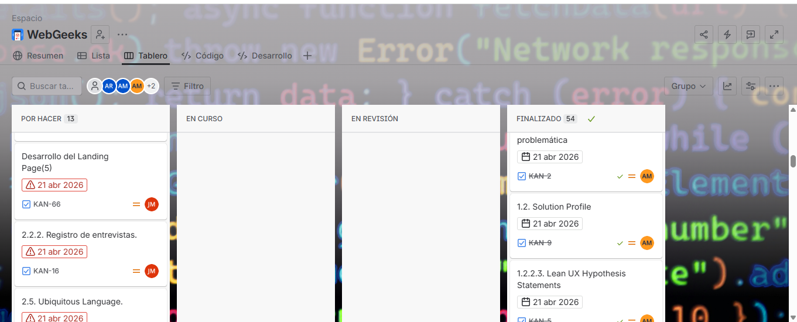

🔗 URL del Board: https://trello.com/tu-board-publico


###  Sprint Backlog

| Sprint | User Story ID | User Story Title | Task ID | Task Title | Description | Estimation (Hours) | Assigned To | Status |
|--------|--------------|------------------|---------|------------|-------------|--------------------|-------------|--------|
| Sprint 1 | US-26 | Visualizar landing page | T-01 | Crear estructura HTML/CSS | Maquetar layout principal | 4 | Andree | To-do |
| Sprint 1 | US-27 | Ver propuesta de valor | T-02 | Sección Hero | Diseñar sección principal con CTA | 3 | Angel | To-do |
| Sprint 1 | US-29 | Visualizar características | T-03 | Sección features | Mostrar funcionalidades del sistema | 3 | Anhelo | To-do |
| Sprint 1 | US-28 | Navegar por secciones | T-04 | Implementar navbar | Navegación entre secciones | 2 | Andree | InProcess |
| Sprint 1 | US-32 | Contactar a la empresa | T-05 | Formulario de contacto | Crear formulario funcional | 3 | Anhelo | To-do |
| Sprint 1 | US-33 | Visualizar testimonios | T-06 | Sección testimonios | Mostrar opiniones de usuarios | 2 | Andre | To-do |
| Sprint 1 | US-35 | Ver CTA | T-07 | Botones CTA | Implementar botones de acción | 2 | Adolfo | To-do |
| Sprint 1 | US-34 | Acceder desde dispositivos móviles | T-08 | Responsive design | Adaptar a mobile | 4 | Angel | To-do |
| Sprint 1 | - | Configuración inicial | T-09 | Configurar proyecto | Inicializar proyecto frontend | 2 | Andree | Done |

###  Estados de las tareas
- **To-do**: Pendiente
- **InProcess**: En desarrollo
- **ToReview**: En revisión
- **Done**: Finalizado

### 5.2.1.4. Development Evidence for Sprint Review

<table>
  <thead>
    <tr>
      <th>Repository</th>
      <th>Branch</th>
      <th>Commit Id</th>
      <th>Commit Message</th>
      <th>Commit Message Body</th>
      <th>Committed on (Date)</th>
    </tr>
  </thead>
  <tbody>
    <tr>
      <td>Guille-berrs/safeflow-website</td>
      <td>feature/pricing</td>
      <td>09d59ce4d376bd3a5a2b1f849d6dbefd056835a5</td>
      <td>feat: create structure for the section pricing.</td>
      <td>Create the structure for pricing because thats my section.</td>
      <td>16/04/2026</td>
    </tr>
    <tr>
      <td>Guille-berrs/safeflow-website</td>
      <td>feature/pricing</td>
      <td>562f581e39a0fdbb288e81705aae3c471c19b7c6</td>
      <td>feat: create style for the section pricing.</td>
      <td>Create the style for the section pricing.</td>
      <td>16/04/2026</td>
    </tr>
    <tr>
      <td>Guille-berrs/safeflow-website</td>
      <td>feature/how-it-work</td>
      <td>cfacfbbfe0dc72bc9bdb6736289556590b8d57e8</td>
      <td>feat: create the structure of section how it works.</td>
      <td>Create the structure for how it works because thats my section.</td>
      <td>16/04/2026</td>
    </tr>
    <tr>
      <td>Guille-berrs/safeflow-website</td>
      <td>feature/how-it-work</td>
      <td>469afbf4d23e12618f10bbd9b2a5db5c0191fe9f</td>
      <td>feat: create the style for the section how it works.</td>
      <td>Create the style for the section how it works.</td>
      <td>16/04/2026</td>
    </tr>
    <tr>
      <td>Guille-berrs/safeflow-website</td>
      <td>feature/characteristics</td>
      <td>7ac3298ec94c28fe6bb6e5175a0522b5186ee200</td>
      <td>feat: create the section of characteristics</td>
      <td>Create the structure for characteristics.</td>
      <td>16/04/2026</td>
    </tr>
    <tr>
      <td>Guille-berrs/safeflow-website</td>
      <td>feature/characteristics</td>
      <td>8f5e5f46b782b75638c74e2afd779cf164670f84</td>
      <td>feat: create styles for the section characteristic.</td>
      <td>Create the style for the section characteristics.</td>
      <td>16/04/2026</td>
    </tr>
  </tbody>
</table>

#### 5.2.1.5. Execution Evidence for Sprint Review


## 1. Resumen de Logros del Sprint
En este Sprint, el equipo se ha enfocado en el diseño, maquetación y despliegue de la interfaz principal de **SafeFlow**. Se ha logrado consolidar la identidad visual de la marca y la arquitectura de información necesaria para comunicar una solución técnica compleja de manera sencilla y efectiva.

**Hitos alcanzados:**
* **Desarrollo de Interfaz:** Implementación completa de la Landing Page utilizando estándares modernos de diseño UI/UX.
* **Optimización de Activos:** Organización y renombrado semántico de recursos visuales para mejorar la mantenibilidad del proyecto.
* **Propuesta de Valor:** Estructuración de las secciones de monetización (Planes) y validación social (Testimonios).
* **Navegación:** Configuración de una experiencia de usuario fluida y orientada a la conversión (CTAs).

## 2. Screenshots de las Principales Vistas
A continuación, se presentan las capturas de pantalla que sirven como evidencia de la implementación funcional del sitio:

### A. Portada y Propuesta de Valor
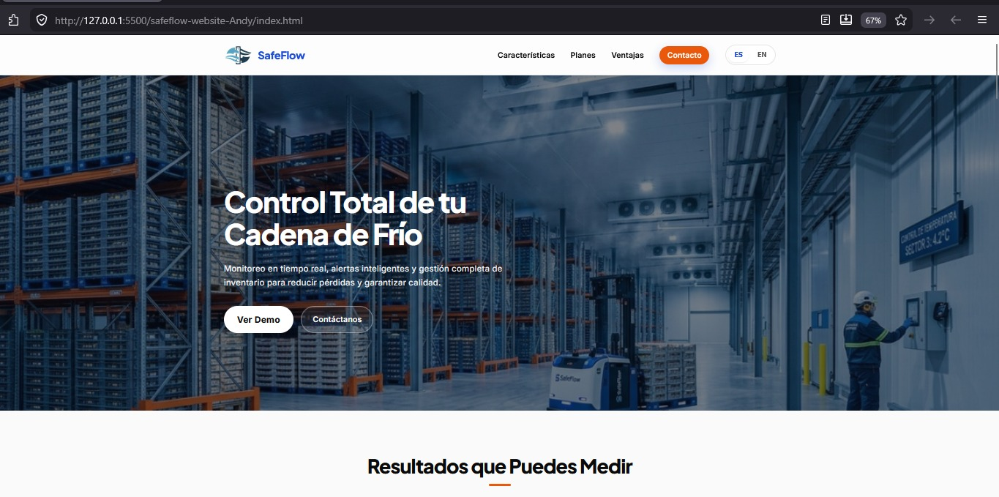
*Sección principal que comunica el "Control Total de tu Cadena de Frío" y facilita el acceso inmediato a la demo.*

### B. Funcionalidades y Operatividad

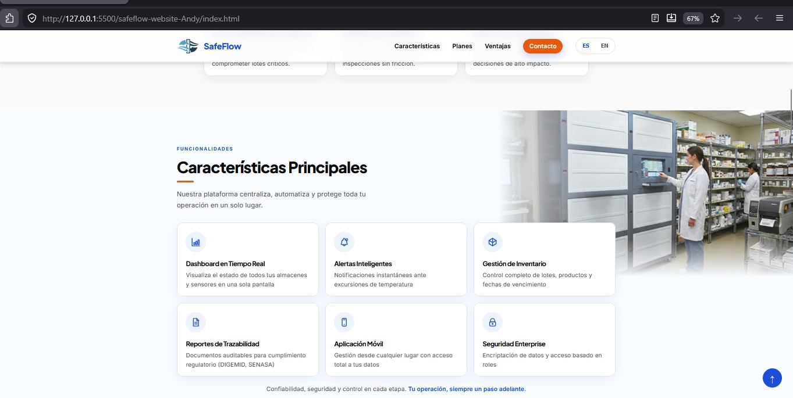
*Detalle de las herramientas técnicas como Dashboard y Alertas.*


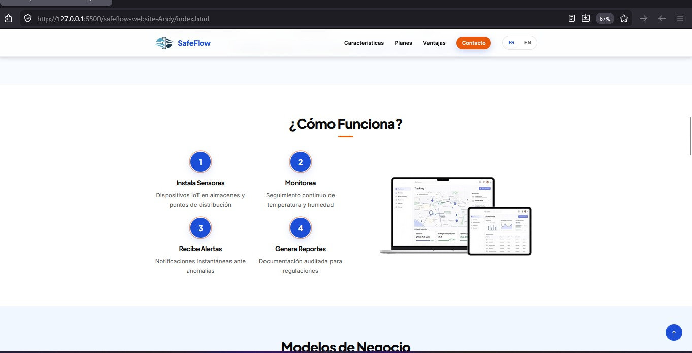
 *Flujo paso a paso del proceso de monitoreo con sensores IoT.* 


### C. Estrategia de Negocio y Sectores
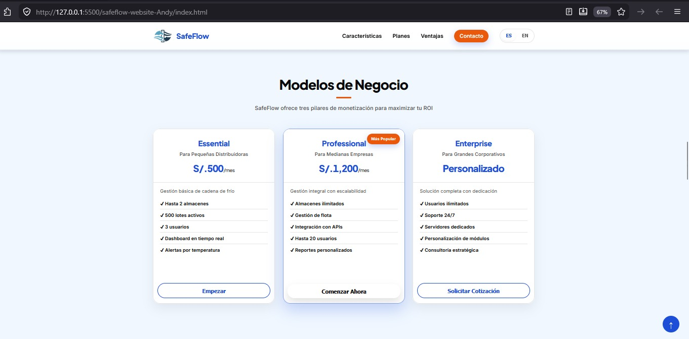
*Modelos de suscripción (Essential, Professional, Enterprise) diseñados para diferentes escalas de operación.*

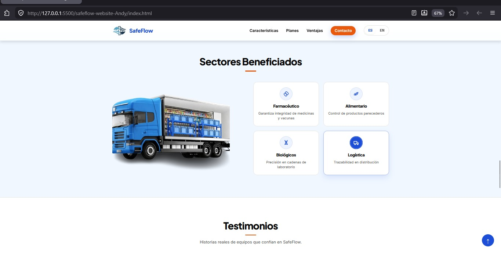
*Identificación de las industrias clave donde SafeFlow garantiza el cumplimiento normativo.*

### D. Confianza y Equipo
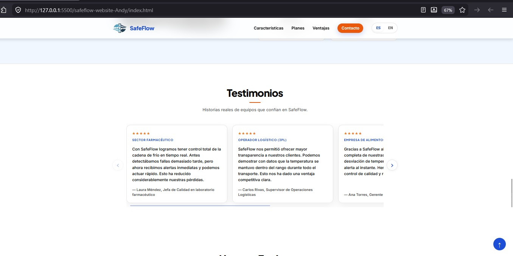
*Validación de terceros mediante testimonios de sectores farmacéuticos y logísticos.*

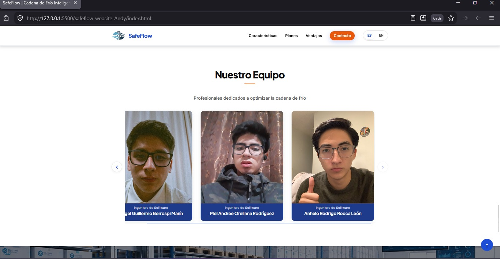
*Presentación del equipo de ingeniería responsable del desarrollo del software.*


### E. Cierre y Call to Action (CTA)
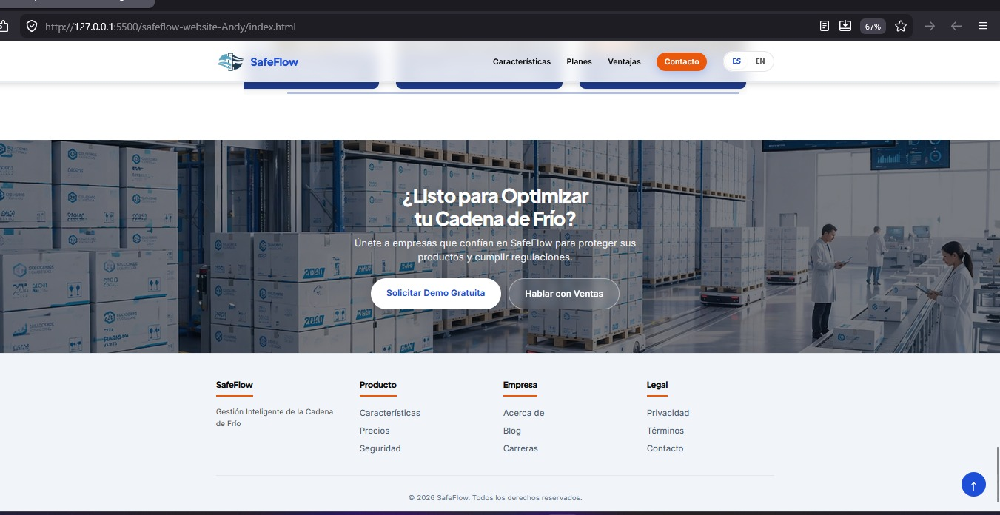
*Banner final de conversión diseñado para capturar leads mediante el botón "Solicitar Demo Gratuita", junto con la navegación secundaria y enlaces legales del proyecto.*


## 3. Video de Demostración y Navegación
Para observar la fluidez de la navegación, la respuesta de los elementos interactivos y la explicación detallada de cada sección, se ha preparado el siguiente material audiovisual:

 **[Ver Video de Demostración - SafeFlow Sprint Review](TU_ENLACE_AQUÍ)**


#### 5.2.1.6. Services Documentation Evidence for Sprint Review

En esta sección se presenta la documentación relacionada con los servicios que serán ofrecidos a través de la plataforma web de SafeFlow, los cuales estarán orientados al monitoreo, control y análisis de la cadena de frío en tiempo real. Estos servicios incluirán funcionalidades como el registro de datos de sensores, visualización de temperaturas, generación de alertas ante desviaciones térmicas y recomendaciones para la toma de decisiones logísticas.

Durante el presente Sprint 1, el enfoque del equipo estuvo centrado exclusivamente en el diseño y desarrollo de la Landing Page del producto, con el objetivo de definir la propuesta de valor, los segmentos de usuarios y la experiencia inicial del sistema. Debido a este alcance, no se implementaron ni desplegaron servicios web funcionales, por lo que no se cuenta aún con endpoints operativos ni documentación técnica asociada a su consumo mediante OpenAPI.


#### 5.2.1.7. Software Deployment Evidence for Sprint Review

En esta sección se describe el proceso de implementación de la plataforma en un entorno de producción. Además, se presentarán los hitos más importantes que marcarán el despliegue del proyecto y garantizarán su disponibilidad para los usuarios finales.

URL de despliegue del Landing Page: [Landing Page Desplegado](https://upc-pre-202610-1asi0730-20177-cryologic.github.io/safeflow-website/) 

1. Para la Landing Page, nuestro equipo creó una rama denominada “develop” dentro del repositorio, en la cual se organizaron y almacenaron todos los archivos correspondientes al desarrollo de la Landing Page.
 <div algin="center">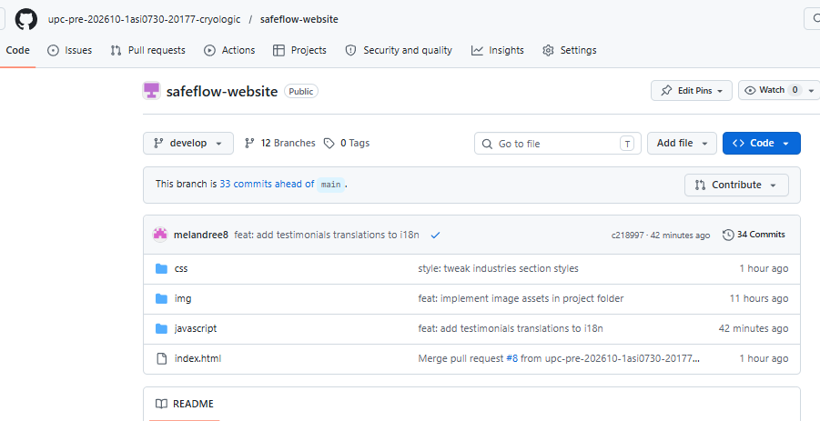  </div>        
 
2. Posteriormente, nos dirigimos a configuración y empleamos GitHub Pages, el servicio de alojamiento para sitios estáticos de GitHub, para publicar y poner en línea nuestra Landing Page.
 <div algin="center">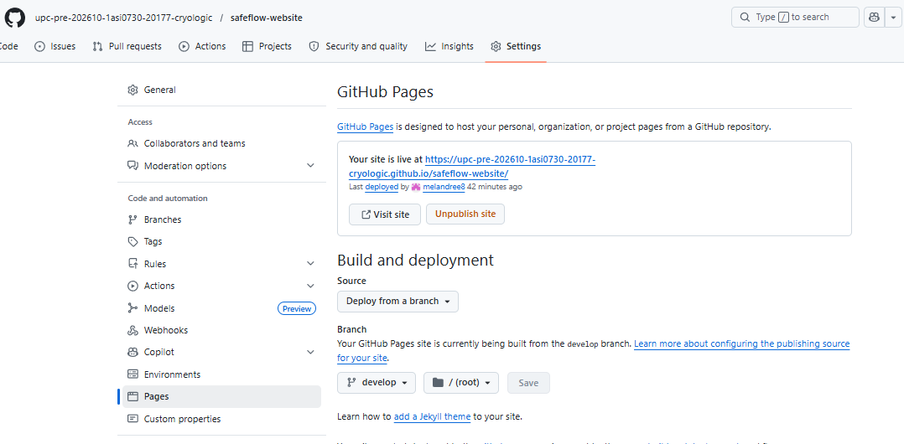  </div>        

3. Se seleccionó la rama previamente configurada y se procedió con el despliegue de la página.
    <div algin="center">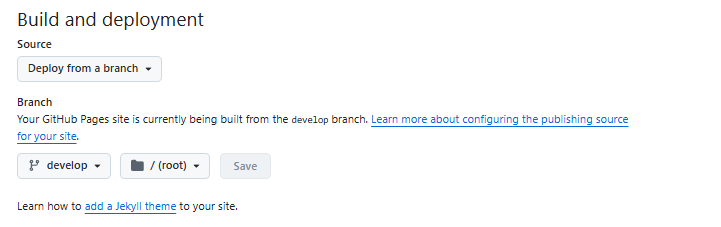  </div>        

5. Finalmente, obtuvimos el enlace de publicación, que nos permite acceder y visualizar la Landing Page en línea.
    <div algin="center">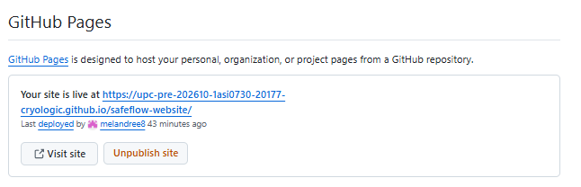  </div>        


#### 5.2.1.8. Team Collaboration Insights during Sprint

 <div algin="center">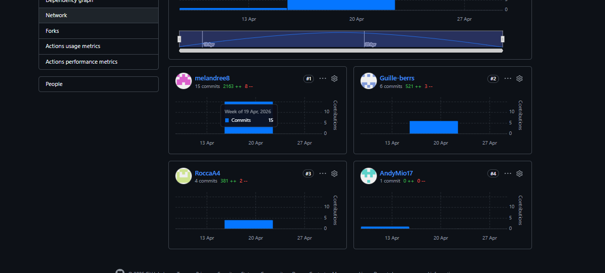  </div>        

 <div algin="center">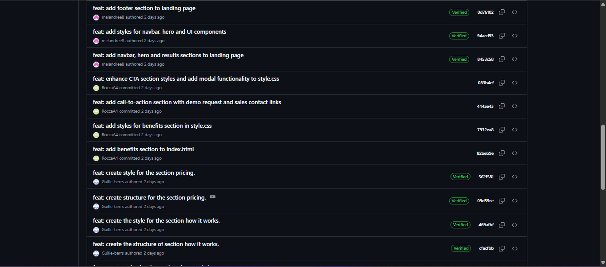  </div>        


### 5.2.2 Sprint 2


#### 5.2.2.1 Sprint Planning 2

<table><tr> <th colspan="5">Sprint #</th> <th colspan="9">Sprint 2</th> </tr> <tr> <td colspan="13">Sprint Planning Background</td> </tr> <tr> <td colspan="5">Date</td> <td colspan="8">13-05-2026</td> </tr> <tr> <td colspan="5">Time</td> <td colspan="8">4:00 PM</td> </tr> <tr> <td colspan="5">Location</td> <td colspan="8">Reunion por Meet</td> </tr> <tr> <td colspan="5">Prepared By</td> <td colspan="8">Mel Andre Orellana</td> </tr> <tr> <td colspan="5">Attendees (to planning meeting)</td> <td colspan="8">Anhelo Rodrigo	Rocca
, Andy Alejandro Mio, Mel Andre Orellana, Angel Berrospi Marin, Jefferson Bayron</td> </tr> <tr> <td colspan="5">Sprint 1 Review Summary</td> <td colspan="8">Se completó con éxito el despliegue de la Landing Page de SafeFlow, logrando que sea accesible online con todas sus secciones principales (home, features, benefits y testimonials) funcionales.</td> </tr> <tr> <td colspan="5">Sprint 1 Retrospective Summary</td> <td colspan="8">El equipo mantuvo una buena velocidad de desarrollo; para este sprint se acordó estandarizar los componentes de UI para las tablas de datos y formularios técnicos para asegurar la consistencia visual.</td> </tr> <tr> <td colspan="13">Sprint Goal & User Stories</td> </tr> <tr> <td colspan="5">Sprint 2 Goal</td> <td colspan="8"> <strong>"Our focus is on developing the core functional frontend of the SafeFlow platform, specifically the Inventory, Logistics, Monitoring, and Alerts modules for medical warehouse management. We aim to deliver a fully operational dashboard that allows users to manage medical stock, track shipments in real-time, and visualize critical thermal data for cold chain integrity. This will be validated when the dashboard is accessible via localhost, featuring interactive data tables for warehouse inventory, functional forms for logistics registration, and dynamic monitoring cards with real-time temperature status."</strong> </td> </tr> <tr> <td colspan="5">Sprint 2 Velocity</td> <td colspan="8">25</td> 25 hours</tr> <tr> <td colspan="5">Sum of Story Points</td> <td colspan="8"> 25 story points</td> </tr> </table>


#### 5.2.2.2 Aspect Leaders and Collaborators

<div align="center">
  <table style="width:100%; border-collapse: collapse; font-family: Arial, sans-serif; font-size: 13px; text-align: center;">
    <thead>
      <tr style="background-color: #f2f2f2;">
        <th style="border: 1px solid #dddddd; padding: 10px;">Team Member (Last Name, First Name)</th>
        <th style="border: 1px solid #dddddd; padding: 10px;">GitHub Username</th>
        <th style="border: 1px solid #dddddd; padding: 10px;">Module Inventory  (L/C)</th>
        <th style="border: 1px solid #dddddd; padding: 10px;">Module Logistics</th>
        <th style="border: 1px solid #dddddd; padding: 10px;">Module Monitoring(L/C)</th>
        <th style="border: 1px solid #dddddd; padding: 10px;">Module Alerts</th>
        <th style="border: 1px solid #dddddd; padding: 10px;">Module Reporting</th>
        <th style="border: 1px solid #dddddd; padding: 10px;">Module Analytics</th>
      </tr>
    </thead>
    <tbody>
      <tr>
        <td style="border: 1px solid #dddddd; padding: 8px;">Orellana Rodriguez, Mel Andree</td>
        <td style="border: 1px solid #dddddd; padding: 8px;">melandree8</td>
        <td style="border: 1px solid #dddddd; padding: 8px; font-weight: bold;">C</td>
        <td style="border: 1px solid #dddddd; padding: 8px;">C</td>
        <td style="border: 1px solid #dddddd; padding: 8px; font-weight: bold;">L</td>
        <td style="border: 1px solid #dddddd; padding: 8px;">C</td>
       <td style="border: 1px solid #dddddd; padding: 8px;">C</td>
       <td style="border: 1px solid #dddddd; padding: 8px;">L</td>
      </tr>
      <tr>
        <td style="border: 1px solid #dddddd; padding: 8px;">Bayron	Morales, Jefferson</td>
        <td style="border: 1px solid #dddddd; padding: 8px;">Fenfito</td>
        <td style="border: 1px solid #dddddd; padding: 8px;">C</td>
        <td style="border: 1px solid #dddddd; padding: 8px;">C</td>
        <td style="border: 1px solid #dddddd; padding: 8px;">C</td>
        <td style="border: 1px solid #dddddd; padding: 8px; font-weight: bold;">L</td>
        <td style="border: 1px solid #dddddd; padding: 8px;">C</td>     
        <td style="border: 1px solid #dddddd; padding: 8px;">C</td>
      </tr>
      <tr>
        <td style="border: 1px solid #dddddd; padding: 8px;">Berrospi Marin, Angel Guillermo</td>
        <td style="border: 1px solid #dddddd; padding: 8px;">Guille-berrs</td>
        <td style="border: 1px solid #dddddd; padding: 8px;">C</td>
        <td style="border: 1px solid #dddddd; padding: 8px; font-weight: bold;">C</td>
        <td style="border: 1px solid #dddddd; padding: 8px;">C</td>
        <td style="border: 1px solid #dddddd; padding: 8px;">C</td>
        <td style="border: 1px solid #dddddd; padding: 8px;">L</td>
        <td style="border: 1px solid #dddddd; padding: 8px;">C</td>
      </tr>
      <tr>
        <td style="border: 1px solid #dddddd; padding: 8px;">Alejandro	Mio, Andy</td>
        <td style="border: 1px solid #dddddd; padding: 8px;">AndyMio17</td>
        <td style="border: 1px solid #dddddd; padding: 8px;">L</td>
        <td style="border: 1px solid #dddddd; padding: 8px;">C</td>
        <td style="border: 1px solid #dddddd; padding: 8px; font-weight: bold;">C</td>
        <td style="border: 1px solid #dddddd; padding: 8px;">C</td>
        <td style="border: 1px solid #dddddd; padding: 8px;">C</td>
        <td style="border: 1px solid #dddddd; padding: 8px;">C</td>
      </tr>
        <tr>
        <td style="border: 1px solid #dddddd; padding: 8px;">Rodrigo Rocca, Anhelo</td>
        <td style="border: 1px solid #dddddd; padding: 8px;">RoccaA4</td>
        <td style="border: 1px solid #dddddd; padding: 8px;">C</td>
        <td style="border: 1px solid #dddddd; padding: 8px;">L</td>
        <td style="border: 1px solid #dddddd; padding: 8px; font-weight: bold;">C</td>
        <td style="border: 1px solid #dddddd; padding: 8px;">C</td>
        <td style="border: 1px solid #dddddd; padding: 8px;">C</td>
        <td style="border: 1px solid #dddddd; padding: 8px;">C</td>
      </tr>
    </tbody>
  </table>
</div>


#### 5.2.2.3 Sprint Backlog 2


| Sprint | User Story ID | User Story Title | Task ID | Task Title | Description | Estimation (Hours) | Assigned To | Status |
|--------|--------------|------------------|---------|------------|-------------|--------------------|-------------|--------|
| Sprint 2 | US-01 | Registrar producto | T-10 | Crear formulario de productos | Diseñar formulario para registrar productos y rangos de temperatura | 4 | Andree | To-do  |
| Sprint 2 | US-02 | Registrar ingreso de stock | T-11 | Módulo de stock | Implementar registro de ingreso de productos al inventario | 3 | Angel | To-do |
| Sprint 2 | US-10 | Consultar inventario | T-12 | Tabla de inventario | Mostrar productos registrados con filtros y estados | 4 | Anhelo | To-do |
| Sprint 2 | US-14 | Editar producto | T-13 | Editar información | Implementar actualización de datos del producto | 3 | Jefferson | To-do |
| Sprint 2 | US-15 | Eliminar producto | T-14 | Eliminar productos | Agregar opción para eliminar productos del sistema | 2 | Andy | To-do |
| Sprint 2 | US-19 | Registrar lote de producto | T-15 | Gestión de lotes | Implementar registro y validación de lotes | 3 | Andree | To-do  |
| Sprint 2 | US-16 | Registrar ubicación del producto | T-16 | Gestión de ubicaciones | Permitir asignar ubicación física a productos | 3 | Angel | To-do |
| Sprint 2 | US-20 | Consultar productos en riesgo | T-17 | Vista de productos críticos | Mostrar productos con estado “En Riesgo” | 3 | Anhelo | To-do |
| Sprint 2 | US-13 | Visualizar dashboard | T-18 | Dashboard principal | Crear panel con métricas y resumen del sistema | 5 | Jefferson | To-do  |

#### 5.2.2.4 Development Evidence for Sprint Review

<table>
  <thead>
    <tr>
      <th>Repository</th>
      <th>Branch</th>
      <th>Commit Id</th>
      <th>Commit Message</th>
      <th>Commit Message Body</th>
      <th>Committed on (Date)</th>
    </tr>
  </thead>
  <tbody>
    <tr>
      <td>Guille-berrs/safeflow-website</td>
      <td>feature/pricing</td>
      <td>09d59ce4d376bd3a5a2b1f849d6dbefd056835a5</td>
      <td>feat: create structure for the section pricing.</td>
      <td>Create the structure for pricing because thats my section.</td>
      <td>16/04/2026</td>
    </tr>
    <tr>
      <td>Guille-berrs/safeflow-website</td>
      <td>feature/pricing</td>
      <td>562f581e39a0fdbb288e81705aae3c471c19b7c6</td>
      <td>feat: create style for the section pricing.</td>
      <td>Create the style for the section pricing.</td>
      <td>16/04/2026</td>
    </tr>
    <tr>
      <td>Guille-berrs/safeflow-website</td>
      <td>feature/how-it-work</td>
      <td>cfacfbbfe0dc72bc9bdb6736289556590b8d57e8</td>
      <td>feat: create the structure of section how it works.</td>
      <td>Create the structure for how it works because thats my section.</td>
      <td>16/04/2026</td>
    </tr>
    <tr>
      <td>Guille-berrs/safeflow-website</td>
      <td>feature/how-it-work</td>
      <td>469afbf4d23e12618f10bbd9b2a5db5c0191fe9f</td>
      <td>feat: create the style for the section how it works.</td>
      <td>Create the style for the section how it works.</td>
      <td>16/04/2026</td>
    </tr>
    <tr>
      <td>Guille-berrs/safeflow-website</td>
      <td>feature/characteristics</td>
      <td>7ac3298ec94c28fe6bb6e5175a0522b5186ee200</td>
      <td>feat: create the section of characteristics</td>
      <td>Create the structure for characteristics.</td>
      <td>16/04/2026</td>
    </tr>
    <tr>
      <td>Guille-berrs/safeflow-website</td>
      <td>feature/characteristics</td>
      <td>8f5e5f46b782b75638c74e2afd779cf164670f84</td>
      <td>feat: create styles for the section characteristic.</td>
      <td>Create the style for the section characteristics.</td>
      <td>16/04/2026</td>
    </tr>
    <tr>
      <td>Guille-berrs/safeflow-webapp</td>
      <td>feature/reporting</td>
      <td>4c5a585023f1635721fa6cb26436320dd94a9c5e</td>
      <td>feat: create the bounded context reporting and use domain driven design.</td>
      <td>Create the section reporting.</td>
      <td>15/05/2026</td>
    </tr>
    <tr>
      <td>AndyMio17/safeflow-webapp</td>
      <td>feature/inventory</td>
      <td>4f76bcd3051dfc08fb0bdbe029fb148a86c9acc2</td>
      <td>feat: add bounded context inventory</td>
      <td>Create the section inventory.</td>
      <td>15/05/2026</td>
    </tr>
    <tr>
      <td>Fenfito/safeflow-webapp</td>
      <td>feature/alerts</td>
      <td>65f7053fefcf817375fb7a097bb50b5c2cf38a5c</td>
      <td>feat(alerts): implement alerts bounded context</td>
      <td>Create the section alerts.</td>
      <td>15/05/2026</td>
    </tr>
<tr>
      <td>melandree8/safeflow-webapp</td>
      <td>feature/iam</td>
      <td>4cfe49b81bd3fd5c6cc671bd13bedb6588740215</td>
      <td>feat(iam): implement authentication module</td>
      <td>Create login and register flow with demo session support.</td>
      <td>15/05/2026</td>
    </tr>
    <tr>
      <td>melandree8/safeflow-webapp</td>
      <td>feature/iam</td>
      <td>4b5ce1347ce6945add2d9ac2b287b53271de4019</td>
      <td>feat(iam): restore login and register screens with demo session</td>
      <td>Re-enable authentication UI and demo access entry point.</td>
      <td>15/05/2026</td>
    </tr>
    <tr>
      <td>melandree8/safeflow-webapp</td>
      <td>feature/inventory</td>
      <td>b6e2367e5b61ac67ce481270e3c0f6538be7274c</td>
      <td>feat: add bounded context inventory</td>
      <td>Implement inventory module following domain-driven design.</td>
      <td>15/05/2026</td>
    </tr>
    <tr>
      <td>melandree8/safeflow-webapp</td>
      <td>feature/analytics</td>
      <td>5ad58d128955f4081b35340d4c621d933f5a73e1</td>
      <td>feat: implement analytics module</td>
      <td>Add analytics dashboard and tracking functionality.</td>
      <td>15/05/2026</td>
    </tr>
    <tr>
      <td>melandree8/safeflow-webapp</td>
      <td>feature/logistics</td>
      <td>a74b909b3a6b35c63a7bb50dcfa768def2ad8c26</td>
      <td>feat: implement logistics store for shipments tracking</td>
      <td>Create store for managing shipments and delivery tracking.</td>
      <td>15/05/2026</td>
    </tr>
    <tr>
      <td>melandree8/safeflow-webapp</td>
      <td>feature/reporting</td>
      <td>05f02b35cb34a4ac13179c7bb62ce86703fa68b1</td>
      <td>feat: create reporting bounded context using DDD</td>
      <td>Implement reporting module following domain-driven architecture.</td>
      <td>15/05/2026</td>
    </tr>
    <tr>
      <td>melandree8/safeflow-webapp</td>
      <td>feature/deploy</td>
      <td>td05f02b35cb34a4ac13179c7bb62ce86703fa68b1</td>
      <td>fix(deploy): point production build at MockAPI for Netlify</td>
      <td>Update deployment configuration for production environment.</td>
      <td>15/05/2026</td>
    </tr>
    <tr>
      <td>RoccaA4/safeflow-webapp</td>
      <td>feature/logistics</td>
      <td>c1696956f969478041aa6df4dcd94a34bb6768d1</td>
      <td>feat: add logistics shipment entity for tracking and management</td>
      <td>-.</td>
      <td>15/05/2026</td>
    </tr>
<tr>
      <td>RoccaA4/safeflow-webapp</td>
      <td>feature/logistics</td>
      <td>87058c296c6f73e18e108b9130dfe5cb9b5070fd</td>
      <td>feat: add logistics aggregation and shipment assembler for tracking inside infrastructure directory</td>
      <td>-.</td>
      <td>15/05/2026</td>
    </tr>
<tr>
      <td>RoccaA4/safeflow-webapp</td>
      <td>feature/logistics</td>
      <td>201150d6cd0d00ce89519d201c854c3dfdbaf931</td>
      <td>feat: implement logistics API for managing shipments, destinos, and choferes inside infrastructure directory</td>
      <td>-.</td>
      <td>15/05/2026</td>
    </tr>
<tr>
      <td>RoccaA4/safeflow-webapp</td>
      <td>feature/logistics</td>
      <td>01c060ddd043265fb0af898bb91d0bceddf8e279</td>
      <td>feat: add logistics management components for tracking shipments and destinations inside presentation/view and presentation/components directories</td>
      <td>-.</td>
      <td>15/05/2026</td>
    </tr>
<tr>
      <td>RoccaA4/safeflow-webapp</td>
      <td>feature/logistics</td>
      <td>fbfc4cc484a269d6129c00218a4f99971df90ad8</td>
      <td>feat: add logistics routes and localization for shipment management inside presentation directory but outside views and components directories</td>
      <td>-.</td>
      <td>15/05/2026</td>
    </tr>
<tr>
      <td>RoccaA4/safeflow-webapp</td>
      <td>feature/logistics</td>
      <td>ae3109e9d6fb36def7236d9309e42f406e6f892d</td>
      <td>feat: implement logistics store for managing shipments and tracking inside application directory</td>
      <td>-.</td>
      <td>15/05/2026</td>
    </tr>
      <tr>
      <td>Fenfito/safeflow-webapp</td>
      <td>feature/alerts</td>
      <td>65f7053fefcf817375fb7a097bb50b5c2cf38a5c</td>
      <td>feat(alerts): implement alerts bounded context</td>
      <td>-.</td>
      <td>15/05/2026</td>
    </tr>
  </tbody>
</table>

#### 5.2.2.5 Execution Evidence for Sprint Review

### Sign In
<div algin="center">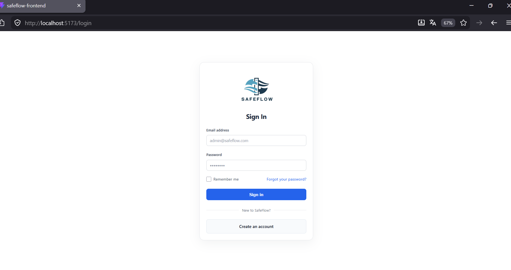  </div>

1. Evidencia de la pantalla sign-up, donde el usuario entra a la web con sus credenciales previamente creadas.

### Register
<div algin="center">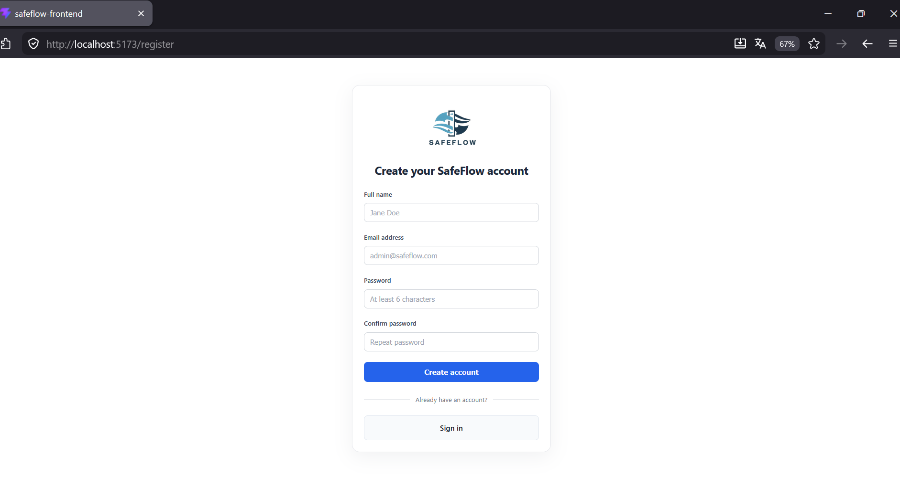  </div>

2. Evidencia de la pantalla register, donde el usuario debe crearse una cuenta para poder ingresar a la web.

### Analytics
<div algin="center">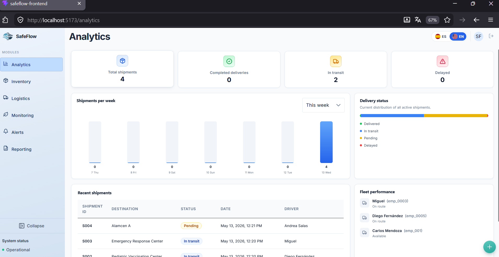  </div>

3. Evidencia de la pantalla analytics, donde el usuario podra visualizar el análisis mediante gráficos y/o resumen de la creación de los conductores, operadores, rutas de los conductores, medicamentos. 

### Monitoring
<div algin="center">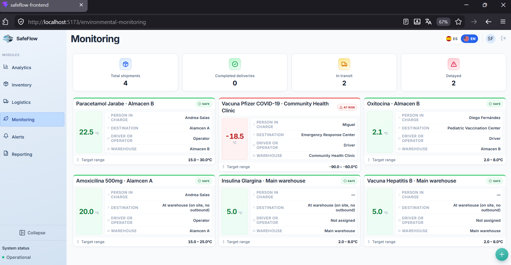  </div>

4. Evidencia de la pantalla monitoring, donde el usuario puede monitorear el estado de las vacunas, información de los conductores y las rutas.

### Logistics
<div algin="center">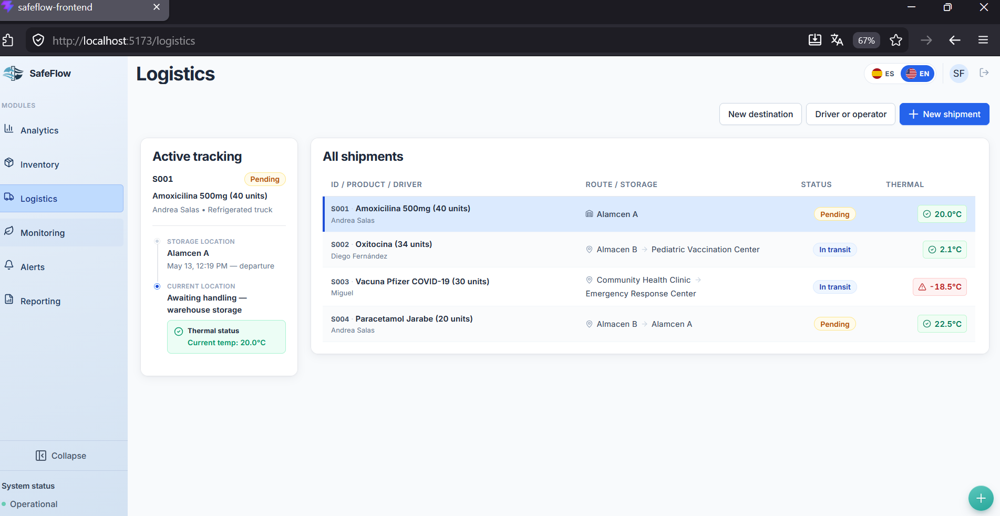  </div>

5. Evidencia de la pantalla logistics donde se ve de forma detallada el estado de los productos sobre la ruta y temperatura.

### Alerts
<div algin="center">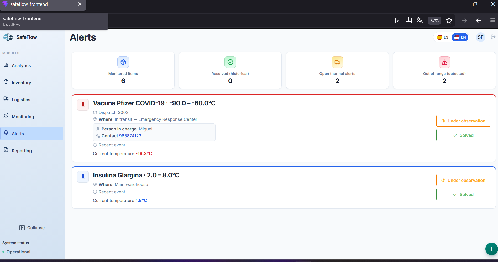  </div>        

6. Evidencia de la pantalla alerts, donde nos envian alertas sobre las vacunas que superaron su limite y necesitan atención inmediata.

### Profile
<div algin="center">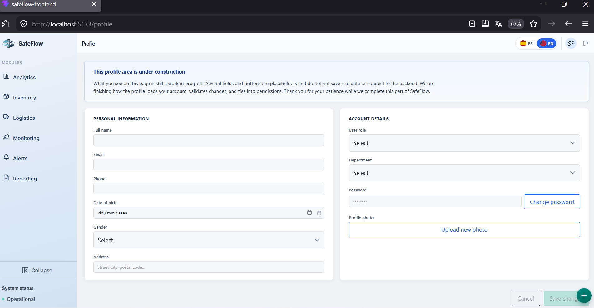  </div>        

7. Evidencia de la pantalla, donde registra al personal encargado de áreas específicas según su cargo.

### Inventory
<div algin="center">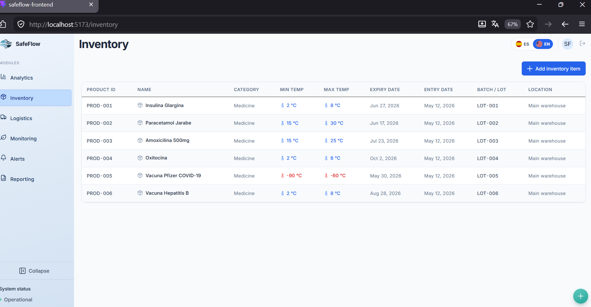  </div>        

8. Evidencia de la pantalla, donde se crea los productos que necesitan detalles específicos de su mantenimiento para que no se malogren en ruta.

### Reporting
<div algin="center">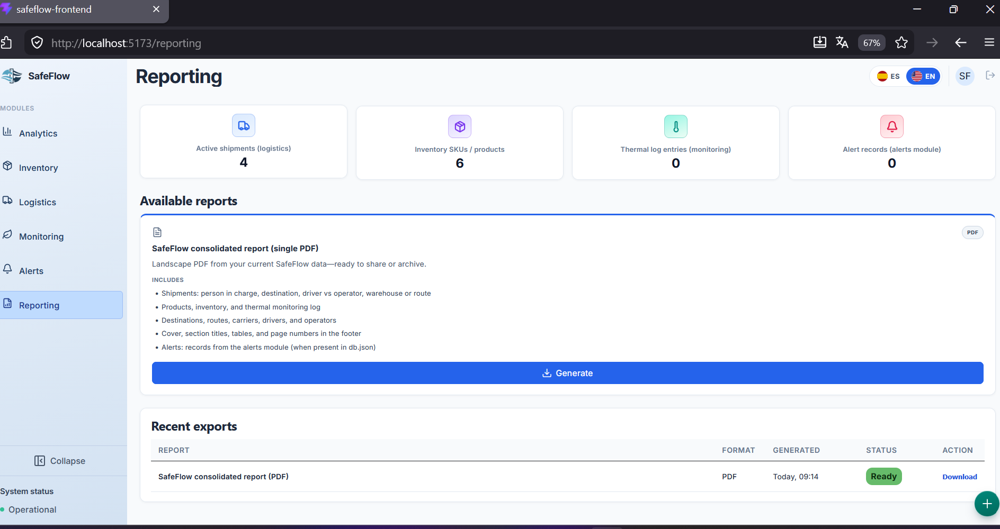  </div> 
9. Evidencia de la pantalla, donde se crean los reportes

#### 5.2.2.6 Services Documentation Evidence for Sprint Review

Durante el presente Sprint, se desarrollaron y documentaron diversos endpoints que forman parte de los servicios backend de la aplicación. Estos endpoints permiten la interacción entre el cliente y el servidor, facilitando operaciones clave como la consulta de datos, la gestión de dispositivos, la visualización de niveles de radiación y la administración de usuarios.
</br> 
</br> 
</br>

1.Panel principal del proyecto SafeFlow desplegado en Netlify. Se visualiza el estado general del sitio y las opciones de configuración y análisis. 
<div algin="center">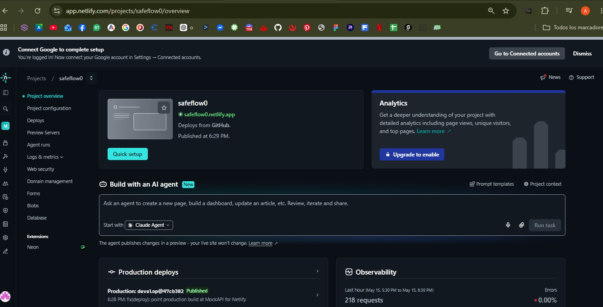  
</div> </br> </br> 
2.Registro del proceso de despliegue exitoso en Netlify. Todas las etapas de inicialización, compilación y publicación fueron completadas correctamente.
<div algin="center">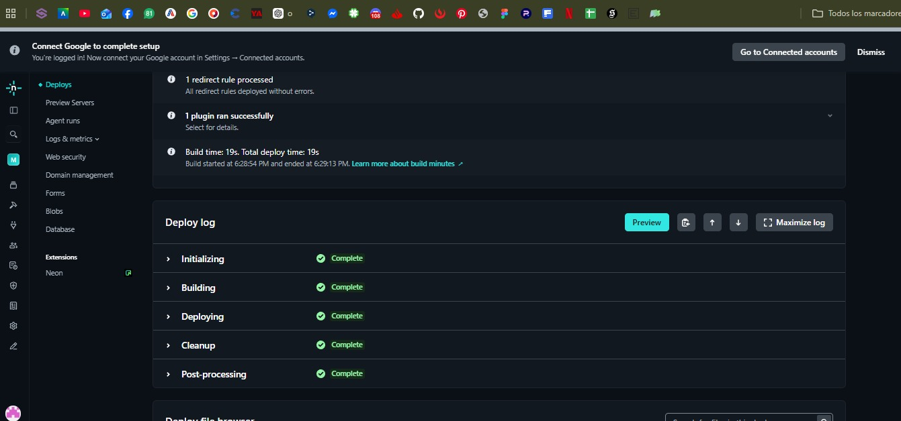  
</div> </br> </br> 
3.Pantalla de inicio de sesión de la plataforma SafeFlow. Permite a los usuarios autenticarse o crear una nueva cuenta para acceder al sistema. 
<div algin="center">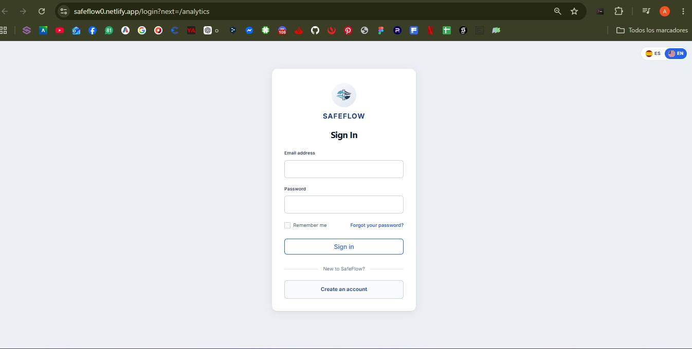  
</div> </br> </br>
4.Configuración de los endpoints del API en MockAPI para el proyecto SafeFlow. Se muestran los recursos creados para inventario, logística y monitoreo del sistema.
<div algin="center">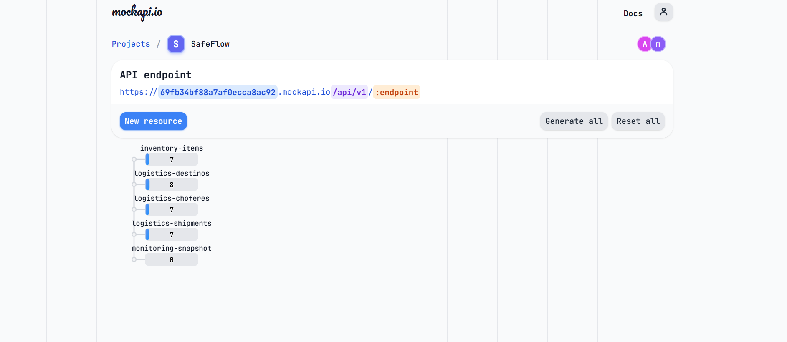  </div>


#### 5.2.2.7 Software Deployment Evidence for Sprint Review


Durante el Sprint 2, el equipo se enfocó en el despliegue de la aplicación web frontend de SafeFlow, correspondiente al TP1 (Stage Review). El objetivo principal fue lograr la publicación de la primera versión funcional del sistema frontend, permitiendo validar el acceso y funcionamiento inicial de la plataforma. Para ello, se realizaron actividades relacionadas con la configuración de servicios de hosting, integración continua y despliegue automático.

En este Sprint se trabajó principalmente con Netlify como plataforma de despliegue, además de MockAPI para la simulación de servicios backend durante el desarrollo. Se configuró la integración con GitHub para automatizar los despliegues cada vez que se realizaban cambios en el repositorio del proyecto. Asimismo, se verificó el correcto funcionamiento de la aplicación desplegada mediante pruebas de acceso y visualización del sistema en línea.

## Actividades de Deployment Realizadas

### 1. Creación y Configuración de Servicios Cloud

Durante el Sprint 2 se crearon y configuraron los siguientes servicios:

#### Netlify
Se utilizó para el despliegue de la aplicación frontend de SafeFlow.

- Configuración del proyecto conectado al repositorio de GitHub.
- Despliegue automático mediante integración continua (CI/CD).
- Generación de URL pública para acceso al sistema.
- Verificación del estado de compilación y despliegue exitoso.

#### MockAPI
Se configuró como servicio mock para simular los endpoints backend durante el desarrollo frontend.

- Creación de endpoints para inventario y logística.
- Configuración de recursos y generación de datos simulados.
- Uso de APIs REST para pruebas de integración frontend.

### 2. Configuración del Repositorio Frontend

Se configuró el repositorio del frontend en GitHub para el proyecto SafeFlow.

- Integración del repositorio con Netlify.
- Configuración de despliegues automáticos al realizar push.
- Organización del proyecto frontend para compilación y publicación.
- Verificación del flujo de despliegue continuo.

### 3. Configuración de la Plataforma de Hosting

#### Netlify - Configuración Principal

- **Proyecto:** SafeFlow
- **Framework utilizado:** Frontend Web Application
- **Integración con GitHub:** Habilitada
- **Despliegue automático:** Configurado
- **Build y publicación:** Completados correctamente

### 4. Evidencias del Deployment

Durante el Sprint se verificó:

- La creación y configuración correcta de los endpoints en MockAPI.
- El despliegue exitoso del proyecto en Netlify.
- La correcta compilación y publicación de la aplicación.
- El acceso funcional a la pantalla inicial de autenticación de SafeFlow.


### Enfoque del Sprint 2

El despliegue realizado corresponde únicamente a la aplicación frontend y a los servicios mock utilizados para pruebas. Los servicios backend reales serán implementados y desplegados en los siguientes sprints del proyecto.


#### 5.2.2.8 Team Collaboration Insights during Sprint


En esta sección se describe cómo el equipo ha desarrollado las actividades de implementación durante el Sprint 2, evidenciando la colaboración en el desarrollo del proyecto.

Durante este sprint, el equipo de **SafeFlow WebApp** trabajó de manera colaborativa utilizando diversas herramientas de desarrollo y control de versiones, como GitHub, para asegurar la entrega exitosa del producto.

La colaboración se caracterizó por una comunicación constante entre los integrantes, una distribución efectiva de tareas y un seguimiento continuo del progreso mediante herramientas de gestión del proyecto. Cada miembro del equipo participó activamente en la implementación de los distintos componentes del sistema, incluyendo el desarrollo del **frontend de la aplicación web**, mejoras en el **Landing Page**, y la preparación de la arquitectura para la futura integración de **Web Services** en el siguiente sprint.

Además, se realizaron revisiones constantes de commits en GitHub y análisis de la participación del equipo, lo que permitió garantizar que todos los integrantes contribuyeran en la implementación de los productos definidos para el sprint: **Landing Page, Web Application y preparación de Web Services**.


<div algin="center">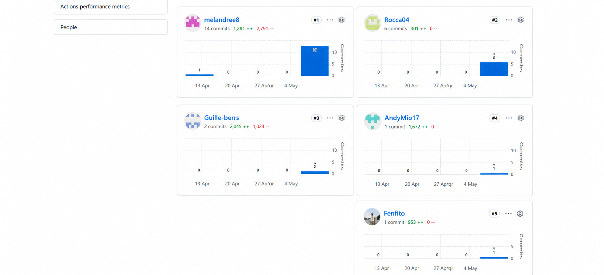  </div>


<div algin="center">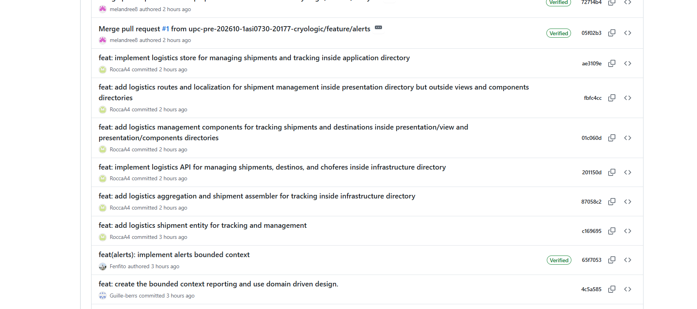  </div>


### 5.2.3. Sprint 3
#### 5.2.3.1. Sprint Planning 3

<table>
  <tr>
    <th colspan="5">Sprint #</th>
    <th colspan="8">Sprint 3</th>
  </tr>
  <tr>
    <td colspan="13"><b>Sprint Planning Background</b></td>
  </tr>
  <tr>
    <td colspan="5">Date</td>
    <td colspan="8">06-06-2026</td>
  </tr>
  <tr>
    <td colspan="5">Time</td>
    <td colspan="8">6:00 PM</td>
  </tr>
  <tr>
    <td colspan="5">Location</td>
    <td colspan="8">Reunion por Meet</td>
  </tr>
  <tr>
    <td colspan="5">Prepared By</td>
    <td colspan="8">Mel Andree Orellana Rodriguez</td>
  </tr>
  <tr>
    <td colspan="5">Attendees (to planning meeting)</td>
    <td colspan="8">Andy Alejandro Mio Mejia, Mel Andree Orellana Rodriguez, Angel Guillermo Berrospi Marin, Anhelo Rodrigo Rocca Leon, Jefferson Bayron Morales Yapuchura</td>
  </tr>
  <tr>
    <td colspan="5">Sprint 2 Review Summary</td>
    <td colspan="8">Se completó con éxito el diseño y despliegue de la Landing Page responsiva conectada a la estructura base de SafeFlow Web App. Se validó el diseño visual, la propuesta de valor y se implementó el MockAPI inicial para las primeras pruebas del frontend.</td>
  </tr>
  <tr>
    <td colspan="5">Sprint 2 Retrospective Summary</td>
    <td colspan="8">Buen acoplamiento en el diseño de interfaces y organización. Como oportunidad de mejora, se identificó la necesidad de definir los esquemas de base de datos con mayor anticipación para evitar retrasos en la lógica del negocio. Compromiso de mejorar el flujo de commits.</td>
  </tr>
  <tr>
    <td colspan="13"><b>Sprint Goal & User Stories</b></td>
  </tr>
  <tr>
    <td colspan="5">Sprint 3 Goal</td>
    <td colspan="8">"Develop and implement the core Backend architecture and relational data model of the solution, achieving automatic temperature range validation, and the isolation of the Analytics and Monitoring Bounded Contexts."</td>
  </tr>
  <tr>
    <td colspan="5">Sprint 3 Velocity</td>
    <td colspan="8">43 Horas</td>
  </tr>
  <tr>
    <td colspan="5">Sum of Story Points</td>
    <td colspan="8">26 Story Points </td>
  </tr>
</table>

#### 5.2.3.2. Aspect Leaders and Collaborators


<div align="center">
  <table style="width:100%; border-collapse: collapse; font-family: Arial, sans-serif; font-size: 13px; text-align: center;">
    <thead>
      <tr style="background-color: #f2f2f2;">
        <th style="border: 1px solid #dddddd; padding: 10px;">Team Member (Last Name, First Name)</th>
        <th style="border: 1px solid #dddddd; padding: 10px;">GitHub Username</th>
        <th style="border: 1px solid #dddddd; padding: 10px;">Module Inventory  (L/C)</th>
        <th style="border: 1px solid #dddddd; padding: 10px;">Module Logistics</th>
        <th style="border: 1px solid #dddddd; padding: 10px;">Module Monitoring(L/C)</th>
        <th style="border: 1px solid #dddddd; padding: 10px;">Module Alerts</th>
        <th style="border: 1px solid #dddddd; padding: 10px;">Module Reporting</th>
        <th style="border: 1px solid #dddddd; padding: 10px;">Module Analytics</th>
      </tr>
    </thead>
    <tbody>
      <tr>
        <td style="border: 1px solid #dddddd; padding: 8px;">Orellana Rodriguez, Mel Andree</td>
        <td style="border: 1px solid #dddddd; padding: 8px;">melandree8</td>
        <td style="border: 1px solid #dddddd; padding: 8px; font-weight: bold;">C</td>
        <td style="border: 1px solid #dddddd; padding: 8px;">C</td>
        <td style="border: 1px solid #dddddd; padding: 8px; font-weight: bold;">L</td>
        <td style="border: 1px solid #dddddd; padding: 8px;">C</td>
       <td style="border: 1px solid #dddddd; padding: 8px;">C</td>
       <td style="border: 1px solid #dddddd; padding: 8px;">L</td>
      </tr>
      <tr>
        <td style="border: 1px solid #dddddd; padding: 8px;">Bayron	Morales, Jefferson</td>
        <td style="border: 1px solid #dddddd; padding: 8px;">Fenfito</td>
        <td style="border: 1px solid #dddddd; padding: 8px;">C</td>
        <td style="border: 1px solid #dddddd; padding: 8px;">C</td>
        <td style="border: 1px solid #dddddd; padding: 8px;">C</td>
        <td style="border: 1px solid #dddddd; padding: 8px; font-weight: bold;">L</td>
        <td style="border: 1px solid #dddddd; padding: 8px;">C</td>     
        <td style="border: 1px solid #dddddd; padding: 8px;">C</td>
      </tr>
      <tr>
        <td style="border: 1px solid #dddddd; padding: 8px;">Berrospi Marin, Angel Guillermo</td>
        <td style="border: 1px solid #dddddd; padding: 8px;">Guille-berrs</td>
        <td style="border: 1px solid #dddddd; padding: 8px;">C</td>
        <td style="border: 1px solid #dddddd; padding: 8px; font-weight: bold;">C</td>
        <td style="border: 1px solid #dddddd; padding: 8px;">C</td>
        <td style="border: 1px solid #dddddd; padding: 8px;">C</td>
        <td style="border: 1px solid #dddddd; padding: 8px;">L</td>
        <td style="border: 1px solid #dddddd; padding: 8px;">C</td>
      </tr>
      <tr>
        <td style="border: 1px solid #dddddd; padding: 8px;">Alejandro	Mio, Andy</td>
        <td style="border: 1px solid #dddddd; padding: 8px;">AndyMio17</td>
        <td style="border: 1px solid #dddddd; padding: 8px;">L</td>
        <td style="border: 1px solid #dddddd; padding: 8px;">C</td>
        <td style="border: 1px solid #dddddd; padding: 8px; font-weight: bold;">C</td>
        <td style="border: 1px solid #dddddd; padding: 8px;">C</td>
        <td style="border: 1px solid #dddddd; padding: 8px;">C</td>
        <td style="border: 1px solid #dddddd; padding: 8px;">C</td>
      </tr>
        <tr>
        <td style="border: 1px solid #dddddd; padding: 8px;">Rodrigo Rocca, Anhelo</td>
        <td style="border: 1px solid #dddddd; padding: 8px;">RoccaA4</td>
        <td style="border: 1px solid #dddddd; padding: 8px;">C</td>
        <td style="border: 1px solid #dddddd; padding: 8px;">L</td>
        <td style="border: 1px solid #dddddd; padding: 8px; font-weight: bold;">C</td>
        <td style="border: 1px solid #dddddd; padding: 8px;">C</td>
        <td style="border: 1px solid #dddddd; padding: 8px;">C</td>
        <td style="border: 1px solid #dddddd; padding: 8px;">C</td>
      </tr>
    </tbody>
  </table>
</div>


#### 5.2.3.3. Sprint Backlog 3

| Sprint | User Story ID | User Story Title | Task ID | Task Title | Description | Estimation (Hours) | Assigned To | Status |
| :--- | :--- | :--- | :--- | :--- | :--- | :--- | :--- | :--- |
| Sprint 3 | **US-01** | Registrar producto | T-01 | Diseño del Modelo de Datos | Crear la entidad relacional de Producto con sus restricciones de rangos de temperatura mínimos y máximos en la BD. | 3 | Andy Alejandro Mio Mejia | To Do |
| Sprint 3 | **US-01** | Registrar producto | T-02 | Desarrollo del CRUD de Producto | Implementar los endpoints REST de creación y validaciones de negocio en el Backend (rango min < max, campos obligatorios). | 6 | Mel Andree Orellana Rodriguez | To Do |
| Sprint 3 | **US-04** | Detectar anomalías de temperatura | T-03 | Lógica del Servicio de Verificación | Desarrollar el algoritmo backend para interceptar lecturas y cambiar estados automáticamente a "En Riesgo" o "Crítico". | 8 | Angel Guillermo Berrospi Marin | To Do |
| Sprint 3 | **US-09** | Cambiar estado del producto | T-04 | Automatización de Estados de Entidad | Implementar la máquina de estados en el backend para la transición automática a "Desechado" al acumular 3+ anomalías. | 5 | Anhelo Rodrigo Rocca Leon | To Do |
| Sprint 3 | **US-11** | Asociar temperatura a despacho | T-05 | Modelo de Datos Relacional de Despachos | Diseñar tablas y claves foráneas en la BD para vincular la telemetría de sensores a un ID de despacho específico. | 4 | Jefferson Bayron Morales Yapuchura | To Do |
| Sprint 3 | **US-11** | Asociar temperatura a despacho | T-06 | API de Asociación y Filtros | Implementar lógica transaccional que valide la existencia del despacho activo antes de inyectar las métricas de temperatura. | 6 | Andy Alejandro Mio Mejia | To Do |
| Sprint 3 | **US-52** | Integrar con sensores IoT | T-08 | Validación de Payload y Excepciones | Desarrollar filtros de seguridad y parseo para rechazar datos corruptos de sensores caídos y registrar logs de error. | 4 | Angel Guillermo Berrospi Marin | To Do |
| Sprint 3 | **US-55** | Visualizar alertas en dashboard | T-09 | Infraestructura del Bounded Context Analytics | Configurar la separación de capas de base de datos y esquemas para persistencia exclusiva del módulo Analytics. | 5 | Anhelo Rodrigo Rocca Leon | To Do |
| Sprint 3 | **US-55** | Visualizar alertas en dashboard | T-10 | Infraestructura del Bounded Context Monitoring | Configurar esquemas de base de datos y pipes de consulta de eventos en tiempo real para el módulo de Monitoreo. | 6 | Jefferson Bayron Morales Yapuchura | To Do |

#### 5.2.3.4. Development Evidence for Sprint Review

<table>
  <thead>
    <tr>
      <th>Repository</th>
      <th>Branch</th>
      <th>Commit Id</th>
      <th>Commit Message</th>
      <th>Commit Message Body</th>
      <th>Committed on (Date)</th>
    </tr>
  </thead>
  <tbody>
    <tr>
      <td>melandree8/safeflow-platform</td>
      <td>develop</td>
      <td>084f4a24ebfc2c7d68533489c402283b7a76a71f</td>
      <td>feat: add safeflow backend base structure</td>
      <td>Implement Structure</td>
      <td>06/06/2026</td>
    </tr>
 <tr>
      <td>melandree8/safeflow-platform</td>
      <td>feature/analytics</td>
      <td>882cddacad39fee7386fe2a54a04e45189a9b796</td>
      <td>refactor(analytics): flatten analytics module structure</td>
      <td>Implement Module Analytics</td>
      <td>06/06/2026</td>
    </tr>
  <tr>
      <td>melandree8/safeflow-platform</td>
      <td>feature/environmental-monitoring</td>
      <td>f13133e760418bd2c81c11c7f9c9b3a76924a036</td>
      <td>feat: environmental monitoring module</td>
      <td>Implement Module Monitoring</td>
      <td>06/06/2026</td>
    </tr>
       <tr>
      <td>Guille-berrs/safeflow-platform</td>
      <td>feature/reporting</td>
      <td>86b85a927a70a6a887203677b8e4d7d9ed4ac102</td>
      <td>feat: complete the bounded context reporting and use the architecture ddd. </td>
      <td>Create the structure domain driven segin for the bounded context reporting .</td>
      <td>12/06/2026</td>
    </tr>
       <tr>
      <td>AndyMio17/safeflow-platform</td>
      <td>feature/inventory</td>
      <td>817add63e450fba4dab6e6e7228d8d553f5aa488</td>
      <td>fix: add bounded context and code of inventory</td>
      <td>Create the structure domain driven segin for the bounded context inventory .</td>
      <td>12/06/2026</td>
    </tr>
       <tr>
      <td>RoccaA4/safeflow-platform</td>
      <td>feature/logistics</td>
      <td>19fed0647ea91b145553ef8fcfaf25cd78fbcf47</td>
      <td>feat(logistics): add logistics domain model aggregates</td>
      <td>-</td>
      <td>11/06/2026</td>
    </tr>
       <tr>
      <td>RoccaA4/safeflow-platform</td>
      <td>feature/logistics</td>
      <td>9b199dd54bbb55d6b3e8d0632466df842673326e</td>
      <td>feat(logistics): add query repository interface for logistics domain</td>
      <td>-</td>
      <td>11/06/2026</td>
    </tr>
       <tr>
      <td>RoccaA4/safeflow-platform</td>
      <td>feature/logistics</td>
      <td>736141c5e4516fc5425511a2eb7a7d210992ad1d</td>
      <td>feat(logistics): implement REST API layer with controllers, repository, and assemblers. Documentation was also implemented</td>
      <td>-</td>
      <td>11/06/2026</td>
    </tr>
    <tr>
      <td>RoccaA4/safeflow-platform</td>
      <td>feature/logistics</td>
      <td>d08ff93acb2f7236e96daff219bb33631577e937</td>
      <td>feat(logistics): add command and query services for logistics operations, including destination and driver management</td>
      <td>-</td>
      <td>11/06/2026</td>
    </tr>
     <tr>
      <td>RoccaA4/safeflow-platform</td>
      <td>feature/logistics</td>
      <td>76a6e99f38b05b7f4ac3798a2af53925becc1d28</td>
      <td>feat(logistics): add command and query service interfaces for logistics operations, including destination and driver management</td>
      <td>-</td>
      <td>11/06/2026</td>
    </tr>
     <tr>
      <td>RoccaA4/safeflow-platform</td>
      <td>feature/logistics</td>
      <td>1e30fd99045a8d2f0c930ac7216259f3c029debd</td>
      <td>docs(logistics): add XML documentation to domain aggregates and query repository</td>
      <td>-</td>
      <td>12/06/2026</td>
    </tr>
    <tr>
    <td>Fenfito/safeflow-platform</td>
      <td>feature/alerts</td>
      <td>25daaa205a286c40b6f01e1f532c2066fdbc5e1a</td>
      <td>feat(alerts): implement AlertsController for managing alerts via REST API</td>
      <td>-</td>
      <td>10/06/2026</td>
    </tr>
    <tr>
    <td>Fenfito/safeflow-platform</td>
      <td>feature/alerts</td>
      <td>164d8ece047c1bb36525170b099af85e00a35f88</td>
      <td>feat(alerts): implement AlertRepository for managing alerts</td>
      <td>-</td>
      <td>10/06/2026</td>
    </tr>
    <tr>
    <td>Fenfito/safeflow-platform</td>
      <td>feature/alerts</td>
      <td>8ca216d7773e333f7f736c5910d9c913c28e80a5</td>
      <td>feat(alerts): add Alert aggregate for alert management</td>
      <td>-</td>
      <td>10/06/2026</td>
    </tr>
      <tr>
    <td>Fenfito/safeflow-platform</td>
      <td>feature/alerts</td>
      <td>6c8eae1387ea3e8316701c19371fa6b7e731c506</td>
      <td>feat(alerts): implement AlertCommandService for handling alert commands</td>
      <td>-</td>
      <td>10/06/2026</td>
    </tr>
  </tbody>
</table>


#### 5.2.3.5. Execution Evidence for Sprint Review

Durante el desarrollo de este Sprint, el foco principal estuvo orientado en la validación funcional del sistema y la integración de la capa de presentación con el servidor de servicios desplegado en la nube de Azure. A continuación, se detalla el estado operacional de la plataforma:

#### Resumen de Logros Funcionales
* **Consumo de Servicios en Producción:** Se migró con éxito toda la persistencia simulada local de la aplicación hacia el consumo directo del dominio público de nuestra API (`https://safeflow-api-chbaa6fxbbdja6b2.southeastasia-01.azurewebsites.net`).
* **Sincronización de Módulos Core:** Las vistas de usuario finales logran inyectar, actualizar y listar en tiempo real los registros del sistema (como la gestión de alertas, ítems de inventario y el estado logístico de los despachos) interactuando directamente con la base de datos cloud `safeflow_db`.
* **Estabilidad del Entorno:** Se validó la correcta recepción de códigos de estado HTTP estándar (`200 OK`, `210 Created`) en el cliente, asegurando una experiencia de usuario fluida y libre de interrupciones de conectividad.

#### Capturas de Pantalla Requeridas para el Informe
<div algin="center">  </div>        
  

#### 5.2.3.6. Services Documentation Evidence for Sprint Review


Esta sección expone los endpoints que componen los servicios backend de la plataforma, los cuales han sido completamente estructurados, programados en el entorno de la aplicación y expuestos para el consumo del cliente.

#### Introducción y Logros
Se implementó y estructuró el código de enrutamiento y lógica de controladores utilizando .NET, exponiendo los contratos de la API bajo la especificación OpenAPI 3.0 (OAS 3.0) para el sistema `safeflow-backend` versión 1.0. Esto garantiza que las aplicaciones cliente puedan consumir de forma estructurada los recursos de alertas, monitoreo, inventario y logística con validaciones de esquema transparentes.

#### Tabla de Endpoints Documentados

| Módulo / Tag | Verbo HTTP | Sintaxis de Llamada | Descripción / Acción | Parámetros |
| :--- | :--- | :--- | :--- | :--- |
| **Alerts** | **GET** | `/api/alerts/dashboard` | Obtiene las métricas agregadas para el panel de alertas. | Ninguno |
| **Alerts** | **GET** | `/api/alerts` | Lista todas las alertas registradas en el sistema. | Ninguno |
| **Alerts** | **POST** | `/api/alerts` | Registra una nueva alerta en la plataforma. | Request Body |
| **Alerts** | **PATCH** | `/api/alerts/{id}/resolve` | Resuelve o cierra una alerta específica por su identificador. | `{id}` (Path) |
| **Analytics** | **GET** | `/api/analytics/dashboard` | Recupera datos consolidados para análisis estadístico. | Ninguno |
| **EnvironmentalMonitoring** | **GET** | `/api/monitoring/dashboard` | Retorna los estados actuales del monitoreo ambiental. | Ninguno |
| **InventoryItems** | **GET** | `/api/inventory/items` | Obtiene la lista completa de ítems de inventario. | Ninguno |
| **InventoryItems** | **POST** | `/api/inventory/items` | Agrega un nuevo ítem al inventario del sistema. | Request Body |
| **InventoryItems** | **GET** | `/api/inventory/items/{id}` | Recupera el detalle de un ítem de inventario específico. | `{id}` (Path) |
| **InventoryItems** | **PUT** | `/api/inventory/items/{id}` | Actualiza los datos generales de un ítem de inventario. | `{id}` (Path) / Body |
| **InventoryItems** | **DELETE** | `/api/inventory/items/{id}` | Elimina de forma lógica o física un ítem de inventario. | `{id}` (Path) |
| **LogisticsChoferes** | **GET** | `/api/logistics/choferes` | Lista todos los choferes registrados en el módulo logístico. | Ninguno |
| **LogisticsChoferes** | **POST** | `/api/logistics/choferes` | Registra un nuevo chofer en el sistema. | Request Body |
| **LogisticsChoferes** | **PUT** | `/api/logistics/choferes/{id}` | Modifica la información técnica o personal de un chofer. | `{id}` (Path) / Body |
| **LogisticsChoferes** | **DELETE** | `/api/logistics/choferes/{id}` | Da de baja a un chofer específico del registro. | `{id}` (Path) |
| **LogisticsDestinos** | **GET** | `/api/logistics/destinos` | Lista las ubicaciones o puntos de destino logísticos. | Ninguno |
| **LogisticsDestinos** | **POST** | `/api/logistics/destinos` | Añade un nuevo punto de destino a la base de datos. | Request Body |
| **LogisticsDestinos** | **PUT** | `/api/logistics/destinos/{id}` | Actualiza los detalles de dirección o coordenadas de un destino. | `{id}` (Path) / Body |
| **LogisticsDestinos** | **DELETE** | `/api/logistics/destinos/{id}` | Remueve un punto de destino del catálogo logístico. | `{id}` (Path) |
| **LogisticsShipments** | **GET** | `/api/logistics/shipments` | Obtiene la lista de embarques, despachos o cargamentos. | Ninguno |
| **LogisticsShipments** | **POST** | `/api/logistics/shipments` | Crea u ordena un nuevo despacho dentro de la plataforma. | Request Body |
| **Reporting** | **GET** | `/api/reporting/dashboard` | Extrae métricas e informes generales para reportes de gestión. | Ninguno |

#### Evidencia de Interacción con OpenAPI
Como evidencia del correcto funcionamiento y visualización de la especificación técnica de la API, se anexan las capturas de la interfaz gráfica de Swagger correspondientes a los archivos. En ellas se constata la exposición pública de los contratos y la pasarela interactiva de pruebas levantada sobre el dominio de producción de la Web App de Azure.

#### Trazabilidad del Repositorio
*   **URL del Repositorio de Web Services:** [https://github.com/upc-pre-202610-1asi0730-20177-cryologic-systems/safeflow-platform](https://github.com/upc-pre-202610-1asi0730-20177-cryologic-systems/safeflow-platform)


#### 5.2.3.7. Software Deployment Evidence for Sprint Review


En esta sección se detalla el proceso completo de arquitectura, aprovisionamiento de infraestructura en la nube y automatización de despliegue continuo desarrollado durante este Sprint.

#### Introducción
Para garantizar un entorno aislado, tolerante a fallos y con alta disponibilidad, se configuraron dos recursos principales dentro del grupo de recursos `safeflow` en **Microsoft Azure**: una instancia administrada de base de datos relacional MySQL y un entorno de ejecución basado en App Services para la API del backend. Todo el ciclo de vida se automatizó vinculando el código fuente con flujos de CI/CD.

#### Flujo Técnico de Aprovisionamiento y Evidencias

**1. Despliegue de la Persistencia de Datos (Azure Database for MySQL)**
*   Se seleccionó la creación de un servidor flexible en la plataforma de Azure con el fin de obtener control predictivo sobre los costos, ventanas de mantenimiento y resiliencia de almacenamiento. Este paso inicial se observa en el archivo.

<div algin="center">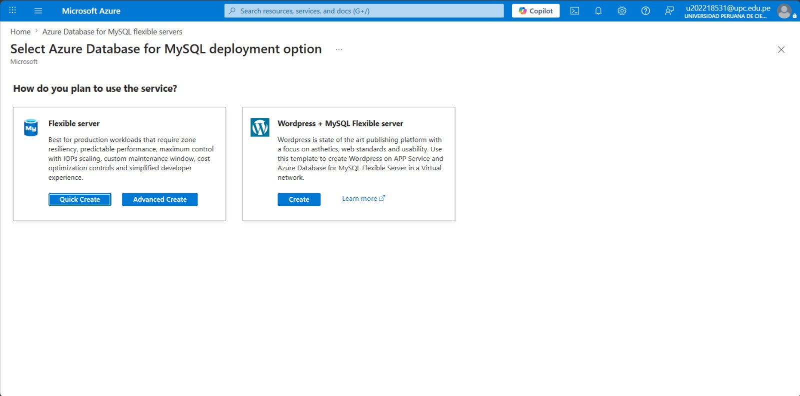  </div>        

*   Posteriormente, en la pestaña de aspectos básicos, se configuraron los datos del proyecto asignando la suscripción *Azure for Students* y el grupo de recursos unificado `safeflow`, tal como se documenta en la vista del archivo. 

<div algin="center">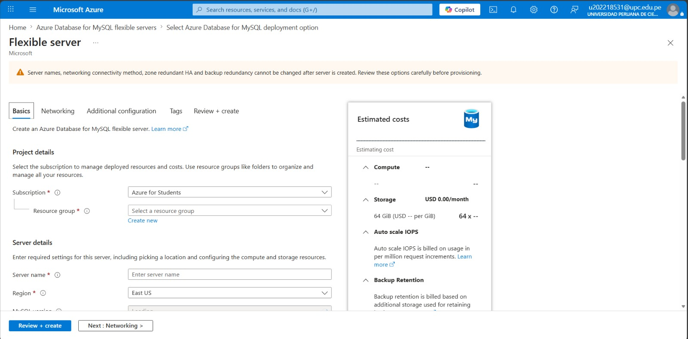  </div>        

*   Una vez completada la inicialización, se obtuvo el panel general del servidor bautizado como `safeflowdb`, ubicado estratégicamente en la región de *Southeast Asia*, operando sobre la versión de motor MySQL 8.4 y un plan de cómputo *Burstable, B1ms*, como se constata en el archivo.

<div algin="center">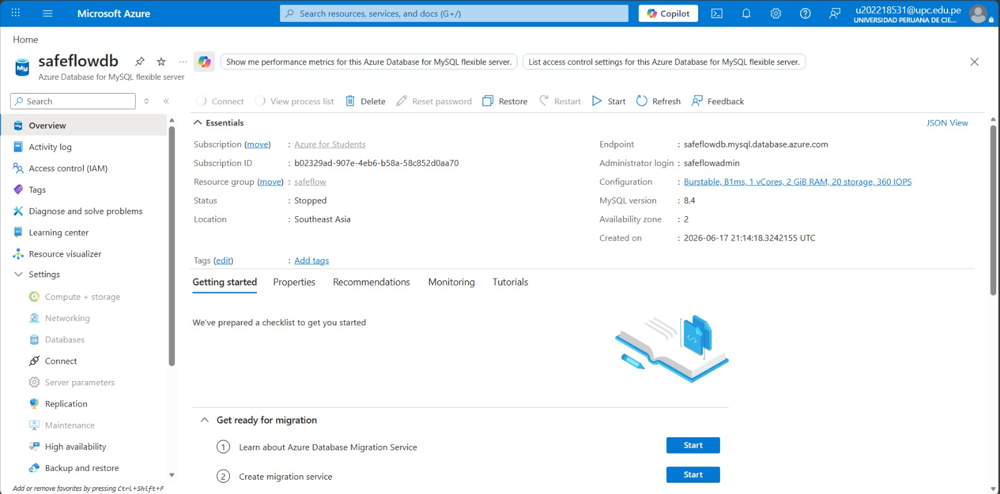  </div>        


**2. Seguridad de Red y Creación de Esquema de Datos**
*   Con la finalidad de conectar herramientas externas de administración y ejecutar scripts de migración de datos, se accedió a la sección de redes para añadir una regla de firewall denominada `MiComputadoraLocal` asociada a la dirección IP pública del desarrollador (`38.25.17.80`). Este proceso se visualiza en el archivo.

<div algin="center">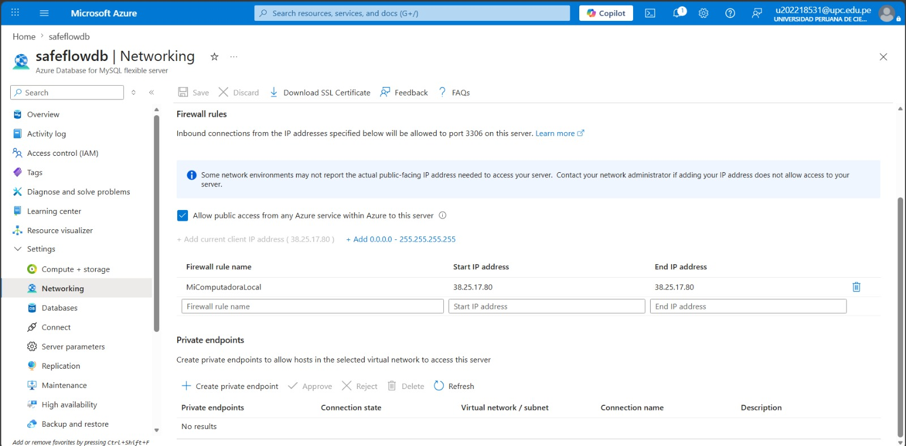  </div>        

  
*   Con el acceso asegurado, se inicializó el espacio de trabajo relacional del negocio, creando con éxito el esquema lógico denominado `safeflow_db` dentro del servidor cloud, evidenciado en el archivo.

<div algin="center">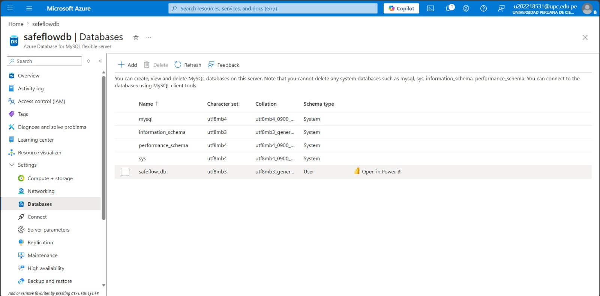  </div>        


**3. Despliegue del Servidor Web de la Aplicación (Azure App Services)**
*   Completada la base de datos, se procedió con la creación de la Web App en el panel de App Services asignando el mismo grupo de recursos compartido, como se muestra en la configuración del archivo.

<div algin="center">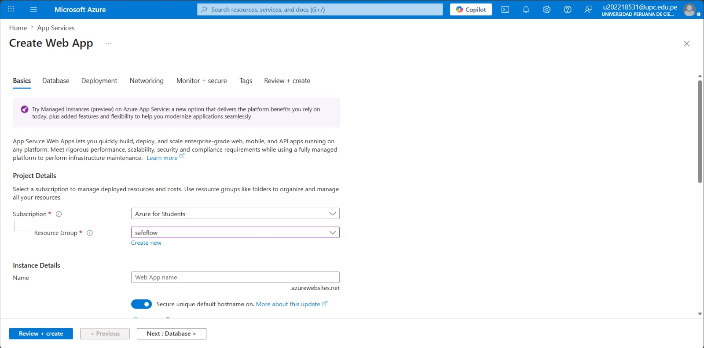  </div>        


  
*   En las especificaciones del entorno, se definió la publicación mediante código de la solución, seleccionando la región de *Canada Central*, un sistema operativo *Linux* y un plan de precios de categoría *Basic B1*, documentado en el archivo.

<div algin="center">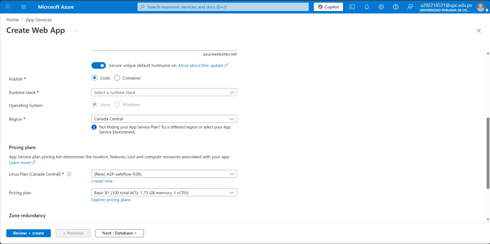  </div>        

  
*   El aprovisionamiento final concluyó exitosamente con la Web App denominada `safeflow-api` en estado *Running* (Activo). En su panel principal se confirma el stack tecnológico correspondiente a *Dotnetcore - 10.0* y la sincronización correcta con el repositorio oficial, visible en el archivo.
<div algin="center">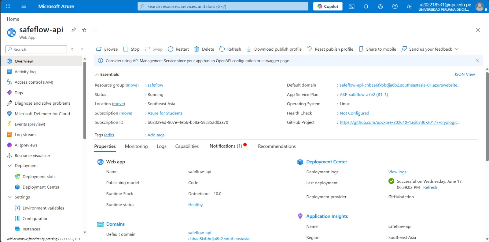  </div>        


**4. Gestión Segura de Credenciales y Automatización de CI/CD**
*   Para evitar malas prácticas de seguridad de software, se inyectaron las credenciales de base de datos directamente en las variables del panel cloud. Específicamente, se configuró la cadena de conexión cifrada bajo la llave de configuración `ConnectionStrings__DefaultConnection` dentro de las variables de entorno de la Web App, tal como figura en el archivo.

<div algin="center">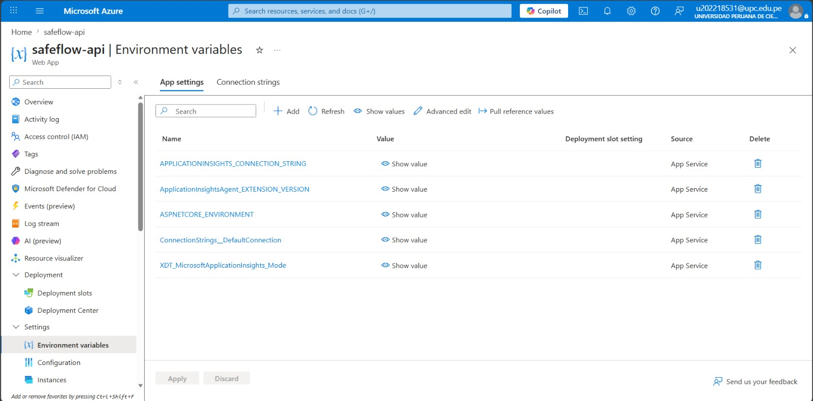  </div>        

  
*   Finalmente, para cerrar el flujo de desarrollo, se automatizó el pipeline mediante un archivo de workflow de GitHub Actions denominado `main_safeflow-api.yml`. Cada confirmación de cambio en la rama principal desencadena una compilación automatizada (etapa *build* de 27s) seguida de una actualización en producción (etapa *deploy* de 39s), lo cual culminó con éxito en un tiempo de ejecución total de 1 minuto y 19 segundos bajo el commit hash `2e833b3`. Toda esta trazabilidad se encuentra registrada en el archivo.

<div algin="center">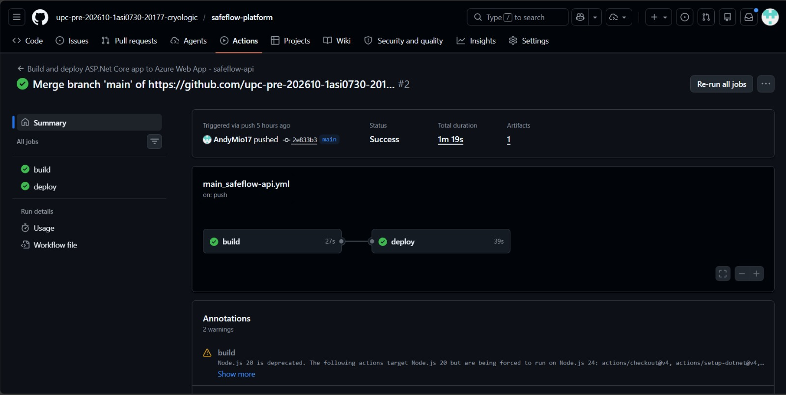  </div>        


#### Enlaces Oficiales del Entorno de Production
*   **Dominio público de la API Desplegada:** `https://safeflow-api-chbaa6fxbbdja6b2.southeastasia-01.azurewebsites.net`
*   **URL del Repositorio de GitHub:** `https://github.com/upc-pre-202610-1asi0730-20177-cryologic-systems/safeflow-platform`

#### 5.2.3.8. Team Collaboration Insights during Sprint


En esta sección se describe cómo el equipo ha desarrollado las actividades de implementación durante el Sprint 3, evidenciando la colaboración en el desarrollo del proyecto.

Durante este sprint, el equipo de SafeFlow trabajó de manera estrictamente coordinada utilizando metodologías ágiles y herramientas avanzadas de control de versiones como GitHub para asegurar la entrega exitosa del producto. La colaboración en este ciclo migró de la fase de maquetación local hacia un ecosistema de despliegue continuo, lo cual requirió una comunicación constante entre los integrantes, una distribución efectiva de tareas técnicas y un seguimiento milimétrico del progreso mediante el marco de trabajo Scrum.

Cada miembro del equipo participó activamente en la implementación de los distintos componentes del sistema. El esfuerzo colaborativo se centró en la programación y estructuración del Backend utilizando .NET, la exposición y documentación exhaustiva de contratos mediante OpenAPI/Swagger, y el aprovisionamiento de la infraestructura en la nube utilizando Microsoft Azure (servidor de base de datos relacional MySQL y entornos de ejecución en App Services). 

Asimismo, la sinergia del equipo fue clave para configurar con éxito el pipeline de integración y despliegue continuo (CI/CD) a través de GitHub Actions. Esto permitió que las revisiones constantes de commits bajo estándares profesionales, el análisis conjunto de código y las pruebas de consumo de servicios en producción garantizaran que todos los integrantes contribuyeran equitativamente en la consolidación de los productos clave definidos para este sprint: la API de servicios completamente operativa en la nube y la base de datos cloud enlazada al aplicativo.

<div algin="center">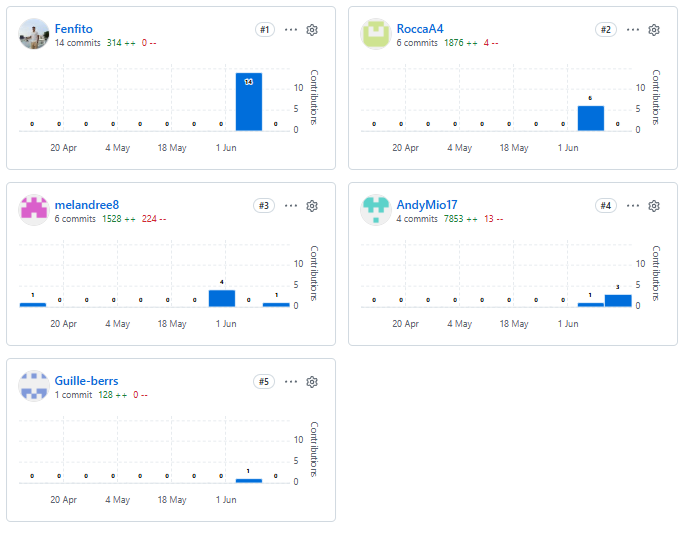  </div>        

<div algin="center">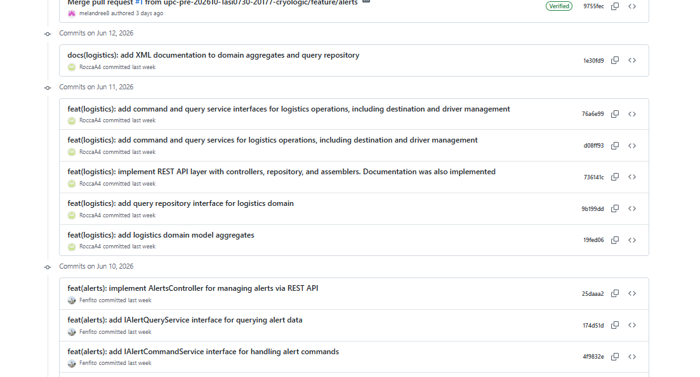  </div>        

### 5.2.4. Sprint 4

#### 5.2.4.1. Sprint Planning 4

<table>
  <tr>
    <th colspan="5">Sprint #</th>
    <th colspan="8"></th>
  </tr>
  <tr>
    <td colspan="13"><b>Sprint Planning Background</b></td>
  </tr>
  <tr>
    <td colspan="5">Date</td>
    <td colspan="8"></td>
  </tr>
  <tr>
    <td colspan="5">Time</td>
    <td colspan="8"></td>
  </tr>
  <tr>
    <td colspan="5">Location</td>
    <td colspan="8"></td>
  </tr>
  <tr>
    <td colspan="5">Prepared By</td>
    <td colspan="8"></td>
  </tr>
  <tr>
    <td colspan="5">Attendees (to planning meeting)</td>
    <td colspan="8"></td>
  </tr>
  <tr>
    <td colspan="5">Sprint 2 Review Summary</td>
    <td colspan="8"></td>
  </tr>
  <tr>
    <td colspan="5">Sprint 2 Retrospective Summary</td>
    <td colspan="8"></td>
  </tr>
  <tr>
    <td colspan="13"><b>Sprint Goal & User Stories</b></td>
  </tr>
  <tr>
    <td colspan="5">Sprint 3 Goal</td>
    <td colspan="8"></td>
  </tr>
  <tr>
    <td colspan="5">Sprint 3 Velocity</td>
    <td colspan="8"></td>
  </tr>
  <tr>
    <td colspan="5">Sum of Story Points</td>
    <td colspan="8"></td>
  </tr>
</table>


#### 5.2.4.2. Aspect Leaders and Collaborators


<div align="center">
  <table style="width:100%; border-collapse: collapse; font-family: Arial, sans-serif; font-size: 13px; text-align: center;">
    <thead>
      <tr style="background-color: #f2f2f2;">
        <th style="border: 1px solid #dddddd; padding: 10px;">Team Member (Last Name, First Name)</th>
        <th style="border: 1px solid #dddddd; padding: 10px;">GitHub Username</th>
        <th style="border: 1px solid #dddddd; padding: 10px;">Module Inventory (L/C)</th>
        <th style="border: 1px solid #dddddd; padding: 10px;">Module Logistics</th>
        <th style="border: 1px solid #dddddd; padding: 10px;">Module Monitoring(L/C)</th>
        <th style="border: 1px solid #dddddd; padding: 10px;">Module Alerts</th>
        <th style="border: 1px solid #dddddd; padding: 10px;">Module Reporting</th>
        <th style="border: 1px solid #dddddd; padding: 10px;">Module Analytics</th>
      </tr>
    </thead>
    <tbody>
      <tr>
        <td style="border: 1px solid #dddddd; padding: 8px;"></td>
        <td style="border: 1px solid #dddddd; padding: 8px;"></td>
        <td style="border: 1px solid #dddddd; padding: 8px;"></td>
        <td style="border: 1px solid #dddddd; padding: 8px;"></td>
        <td style="border: 1px solid #dddddd; padding: 8px;"></td>
        <td style="border: 1px solid #dddddd; padding: 8px;"></td>
        <td style="border: 1px solid #dddddd; padding: 8px;"></td>
        <td style="border: 1px solid #dddddd; padding: 8px;"></td>
      </tr>
      <tr>
        <td style="border: 1px solid #dddddd; padding: 8px;"></td>
        <td style="border: 1px solid #dddddd; padding: 8px;"></td>
        <td style="border: 1px solid #dddddd; padding: 8px;"></td>
        <td style="border: 1px solid #dddddd; padding: 8px;"></td>
        <td style="border: 1px solid #dddddd; padding: 8px;"></td>
        <td style="border: 1px solid #dddddd; padding: 8px;"></td>
        <td style="border: 1px solid #dddddd; padding: 8px;"></td>
        <td style="border: 1px solid #dddddd; padding: 8px;"></td>
      </tr>
      <tr>
        <td style="border: 1px solid #dddddd; padding: 8px;"></td>
        <td style="border: 1px solid #dddddd; padding: 8px;"></td>
        <td style="border: 1px solid #dddddd; padding: 8px;"></td>
        <td style="border: 1px solid #dddddd; padding: 8px;"></td>
        <td style="border: 1px solid #dddddd; padding: 8px;"></td>
        <td style="border: 1px solid #dddddd; padding: 8px;"></td>
        <td style="border: 1px solid #dddddd; padding: 8px;"></td>
        <td style="border: 1px solid #dddddd; padding: 8px;"></td>
      </tr>
      <tr>
        <td style="border: 1px solid #dddddd; padding: 8px;"></td>
        <td style="border: 1px solid #dddddd; padding: 8px;"></td>
        <td style="border: 1px solid #dddddd; padding: 8px;"></td>
        <td style="border: 1px solid #dddddd; padding: 8px;"></td>
        <td style="border: 1px solid #dddddd; padding: 8px;"></td>
        <td style="border: 1px solid #dddddd; padding: 8px;"></td>
        <td style="border: 1px solid #dddddd; padding: 8px;"></td>
        <td style="border: 1px solid #dddddd; padding: 8px;"></td>
      </tr>
      <tr>
        <td style="border: 1px solid #dddddd; padding: 8px;"></td>
        <td style="border: 1px solid #dddddd; padding: 8px;"></td>
        <td style="border: 1px solid #dddddd; padding: 8px;"></td>
        <td style="border: 1px solid #dddddd; padding: 8px;"></td>
        <td style="border: 1px solid #dddddd; padding: 8px;"></td>
        <td style="border: 1px solid #dddddd; padding: 8px;"></td>
        <td style="border: 1px solid #dddddd; padding: 8px;"></td>
        <td style="border: 1px solid #dddddd; padding: 8px;"></td>
      </tr>
    </tbody>
  </table>
</div>


#### 5.2.4.3. Sprint Backlog 4

| Sprint | User Story ID | User Story Title | Task ID | Task Title | Description | Estimation (Hours) | Assigned To | Status |
| :--- | :--- | :--- | :--- | :--- | :--- | :--- | :--- | :--- |
| | | | | | | | | |
| | | | | | | | | |
| | | | | | | | | |
| | | | | | | | | |
| | | | | | | | | |
| | | | | | | | | |
| | | | | | | | | |
| | | | | | | | | |
| | | | | | | | | |


#### 5.2.4.4. Development Evidence for Sprint Review

<table>
  <thead>
    <tr>
      <th>Repository</th>
      <th>Branch</th>
      <th>Commit Id</th>
      <th>Commit Message</th>
      <th>Commit Message Body</th>
      <th>Committed on (Date)</th>
    </tr>
  </thead>
  <tbody>
    <tr>
      <td></td>
      <td></td>
      <td></td>
      <td></td>
      <td></td>
      <td></td>
    </tr>
    <tr>
    <td>AndyMio17/safeflow-report</td>
      <td>develop</td>
      <td>81b8cf59b76bed69e8a2a2f27a3937ed4052fa43</td>
      <td>docs: agregando informacion en registro de versiones y Student Outcome</td>
      <td>Implement content</td>
      <td>28/06/2026</td>
    </tr>
  </tbody>
</table>


#### 5.2.4.5. Execution Evidence for Sprint Review
#### 5.2.4.6. Services Documentation Evidence for Sprint Review
#### 5.2.4.7. Software Deployment Evidence for Sprint Review
#### 5.2.4.8. Team Collaboration Insights during Sprint


### 5.3. Validation Interviews
#### 5.3.1. Diseño de Entrevistas

Segmento Objetivo 1: Empresas del sector farmacéutico

1. Al revisar la lista de productos farmacéuticos, ¿considera que la visualización explícita de las columnas MIN TEMP y MAX TEMP para productos como la Insulina Glargina 2°C a 8°C o la Vacuna Pfizer COVID-19 -90°C a -60°C facilita el control rápido del inventario regulado?

2. Si necesita ingresar un nuevo lote de medicamentos al sistema, ¿el botón azul "+ Add inventory item" ubicado en la esquina superior derecha le resulta visible y predecible para iniciar el registro regulatorio?

3. La tabla muestra datos de trazabilidad técnica como BATCH / LOT, EXPIRY DATE y LOCATION. Desde la perspectiva de una inspección de calidad, ¿considera que el orden y la terminología de estas columnas son limpios y libres de ambigüedad?

4. En el módulo de Logistics, la pantalla muestra el envío S003 (Vacuna Pfizer COVID-19) con un estado de In transit y una temperatura actual de -18.5°C. ¿El uso del color rojo y el ícono de peligro en el recuadro térmico le comunican eficazmente que el producto está fuera de su rango permitido?

5. En el módulo de Monitoring, las tarjetas detallan el rango objetivo en la parte inferior (ej. Target range: 2.0 - 8.0°C). ¿Considera que colocar esta métrica fija de comparación ayuda a detectar desviaciones sin necesidad de recordar los parámetros de cada producto?

6. Al observar las tarjetas de monitoreo, ¿es fácil identificar al PERSON IN CHARGE, al DRIVER OR OPERATOR y el WAREHOUSE de origen para iniciar un proceso de contención ante una falla de frío?

7. En la sección superior de Alertas, el contador de "Out of range (detected)" marca 1. ¿La tarjeta roja detallada de la Vacuna Pfizer COVID-19 con su temperatura actual en -18.5°C le proporciona la información suficiente para entender la gravedad de la excursión térmica?

8. La alerta del despacho S003 expone el campo de contacto del conductor encargado (Contact: 965874123). ¿Considera que la inclusión directa de este enlace telefónico agiliza el tiempo de reacción para la mitigación del riesgo en la carga?

9. La tarjeta principal describe que el "SafeFlow consolidated report (single PDF)" incluye los envíos, inventarios, bitácoras térmicas e incidencias. ¿La descripción detallada de los elementos incluidos le ayuda a predecir con exactitud el contenido del documento antes de generarlo?

10. Al observar la tabla de "Recent exports", el documento aparece con un indicador verde de "Ready" y un botón de "Download". ¿El flujo de dos pasos (Generate y luego Download) le parece claro para la obtención de sus evidencias de auditoría?

11. En el panel de Analytics, la barra superior muestra un selector de idioma (ES / EN). Si cambia la configuración regional, ¿espera que la consistencia de los datos técnicos de los medicamentos y las temperaturas se mantenga intacta?

12. El menú lateral izquierdo utiliza íconos planos al lado de términos directos como Analytics, Inventory, Logistics, Monitoring, Alerts, Reporting. ¿Considera que el diseño iconográfico se correlaciona lógicamente con las tareas analíticas de su área?

13. En la esquina inferior izquierda se observa el indicador System status: Operational. Como usuario que depende de la disponibilidad del sistema para auditorías, ¿esta señalización sutil le otorga la confianza necesaria en la estabilidad de la plataforma?


Segmento Objetivo 2: Operadores logísticos (3PL / transporte especializado)

1. En la parte superior del Dashboard de Analytics, observa cuatro tarjetas de resumen (Total shipments: 4, Completed deliveries: 0, In transit: 2, Delayed: 0). ¿Estos contadores numéricos de alto nivel le permiten evaluar el estado de la operación diaria en sus primeros 5 segundos de visualización?

2. En la sección inferior derecha "Fleet performance", se listan los conductores (Miguel, Diego Fernández) indicando su estado (On route, Available). ¿Esta lista simplificada le facilita la asignación de nuevos fletes según la disponibilidad actual del personal?

3. La tabla de "Recent shipments" muestra el envío S004 con destino a Almacen A bajo el estado amarillo de "Pending". ¿El uso de etiquetas de colores (Pending, In transit) le ayuda a priorizar los despachos que aún no han salido de la base?

4. Al seleccionar el envío S001 en la lista de despachos, se despliega a la izquierda la sección de "Active tracking". ¿El diagrama vertical que conecta el STORAGE LOCATION (Almacen A) con el CURRENT LOCATION (Awaiting handling) describe de forma clara la etapa exacta en la que está la carga?

5. En el panel de Active tracking, el recuadro verde de estatus térmico muestra el texto: "Allowed range: 15.0°C – 25.0°C". ¿Considera útil que el sistema le muestre el rango operativo permitido directamente en la tarjeta de seguimiento del viaje del conductor?

6. En la barra superior derecha de Logistics, se encuentran tres botones diferenciados: "New destination", "Driver or operator" y el botón azul de "+ New shipment". ¿La distribución de estos botones le facilita las tareas recurrentes de planificación y alta de rutas?

7. Al monitorear las unidades en tiempo real, observa que la tarjeta del despacho S004 (Paracetamol Jarabe) está marcada con una etiqueta verde de "SAFE" a pesar de registrar 22.5°C. Al verificar abajo que su Target range es de 15.0 - 30.0°C, ¿le queda claro que el viaje progresa sin novedades operativas?

8. En contraste, el despacho S003 muestra una etiqueta roja de "AT RISK" con una temperatura de -18.5°C. ¿Siente que el contraste visual entre las tarjetas verdes (SAFE) y las tarjetas rojas (AT RISK) es suficiente para identificar qué unidades de la flota requieren su atención inmediata?

9. Dentro del detalle de la alerta activa para el despacho S003, se muestran dos botones de acción en el extremo derecho: "Under observation" y "Solved". ¿La presencia y el diseño de estas opciones le sugieren claramente cómo registrar que ya está gestionando la incidencia con el chofer?

10. En la parte superior de la pantalla de Alertas, los contadores muestran "Open thermal alerts: 1" e "Out of range (detected): 1". Si presiona el botón "Solved" en la alerta activa, ¿espera que estos indicadores cambien automáticamente a cero?

11. En la pantalla de Reporting, la tabla de "Recent exports" muestra que un reporte fue generado "Today, 09:14" con el formato PDF. Para sus tareas administrativas de cierre de mes, ¿este registro histórico le ayuda a controlar qué informes ya fueron entregados a la gerencia?

12. En la esquina inferior izquierda de todas las pantallas de la plataforma se ubica un botón interactivo llamado "Collapse" con el ícono de una flecha hacia la izquierda. Si hace clic en él, ¿deduce correctamente que el menú lateral se encogerá para otorgarle un mayor espacio de trabajo a los mapas y tablas?

13. En la esquina inferior izquierda del navegador, la barra de estado del sistema muestra la dirección local de desarrollo (localhost:5173/analytics). Sabiendo que es una aplicación web, ¿considera que el rendimiento y la velocidad de cambio entre los módulos laterales son adecuados para el flujo rápido que exige la supervisión de transportes?


#### 5.3.2. Registro de Entrevistas

#### Segmento objetivo #1: Empresas del sector farmacéutico

---


**Entrevista 1:**
- **Nombres y apellidos:** Sebastian Mendoza
- **Edad:** 35 años
- **Distrito:** San Borja

- **Inicio:** 0:01
- **Duración:** 15:16
- **URL:** https://upcedupe-my.sharepoint.com/:v:/g/personal/u202114701_upc_edu_pe/IQCOSdQa1h4DSY-70-_gSeYxAflBddPMzgu6Vzg3LanaLcA?nav=eyJyZWZlcnJhbEluZm8iOnsicmVmZXJyYWxBcHAiOiJTdHJlYW1XZWJBcHAiLCJyZWZlcnJhbFZpZXciOiJTaGFyZURpYWxvZy1MaW5rIiwicmVmZXJyYWxBcHBQbGF0Zm9ybSI6IldlYiIsInJlZmVycmFsTW9kZSI6InZpZXcifX0%3D&e=PY0HMH

**Resumen:** El Gestor de Aseguramiento de Calidad valida positivamente el diseño visual y la terminología técnica de la interfaz de "SafeFlow", destacando que la visualización explícita de los rangos de temperatura y las alertas críticas en color rojo previenen fallos humanos en productos de cadena de frío estricta. Asimismo, resalta que la inclusión de números de contacto clickeables y la estructura de las tarjetas de emergencia agilizan drásticamente los tiempos de respuesta y traslados ante contingencias críticas. Por otro lado, la traducción selectiva de etiquetas que preserva intactos los nombres de los medicamentos y el indicador visual de conexión activa garantizan la trazabilidad e infunden tranquilidad durante los procesos de auditoría regulatoria. Finalmente, valora positivamente los estados de control como "Ready" en las descargas de PDFs, ya que aseguran la consolidación sin errores de un alto volumen de datos históricos que servirán como evidencia legal válida.


---

#### Segmento objetivo #2: Operadores logísticos (3PL / transporte especializado)

---


**Entrevista 2:**
- **Nombres y apellidos:** Maria Ruiz
- **Edad:** 28 años
- **Distrito:** Los Olivos

- **Inicio:** 0:03
- **Duración:** 15:49
- **URL:** https://drive.google.com/file/d/1iUOWHJb6_7Rg9v7kS77kCz5PIBycWJzS/view?usp=sharing

**Resumen:**
El Supervisor de Operaciones y Logística confirma que la plataforma es sumamente práctica y directa para la gestión diaria del transporte. Destaca que los contadores numéricos del dashboard y el fuerte contraste visual entre las tarjetas verdes (SAFE) y rojas (AT RISK) le permiten evaluar la flota en segundos y priorizar las emergencias térmicas sin perder tiempo. Asimismo, valora la claridad de la línea de tiempo vertical para rastrear los estados de la carga, la visualización del rango permitido y la simplificación en la asignación de conductores disponibles. Finalmente, valida que funciones como los estados de incidencias (Under observation / Solved), el menú colapsable para ganar espacio y la velocidad de respuesta del sistema optimizan drásticamente su ritmo de trabajo y el control administrativo mensual.

---

#### 5.3.3. Evaluaciones según heurísticas
### 5.4. Video About-the-Product

El video "About-the-Product" (Sobre el Producto) funciona como una demostración audiovisual concisa y de alto impacto, diseñada para mostrar la propuesta de valor central, la arquitectura y la funcionalidad en vivo de la solución **SafeFlow**. Este video conecta visualmente los desafíos de la cadena de frío y el monitoreo ambiental con la respuesta automatizada de nuestro software. A través de un recorrido profesional, se demuestra cómo la ingesta de datos de sensores IoT en tiempo real, la detección algorítmica de anomalías y las notificaciones automatizadas operan dentro de una plataforma unificada y confiable para mitigar riesgos y prevenir pérdidas logísticas.

- **Video About the Product**:  [Enlace Video About the Product](https://youtu.be/Kb1i16M4o-Q)


# Conclusiones y recomendaciones

# Video About-the-Team

# Bibliografía

# Anexos
